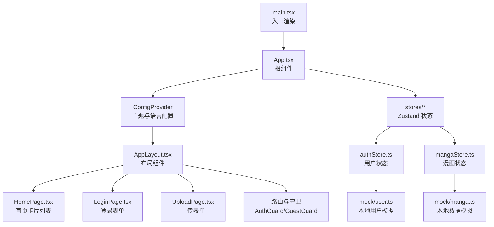
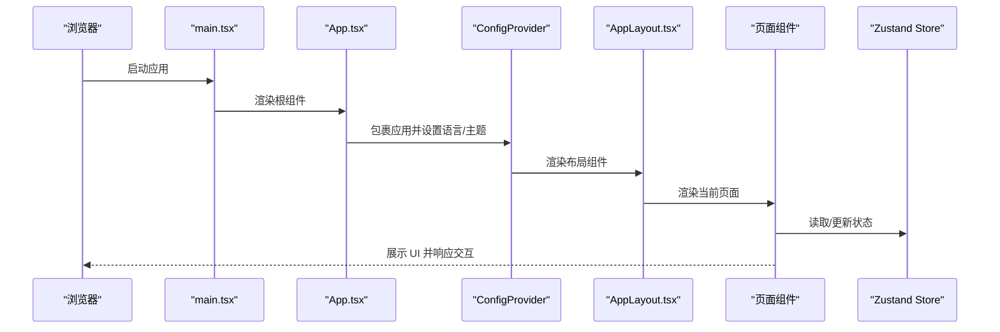
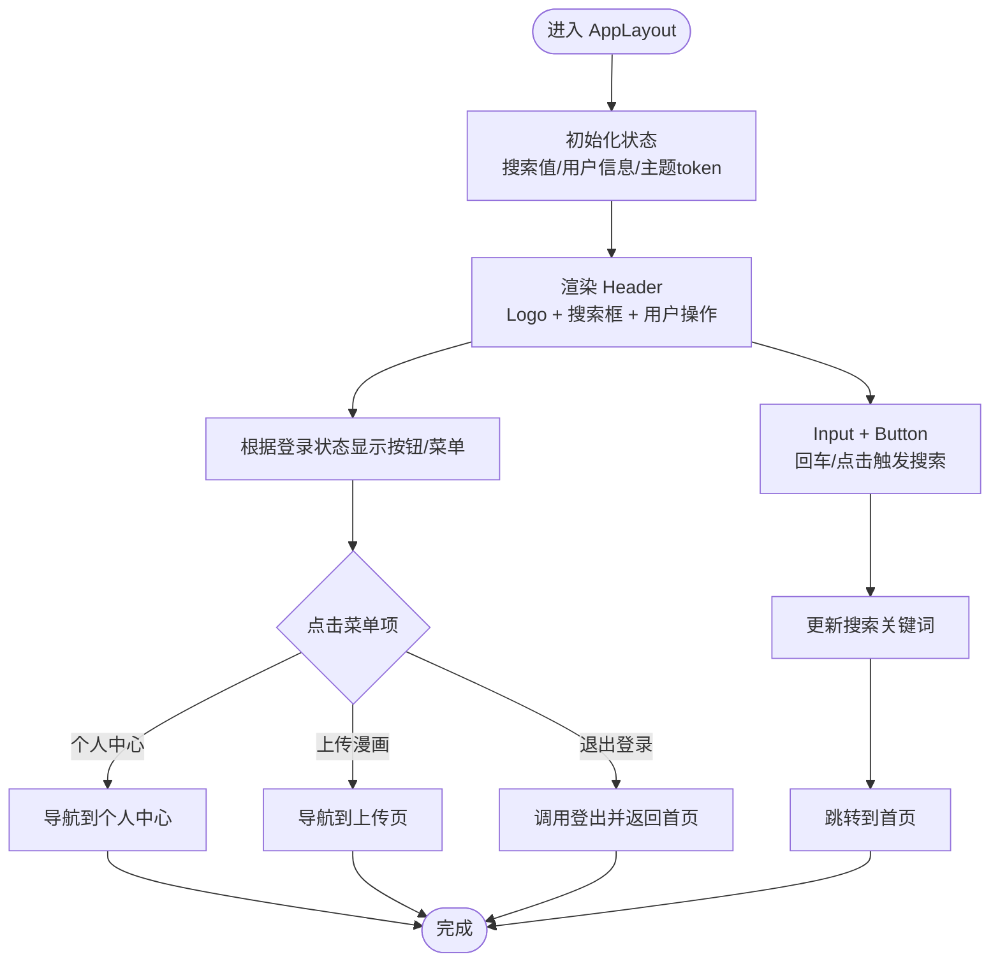
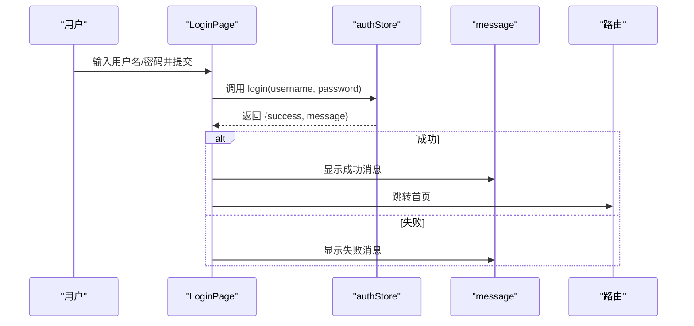
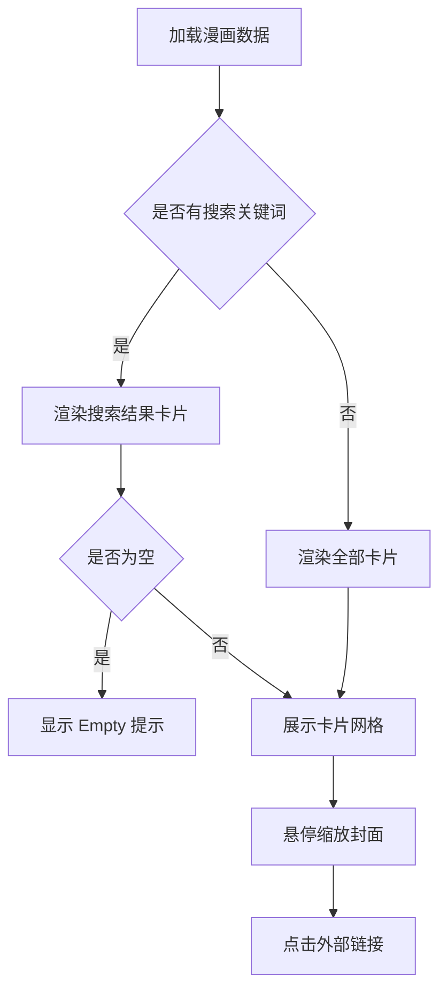
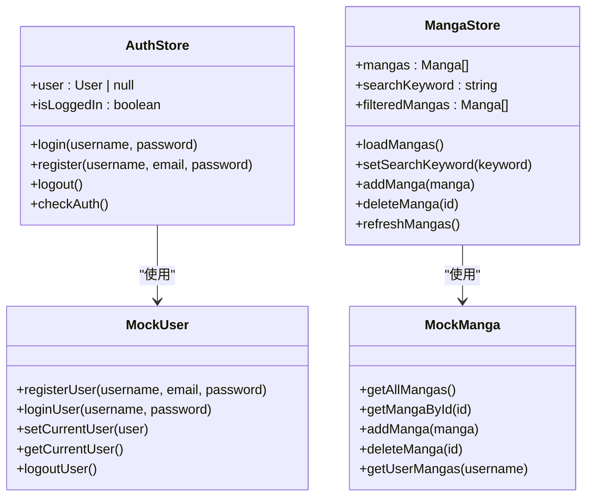
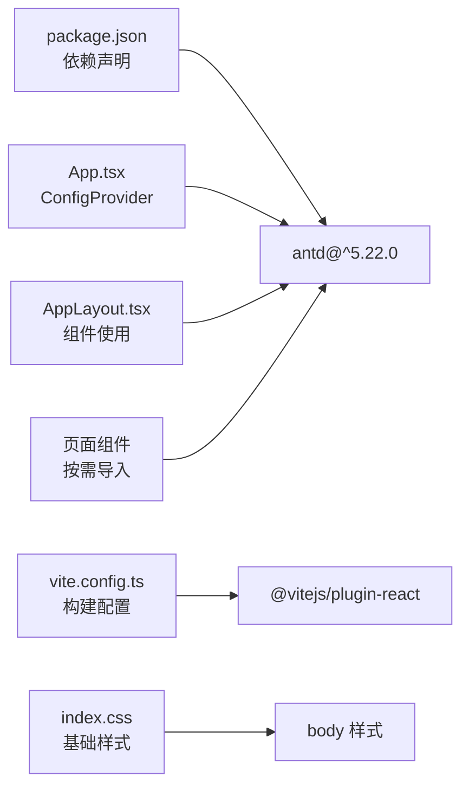

# Ant Design集成

<cite>
**本文引用的文件**
- [package.json](file://manga-website/package.json)
- [vite.config.ts](file://manga-website/vite.config.ts)
- [src/App.tsx](file://manga-website/src/App.tsx)
- [src/main.tsx](file://manga-website/src/main.tsx)
- [src/index.css](file://manga-website/src/index.css)
- [src/components/AppLayout.tsx](file://manga-website/src/components/AppLayout.tsx)
- [src/pages/HomePage.tsx](file://manga-website/src/pages/HomePage.tsx)
- [src/pages/LoginPage.tsx](file://manga-website/src/pages/LoginPage.tsx)
- [src/pages/UploadPage.tsx](file://manga-website/src/pages/UploadPage.tsx)
- [src/stores/authStore.ts](file://manga-website/src/stores/authStore.ts)
- [src/stores/mangaStore.ts](file://manga-website/src/stores/mangaStore.ts)
- [src/types/index.ts](file://manga-website/src/types/index.ts)
- [src/mock/manga.ts](file://manga-website/src/mock/manga.ts)
- [src/mock/user.ts](file://manga-website/src/mock/user.ts)
</cite>

## 目录
1. [简介](#简介)
2. [项目结构](#项目结构)
3. [核心组件](#核心组件)
4. [架构总览](#架构总览)
5. [详细组件分析](#详细组件分析)
6. [依赖关系分析](#依赖关系分析)
7. [性能考量](#性能考量)
8. [故障排查指南](#故障排查指南)
9. [结论](#结论)
10. [附录](#附录)

## 简介
本项目基于 React + Vite + TypeScript 构建，集成了 Ant Design 5.22.0，用于构建现代化的漫画展示网站。本文档系统性地阐述 Ant Design 在本项目中的安装配置、主题定制、按需导入策略、样式引入方式以及常用组件（Layout、Menu、Button、Input、Form 等）的实际使用方法与最佳实践。同时提供常见问题的排查建议与优化建议，帮助开发者快速上手并在生产环境中稳定运行。

## 项目结构
项目采用前端单页应用（SPA）架构，路由通过 React Router DOM 管理，状态管理采用 Zustand，UI 组件库统一使用 Ant Design。Ant Design 的全局配置集中在根组件中，通过 ConfigProvider 实现语言与主题的统一设置；页面级组件通过局部导入的方式按需使用所需组件，避免全量打包带来的体积膨胀。

图表来源
- [src/main.tsx:1-14](file://manga-website/src/main.tsx#L1-L14)
- [src/App.tsx:1-66](file://manga-website/src/App.tsx#L1-L66)
- [src/components/AppLayout.tsx:1-156](file://manga-website/src/components/AppLayout.tsx#L1-L156)
- [src/pages/HomePage.tsx:1-108](file://manga-website/src/pages/HomePage.tsx#L1-L108)
- [src/pages/LoginPage.tsx:1-86](file://manga-website/src/pages/LoginPage.tsx#L1-L86)
- [src/pages/UploadPage.tsx:1-187](file://manga-website/src/pages/UploadPage.tsx#L1-L187)
- [src/stores/authStore.ts:1-45](file://manga-website/src/stores/authStore.ts#L1-L45)
- [src/stores/mangaStore.ts:1-62](file://manga-website/src/stores/mangaStore.ts#L1-L62)
- [src/mock/manga.ts:1-173](file://manga-website/src/mock/manga.ts#L1-L173)
- [src/mock/user.ts:1-90](file://manga-website/src/mock/user.ts#L1-L90)

章节来源
- [src/main.tsx:1-14](file://manga-website/src/main.tsx#L1-L14)
- [src/App.tsx:1-66](file://manga-website/src/App.tsx#L1-L66)

## 核心组件
本节聚焦 Ant Design 在项目中的核心使用点：全局主题与语言配置、布局组件、常用表单与输入组件、消息提示与弹层组件等。

- 全局主题与语言配置
  - 在根组件中通过 ConfigProvider 设置语言为简体中文，并自定义主题 token（主色、圆角等），确保全局一致的视觉风格。
  - 参考路径：[src/App.tsx:13-23](file://manga-website/src/App.tsx#L13-L23)

- 布局组件
  - 使用 Layout.Header、Layout.Content、Layout.Footer 构建页面骨架，Header 中集成 Logo、搜索框、用户操作区，Footer 展示版权信息。
  - 参考路径：[src/components/AppLayout.tsx:58-154](file://manga-website/src/components/AppLayout.tsx#L58-L154)

- 表单与输入组件
  - 登录页使用 Form、Input、Button、Divider、Typography 等构建登录表单；上传页使用 Upload、Input.TextArea、Form.Item 等实现封面上传与表单校验。
  - 参考路径：
    - [src/pages/LoginPage.tsx:24-84](file://manga-website/src/pages/LoginPage.tsx#L24-L84)
    - [src/pages/UploadPage.tsx:96-182](file://manga-website/src/pages/UploadPage.tsx#L96-L182)

- 卡片与展示组件
  - 首页使用 Card、Row、Col、Empty、Spin、Tag、Tooltip 等展示漫画列表，支持悬停缩放、标签与链接跳转。
  - 参考路径：[src/pages/HomePage.tsx:23-107](file://manga-website/src/pages/HomePage.tsx#L23-L107)

- 消息与弹层组件
  - 使用 message 提示登录/上传结果；使用 Dropdown 实现用户菜单；使用 Space、Space.Compact 组合布局。
  - 参考路径：
    - [src/pages/LoginPage.tsx:14-22](file://manga-website/src/pages/LoginPage.tsx#L14-L22)
    - [src/pages/UploadPage.tsx:46-74](file://manga-website/src/pages/UploadPage.tsx#L46-L74)
    - [src/components/AppLayout.tsx:110-136](file://manga-website/src/components/AppLayout.tsx#L110-L136)

章节来源
- [src/App.tsx:13-23](file://manga-website/src/App.tsx#L13-L23)
- [src/components/AppLayout.tsx:58-154](file://manga-website/src/components/AppLayout.tsx#L58-L154)
- [src/pages/LoginPage.tsx:24-84](file://manga-website/src/pages/LoginPage.tsx#L24-L84)
- [src/pages/UploadPage.tsx:96-182](file://manga-website/src/pages/UploadPage.tsx#L96-L182)
- [src/pages/HomePage.tsx:23-107](file://manga-website/src/pages/HomePage.tsx#L23-L107)

## 架构总览
Ant Design 在本项目中的集成遵循“全局配置 + 局部按需”的原则：
- 全局：通过 ConfigProvider 在根组件集中注入语言与主题，保证跨页面一致性。
- 局部：各页面组件按需导入所需 Ant Design 组件，减少打包体积。
- 样式：默认引入 Ant Design 样式，无需额外手动引入样式文件（Vite 默认处理）。

图表来源
- [src/main.tsx:7-13](file://manga-website/src/main.tsx#L7-L13)
- [src/App.tsx:13-23](file://manga-website/src/App.tsx#L13-L23)
- [src/components/AppLayout.tsx:19-154](file://manga-website/src/components/AppLayout.tsx#L19-L154)

## 详细组件分析

### 布局组件（Layout）
- 结构组成：Header、Content、Footer，Header 内含 Logo、搜索框、用户操作按钮组。
- 主题适配：通过 theme.useToken() 动态读取主题 token，实现背景、边框、文字颜色的统一。
- 交互逻辑：搜索框支持回车与清空；用户菜单项触发导航或登出；未登录时显示登录/注册按钮。
- 最佳实践：
  - 使用 Space 和 Space.Compact 组合布局，提升紧凑性与可读性。
  - 使用 Link 组件进行页面内导航，避免整页刷新。
  - 使用 Dropdown 作为用户菜单容器，便于扩展更多功能项。

图表来源
- [src/components/AppLayout.tsx:26-34](file://manga-website/src/components/AppLayout.tsx#L26-L34)
- [src/components/AppLayout.tsx:110-136](file://manga-website/src/components/AppLayout.tsx#L110-L136)

章节来源
- [src/components/AppLayout.tsx:19-154](file://manga-website/src/components/AppLayout.tsx#L19-L154)

### 表单组件（Form、Input、Button、Upload）
- 登录表单（LoginPage）
  - 使用 Form.Item 包裹 Input，设置必填规则；使用 Form.useForm() 管理表单实例；提交时调用 store 的 login 方法并根据结果提示消息。
  - 参考路径：[src/pages/LoginPage.tsx:14-22](file://manga-website/src/pages/LoginPage.tsx#L14-L22)
- 上传表单（UploadPage）
  - 使用 Upload 组件限制文件类型与大小，转换为 Base64 存储；使用 Form.Item 定义字段与校验规则；提交时调用 store 的 addManga 方法并重置表单。
  - 参考路径：[src/pages/UploadPage.tsx:22-44](file://manga-website/src/pages/UploadPage.tsx#L22-L44)

图表来源
- [src/pages/LoginPage.tsx:14-22](file://manga-website/src/pages/LoginPage.tsx#L14-L22)
- [src/stores/authStore.ts:18-24](file://manga-website/src/stores/authStore.ts#L18-L24)

章节来源
- [src/pages/LoginPage.tsx:24-84](file://manga-website/src/pages/LoginPage.tsx#L24-L84)
- [src/pages/UploadPage.tsx:96-182](file://manga-website/src/pages/UploadPage.tsx#L96-L182)
- [src/stores/authStore.ts:18-24](file://manga-website/src/stores/authStore.ts#L18-L24)

### 卡片与展示组件（Card、Row、Col、Empty、Tag、Tooltip）
- 首页（HomePage）使用 Card 展示漫画封面与元信息，支持悬停缩放效果；使用 Row/Col 实现响应式网格布局；当无搜索结果时使用 Empty 提示。
- 参考路径：[src/pages/HomePage.tsx:34-104](file://manga-website/src/pages/HomePage.tsx#L34-L104)

图表来源
- [src/pages/HomePage.tsx:15-21](file://manga-website/src/pages/HomePage.tsx#L15-L21)
- [src/pages/HomePage.tsx:34-104](file://manga-website/src/pages/HomePage.tsx#L34-L104)

章节来源
- [src/pages/HomePage.tsx:23-107](file://manga-website/src/pages/HomePage.tsx#L23-L107)

### 状态管理与数据流
- 用户状态（authStore）
  - 提供登录、注册、登出、检查认证等方法，并维护用户信息与登录状态。
  - 参考路径：[src/stores/authStore.ts:14-44](file://manga-website/src/stores/authStore.ts#L14-L44)
- 漫画状态（mangaStore）
  - 提供加载、搜索、新增、删除、刷新等方法，并维护漫画列表与过滤后的结果。
  - 参考路径：[src/stores/mangaStore.ts:16-61](file://manga-website/src/stores/mangaStore.ts#L16-L61)

图表来源
- [src/stores/authStore.ts:14-44](file://manga-website/src/stores/authStore.ts#L14-L44)
- [src/stores/mangaStore.ts:16-61](file://manga-website/src/stores/mangaStore.ts#L16-L61)
- [src/mock/manga.ts:138-172](file://manga-website/src/mock/manga.ts#L138-L172)
- [src/mock/user.ts:26-89](file://manga-website/src/mock/user.ts#L26-L89)

章节来源
- [src/stores/authStore.ts:14-44](file://manga-website/src/stores/authStore.ts#L14-L44)
- [src/stores/mangaStore.ts:16-61](file://manga-website/src/stores/mangaStore.ts#L16-L61)
- [src/mock/manga.ts:138-172](file://manga-website/src/mock/manga.ts#L138-L172)
- [src/mock/user.ts:26-89](file://manga-website/src/mock/user.ts#L26-L89)

## 依赖关系分析
- 依赖声明
  - Ant Design 5.22.0 已在依赖中声明，确保版本稳定。
  - 参考路径：[package.json:11-16](file://manga-website/package.json#L11-L16)
- 构建工具
  - Vite 默认处理 React 与样式资源，无需额外配置即可使用 Ant Design。
  - 参考路径：[vite.config.ts:1-11](file://manga-website/vite.config.ts#L1-L11)
- 全局样式
  - 项目基础样式位于 index.css，Ant Design 样式随组件按需引入。
  - 参考路径：[src/index.css:1-25](file://manga-website/src/index.css#L1-L25)

图表来源
- [package.json:11-16](file://manga-website/package.json#L11-L16)
- [vite.config.ts:1-11](file://manga-website/vite.config.ts#L1-L11)
- [src/App.tsx:13-23](file://manga-website/src/App.tsx#L13-L23)
- [src/components/AppLayout.tsx:3-12](file://manga-website/src/components/AppLayout.tsx#L3-L12)
- [src/index.css:7-11](file://manga-website/src/index.css#L7-L11)

章节来源
- [package.json:11-16](file://manga-website/package.json#L11-L16)
- [vite.config.ts:1-11](file://manga-website/vite.config.ts#L1-L11)
- [src/App.tsx:13-23](file://manga-website/src/App.tsx#L13-L23)
- [src/components/AppLayout.tsx:3-12](file://manga-website/src/components/AppLayout.tsx#L3-L12)
- [src/index.css:7-11](file://manga-website/src/index.css#L7-L11)

## 性能考量
- 按需导入
  - 页面组件按需导入所需 Ant Design 组件，避免全量引入导致包体增大。
  - 示例：[src/pages/LoginPage.tsx:1-86](file://manga-website/src/pages/LoginPage.tsx#L1-L86)、[src/pages/UploadPage.tsx:1-187](file://manga-website/src/pages/UploadPage.tsx#L1-L187)
- 主题与样式
  - 通过 ConfigProvider 统一主题，减少重复样式计算；使用 theme.useToken() 动态读取 token，避免硬编码颜色。
  - 示例：[src/components/AppLayout.tsx:23](file://manga-website/src/components/AppLayout.tsx#L23)
- 图片与交互
  - 首页卡片图片使用缩放过渡，注意在移动端的性能影响；必要时可考虑懒加载或 WebP 格式。
  - 示例：[src/pages/HomePage.tsx:42-56](file://manga-website/src/pages/HomePage.tsx#L42-L56)

## 故障排查指南
- Ant Design 样式不生效
  - 确认已在根组件中使用 ConfigProvider 包裹应用，并正确设置语言与主题。
  - 参考路径：[src/App.tsx:13-23](file://manga-website/src/App.tsx#L13-L23)
- 按需导入报错
  - 确保组件导入路径正确且版本匹配 Ant Design 5.22.0；若使用图标组件，需单独导入对应图标。
  - 参考路径：[src/components/AppLayout.tsx:4-12](file://manga-website/src/components/AppLayout.tsx#L4-L12)
- 表单校验无效
  - 检查 Form.Item 的 name 与 rules 是否正确设置；确认 onFinish 回调中使用正确的参数类型。
  - 参考路径：[src/pages/LoginPage.tsx:52-64](file://manga-website/src/pages/LoginPage.tsx#L52-L64)
- 上传文件失败
  - 检查 beforeUpload 的文件类型与大小限制；确认 Base64 转换逻辑与 fileList 状态同步。
  - 参考路径：[src/pages/UploadPage.tsx:22-44](file://manga-website/src/pages/UploadPage.tsx#L22-L44)
- 登录/注册状态异常
  - 检查 authStore 的 login/register/logout 方法返回值与消息提示；确认 mock 数据是否正确保存当前用户。
  - 参考路径：[src/stores/authStore.ts:18-38](file://manga-website/src/stores/authStore.ts#L18-L38)、[src/mock/user.ts:67-89](file://manga-website/src/mock/user.ts#L67-L89)

章节来源
- [src/App.tsx:13-23](file://manga-website/src/App.tsx#L13-L23)
- [src/components/AppLayout.tsx:4-12](file://manga-website/src/components/AppLayout.tsx#L4-L12)
- [src/pages/LoginPage.tsx:52-64](file://manga-website/src/pages/LoginPage.tsx#L52-L64)
- [src/pages/UploadPage.tsx:22-44](file://manga-website/src/pages/UploadPage.tsx#L22-L44)
- [src/stores/authStore.ts:18-38](file://manga-website/src/stores/authStore.ts#L18-L38)
- [src/mock/user.ts:67-89](file://manga-website/src/mock/user.ts#L67-L89)

## 结论
本项目在 Vite + React + TypeScript 环境下，成功集成了 Ant Design 5.22.0，实现了全局主题与语言配置、按需组件导入、表单与卡片展示、状态管理与本地数据模拟的完整闭环。通过合理的组件拆分与状态管理，项目具备良好的可维护性与扩展性。建议后续可在生产环境引入 Tree Shaking 与 CDN 加速，并持续优化图片与交互性能。

## 附录
- 版本信息
  - Ant Design：5.22.0
  - Vite：6.0.0
  - React：18.3.1
  - TypeScript：5.6.2
  - 参考路径：[package.json:11-24](file://manga-website/package.json#L11-L24)
- 类型定义
  - 漫画、用户、登录/注册/上传表单类型均在 types/index.ts 中定义，便于统一约束。
  - 参考路径：[src/types/index.ts:1-44](file://manga-website/src/types/index.ts#L1-L44)