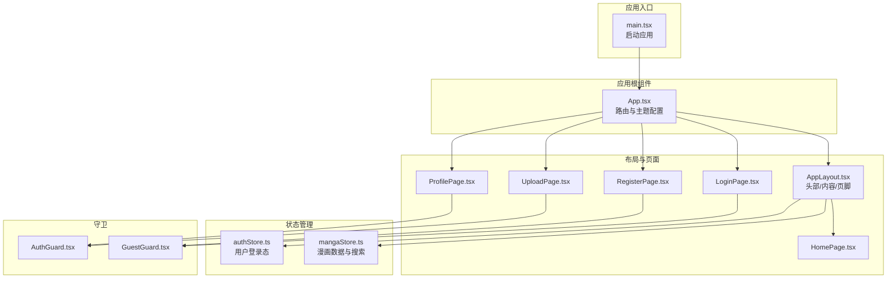
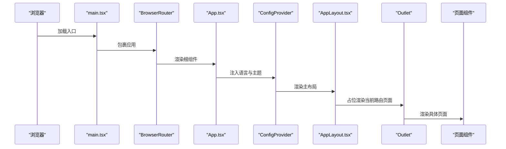
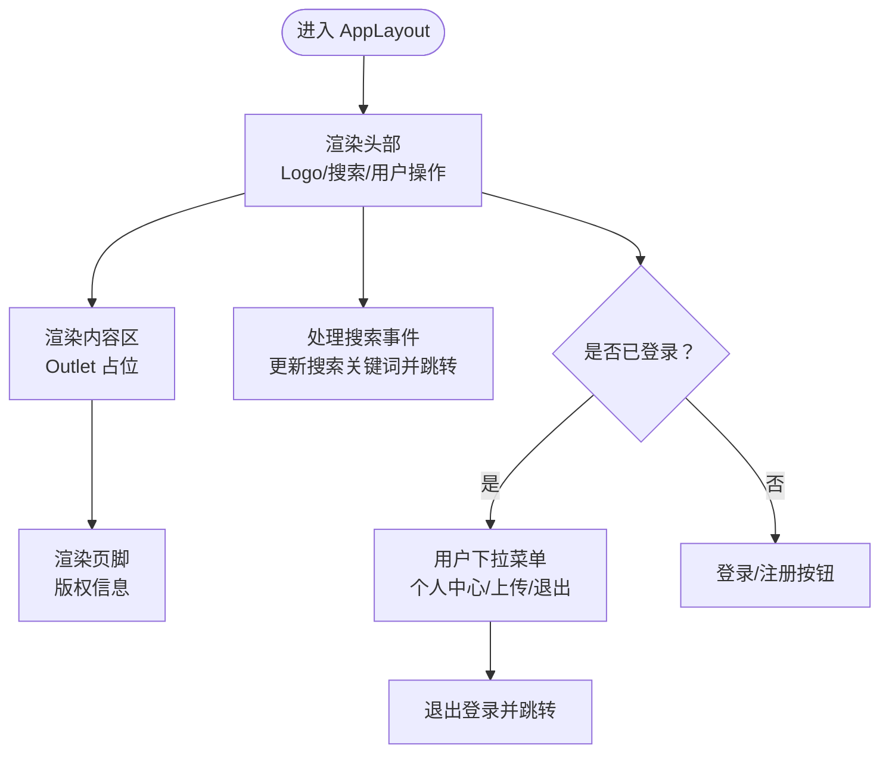
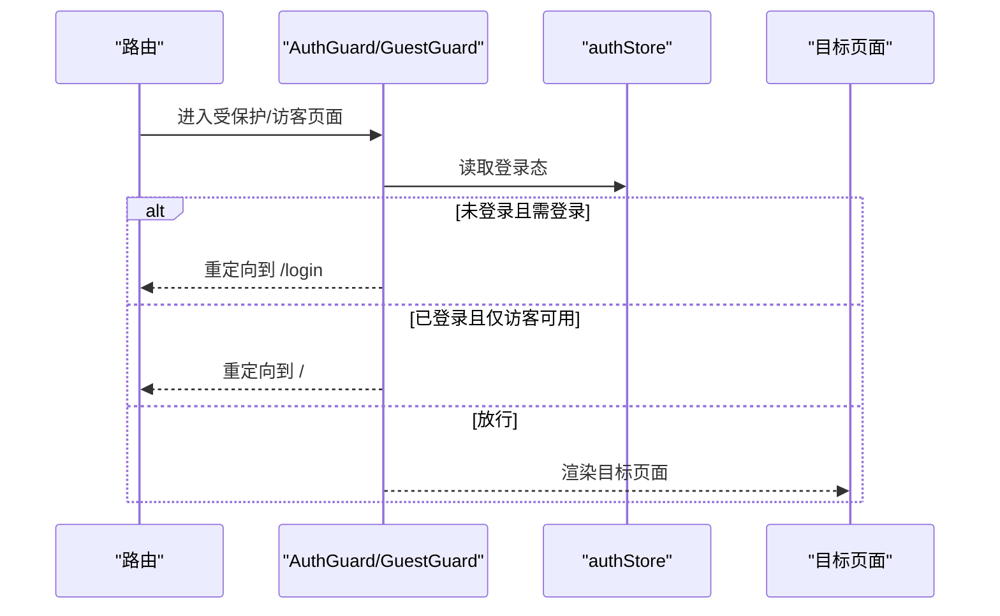
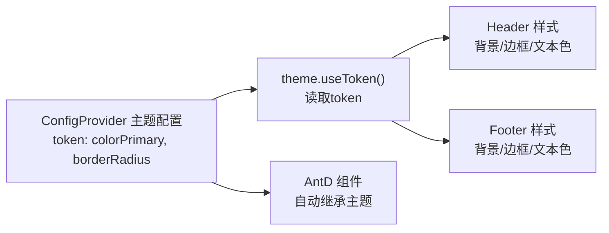
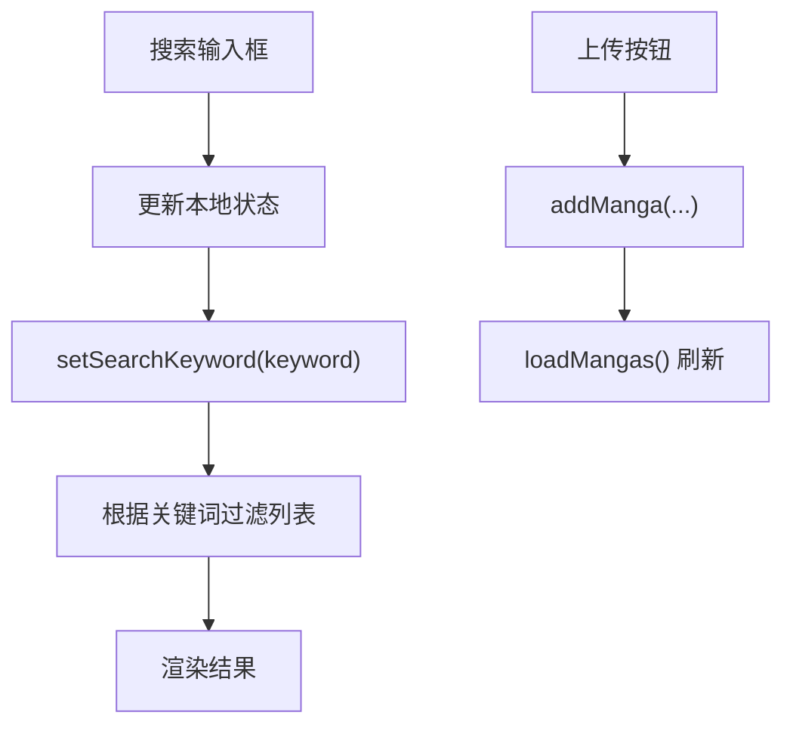
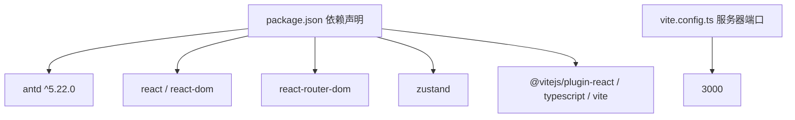

# UI组件

<cite>
**本文引用的文件**
- [AppLayout.tsx](file://manga-website/src/components/AppLayout.tsx)
- [App.tsx](file://manga-website/src/App.tsx)
- [main.tsx](file://manga-website/src/main.tsx)
- [index.css](file://manga-website/src/index.css)
- [authStore.ts](file://manga-website/src/stores/authStore.ts)
- [mangaStore.ts](file://manga-website/src/stores/mangaStore.ts)
- [AuthGuard.tsx](file://manga-website/src/components/AuthGuard.tsx)
- [GuestGuard.tsx](file://manga-website/src/components/GuestGuard.tsx)
- [package.json](file://manga-website/package.json)
- [vite.config.ts](file://manga-website/vite.config.ts)
</cite>

## 目录
1. [简介](#简介)
2. [项目结构](#项目结构)
3. [核心组件](#核心组件)
4. [架构总览](#架构总览)
5. [详细组件分析](#详细组件分析)
6. [依赖分析](#依赖分析)
7. [性能考量](#性能考量)
8. [故障排查指南](#故障排查指南)
9. [结论](#结论)
10. [附录](#附录)

## 简介
本文件面向漫画网站的UI组件与布局系统，聚焦于Ant Design在本项目中的集成与使用，涵盖组件选择、主题定制、样式覆盖、主布局AppLayout的实现（头部导航、侧边栏菜单与内容区）、响应式设计策略、无障碍与浏览器兼容性建议，以及组件使用指南与最佳实践。目标是帮助开发者正确使用与扩展UI组件，确保一致的视觉与交互体验。

## 项目结构
本项目采用Vite + React + TypeScript构建，Ant Design作为UI基础库，Zustand管理全局状态，React Router进行路由控制。应用入口通过BrowserRouter包裹，Ant Design通过ConfigProvider统一注入语言包与主题配置；页面级组件通过AppLayout承载头部、内容与页脚，配合守卫组件实现登录态控制。

**图表来源**
- [main.tsx:1-14](file://manga-website/src/main.tsx#L1-L14)
- [App.tsx:13-66](file://manga-website/src/App.tsx#L13-L66)
- [AppLayout.tsx:19-156](file://manga-website/src/components/AppLayout.tsx#L19-L156)
- [authStore.ts:14-45](file://manga-website/src/stores/authStore.ts#L14-L45)
- [mangaStore.ts:16-62](file://manga-website/src/stores/mangaStore.ts#L16-L62)
- [AuthGuard.tsx:8-17](file://manga-website/src/components/AuthGuard.tsx#L8-L17)
- [GuestGuard.tsx:8-17](file://manga-website/src/components/GuestGuard.tsx#L8-L17)

**章节来源**
- [main.tsx:1-14](file://manga-website/src/main.tsx#L1-L14)
- [App.tsx:13-66](file://manga-website/src/App.tsx#L13-L66)

## 核心组件
- Ant Design集成与主题定制：在应用根组件中通过ConfigProvider注入中文语言包与主题token，统一全局样式与交互语言。
- 主布局AppLayout：负责头部导航（Logo、搜索、用户操作）、内容区域Outlet占位、页脚版权信息。
- 路由与守卫：使用React Router进行路由配置，结合AuthGuard与GuestGuard控制受保护页面与访客页面的访问权限。
- 状态管理：使用Zustand管理用户登录态与漫画数据、搜索关键词与过滤结果。

**章节来源**
- [App.tsx:15-23](file://manga-website/src/App.tsx#L15-L23)
- [AppLayout.tsx:19-156](file://manga-website/src/components/AppLayout.tsx#L19-L156)
- [authStore.ts:14-45](file://manga-website/src/stores/authStore.ts#L14-L45)
- [mangaStore.ts:16-62](file://manga-website/src/stores/mangaStore.ts#L16-L62)
- [AuthGuard.tsx:8-17](file://manga-website/src/components/AuthGuard.tsx#L8-L17)
- [GuestGuard.tsx:8-17](file://manga-website/src/components/GuestGuard.tsx#L8-L17)

## 架构总览
下图展示了从应用启动到页面渲染、布局承载与状态驱动的关键流程。

**图表来源**
- [main.tsx:7-13](file://manga-website/src/main.tsx#L7-L13)
- [App.tsx:13-66](file://manga-website/src/App.tsx#L13-L66)
- [AppLayout.tsx:58-154](file://manga-website/src/components/AppLayout.tsx#L58-L154)

## 详细组件分析

### AppLayout 主布局组件
- 组件职责
  - 头部导航：包含Logo、搜索输入与按钮、用户操作（登录/注册或用户下拉菜单）。
  - 内容区域：使用Outlet承载当前路由页面。
  - 页脚：显示版权信息。
- 关键实现要点
  - 使用Ant Design Layout、Typography、Input、Button、Space、Dropdown等组件组合。
  - 使用Ant Design主题token动态读取颜色与圆角，保证与全局主题一致。
  - 通过useNavigate进行页面跳转，结合useAuthStore与useMangaStore管理用户态与搜索关键词。
  - 搜索功能支持回车触发与清空逻辑，更新store后跳转首页以刷新列表。
  - 用户下拉菜单提供“个人中心”“上传漫画”“退出登录”等操作。
- 响应式与布局
  - 头部采用flex布局，左右两端元素通过space-between对齐，右侧按钮组与搜索框宽度固定，整体在大屏下保持稳定间距。
  - 内容区设置最大宽度与居中，保证在宽屏下的阅读舒适度。
  - 页脚背景与边框与主题保持一致，文字颜色使用次级文本色。

**图表来源**
- [AppLayout.tsx:58-154](file://manga-website/src/components/AppLayout.tsx#L58-L154)
- [authStore.ts:14-45](file://manga-website/src/stores/authStore.ts#L14-L45)
- [mangaStore.ts:34-44](file://manga-website/src/stores/mangaStore.ts#L34-L44)

**章节来源**
- [AppLayout.tsx:19-156](file://manga-website/src/components/AppLayout.tsx#L19-L156)
- [authStore.ts:14-45](file://manga-website/src/stores/authStore.ts#L14-L45)
- [mangaStore.ts:16-62](file://manga-website/src/stores/mangaStore.ts#L16-L62)

### 路由与守卫组件
- AuthGuard：当用户未登录时重定向至登录页，已登录则放行子组件。
- GuestGuard：当用户已登录时重定向至首页，未登录则放行子组件（用于登录/注册页）。
- 与AppLayout组合：受保护页面（上传、个人资料）包裹AuthGuard；登录/注册页包裹GuestGuard。

**图表来源**
- [AuthGuard.tsx:8-17](file://manga-website/src/components/AuthGuard.tsx#L8-L17)
- [GuestGuard.tsx:8-17](file://manga-website/src/components/GuestGuard.tsx#L8-L17)
- [authStore.ts:14-45](file://manga-website/src/stores/authStore.ts#L14-L45)

**章节来源**
- [AuthGuard.tsx:8-17](file://manga-website/src/components/AuthGuard.tsx#L8-L17)
- [GuestGuard.tsx:8-17](file://manga-website/src/components/GuestGuard.tsx#L8-L17)

### Ant Design 集成与主题定制
- 全局注入：在App.tsx中通过ConfigProvider注入中文语言包与主题token，包括主色与圆角半径。
- 动态主题：AppLayout中使用theme.useToken()读取token，使头部、页脚背景与边框、文本颜色与Ant Design组件保持一致。
- 样式覆盖：通过CSS变量与Ant Design token联动，避免直接覆盖内部类名导致的脆弱样式。

**图表来源**
- [App.tsx:15-23](file://manga-website/src/App.tsx#L15-L23)
- [AppLayout.tsx:23-72](file://manga-website/src/components/AppLayout.tsx#L23-L72)

**章节来源**
- [App.tsx:15-23](file://manga-website/src/App.tsx#L15-L23)
- [AppLayout.tsx:23-72](file://manga-website/src/components/AppLayout.tsx#L23-L72)

### 状态管理（Zustand）
- authStore：维护用户信息与登录态，提供登录、注册、退出与检查登录的方法。
- mangaStore：维护漫画列表、搜索关键词与过滤后的结果，提供加载、新增、删除与刷新方法。
- 与AppLayout协作：搜索框值与store同步，提交后跳转首页以触发列表刷新。

**图表来源**
- [mangaStore.ts:34-44](file://manga-website/src/stores/mangaStore.ts#L34-L44)
- [mangaStore.ts:21-32](file://manga-website/src/stores/mangaStore.ts#L21-L32)
- [AppLayout.tsx:26-29](file://manga-website/src/components/AppLayout.tsx#L26-L29)

**章节来源**
- [authStore.ts:14-45](file://manga-website/src/stores/authStore.ts#L14-L45)
- [mangaStore.ts:16-62](file://manga-website/src/stores/mangaStore.ts#L16-L62)
- [AppLayout.tsx:26-29](file://manga-website/src/components/AppLayout.tsx#L26-L29)

## 依赖分析
- 运行时依赖
  - antd：UI组件库，提供Layout、Input、Button、Space、Dropdown、Typography等组件与主题系统。
  - react、react-dom：前端框架。
  - react-router-dom：路由控制与守卫。
  - zustand：轻量状态管理。
- 开发依赖
  - @vitejs/plugin-react、typescript、vite：开发与构建工具链。
- 版本与端口
  - Ant Design版本：^5.22.0
  - Vite服务端口：3000（可配置）

**图表来源**
- [package.json:11-24](file://manga-website/package.json#L11-L24)
- [vite.config.ts:4-10](file://manga-website/vite.config.ts#L4-L10)

**章节来源**
- [package.json:11-24](file://manga-website/package.json#L11-L24)
- [vite.config.ts:4-10](file://manga-website/vite.config.ts#L4-L10)

## 性能考量
- 组件渲染
  - AppLayout使用局部状态存储搜索输入，避免每次输入都触发全局重渲染。
  - 使用useNavigate减少不必要的路由监听开销。
- 状态更新
  - mangaStore的过滤逻辑在store内完成，避免在组件层重复计算。
- 主题与样式
  - 通过ConfigProvider集中注入主题，减少多处样式覆盖带来的重绘成本。
- 构建与开发
  - Vite快速冷启动与热更新，适合开发阶段迭代UI组件。

## 故障排查指南
- 登录态不生效
  - 检查authStore初始化与checkAuth调用时机，确认用户信息与登录态同步。
  - 参考：[authStore.ts:14-45](file://manga-website/src/stores/authStore.ts#L14-L45)
- 搜索无结果
  - 确认mangaStore的loadMangas与setSearchKeyword调用顺序，检查关键词大小写与匹配逻辑。
  - 参考：[mangaStore.ts:21-44](file://manga-website/src/stores/mangaStore.ts#L21-L44)
- 页面无法访问
  - 若受保护页面跳转至登录，请确认AuthGuard逻辑与登录态。
  - 参考：[AuthGuard.tsx:8-17](file://manga-website/src/components/AuthGuard.tsx#L8-L17)
- 语言或主题异常
  - 确认ConfigProvider的locale与theme配置未被覆盖。
  - 参考：[App.tsx:15-23](file://manga-website/src/App.tsx#L15-L23)
- 滚动条样式问题
  - 如需调整滚动条样式，可在全局样式中进一步扩展。
  - 参考：[index.css:13-24](file://manga-website/src/index.css#L13-L24)

**章节来源**
- [authStore.ts:14-45](file://manga-website/src/stores/authStore.ts#L14-L45)
- [mangaStore.ts:21-44](file://manga-website/src/stores/mangaStore.ts#L21-L44)
- [AuthGuard.tsx:8-17](file://manga-website/src/components/AuthGuard.tsx#L8-L17)
- [App.tsx:15-23](file://manga-website/src/App.tsx#L15-L23)
- [index.css:13-24](file://manga-website/src/index.css#L13-L24)

## 结论
本项目以Ant Design为核心UI基础，通过ConfigProvider统一语言与主题，结合Zustand实现简洁的状态管理，配合React Router与守卫组件保障页面访问安全。AppLayout承担了头部导航、搜索与用户操作的核心职责，内容区通过Outlet灵活承载各页面。整体架构清晰、扩展性强，便于后续按需增加侧边栏菜单、更多主题变量与响应式断点。

## 附录

### 响应式设计策略与移动端优化
- 断点与布局适配
  - 当前头部搜索区宽度固定，建议在更窄屏幕下将搜索区折叠为顶部抽屉或简化为图标入口。
  - 内容区设置最大宽度与居中，适合桌面端阅读；移动端建议降低padding并调整卡片布局。
- 移动端优化建议
  - 将用户操作按钮改为胶囊按钮或图标按钮，减少空间占用。
  - 在AppLayout中引入媒体查询或条件渲染，针对小屏设备隐藏次要元素或合并为下拉菜单。
  - 使用Ant Design的响应式栅格系统（如Row/Col）组织页面内容，提升移动端可读性。

### 主题定制与样式覆盖
- 颜色方案
  - 通过ConfigProvider的token配置主色与圆角，确保与品牌一致。
  - 使用theme.useToken()在组件中读取颜色变量，避免硬编码。
- 字体设置
  - 全局字体在index.css中定义，可按需替换为更合适的中文字体栈。
- 组件样式自定义
  - 优先使用Ant Design提供的size、variant等属性；必要时通过CSS变量或className覆盖，但避免破坏组件结构。

### UI组件使用指南
- 组件属性与事件
  - 搜索输入：支持回车事件与清空回调，提交后更新store并跳转首页。
  - 下拉菜单：items数组定义菜单项，支持图标与点击回调。
  - 按钮：根据场景选择primary、ghost或默认样式，注意图标与文案组合。
- 样式定制
  - 头部与页脚背景、边框与文本色统一使用token，确保与主题一致。
  - 内容区设置最大宽度与居中，保证在宽屏下的阅读体验。

### 无障碍访问与浏览器兼容性
- 无障碍访问
  - 为按钮与链接提供明确的文本标签，避免仅使用图标。
  - 使用语义化HTML与ARIA属性（如需要），确保键盘可访问与屏幕阅读器友好。
- 浏览器兼容性
  - Ant Design v5对现代浏览器有良好支持，建议在主流浏览器（Chrome、Firefox、Safari、Edge）上验证功能。
  - 如需支持旧版IE，需评估polyfill与Babel配置，但通常不建议在新项目中支持。