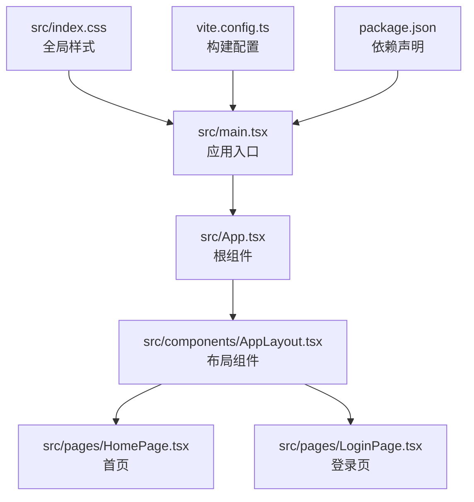
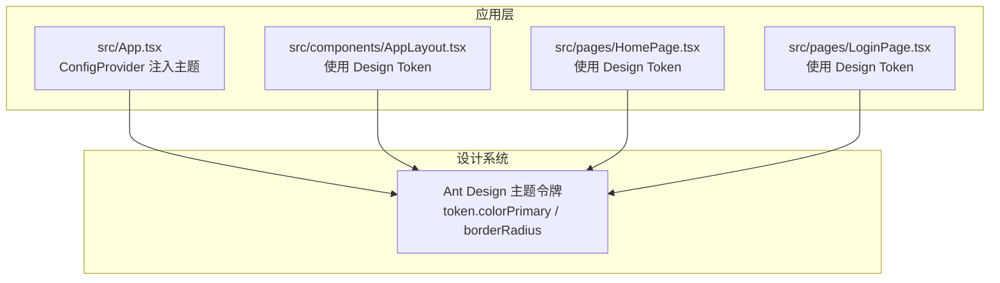
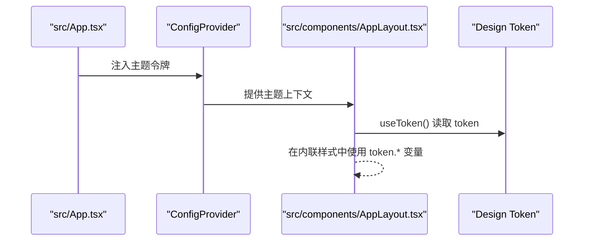
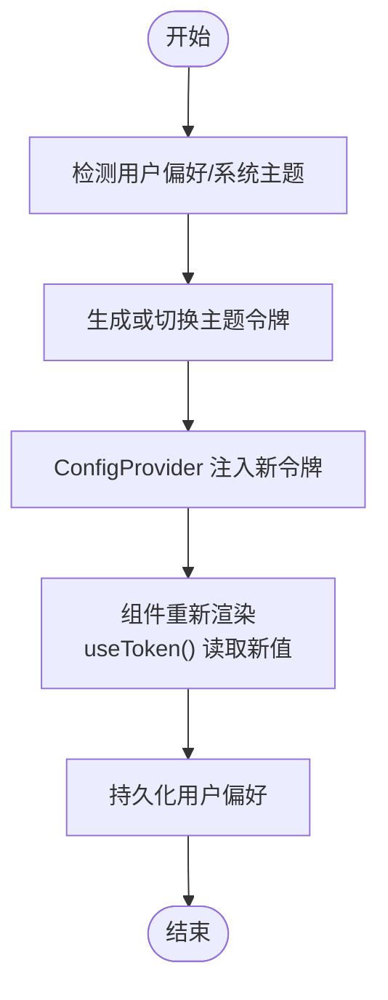
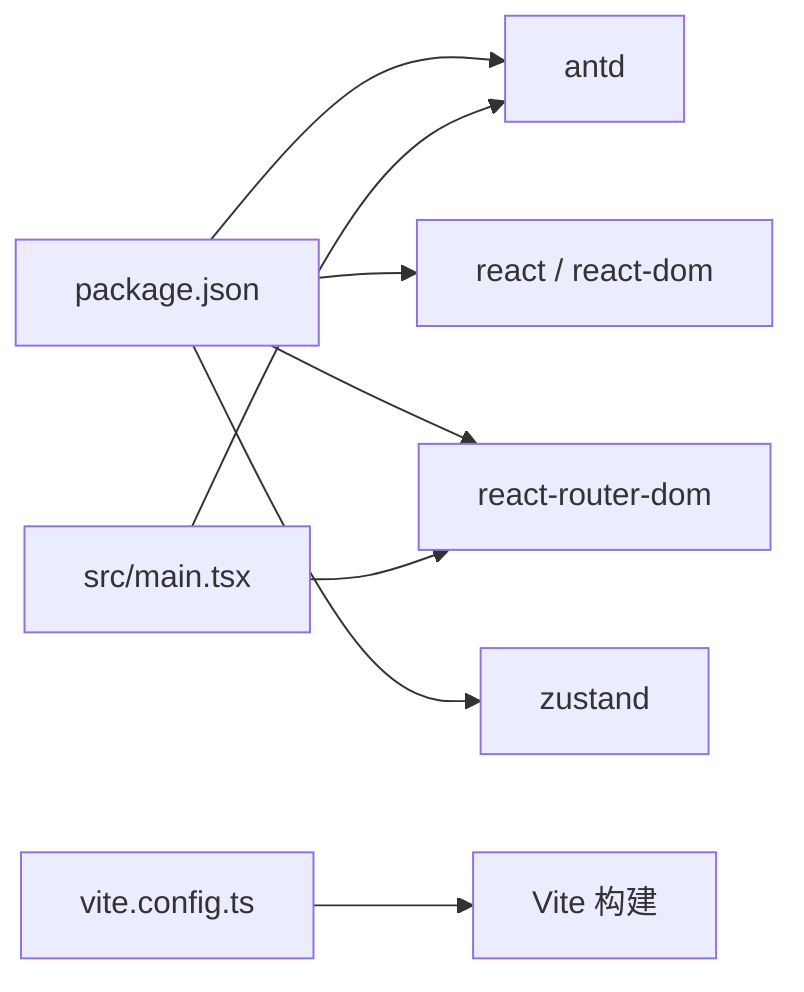

# 主题定制

<cite>
**本文引用的文件**
- [package.json](file://manga-website/package.json)
- [vite.config.ts](file://manga-website/vite.config.ts)
- [src/index.css](file://manga-website/src/index.css)
- [src/App.tsx](file://manga-website/src/App.tsx)
- [src/main.tsx](file://manga-website/src/main.tsx)
- [src/components/AppLayout.tsx](file://manga-website/src/components/AppLayout.tsx)
- [src/pages/HomePage.tsx](file://manga-website/src/pages/HomePage.tsx)
- [src/pages/LoginPage.tsx](file://manga-website/src/pages/LoginPage.tsx)
- [src/stores/authStore.ts](file://manga-website/src/stores/authStore.ts)
- [src/stores/mangaStore.ts](file://manga-website/src/stores/mangaStore.ts)
- [src/types/index.ts](file://manga-website/src/types/index.ts)
</cite>

## 目录
1. [简介](#简介)
2. [项目结构](#项目结构)
3. [核心组件](#核心组件)
4. [架构总览](#架构总览)
5. [详细组件分析](#详细组件分析)
6. [依赖分析](#依赖分析)
7. [性能考量](#性能考量)
8. [故障排查指南](#故障排查指南)
9. [结论](#结论)
10. [附录](#附录)

## 简介
本项目为一个基于 React 与 Ant Design 的漫画网站，已实现基础的主题定制能力：通过 Ant Design 的 ConfigProvider 在根部集中注入主题令牌（token），并在组件中使用 Design Token 动态读取当前主题变量，从而在不修改组件样式代码的前提下完成颜色、圆角等视觉元素的统一调整。本文围绕该实现进行系统化说明，涵盖主题变量配置、CSS 变量使用、Less 覆盖思路、主题切换机制与最佳实践，并提供可直接定位到源码位置的参考路径。

## 项目结构
项目采用 Vite + React + TypeScript 构建，Ant Design v5 作为 UI 基础库。主题定制的关键入口位于应用根组件，通过 ConfigProvider 注入主题配置；组件层通过 Design Token 读取主题变量，实现“声明式”主题消费。

图示来源
- [src/main.tsx:1-14](file://manga-website/src/main.tsx#L1-L14)
- [src/App.tsx:1-66](file://manga-website/src/App.tsx#L1-L66)
- [src/components/AppLayout.tsx:1-156](file://manga-website/src/components/AppLayout.tsx#L1-L156)
- [src/pages/HomePage.tsx:1-108](file://manga-website/src/pages/HomePage.tsx#L1-L108)
- [src/pages/LoginPage.tsx:1-86](file://manga-website/src/pages/LoginPage.tsx#L1-L86)
- [src/index.css:1-25](file://manga-website/src/index.css#L1-L25)
- [vite.config.ts:1-11](file://manga-website/vite.config.ts#L1-L11)
- [package.json:1-26](file://manga-website/package.json#L1-L26)

章节来源
- [src/main.tsx:1-14](file://manga-website/src/main.tsx#L1-L14)
- [src/App.tsx:1-66](file://manga-website/src/App.tsx#L1-L66)
- [src/index.css:1-25](file://manga-website/src/index.css#L1-L25)
- [vite.config.ts:1-11](file://manga-website/vite.config.ts#L1-L11)
- [package.json:1-26](file://manga-website/package.json#L1-L26)

## 核心组件
- 应用根组件（ConfigProvider）：集中注入主题令牌，包含主色与圆角等基础变量。
- 布局组件（AppLayout）：使用 Design Token 读取背景、边框、文本等颜色，实现头部、内容区、页脚的统一风格。
- 页面组件（HomePage、LoginPage）：在局部样式中直接使用 Design Token，确保与全局主题一致。
- 全局样式（index.css）：定义基础排版、滚动条等通用样式，与主题变量协同工作。

章节来源
- [src/App.tsx:14-23](file://manga-website/src/App.tsx#L14-L23)
- [src/components/AppLayout.tsx:23](file://manga-website/src/components/AppLayout.tsx#L23)
- [src/pages/HomePage.tsx:34-104](file://manga-website/src/pages/HomePage.tsx#L34-L104)
- [src/pages/LoginPage.tsx:24-84](file://manga-website/src/pages/LoginPage.tsx#L24-L84)
- [src/index.css:1-25](file://manga-website/src/index.css#L1-L25)

## 架构总览
下图展示了主题定制在应用中的运行时关系：ConfigProvider 将主题令牌注入全局，组件通过 Design Token 读取并渲染，最终形成一致的视觉风格。

图示来源
- [src/App.tsx:14-23](file://manga-website/src/App.tsx#L14-L23)
- [src/components/AppLayout.tsx:23](file://manga-website/src/components/AppLayout.tsx#L23)
- [src/pages/HomePage.tsx:34-104](file://manga-website/src/pages/HomePage.tsx#L34-L104)
- [src/pages/LoginPage.tsx:24-84](file://manga-website/src/pages/LoginPage.tsx#L24-L84)

## 详细组件分析

### 根组件主题注入（ConfigProvider）
- 作用：在应用根部集中注入主题令牌，影响所有子组件。
- 关键点：通过 token 字段设置主色与圆角等基础变量，即可实现全局统一风格。
- 使用建议：将常用颜色、字号、间距等抽象为 token，避免散落在各组件中硬编码。

章节来源
- [src/App.tsx:14-23](file://manga-website/src/App.tsx#L14-L23)

### 布局组件主题消费（AppLayout）
- 作用：在头部、内容区、页脚等区域使用 Design Token，保证背景、边框、文本颜色与全局主题一致。
- 关键点：通过 theme.useToken() 获取 token，再在内联样式中使用 token.colorBgContainer、token.colorBorderSecondary、token.colorTextSecondary 等变量。
- 实现方式：将 token 值直接用于 style 对象，实现“所见即所得”的主题一致性。

图示来源
- [src/App.tsx:14-23](file://manga-website/src/App.tsx#L14-L23)
- [src/components/AppLayout.tsx:23](file://manga-website/src/components/AppLayout.tsx#L23)

章节来源
- [src/components/AppLayout.tsx:19-156](file://manga-website/src/components/AppLayout.tsx#L19-L156)

### 页面组件主题消费（HomePage、LoginPage）
- 作用：在卡片、输入框、按钮等组件中使用 Design Token，确保与全局主题一致。
- 关键点：在局部样式中直接使用 token.* 变量，减少重复定义，提升可维护性。
- 示例场景：卡片圆角、按钮圆角、分割线颜色、文本强调色等。

章节来源
- [src/pages/HomePage.tsx:34-104](file://manga-website/src/pages/HomePage.tsx#L34-L104)
- [src/pages/LoginPage.tsx:24-84](file://manga-website/src/pages/LoginPage.tsx#L24-L84)

### 全局样式与主题协同（index.css）
- 作用：定义基础排版、滚动条等通用样式，与 Design Token 协同工作。
- 关键点：body 字体族、背景色等可与主题变量配合，保持整体风格统一。

章节来源
- [src/index.css:1-25](file://manga-website/src/index.css#L1-L25)

### 主题切换机制（实现建议）
当前仓库未实现动态主题切换功能。若需实现，可按以下思路扩展：
- 状态管理：在全局状态中维护当前主题模式（如 light/dark 或自定义主题）。
- 主题生成：根据模式动态计算或切换 ConfigProvider 的 token 值。
- 本地存储：持久化用户偏好，刷新后恢复。
- 组件更新：通过 Context 或状态驱动，使组件重新读取 Design Token 并渲染。

（本图为概念流程，无需图示来源）

## 依赖分析
- Ant Design：提供 Design Token 与组件生态，是主题定制的核心依赖。
- Vite：构建工具，支持按需处理样式与资源。
- React Router：路由控制页面切换，不影响主题逻辑。
- Zustand：状态管理，用于用户与漫画数据的状态维护。

图示来源
- [package.json:11-24](file://manga-website/package.json#L11-L24)
- [vite.config.ts:1-11](file://manga-website/vite.config.ts#L1-L11)
- [src/main.tsx:1-14](file://manga-website/src/main.tsx#L1-L14)

章节来源
- [package.json:11-24](file://manga-website/package.json#L11-L24)
- [vite.config.ts:1-11](file://manga-website/vite.config.ts#L1-L11)
- [src/main.tsx:1-14](file://manga-website/src/main.tsx#L1-L14)

## 性能考量
- Design Token 读取：组件通过 theme.useToken() 获取 token，属于轻量级计算，通常不会成为性能瓶颈。
- 样式体积：尽量通过 token 控制样式，避免在组件内重复定义大量样式，有助于减小打包体积。
- 渲染优化：主题切换时应避免不必要的重渲染，可通过状态分层与浅比较优化。

（本节为通用指导，无需章节来源）

## 故障排查指南
- 主题不生效
  - 检查是否在根组件正确包裹 ConfigProvider，并传入主题令牌。
  - 确认组件中使用了 Design Token（如 token.colorPrimary），而非硬编码颜色。
- 样式冲突
  - 避免在组件内同时使用 token 与硬编码颜色，保持一致性。
  - 若出现滚动条样式异常，检查 index.css 中相关选择器优先级。
- 构建问题
  - 确保 Ant Design 版本与 Design Token API 兼容，避免因版本差异导致的编译错误。

章节来源
- [src/App.tsx:14-23](file://manga-website/src/App.tsx#L14-L23)
- [src/components/AppLayout.tsx:23](file://manga-website/src/components/AppLayout.tsx#L23)
- [src/index.css:13-24](file://manga-website/src/index.css#L13-L24)

## 结论
本项目已具备基础的主题定制能力：通过 ConfigProvider 注入主题令牌，并在组件中使用 Design Token 实现统一风格。建议在此基础上进一步完善主题体系：明确 token 分层、补充暗色模式、增加主题切换与偏好持久化，并建立品牌一致性规范与可访问性准则，以支撑更复杂的主题需求。

（本节为总结，无需章节来源）

## 附录

### Ant Design 主题定制要点
- 主题变量（token）：集中定义主色、圆角、阴影、间距等基础变量。
- Design Token 消费：在组件中通过 theme.useToken() 读取 token.*，实现声明式主题消费。
- 局部样式：在局部样式中直接使用 token.*，避免硬编码颜色与尺寸。
- 全局样式：index.css 定义基础排版与通用组件样式，与 Design Token 协同。

章节来源
- [src/App.tsx:14-23](file://manga-website/src/App.tsx#L14-L23)
- [src/components/AppLayout.tsx:23](file://manga-website/src/components/AppLayout.tsx#L23)
- [src/index.css:1-25](file://manga-website/src/index.css#L1-L25)

### Less 变量覆盖（实现思路）
- 适用场景：需要对组件内部样式进行细粒度控制，或引入第三方 Less 资源。
- 实现步骤：
  - 在构建配置中启用 Less 支持（例如在 Vite 中添加 less 插件或预处理器配置）。
  - 新建主题覆盖文件，使用 Ant Design 提供的 Less 变量名进行覆盖。
  - 在入口处引入覆盖文件，确保在默认样式之后加载，以保证覆盖生效。
- 注意事项：覆盖文件应与 Ant Design 版本匹配，避免变量名变更导致的失效。

（本节为实现建议，无需章节来源）

### 主题切换与偏好保存（实现建议）
- 状态与存储：在全局状态中维护当前主题模式，并持久化到 localStorage。
- 切换策略：根据模式动态计算 token 值，或切换预设主题包。
- 组件响应：通过 Context 或状态变化触发组件重新渲染，useToken() 自动读取最新 token。

（本节为实现建议，无需章节来源）

### 最佳实践
- 颜色搭配：遵循品牌主色与辅助色的层级关系，确保对比度与可读性。
- 可访问性：关注文本对比度、键盘导航与屏幕阅读器支持。
- 品牌一致性：统一字号、字重、间距与圆角，形成稳定的视觉语言。
- 维护性：将主题变量集中在一处管理，避免散落硬编码，便于迭代与回滚。

（本节为通用指导，无需章节来源）