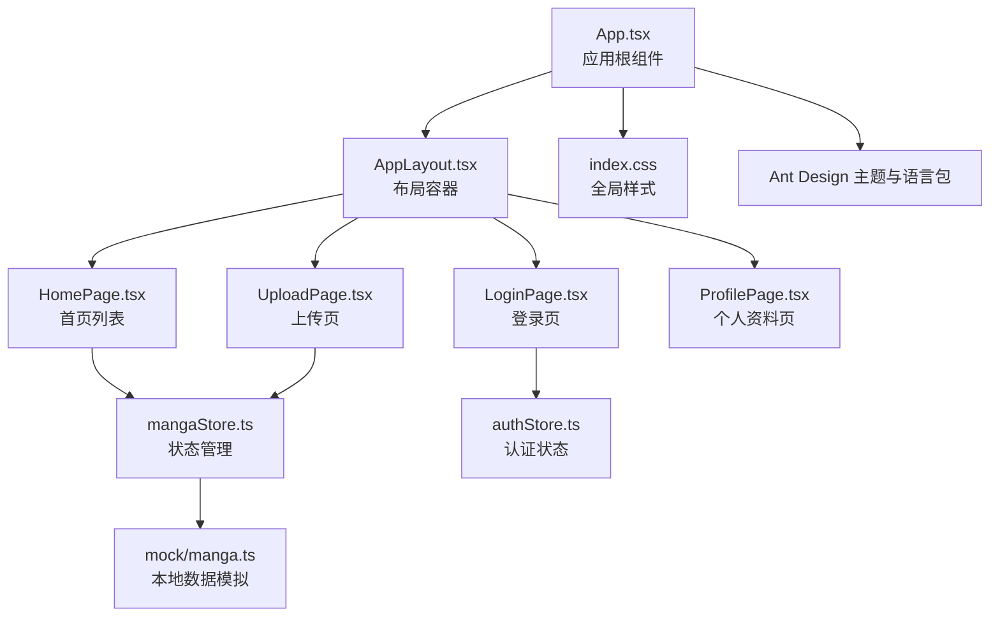
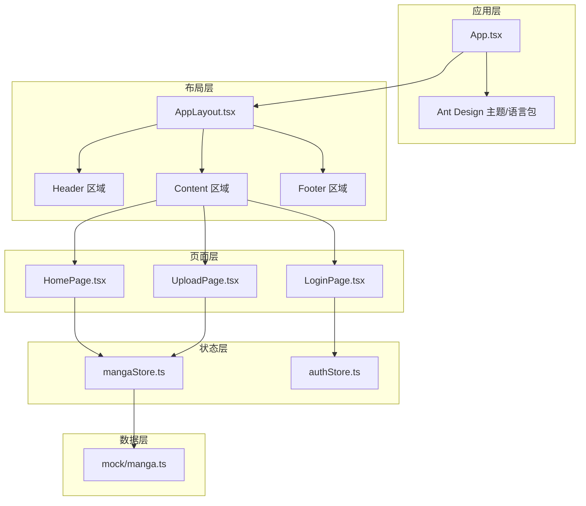
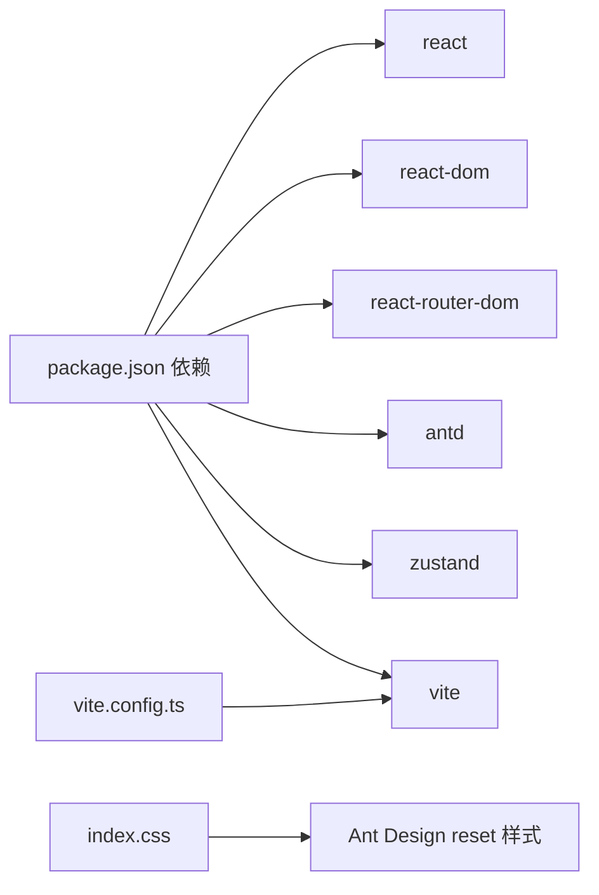

# 响应式设计

<cite>
**本文引用的文件**
- [src/index.css](file://src/index.css)
- [src/App.tsx](file://src/App.tsx)
- [src/components/AppLayout.tsx](file://src/components/AppLayout.tsx)
- [src/pages/HomePage.tsx](file://src/pages/HomePage.tsx)
- [src/pages/LoginPage.tsx](file://src/pages/LoginPage.tsx)
- [src/pages/UploadPage.tsx](file://src/pages/UploadPage.tsx)
- [src/stores/mangaStore.ts](file://src/stores/mangaStore.ts)
- [src/stores/authStore.ts](file://src/stores/authStore.ts)
- [src/types/index.ts](file://src/types/index.ts)
- [src/mock/manga.ts](file://src/mock/manga.ts)
- [package.json](file://package.json)
- [vite.config.ts](file://vite.config.ts)
- [dist/assets/index-DP8Hicut.css](file://dist/assets/index-DP8Hicut.css)
</cite>

## 目录
1. [引言](#引言)
2. [项目结构](#项目结构)
3. [核心组件](#核心组件)
4. [架构总览](#架构总览)
5. [详细组件分析](#详细组件分析)
6. [依赖分析](#依赖分析)
7. [性能考虑](#性能考虑)
8. [故障排查指南](#故障排查指南)
9. [结论](#结论)
10. [附录](#附录)

## 引言
本文件围绕漫画网站的响应式设计展开，系统梳理项目在断点策略、媒体查询、弹性布局（Flexbox）、栅格系统（Ant Design Grid）与卡片布局上的实现方式；结合移动端优先的设计原则，说明在桌面端、平板端与手机端的布局差异；并总结 Ant Design 组件的响应式特性与自定义样式的媒体查询配置建议，最后给出最佳实践与性能优化要点。

## 项目结构
该项目采用 React + TypeScript + Vite 构建，Ant Design 作为 UI 基础组件库。样式方面，全局基础样式通过入口样式文件统一设置，Ant Design 的主题与语言包在应用根部进行配置。页面层包含首页、登录页、注册页、上传页与个人资料页；布局层通过 AppLayout 统一承载头部、内容区与页脚，并在内容区使用 Ant Design 的栅格系统实现漫画卡片网格。

图表来源
- [src/App.tsx:13-66](file://src/App.tsx#L13-L66)
- [src/components/AppLayout.tsx:19-156](file://src/components/AppLayout.tsx#L19-L156)
- [src/pages/HomePage.tsx:8-108](file://src/pages/HomePage.tsx#L8-L108)
- [src/pages/LoginPage.tsx:9-86](file://src/pages/LoginPage.tsx#L9-L86)
- [src/pages/UploadPage.tsx:13-187](file://src/pages/UploadPage.tsx#L13-L187)
- [src/stores/mangaStore.ts:16-62](file://src/stores/mangaStore.ts#L16-L62)
- [src/stores/authStore.ts:14-45](file://src/stores/authStore.ts#L14-L45)
- [src/mock/manga.ts:138-173](file://src/mock/manga.ts#L138-L173)
- [src/index.css:1-25](file://src/index.css#L1-L25)

章节来源
- [src/App.tsx:13-66](file://src/App.tsx#L13-L66)
- [src/components/AppLayout.tsx:19-156](file://src/components/AppLayout.tsx#L19-L156)
- [src/index.css:1-25](file://src/index.css#L1-L25)
- [package.json:11-24](file://package.json#L11-L24)
- [vite.config.ts:1-11](file://vite.config.ts#L1-L11)

## 核心组件
- 应用根组件：在根组件中配置 Ant Design 的语言包与主题，并集中声明路由与布局容器。
- 布局容器：统一头部、内容区与页脚，内容区宽度限制与居中，配合 Ant Design 的栅格系统实现卡片网格。
- 首页：使用 Ant Design 的 Row/Col 实现响应式网格，Col 在不同断点下控制每行卡片数量。
- 登录页与上传页：采用 Flex 布局实现垂直居中与卡片内字段纵向排列，提升移动端可读性与触控体验。
- 状态管理：mangaStore 负责漫画数据加载、筛选与新增；authStore 负责登录态维护。

章节来源
- [src/App.tsx:13-66](file://src/App.tsx#L13-L66)
- [src/components/AppLayout.tsx:19-156](file://src/components/AppLayout.tsx#L19-L156)
- [src/pages/HomePage.tsx:34-104](file://src/pages/HomePage.tsx#L34-L104)
- [src/pages/LoginPage.tsx:24-84](file://src/pages/LoginPage.tsx#L24-L84)
- [src/pages/UploadPage.tsx:76-185](file://src/pages/UploadPage.tsx#L76-L185)
- [src/stores/mangaStore.ts:16-62](file://src/stores/mangaStore.ts#L16-L62)
- [src/stores/authStore.ts:14-45](file://src/stores/authStore.ts#L14-L45)

## 架构总览
下图展示了从应用根组件到页面组件、再到状态管理的数据流与布局关系，体现响应式布局在各层级的协作方式。

图表来源
- [src/App.tsx:13-66](file://src/App.tsx#L13-L66)
- [src/components/AppLayout.tsx:59-153](file://src/components/AppLayout.tsx#L59-L153)
- [src/pages/HomePage.tsx:8-108](file://src/pages/HomePage.tsx#L8-L108)
- [src/pages/LoginPage.tsx:9-86](file://src/pages/LoginPage.tsx#L9-L86)
- [src/pages/UploadPage.tsx:13-187](file://src/pages/UploadPage.tsx#L13-L187)
- [src/stores/mangaStore.ts:16-62](file://src/stores/mangaStore.ts#L16-L62)
- [src/stores/authStore.ts:14-45](file://src/stores/authStore.ts#L14-L45)
- [src/mock/manga.ts:138-173](file://src/mock/manga.ts#L138-L173)

## 详细组件分析

### 断点策略与媒体查询
- Ant Design 响应式断点：项目在首页漫画网格中直接使用 Ant Design 的 Col 组件属性 xs/sm/md/lg 实现断点控制，未显式书写媒体查询。Col 的断点语义如下：
  - xs：超小屏（默认每行 1 列）
  - sm：小屏（≥576px 每行 2 列）
  - md：中屏（≥768px 每行 3 列）
  - lg：大屏（≥992px 每行 4 列）
- 自定义媒体查询：项目未在源码中添加自定义媒体查询，全局样式仅包含基础重置与滚动条样式，未包含针对特定断点的规则。

章节来源
- [src/pages/HomePage.tsx:36-36](file://src/pages/HomePage.tsx#L36-L36)
- [src/index.css:1-25](file://src/index.css#L1-L25)

### 弹性布局（Flexbox）应用
- 登录页与上传页均采用 Flex 布局实现垂直居中与水平居中，确保在不同设备上内容区域保持良好的视觉重心与触控可达性。
- 登录页通过容器的 Flex 属性与卡片内字段纵向布局，提升移动端输入体验。
- 上传页同样采用 Flex 容器与纵向表单布局，保证在窄屏设备上字段间距与按钮高度的可读性与可点击性。

章节来源
- [src/pages/LoginPage.tsx:24-84](file://src/pages/LoginPage.tsx#L24-L84)
- [src/pages/UploadPage.tsx:76-185](file://src/pages/UploadPage.tsx#L76-L185)

### CSS Grid 与 Ant Design Grid 的应用
- 首页漫画网格：使用 Ant Design 的 Row/Col 组件构建响应式网格。Row 设置统一的列间距，Col 在不同断点下控制每行卡片数量，实现从手机端到桌面端的自适应排列。
- 卡片布局：卡片内部采用 Ant Design 的 Card 组件，覆盖层用于展示封面图，Meta 用于展示标题与描述，actions 中放置外部链接图标，整体布局简洁清晰。

章节来源
- [src/pages/HomePage.tsx:34-104](file://src/pages/HomePage.tsx#L34-L104)

### 导航菜单与头部的响应式适配
- 头部采用 Flex 布局，Logo、搜索框与用户操作三段式结构在不同断点下保持对齐与间距稳定。
- 搜索框使用 Ant Design 的 Space.Compact 与固定宽度，确保在中等及以上屏幕下具备良好的输入体验。
- 用户操作区根据登录态动态渲染，按钮尺寸与间距在 Ant Design 主题与 Token 的统一控制下保持一致。

章节来源
- [src/components/AppLayout.tsx:59-153](file://src/components/AppLayout.tsx#L59-L153)

### 移动端优先的设计原则
- 触摸友好：按钮与输入框在移动端具备足够的点击面积与间距，避免误触。
- 字体与间距：项目广泛使用 Ant Design 的 Typography 与主题 Token 控制字号与颜色，确保在小屏设备上具备良好的可读性。
- 内容区宽度：内容区设置最大宽度并居中，避免在超宽屏下内容过于稀疏；同时在窄屏下自动收缩至 100% 宽度。

章节来源
- [src/components/AppLayout.tsx:139-141](file://src/components/AppLayout.tsx#L139-L141)
- [src/pages/LoginPage.tsx:33-84](file://src/pages/LoginPage.tsx#L33-L84)
- [src/pages/UploadPage.tsx:84-185](file://src/pages/UploadPage.tsx#L84-L185)

### 不同屏幕尺寸下的布局变化
- 手机端（xs）：每行 1 列，卡片宽度占满，适合单列阅读与快速浏览。
- 平板端（sm）：每行 2 列，兼顾信息密度与可读性。
- 桌面端（md/lg）：每行 3/4 列，充分利用横向空间，提升信息浏览效率。

章节来源
- [src/pages/HomePage.tsx:36-36](file://src/pages/HomePage.tsx#L36-L36)

### Ant Design 组件的响应式特性与主题定制
- 主题定制：在应用根组件中通过 ConfigProvider 的 theme 配置主色与圆角等 Token，影响全局组件的视觉风格与一致性。
- 语言包：通过 locale 配置中文语言包，确保国际化文案与交互符合目标用户习惯。
- 组件断点：Ant Design 的 Grid、Typography、Button、Form 等组件天然支持响应式断点与尺寸调整，无需额外媒体查询即可实现多端适配。

章节来源
- [src/App.tsx:15-23](file://src/App.tsx#L15-L23)

### 表单布局的响应式适配
- 登录页与上传页均采用 Ant Design 的 Form 组件，垂直布局（layout="vertical"）在移动端更易读取与填写。
- 输入项尺寸与间距通过组件自身与主题 Token 控制，减少对自定义样式的依赖，提升维护性。

章节来源
- [src/pages/LoginPage.tsx:45-71](file://src/pages/LoginPage.tsx#L45-L71)
- [src/pages/UploadPage.tsx:96-182](file://src/pages/UploadPage.tsx#L96-L182)

### 数据流与状态管理的响应式支撑
- 首页数据：通过 mangaStore 加载预置数据并在搜索关键词变化时进行过滤，保证在不同断点下列表渲染的一致性。
- 认证状态：authStore 管理登录态，保障需要登录权限的页面在不同设备上的访问控制一致。

章节来源
- [src/stores/mangaStore.ts:21-32](file://src/stores/mangaStore.ts#L21-L32)
- [src/stores/mangaStore.ts:34-44](file://src/stores/mangaStore.ts#L34-L44)
- [src/stores/authStore.ts:14-45](file://src/stores/authStore.ts#L14-L45)

## 依赖分析
- 前端框架与工具：React、React Router DOM、Ant Design、Zustand。
- 构建工具：Vite，开发服务器端口与自动打开浏览器的配置。
- 样式与主题：Ant Design 提供的 reset 样式与主题 Token，全局样式文件负责基础重置与滚动条样式。

图表来源
- [package.json:11-24](file://package.json#L11-L24)
- [vite.config.ts:1-11](file://vite.config.ts#L1-L11)
- [src/index.css:1-25](file://src/index.css#L1-L25)

章节来源
- [package.json:11-24](file://package.json#L11-L24)
- [vite.config.ts:1-11](file://vite.config.ts#L1-L11)
- [src/index.css:1-25](file://src/index.css#L1-L25)

## 性能考虑
- 图片缩放与过渡：首页卡片封面图使用 object-fit 与缩放过渡，提升视觉体验且避免布局抖动。
- 列表渲染：使用 Ant Design 的 Row/Col 简化网格布局，减少手动媒体查询带来的计算开销。
- 状态管理：Zustand 提供轻量的状态管理，避免不必要的重渲染。
- 构建优化：Vite 提供快速冷启动与热更新，有利于开发阶段的响应式调试与迭代。

章节来源
- [src/pages/HomePage.tsx:40-57](file://src/pages/HomePage.tsx#L40-L57)
- [src/stores/mangaStore.ts:16-62](file://src/stores/mangaStore.ts#L16-L62)
- [vite.config.ts:1-11](file://vite.config.ts#L1-L11)

## 故障排查指南
- 登录页与上传页布局异常：检查容器的 Flex 属性与卡片内间距设置，确认在窄屏下是否仍保持垂直居中与可读性。
- 首页卡片断点错乱：核对 Col 的 xs/sm/md/lg 属性值与断点阈值，确保与预期一致。
- 滚动条样式不生效：确认全局样式文件是否正确引入，且未被其他样式覆盖。
- 上传功能异常：检查上传前校验逻辑与消息提示，确保在窄屏下按钮高度与点击反馈正常。

章节来源
- [src/pages/LoginPage.tsx:24-84](file://src/pages/LoginPage.tsx#L24-L84)
- [src/pages/UploadPage.tsx:76-185](file://src/pages/UploadPage.tsx#L76-L185)
- [src/pages/HomePage.tsx:34-104](file://src/pages/HomePage.tsx#L34-L104)
- [src/index.css:13-24](file://src/index.css#L13-L24)

## 结论
本项目在响应式设计上遵循“移动端优先”的原则，通过 Ant Design 的主题与断点体系实现跨端一致的用户体验。首页采用 Ant Design Grid 实现灵活的卡片网格布局，登录与上传页通过 Flex 布局提升移动端可读性与触控体验。整体架构清晰、依赖明确，具备良好的扩展性与维护性。若需进一步增强响应式表现，可在现有基础上补充自定义媒体查询与更精细的断点控制。

## 附录
- 断点对照（基于 Ant Design Col 属性）：
  - xs：每行 1 列
  - sm：每行 2 列
  - md：每行 3 列
  - lg：每行 4 列
- 全局样式要点：基础重置与滚动条样式位于全局样式文件，未包含自定义媒体查询。
- 构建与运行：使用 Vite 开发服务器，端口 3000，自动打开浏览器。

章节来源
- [src/pages/HomePage.tsx:36-36](file://src/pages/HomePage.tsx#L36-L36)
- [src/index.css:1-25](file://src/index.css#L1-L25)
- [vite.config.ts:6-9](file://vite.config.ts#L6-L9)