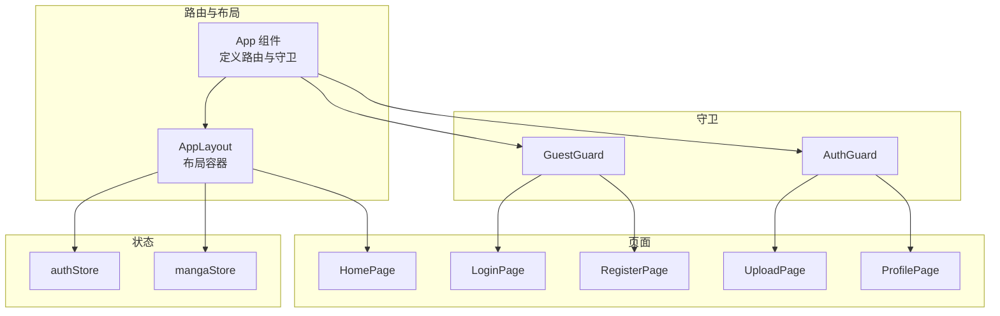
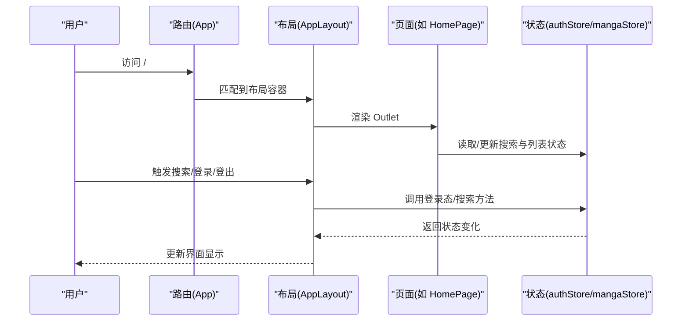
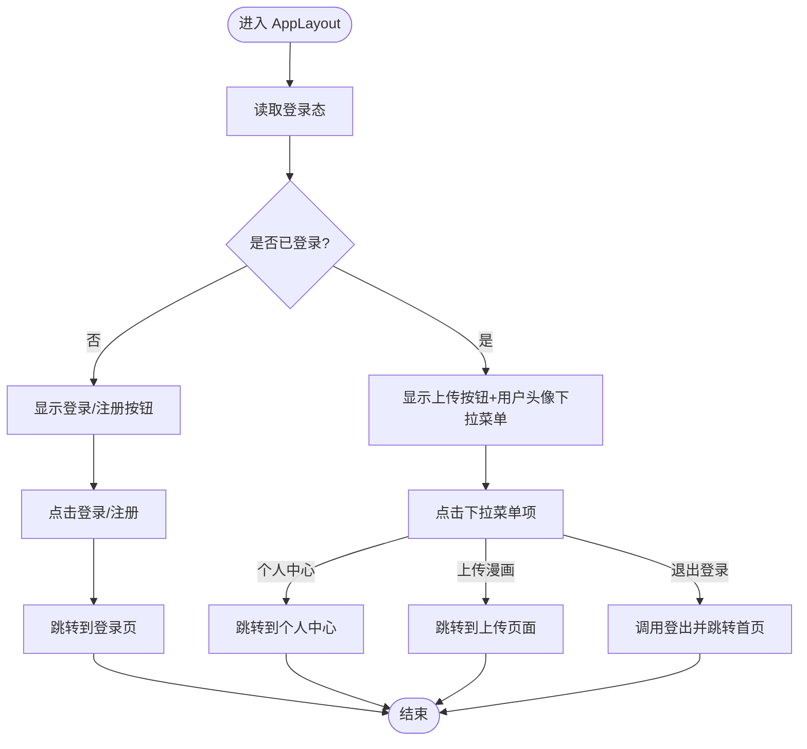
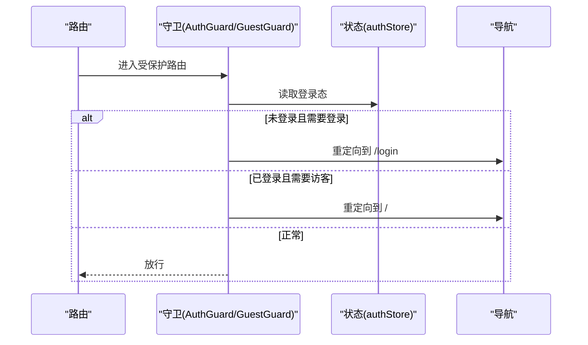
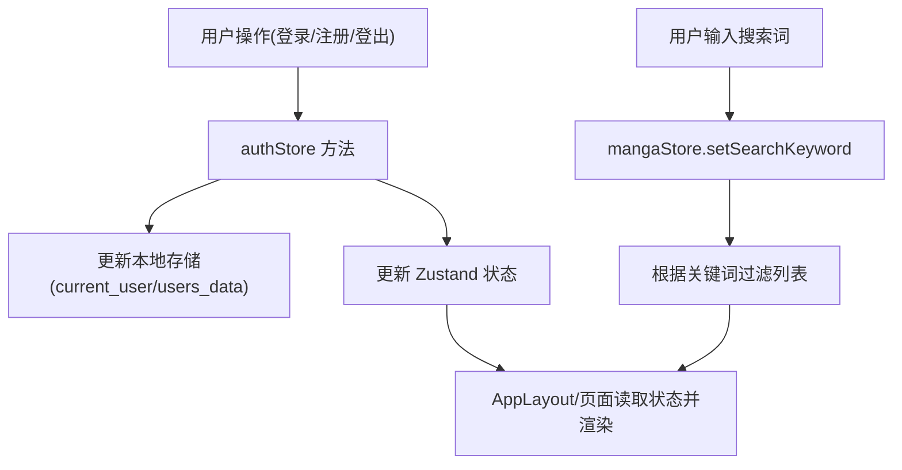
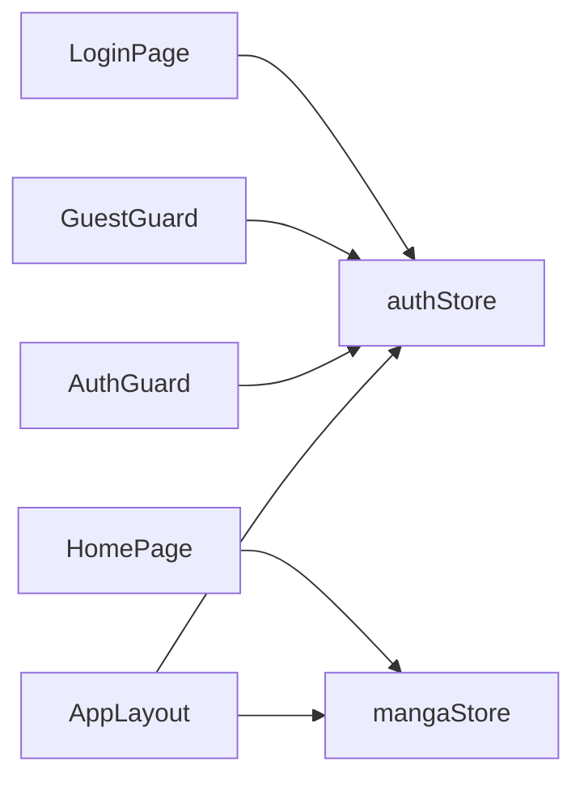

# 应用布局组件

<cite>
**本文引用的文件**
- [AppLayout.tsx](file://manga-website/src/components/AppLayout.tsx)
- [AuthGuard.tsx](file://manga-website/src/components/AuthGuard.tsx)
- [GuestGuard.tsx](file://manga-website/src/components/GuestGuard.tsx)
- [authStore.ts](file://manga-website/src/stores/authStore.ts)
- [mangaStore.ts](file://manga-website/src/stores/mangaStore.ts)
- [user.ts](file://manga-website/src/mock/user.ts)
- [index.ts](file://manga-website/src/types/index.ts)
- [HomePage.tsx](file://manga-website/src/pages/HomePage.tsx)
- [LoginPage.tsx](file://manga-website/src/pages/LoginPage.tsx)
- [App.tsx](file://manga-website/src/App.tsx)
</cite>

## 目录
1. [简介](#简介)
2. [项目结构](#项目结构)
3. [核心组件](#核心组件)
4. [架构总览](#架构总览)
5. [详细组件分析](#详细组件分析)
6. [依赖关系分析](#依赖关系分析)
7. [性能考虑](#性能考虑)
8. [故障排查指南](#故障排查指南)
9. [结论](#结论)
10. [附录：扩展指南](#附录扩展指南)

## 简介
本文件围绕应用布局组件 AppLayout 展开，系统性说明其设计架构与实现细节，涵盖以下主题：
- 布局三段式结构：Header 头部导航、Content 内容区、Footer 底部信息
- 顶部搜索与用户操作区的交互逻辑
- 导航守卫 AuthGuard 与 GuestGuard 与布局组件的集成方式
- 响应式布局在页面卡片中的体现（用于理解整体响应式策略）
- Props 传递、状态管理与事件处理机制
- 扩展指南：自定义菜单项、新增功能区域、修改布局样式

## 项目结构
AppLayout 位于组件层，配合路由守卫与全局状态管理共同构成前端骨架。路由配置在根组件中完成，AppLayout 作为所有受保护页面的容器。

图表来源
- [App.tsx:24-59](file://manga-website/src/App.tsx#L24-L59)
- [AppLayout.tsx:19-155](file://manga-website/src/components/AppLayout.tsx#L19-L155)
- [AuthGuard.tsx:8-16](file://manga-website/src/components/AuthGuard.tsx#L8-L16)
- [GuestGuard.tsx:8-16](file://manga-website/src/components/GuestGuard.tsx#L8-L16)
- [authStore.ts:14-44](file://manga-website/src/stores/authStore.ts#L14-L44)
- [mangaStore.ts:16-61](file://manga-website/src/stores/mangaStore.ts#L16-L61)

章节来源
- [App.tsx:13-63](file://manga-website/src/App.tsx#L13-L63)

## 核心组件
- AppLayout：负责整体布局、头部导航、内容区与页脚渲染；内部包含搜索、用户登录态切换与下拉菜单等交互。
- AuthGuard：认证守卫，未登录则重定向至登录页。
- GuestGuard：访客守卫，已登录则重定向至首页。
- authStore：全局认证状态（用户信息、登录/注册/登出、检查登录态）。
- mangaStore：全局漫画数据与搜索过滤状态（加载、设置关键词、筛选、增删改刷新）。

章节来源
- [AppLayout.tsx:19-155](file://manga-website/src/components/AppLayout.tsx#L19-L155)
- [AuthGuard.tsx:8-16](file://manga-website/src/components/AuthGuard.tsx#L8-L16)
- [GuestGuard.tsx:8-16](file://manga-website/src/components/GuestGuard.tsx#L8-L16)
- [authStore.ts:14-44](file://manga-website/src/stores/authStore.ts#L14-L44)
- [mangaStore.ts:16-61](file://manga-website/src/stores/mangaStore.ts#L16-L61)

## 架构总览
AppLayout 通过 React Router 的 Outlet 渲染子页面；路由层使用 AuthGuard/GuestGuard 控制访问权限；状态层由 Zustand 的 authStore 与 mangaStore 提供。

图表来源
- [App.tsx:24-59](file://manga-website/src/App.tsx#L24-L59)
- [AppLayout.tsx:19-155](file://manga-website/src/components/AppLayout.tsx#L19-L155)
- [authStore.ts:14-44](file://manga-website/src/stores/authStore.ts#L14-L44)
- [mangaStore.ts:16-61](file://manga-website/src/stores/mangaStore.ts#L16-L61)

## 详细组件分析

### AppLayout 布局组件
- 结构组成
  - Header：包含 Logo、搜索框、用户操作按钮与下拉菜单
  - Content：承载 Outlet，渲染当前路由页面
  - Footer：版权与说明信息
- 关键交互
  - 搜索：输入框变更与回车触发，调用状态存储设置关键词并跳转首页
  - 登录态：根据登录状态显示“上传漫画”按钮与用户下拉菜单，或显示“登录/注册”
  - 下拉菜单：包含“个人中心”“上传漫画”“退出登录”，其中“退出登录”会清空本地登录态并跳转首页
- 状态与依赖
  - 使用 authStore 获取用户信息与登录态，并执行登出
  - 使用 mangaStore 获取搜索关键词并设置
  - 使用 Ant Design 主题 token 动态适配背景色与边框色
- 响应式布局
  - 页面卡片在 HomePage 中采用栅格系统与断点，体现整体响应式策略（与 AppLayout 外层布局相辅相成）

图表来源
- [AppLayout.tsx:19-155](file://manga-website/src/components/AppLayout.tsx#L19-L155)
- [authStore.ts:14-44](file://manga-website/src/stores/authStore.ts#L14-L44)

章节来源
- [AppLayout.tsx:19-155](file://manga-website/src/components/AppLayout.tsx#L19-L155)

### 导航守卫 AuthGuard 与 GuestGuard
- AuthGuard
  - 作用：确保只有登录用户可访问被其包裹的页面
  - 实现：从 authStore 读取登录态，未登录则重定向到登录页
- GuestGuard
  - 作用：确保仅未登录用户可访问被其包裹的页面（如登录/注册）
  - 实现：已登录则重定向到首页

图表来源
- [AuthGuard.tsx:8-16](file://manga-website/src/components/AuthGuard.tsx#L8-L16)
- [GuestGuard.tsx:8-16](file://manga-website/src/components/GuestGuard.tsx#L8-L16)
- [authStore.ts:14-44](file://manga-website/src/stores/authStore.ts#L14-L44)

章节来源
- [AuthGuard.tsx:8-16](file://manga-website/src/components/AuthGuard.tsx#L8-L16)
- [GuestGuard.tsx:8-16](file://manga-website/src/components/GuestGuard.tsx#L8-L16)
- [authStore.ts:14-44](file://manga-website/src/stores/authStore.ts#L14-L44)

### 状态管理与数据流
- 认证状态（authStore）
  - 提供用户信息、登录态、登录、注册、登出、检查登录态等方法
  - 登录/注册成功后更新本地存储与状态
  - 登出时清除本地存储并重置状态
- 搜索与漫画数据（mangaStore）
  - 提供加载、设置关键词、筛选、新增、删除、刷新等方法
  - 搜索关键词变更时同步更新过滤结果
- 类型定义（types/index.ts）
  - 定义用户、漫画、登录/注册/上传表单等类型

图表来源
- [authStore.ts:14-44](file://manga-website/src/stores/authStore.ts#L14-L44)
- [user.ts:67-89](file://manga-website/src/mock/user.ts#L67-L89)
- [mangaStore.ts:16-61](file://manga-website/src/stores/mangaStore.ts#L16-L61)
- [index.ts:14-43](file://manga-website/src/types/index.ts#L14-L43)

章节来源
- [authStore.ts:14-44](file://manga-website/src/stores/authStore.ts#L14-L44)
- [user.ts:26-89](file://manga-website/src/mock/user.ts#L26-L89)
- [mangaStore.ts:16-61](file://manga-website/src/stores/mangaStore.ts#L16-L61)
- [index.ts:14-43](file://manga-website/src/types/index.ts#L14-L43)

### 响应式布局与页面示例
- AppLayout 外层使用 Ant Design Layout，Header/Footer 通过主题 token 适配颜色与边框
- 页面级响应式：HomePage 使用栅格断点与卡片布局，体现移动端到桌面端的自适应
- 该策略与 AppLayout 的外层容器形成协同，保证整体视觉与交互一致性

章节来源
- [AppLayout.tsx:59-154](file://manga-website/src/components/AppLayout.tsx#L59-L154)
- [HomePage.tsx:34-104](file://manga-website/src/pages/HomePage.tsx#L34-L104)

## 依赖关系分析
- 组件耦合
  - AppLayout 依赖 authStore 与 mangaStore，用于渲染与交互
  - 守卫组件依赖 authStore 判断登录态
  - 页面组件依赖对应 store 读取/更新状态
- 数据流向
  - 用户操作 → 守卫/布局 → 状态存储 → 页面渲染
  - 搜索输入 → 状态存储 → 页面过滤渲染
- 可能的循环依赖
  - 当前结构清晰，无直接循环依赖风险

图表来源
- [AppLayout.tsx:19-155](file://manga-website/src/components/AppLayout.tsx#L19-L155)
- [AuthGuard.tsx:8-16](file://manga-website/src/components/AuthGuard.tsx#L8-L16)
- [GuestGuard.tsx:8-16](file://manga-website/src/components/GuestGuard.tsx#L8-L16)
- [authStore.ts:14-44](file://manga-website/src/stores/authStore.ts#L14-L44)
- [mangaStore.ts:16-61](file://manga-website/src/stores/mangaStore.ts#L16-L61)
- [HomePage.tsx:9](file://manga-website/src/pages/HomePage.tsx#L9)
- [LoginPage.tsx:11](file://manga-website/src/pages/LoginPage.tsx#L11)

章节来源
- [App.tsx:13-63](file://manga-website/src/App.tsx#L13-L63)

## 性能考虑
- 状态粒度
  - 将登录态与搜索关键词拆分到不同 store，避免无关渲染
- 渲染优化
  - 使用主题 token 减少重复计算
  - 页面卡片使用懒加载与缩略图策略（在图片层面）
- 导航守卫
  - 在路由层进行快速判断，减少无效渲染

## 故障排查指南
- 登录后仍被重定向到登录页
  - 检查 authStore 的登录流程与本地存储写入
  - 确认守卫组件读取的登录态是否正确
- 搜索无结果
  - 检查 mangaStore 的关键词设置与过滤逻辑
  - 确认 HomePage 是否正确读取 filteredMangas
- 退出登录后状态未更新
  - 检查 authStore 的 logout 流程与本地存储清理
  - 确认 AppLayout 的用户菜单是否调用了登出方法

章节来源
- [authStore.ts:35-43](file://manga-website/src/stores/authStore.ts#L35-L43)
- [user.ts:87-89](file://manga-website/src/mock/user.ts#L87-L89)
- [mangaStore.ts:34-44](file://manga-website/src/stores/mangaStore.ts#L34-L44)
- [AppLayout.tsx:31-34](file://manga-website/src/components/AppLayout.tsx#L31-L34)

## 结论
AppLayout 以简洁清晰的方式组织了头部导航、内容区与页脚，结合路由守卫与状态管理实现了完整的访问控制与数据驱动渲染。其响应式策略与 Ant Design 主题系统提升了跨设备体验。通过模块化与职责分离，组件具备良好的可维护性与扩展性。

## 附录：扩展指南

### 自定义菜单项
- 在 AppLayout 的用户下拉菜单中新增条目，设置唯一 key、图标与点击行为
- 若需权限控制，可在渲染前基于登录态或角色进行条件判断

章节来源
- [AppLayout.tsx:36-56](file://manga-website/src/components/AppLayout.tsx#L36-L56)

### 添加新功能区域
- 在 Header 区域增加按钮或下拉菜单，结合 authStore 判断登录态
- 在 Content 区域通过 Outlet 渲染新的页面组件，并在路由层配置 AuthGuard/GuestGuard

章节来源
- [AppLayout.tsx:111-136](file://manga-website/src/components/AppLayout.tsx#L111-L136)
- [App.tsx:43-58](file://manga-website/src/App.tsx#L43-L58)

### 修改布局样式
- 使用 Ant Design 主题 token 动态调整 Header/Footer 背景色与边框色
- 通过内联样式或 CSS-in-JS 控制布局尺寸与间距，保持响应式断点一致

章节来源
- [AppLayout.tsx:61-72](file://manga-website/src/components/AppLayout.tsx#L61-L72)
- [AppLayout.tsx:143-150](file://manga-website/src/components/AppLayout.tsx#L143-L150)