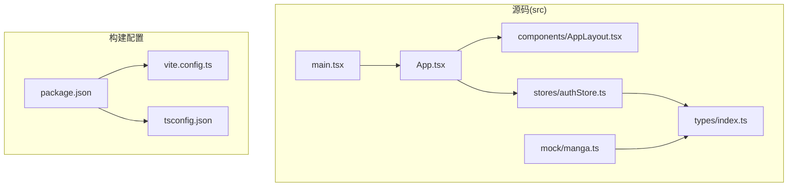
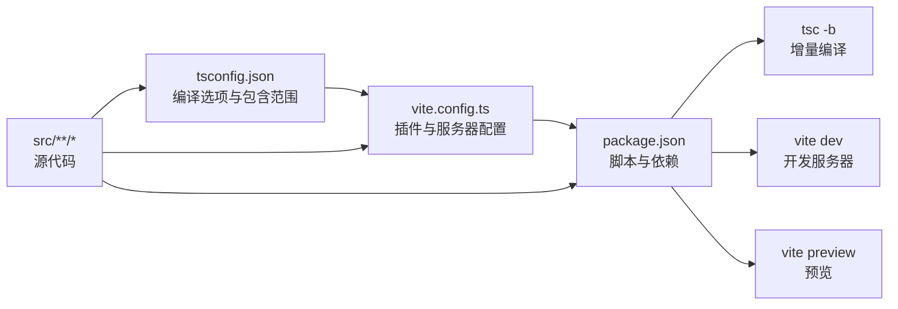
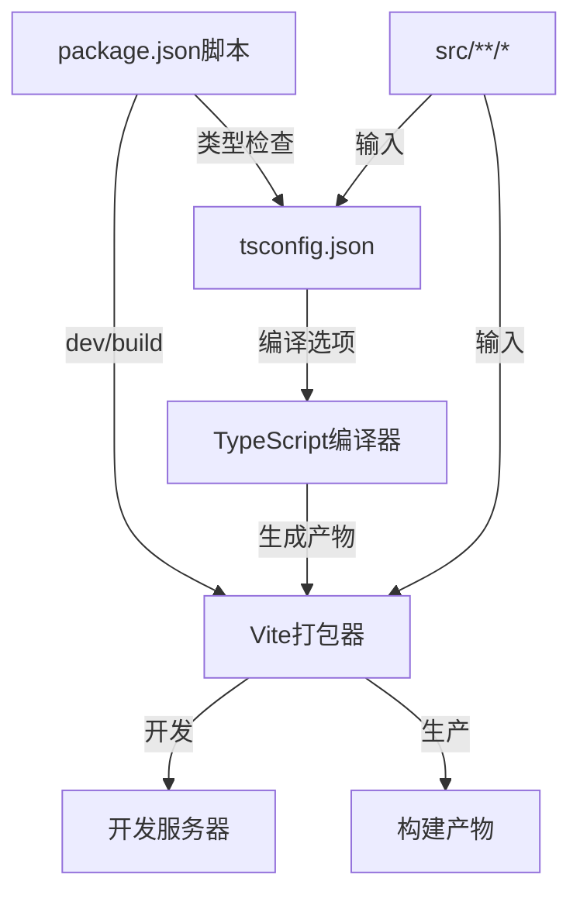

# TypeScript配置

<cite>
**本文引用的文件**
- [tsconfig.json](file://manga-website/tsconfig.json)
- [package.json](file://manga-website/package.json)
- [vite.config.ts](file://manga-website/vite.config.ts)
- [src/types/index.ts](file://manga-website/src/types/index.ts)
- [src/main.tsx](file://manga-website/src/main.tsx)
- [src/App.tsx](file://manga-website/src/App.tsx)
- [src/stores/authStore.ts](file://manga-website/src/stores/authStore.ts)
- [src/mock/manga.ts](file://manga-website/src/mock/manga.ts)
- [src/vite-env.d.ts](file://manga-website/src/vite-env.d.ts)
- [src/components/AppLayout.tsx](file://manga-website/src/components/AppLayout.tsx)
</cite>

## 目录
1. [简介](#简介)
2. [项目结构](#项目结构)
3. [核心组件](#核心组件)
4. [架构总览](#架构总览)
5. [详细组件分析](#详细组件分析)
6. [依赖关系分析](#依赖关系分析)
7. [性能考量](#性能考量)
8. [故障排查指南](#故障排查指南)
9. [结论](#结论)
10. [附录](#附录)

## 简介
本文件围绕该TypeScript项目的核心配置进行系统化解读，重点覆盖以下方面：
- 编译目标、模块系统、严格模式与路径映射等关键编译选项
- 类型检查规则与最佳实践（类型断言、泛型、接口设计）
- 项目结构对配置的影响（源码目录、输出目录、声明文件）
- 类型安全开发指导（类型推断、联合类型、条件类型）
- 常见编译错误的成因与解决思路

本项目采用Vite作为构建工具，TypeScript用于类型检查与编译，React + Ant Design作为前端框架，Zustand管理状态，本地存储模拟数据。

## 项目结构
该项目采用“功能分层 + 组件化”的组织方式：
- 源码根目录：src
  - components：UI组件与路由守卫
  - pages：页面级组件
  - stores：状态管理（Zustand）
  - mock：本地数据与业务模拟
  - types：全局类型定义
  - 入口与应用根组件：main.tsx、App.tsx
- 构建与运行：package.json脚本、vite.config.ts
- 类型配置：tsconfig.json

图表来源
- [tsconfig.json:1-24](file://manga-website/tsconfig.json#L1-L24)
- [package.json:1-26](file://manga-website/package.json#L1-L26)
- [vite.config.ts:1-11](file://manga-website/vite.config.ts#L1-L11)
- [src/main.tsx:1-14](file://manga-website/src/main.tsx#L1-L14)
- [src/App.tsx:1-66](file://manga-website/src/App.tsx#L1-L66)
- [src/types/index.ts:1-44](file://manga-website/src/types/index.ts#L1-L44)
- [src/stores/authStore.ts:1-45](file://manga-website/src/stores/authStore.ts#L1-L45)
- [src/mock/manga.ts:1-173](file://manga-website/src/mock/manga.ts#L1-L173)
- [src/components/AppLayout.tsx:1-156](file://manga-website/src/components/AppLayout.tsx#L1-L156)

章节来源
- [tsconfig.json:1-24](file://manga-website/tsconfig.json#L1-L24)
- [package.json:1-26](file://manga-website/package.json#L1-L26)
- [vite.config.ts:1-11](file://manga-website/vite.config.ts#L1-L11)

## 核心组件
本节聚焦tsconfig.json中的关键编译选项及其影响。

- 编译目标与库
  - target：ES2020，确保现代语法特性可用
  - lib：包含ES2020、DOM、DOM.Iterable，满足浏览器环境与迭代器API需求
- 模块系统与解析策略
  - module：ESNext，与打包器配合
  - moduleResolution：bundler，与打包器生态一致
  - moduleDetection：force，强制检测模块类型，避免隐式默认导出问题
- 输出与编译行为
  - noEmit：true，不生成JS产物，由Vite负责打包与输出
  - isolatedModules：true，提升增量编译与打包器兼容性
- JSX与React
  - jsx：react-jsx，启用新的JSX转换
  - React相关类型：通过@types/react与vite-env.d.ts提供
- 严格模式与静态检查
  - strict：true，开启全面严格检查
  - noUnusedLocals/noUnusedParameters：关闭宽松，便于快速迭代；建议在团队规范中统一
  - noFallthroughCasesInSwitch：true，防止switch遗漏break
  - noUncheckedSideEffectImports：true，限制未检查副作用导入
  - forceConsistentCasingInFileNames：true，避免大小写差异导致的问题
- 路径与类型检查
  - skipLibCheck：true，加速类型检查
  - allowImportingTsExtensions：true，允许直接导入.ts扩展名文件
  - tsBuildInfoFile：指定增量编译缓存位置

章节来源
- [tsconfig.json:1-24](file://manga-website/tsconfig.json#L1-L24)

## 架构总览
TypeScript配置与构建工具的协作关系如下：

图表来源
- [tsconfig.json:1-24](file://manga-website/tsconfig.json#L1-L24)
- [package.json:1-26](file://manga-website/package.json#L1-L26)
- [vite.config.ts:1-11](file://manga-website/vite.config.ts#L1-L11)

## 详细组件分析

### 编译目标与模块系统
- 目标平台：ES2020
  - 影响：可使用较新的语言特性，如逻辑赋值、空值合并、可选链等
  - 注意：需确保打包器与目标浏览器支持
- 模块系统：ESNext + bundler解析
  - 影响：与Vite生态契合，利于Tree Shaking与按需加载
  - 注意：避免CommonJS与ESM混用导致的兼容问题
- 模块检测：force
  - 影响：明确模块类型，减少隐式默认导出带来的歧义

章节来源
- [tsconfig.json:4-12](file://manga-website/tsconfig.json#L4-L12)

### 严格模式与类型检查规则
- 严格模式：true
  - 影响：开启严格的类型推断、空值检查、参数初始化等
  - 建议：结合团队规范，逐步收紧noUnusedLocals与noUnusedParameters
- switch检查：noFallthroughCasesInSwitch
  - 影响：防止遗漏break导致的逻辑错误
- 副作用导入：noUncheckedSideEffectImports
  - 影响：限制未检查副作用的导入，提升安全性
- 文件名大小写：forceConsistentCasingInFileNames
  - 影响：避免跨平台差异导致的导入失败

章节来源
- [tsconfig.json:15-20](file://manga-website/tsconfig.json#L15-L20)

### JSX与React集成
- jsx：react-jsx
  - 影响：启用新的JSX转换，无需手动导入React
- React类型：通过@types/react与vite-env.d.ts提供
  - 影响：确保TS能识别React组件签名与Hooks返回值

章节来源
- [tsconfig.json:14](file://manga-website/tsconfig.json#L14)
- [package.json:18-23](file://manga-website/package.json#L18-L23)
- [src/vite-env.d.ts:1-2](file://manga-website/src/vite-env.d.ts#L1-L2)

### 路径映射与包含范围
- 包含范围：include: ["src"]
  - 影响：仅对src目录进行类型检查与编译，缩小检查范围
- 路径映射：未显式配置baseUrl与paths
  - 影响：使用相对路径导入，保持简单清晰
  - 建议：若项目规模扩大，可考虑配置paths以简化导入

章节来源
- [tsconfig.json:22-23](file://manga-website/tsconfig.json#L22-L23)

### 类型定义与声明文件
- 全局类型：src/types/index.ts
  - 影响：集中定义Manga、User、表单等接口，供各模块复用
- React环境声明：src/vite-env.d.ts
  - 影响：为Vite的客户端类型提供声明

章节来源
- [src/types/index.ts:1-44](file://manga-website/src/types/index.ts#L1-L44)
- [src/vite-env.d.ts:1-2](file://manga-website/src/vite-env.d.ts#L1-L2)

### 实际使用示例与类型安全
- Zustand状态管理
  - 使用泛型约束状态接口，确保store类型安全
  - 在动作函数中返回明确的结果对象，便于上层处理
- Mock数据与类型
  - 使用Omit构造新类型，避免重复字段
  - 对localStorage读取进行try/catch容错，保证类型一致性
- 组件与路由
  - AppLayout通过useAuthStore/useMangaStore注入状态，类型推断明确
  - 路由守卫与页面组件通过类型接口约束props与状态

章节来源
- [src/stores/authStore.ts:1-45](file://manga-website/src/stores/authStore.ts#L1-L45)
- [src/mock/manga.ts:1-173](file://manga-website/src/mock/manga.ts#L1-L173)
- [src/components/AppLayout.tsx:1-156](file://manga-website/src/components/AppLayout.tsx#L1-L156)
- [src/App.tsx:1-66](file://manga-website/src/App.tsx#L1-L66)

## 依赖关系分析
TypeScript配置与构建工具的耦合关系如下：

图表来源
- [tsconfig.json:1-24](file://manga-website/tsconfig.json#L1-L24)
- [package.json:6-10](file://manga-website/package.json#L6-L10)
- [vite.config.ts:1-11](file://manga-website/vite.config.ts#L1-L11)

章节来源
- [tsconfig.json:1-24](file://manga-website/tsconfig.json#L1-L24)
- [package.json:1-26](file://manga-website/package.json#L1-L26)
- [vite.config.ts:1-11](file://manga-website/vite.config.ts#L1-L11)

## 性能考量
- 跳过库检查：skipLibCheck
  - 优点：显著提升类型检查速度
  - 风险：忽略第三方库的类型问题，需在CI中谨慎评估
- 增量编译：noEmit + tsc -b
  - 优点：与Vite联动，减少重复编译开销
  - 注意：确保构建流程中正确触发tsc -b
- 模块检测：moduleDetection: force
  - 优点：避免隐式默认导出导致的类型歧义
  - 建议：在团队内统一模块风格，减少导入差异

章节来源
- [tsconfig.json:8,12](file://manga-website/tsconfig.json#L8,L12)
- [package.json:8](file://manga-website/package.json#L8)

## 故障排查指南
- 常见错误与成因
  - JSX相关报错：确认jsx设置为react-jsx且React类型可用
    - 参考：[tsconfig.json:14](file://manga-website/tsconfig.json#L14)，[package.json:18-23](file://manga-website/package.json#L18-L23)，[src/vite-env.d.ts:1-2](file://manga-website/src/vite-env.d.ts#L1-L2)
  - 模块解析失败：检查module/moduleResolution是否与打包器匹配
    - 参考：[tsconfig.json:7-9](file://manga-website/tsconfig.json#L7-L9)
  - 未使用变量告警：根据团队规范调整noUnusedLocals/noUnusedParameters
    - 参考：[tsconfig.json:16-17](file://manga-website/tsconfig.json#L16-L17)
  - switch遗漏break：启用noFallthroughCasesInSwitch
    - 参考：[tsconfig.json:18](file://manga-website/tsconfig.json#L18)
  - 未检查副作用导入：启用noUncheckedSideEffectImports
    - 参考：[tsconfig.json:19](file://manga-website/tsconfig.json#L19)
- 解决步骤
  - 清理缓存：删除node_modules/.tmp与.vite目录后重试
  - 同步依赖：确保@types/react与typescript版本匹配
  - 检查包含范围：确认include仅包含src，避免无关文件干扰
  - 逐步收紧规则：从noUnusedLocals开始，逐步启用更严格规则

章节来源
- [tsconfig.json:14-20](file://manga-website/tsconfig.json#L14-L20)
- [package.json:18-23](file://manga-website/package.json#L18-L23)
- [src/vite-env.d.ts:1-2](file://manga-website/src/vite-env.d.ts#L1-L2)

## 结论
本项目的TypeScript配置以“严格+现代”为核心，结合Vite实现高效开发与构建。通过合理的编译目标、模块系统与严格规则，既保障了类型安全，又兼顾了开发效率。建议在团队内统一模块风格与严格规则，并根据项目演进适时引入路径映射与更严格的类型检查。

## 附录

### 类型检查规则与最佳实践
- 类型断言
  - 场景：DOM查询、JSON解析后的字段校验
  - 建议：优先使用is检查或自定义类型守卫替代any断言
- 泛型使用
  - 场景：通用组件、工具函数、状态管理
  - 建议：明确泛型边界，避免过度抽象
- 接口设计
  - 场景：API响应、表单数据、状态模型
  - 建议：使用只读属性、可选字段与联合类型表达可变状态

### 类型安全开发指导
- 类型推断
  - 利用上下文推断减少冗余声明
- 联合类型
  - 使用联合类型表达互斥状态，配合switch与in运算符
- 条件类型
  - 通过条件类型实现类型映射与过滤，提升复用性

### 项目结构对配置的影响
- 源码目录：src
  - 影响：include仅包含src，减少检查范围
- 输出目录：Vite负责打包输出，TypeScript不生成JS
  - 影响：noEmit=true，构建脚本中先tsc -b再vite build
- 声明文件：vite-env.d.ts与@types/react
  - 影响：确保React与Vite环境类型可用

章节来源
- [tsconfig.json:22-23](file://manga-website/tsconfig.json#L22-L23)
- [package.json:8](file://manga-website/package.json#L8)
- [src/vite-env.d.ts:1-2](file://manga-website/src/vite-env.d.ts#L1-L2)