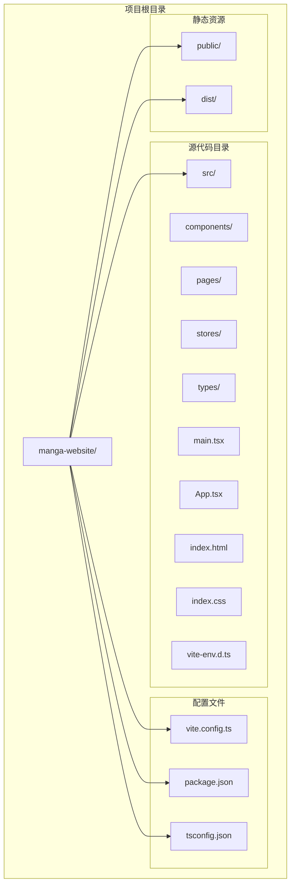
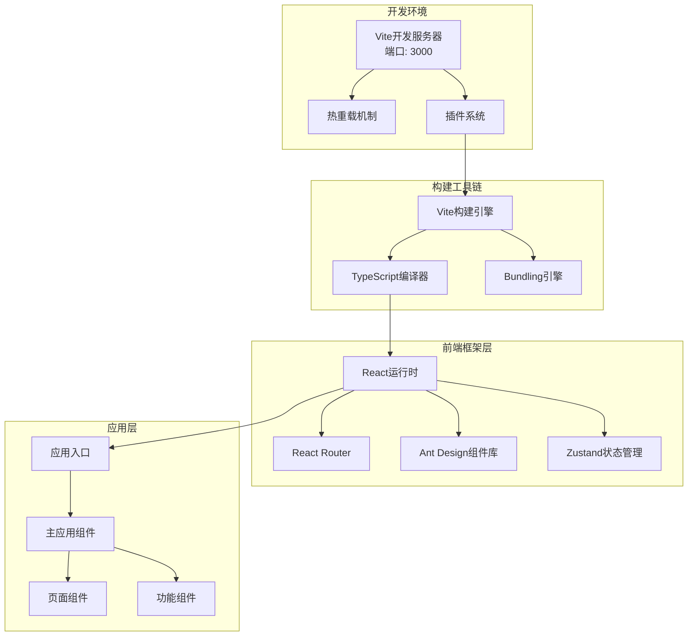
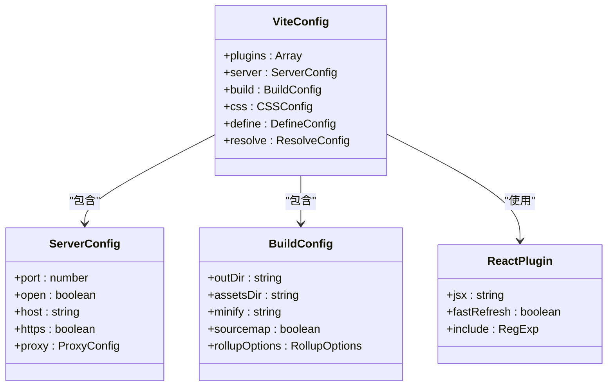
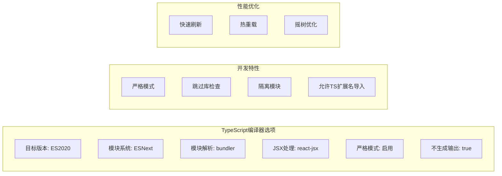
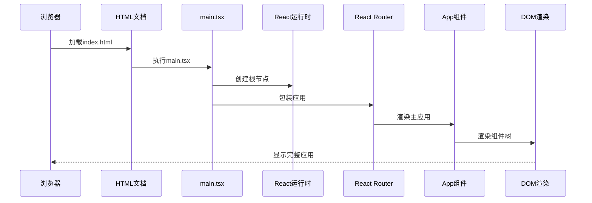
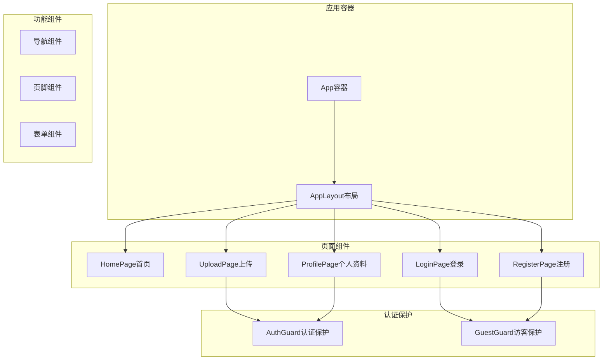
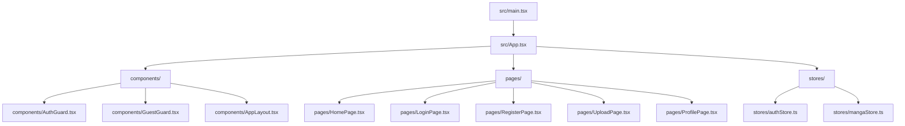
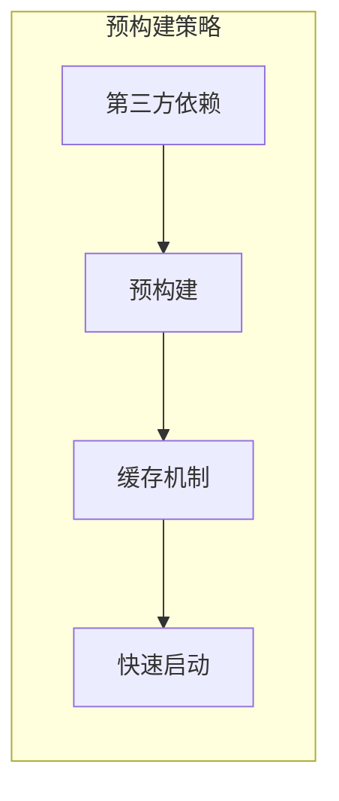
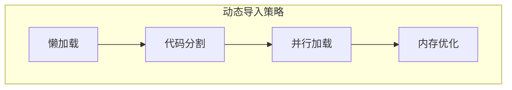

# Vite构建配置

<cite>
**本文档引用的文件**
- [vite.config.ts](file://manga-website/vite.config.ts)
- [package.json](file://manga-website/package.json)
- [tsconfig.json](file://manga-website/tsconfig.json)
- [main.tsx](file://manga-website/src/main.tsx)
- [App.tsx](file://manga-website/src/App.tsx)
- [index.html](file://manga-website/index.html)
- [index.css](file://manga-website/src/index.css)
- [vite-env.d.ts](file://manga-website/src/vite-env.d.ts)
</cite>

## 目录
1. [简介](#简介)
2. [项目结构](#项目结构)
3. [核心组件](#核心组件)
4. [架构概览](#架构概览)
5. [详细组件分析](#详细组件分析)
6. [依赖关系分析](#依赖关系分析)
7. [性能考虑](#性能考虑)
8. [故障排除指南](#故障排除指南)
9. [结论](#结论)

## 简介

本项目是一个基于Vite的React单页应用，使用TypeScript进行类型安全开发。项目采用现代化的前端构建工具链，集成了React生态系统的核心库，包括Ant Design组件库、React Router进行路由管理，以及Zustand状态管理库。

该项目展示了Vite作为现代构建工具在开发体验和构建性能方面的优势，提供了快速的热重载、高效的模块打包和优化的生产构建。

## 项目结构

项目采用标准的Vite + React + TypeScript项目结构，主要目录组织如下：



**图表来源**
- [vite.config.ts:1-11](file://manga-website/vite.config.ts#L1-L11)
- [package.json:1-26](file://manga-website/package.json#L1-L26)
- [tsconfig.json:1-24](file://manga-website/tsconfig.json#L1-L24)

**章节来源**
- [vite.config.ts:1-11](file://manga-website/vite.config.ts#L1-L11)
- [package.json:1-26](file://manga-website/package.json#L1-L26)
- [tsconfig.json:1-24](file://manga-website/tsconfig.json#L1-L24)

## 核心组件

### Vite配置核心组件

项目的核心配置集中在单一的Vite配置文件中，包含了开发服务器设置、插件系统和基础构建配置。

#### 开发服务器配置
- **端口配置**: 默认监听3000端口
- **自动打开浏览器**: 启用开发时自动打开浏览器窗口
- **热重载支持**: 基于Vite的内置热重载机制

#### 插件系统
- **React插件**: 提供React JSX转换和开发时优化
- **TypeScript集成**: 通过TypeScript编译器进行类型检查

#### 构建配置
- **TypeScript预构建**: 使用TypeScript编译器进行类型检查
- **生产构建**: 通过Vite进行最终的生产环境打包

**章节来源**
- [vite.config.ts:4-10](file://manga-website/vite.config.ts#L4-L10)
- [package.json:6-10](file://manga-website/package.json#L6-L10)

### 依赖管理系统

项目使用npm包管理器，包含以下关键依赖：

#### 运行时依赖
- **React生态系统**: React、React DOM、React Router DOM
- **UI组件库**: Ant Design (Antd) 提供丰富的UI组件
- **状态管理**: Zustand 轻量级状态管理解决方案

#### 开发时依赖
- **构建工具**: Vite 6.0.0 作为主要构建工具
- **TypeScript支持**: TypeScript 5.6.2 和相关类型定义
- **React开发插件**: @vitejs/plugin-react 4.3.4

**章节来源**
- [package.json:11-24](file://manga-website/package.json#L11-L24)

## 架构概览

项目采用现代化的前端架构，结合了Vite的开发服务器、React的组件化开发模式和TypeScript的类型安全保障。



**图表来源**
- [vite.config.ts:4-10](file://manga-website/vite.config.ts#L4-L10)
- [package.json:11-24](file://manga-website/package.json#L11-L24)
- [main.tsx:1-14](file://manga-website/src/main.tsx#L1-L14)
- [App.tsx:1-66](file://manga-website/src/App.tsx#L1-L66)

## 详细组件分析

### Vite配置文件分析

#### 配置结构解析



**图表来源**
- [vite.config.ts:4-10](file://manga-website/vite.config.ts#L4-L10)

#### 当前配置实现

项目当前的Vite配置相对简洁，专注于开发体验和基本功能：

1. **插件配置**: 仅启用React插件，提供必要的JSX转换和开发时优化
2. **服务器配置**: 设置默认端口和自动打开浏览器功能
3. **构建配置**: 通过TypeScript编译器进行类型检查，然后交由Vite进行打包

**章节来源**
- [vite.config.ts:1-11](file://manga-website/vite.config.ts#L1-L11)

### TypeScript配置分析

#### 编译器选项详解



**图表来源**
- [tsconfig.json:2-21](file://manga-website/tsconfig.json#L2-L21)

#### 关键配置说明

- **模块解析策略**: 使用bundler模式，与Vite的原生ES模块支持完美配合
- **JSX处理**: 采用react-jsx模式，确保与React 18+的兼容性
- **严格模式**: 启用严格类型检查，提高代码质量
- **无输出编译**: 在开发环境中避免生成额外的JavaScript文件

**章节来源**
- [tsconfig.json:1-24](file://manga-website/tsconfig.json#L1-L24)

### 应用入口分析

#### 主入口文件结构



**图表来源**
- [index.html:10-11](file://manga-website/index.html#L10-L11)
- [main.tsx:1-14](file://manga-website/src/main.tsx#L1-L14)
- [App.tsx:13-63](file://manga-website/src/App.tsx#L13-L63)

#### 应用初始化流程

1. **HTML加载**: 浏览器加载基础HTML模板
2. **入口执行**: main.tsx作为应用入口点执行
3. **根节点创建**: 使用ReactDOM.createRoot创建应用根节点
4. **路由包装**: 使用BrowserRouter为整个应用提供路由上下文
5. **应用渲染**: 渲染App组件及其子组件树

**章节来源**
- [index.html:1-14](file://manga-website/index.html#L1-L14)
- [main.tsx:1-14](file://manga-website/src/main.tsx#L1-L14)
- [App.tsx:13-63](file://manga-website/src/App.tsx#L13-L63)

### 组件架构分析

#### 页面组件层次结构



**图表来源**
- [App.tsx:1-66](file://manga-website/src/App.tsx#L1-L66)

#### 路由保护机制

项目实现了基于角色的访问控制：
- **访客保护**: 登录和注册页面需要未认证用户访问
- **认证保护**: 上传和个人资料页面需要已认证用户访问
- **布局统一**: 所有页面共享相同的AppLayout布局

**章节来源**
- [App.tsx:10-58](file://manga-website/src/App.tsx#L10-L58)

## 依赖关系分析

### 外部依赖关系图

```mermaid
graph TB
subgraph "应用层"
App[应用代码]
Components[组件库]
Pages[页面组件]
Stores[状态管理]
end
subgraph "React生态系统"
React[React核心]
ReactDOM[React DOM]
Router[React Router]
Antd[Ant Design]
Zustand[Zustand]
end
subgraph "构建工具链"
Vite[Vite]
TS[TypeScript]
PluginReact[@vitejs/plugin-react]
end
subgraph "开发工具"
DevDependencies[开发依赖]
TypeDefinitions[类型定义]
end
App --> React
App --> Antd
App --> Zustand
React --> ReactDOM
React --> Router
Antd --> Components
Zustand --> Stores
Vite --> PluginReact
Vite --> TS
PluginReact --> React
DevDependencies --> Vite
TypeDefinitions --> TS
```

**图表来源**
- [package.json:11-24](file://manga-website/package.json#L11-L24)
- [vite.config.ts:2](file://manga-website/vite.config.ts#L2)

### 模块导入关系

项目遵循ES模块规范，所有导入都使用相对路径：



**图表来源**
- [main.tsx:1-14](file://manga-website/src/main.tsx#L1-L14)
- [App.tsx:1-66](file://manga-website/src/App.tsx#L1-L66)

**章节来源**
- [package.json:11-24](file://manga-website/package.json#L11-L24)

## 性能考虑

### 当前配置的性能特点

#### 开发环境优化
- **快速启动**: Vite的原生ES模块支持提供极快的冷启动时间
- **热重载**: 单个模块的更新只影响相关模块，无需整包重建
- **按需编译**: TypeScript编译器仅处理变更的文件

#### 构建优化
- **Tree Shaking**: 通过ES模块系统实现有效的摇树优化
- **代码分割**: Vite自动进行代码分割，按需加载路由组件
- **压缩优化**: 生产构建自动进行代码压缩和混淆

### 性能优化建议

#### 预构建依赖


#### 动态导入优化


#### 缓存策略
- **浏览器缓存**: 利用Vite的哈希命名策略实现长期缓存
- **构建缓存**: Vite内置的构建缓存机制
- **依赖缓存**: 预构建的依赖缓存

## 故障排除指南

### 常见配置问题及解决方案

#### 开发服务器问题
1. **端口占用**
   - 问题: 端口3000被其他进程占用
   - 解决方案: 修改vite.config.ts中的port配置或关闭占用进程

2. **热重载失效**
   - 问题: 文件修改后页面不自动刷新
   - 解决方案: 检查网络连接、防火墙设置或重启开发服务器

#### 构建问题
1. **TypeScript编译错误**
   - 问题: TypeScript编译失败阻止构建
   - 解决方案: 检查tsconfig.json配置和代码中的类型错误

2. **依赖解析失败**
   - 问题: 模块导入失败
   - 解决方案: 检查package.json依赖安装和模块路径

#### 性能问题
1. **构建速度慢**
   - 问题: 生产构建耗时过长
   - 解决方案: 启用预构建、优化依赖和使用更快的硬件

2. **内存使用过高**
   - 问题: 开发服务器内存占用过大
   - 解决方案: 减少同时打开的文件数量、清理缓存

### 调试技巧

#### 开发时调试
- 使用浏览器开发者工具检查网络请求
- 查看控制台错误信息
- 利用React DevTools检查组件树

#### 构建时调试
- 启用源码映射进行调试
- 使用Vite的详细日志输出
- 分析构建产物大小

**章节来源**
- [vite.config.ts:6-9](file://manga-website/vite.config.ts#L6-L9)
- [package.json:6-10](file://manga-website/package.json#L6-L10)

## 结论

本项目展示了Vite作为现代前端构建工具的强大功能和易用性。通过简洁的配置实现了完整的开发和构建流程，结合React生态系统提供了优秀的开发体验。

### 主要优势
- **开发体验**: 快速的热重载和即时反馈
- **构建性能**: 高效的打包和优化
- **类型安全**: 完整的TypeScript支持
- **生态兼容**: 与React和Ant Design的良好集成

### 改进建议
- 实现更完善的开发服务器配置（代理、HTTPS等）
- 添加CSS预处理器支持
- 优化生产构建配置（代码分割、压缩等）
- 添加测试配置和CI/CD集成

该项目为Vite配置提供了良好的起点，可以根据具体需求进一步扩展和完善。