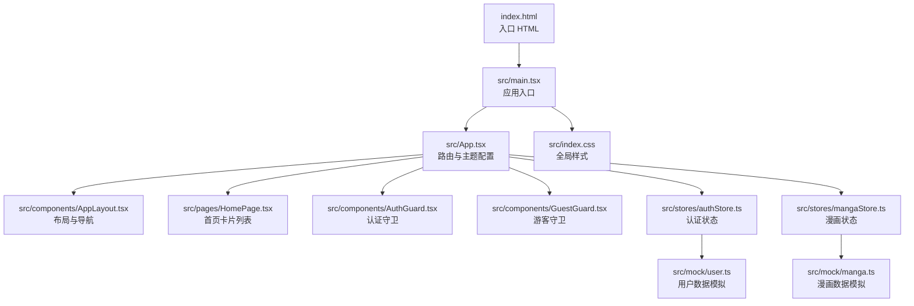
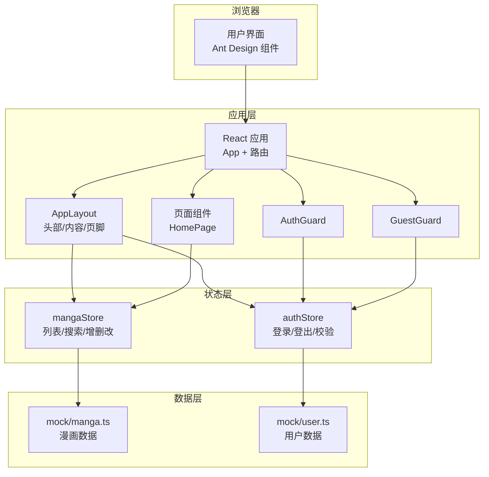
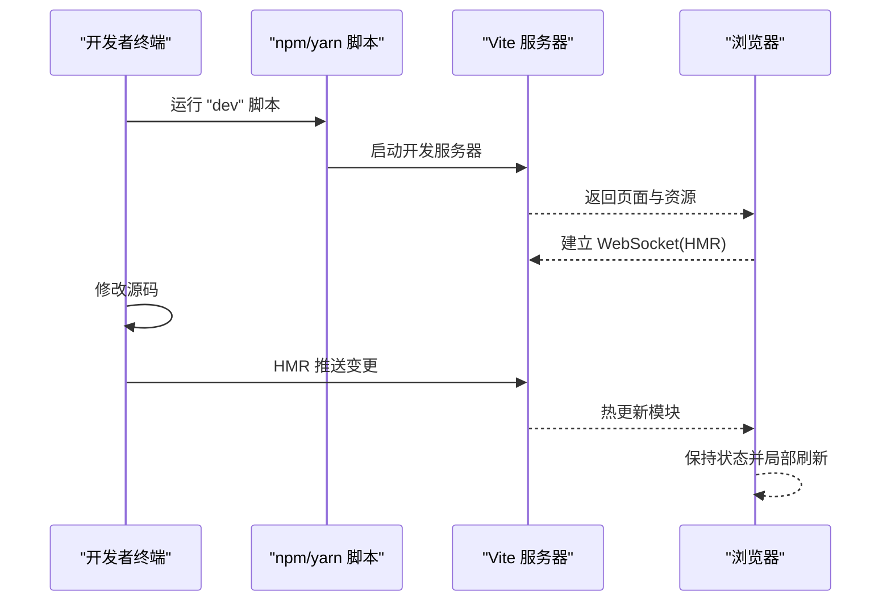
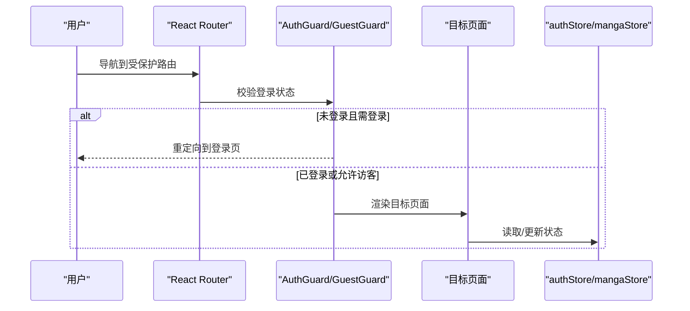
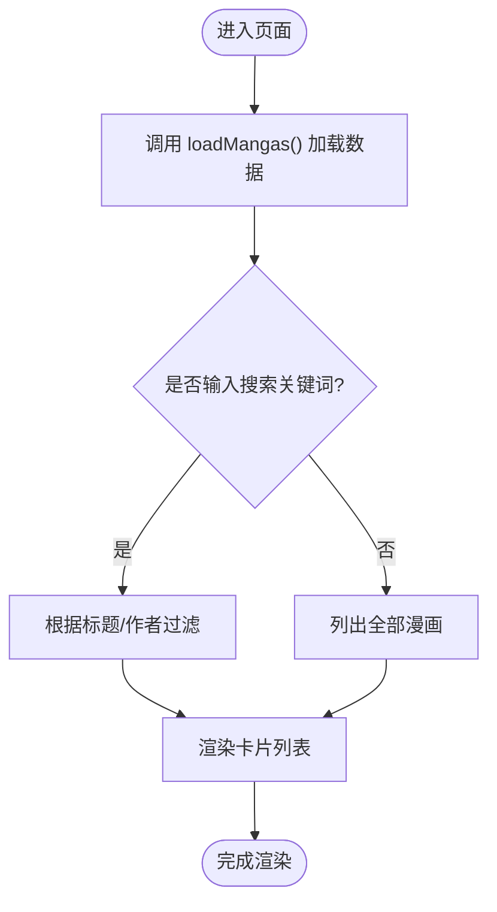
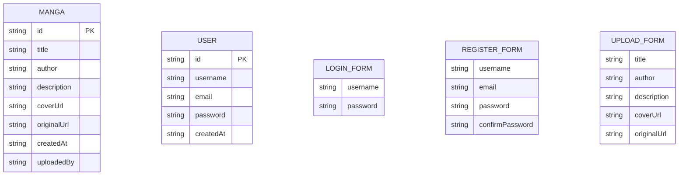
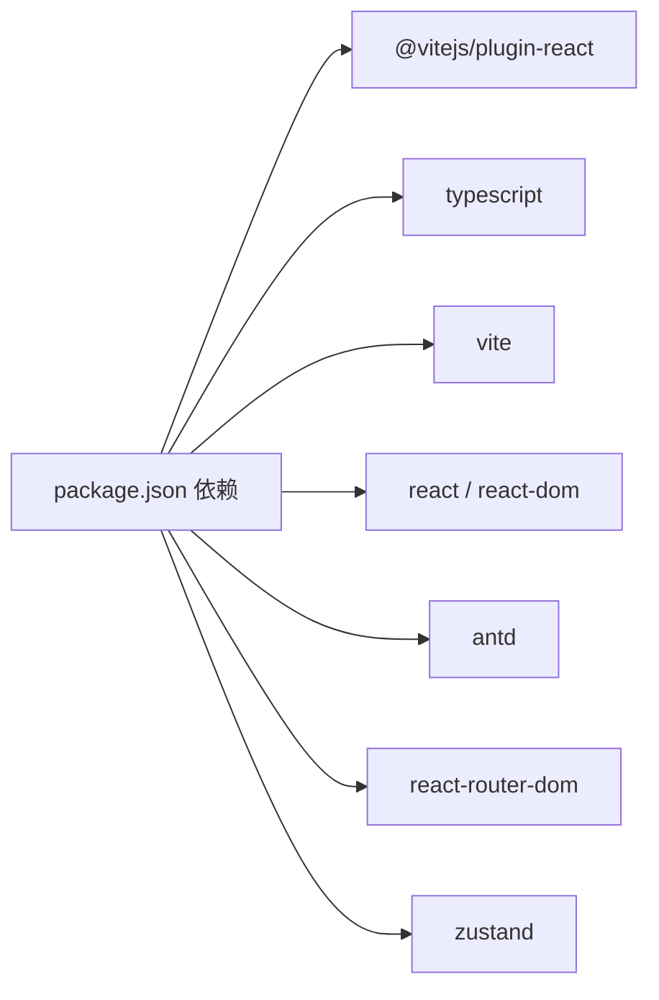

# 开发工作流

<cite>
**本文引用的文件**
- [package.json](file://manga-website/package.json)
- [vite.config.ts](file://manga-website/vite.config.ts)
- [tsconfig.json](file://manga-website/tsconfig.json)
- [index.html](file://manga-website/index.html)
- [src/main.tsx](file://manga-website/src/main.tsx)
- [src/App.tsx](file://manga-website/src/App.tsx)
- [src/components/AppLayout.tsx](file://manga-website/src/components/AppLayout.tsx)
- [src/components/AuthGuard.tsx](file://manga-website/src/components/AuthGuard.tsx)
- [src/components/GuestGuard.tsx](file://manga-website/src/components/GuestGuard.tsx)
- [src/stores/authStore.ts](file://manga-website/src/stores/authStore.ts)
- [src/stores/mangaStore.ts](file://manga-website/src/stores/mangaStore.ts)
- [src/types/index.ts](file://manga-website/src/types/index.ts)
- [src/mock/manga.ts](file://manga-website/src/mock/manga.ts)
- [src/mock/user.ts](file://manga-website/src/mock/user.ts)
- [src/pages/HomePage.tsx](file://manga-website/src/pages/HomePage.tsx)
- [src/index.css](file://manga-website/src/index.css)
</cite>

## 目录
1. [简介](#简介)
2. [项目结构](#项目结构)
3. [核心组件](#核心组件)
4. [架构总览](#架构总览)
5. [详细组件分析](#详细组件分析)
6. [依赖分析](#依赖分析)
7. [性能考虑](#性能考虑)
8. [故障排查指南](#故障排查指南)
9. [结论](#结论)
10. [附录](#附录)

## 简介
本指南面向使用 Vite + React + TypeScript 的前端项目，聚焦于开发工作流与调试技巧。内容涵盖开发服务器启动、热重载与构建流程；React DevTools 使用要点（组件树检查、状态查看、性能分析）；浏览器调试技巧（断点设置、网络请求监控、性能分析工具）；以及代码质量工具（ESLint 规则、Prettier 格式化、TypeScript 类型检查）的配置与实践建议。同时提供常见问题排查与性能优化建议，帮助开发者高效迭代与稳定交付。

## 项目结构
该漫画网站项目采用 Vite 作为构建与开发工具，使用 React 18 与 TypeScript 进行开发，状态管理采用 Zustand，UI 组件库使用 Ant Design。项目通过路由组织页面，使用本地存储模拟后端数据。

图表来源
- [index.html:1-14](file://manga-website/index.html#L1-L14)
- [src/main.tsx:1-14](file://manga-website/src/main.tsx#L1-L14)
- [src/App.tsx:1-66](file://manga-website/src/App.tsx#L1-L66)
- [src/components/AppLayout.tsx:1-156](file://manga-website/src/components/AppLayout.tsx#L1-L156)
- [src/pages/HomePage.tsx:1-108](file://manga-website/src/pages/HomePage.tsx#L1-L108)
- [src/components/AuthGuard.tsx:1-17](file://manga-website/src/components/AuthGuard.tsx#L1-L17)
- [src/components/GuestGuard.tsx:1-17](file://manga-website/src/components/GuestGuard.tsx#L1-L17)
- [src/stores/authStore.ts:1-45](file://manga-website/src/stores/authStore.ts#L1-L45)
- [src/stores/mangaStore.ts:1-62](file://manga-website/src/stores/mangaStore.ts#L1-L62)
- [src/mock/manga.ts:1-173](file://manga-website/src/mock/manga.ts#L1-L173)
- [src/mock/user.ts:1-90](file://manga-website/src/mock/user.ts#L1-L90)
- [src/index.css:1-25](file://manga-website/src/index.css#L1-L25)

章节来源
- [package.json:1-26](file://manga-website/package.json#L1-L26)
- [vite.config.ts:1-11](file://manga-website/vite.config.ts#L1-L11)
- [tsconfig.json:1-24](file://manga-website/tsconfig.json#L1-L24)
- [index.html:1-14](file://manga-website/index.html#L1-L14)
- [src/main.tsx:1-14](file://manga-website/src/main.tsx#L1-L14)
- [src/App.tsx:1-66](file://manga-website/src/App.tsx#L1-L66)

## 核心组件
- 应用入口与渲染：应用通过入口 HTML 创建根节点并挂载 React 应用，启用严格模式与路由包裹。
- 路由与主题：顶层 App 组件配置 Ant Design 主题与国际化，并定义页面路由与守卫。
- 布局与导航：AppLayout 提供头部、内容区与页脚，集成搜索、用户菜单与上传入口。
- 页面组件：HomePage 展示漫画卡片列表，支持搜索关键词过滤与空态提示。
- 状态管理：authStore 管理用户登录状态与认证操作；mangaStore 管理漫画列表、搜索与增删改。
- 数据模拟：mock 模块提供用户与漫画的本地持久化数据接口，便于开发与演示。
- 类型系统：统一定义漫画、用户及各表单的数据结构，确保类型安全。

章节来源
- [src/main.tsx:1-14](file://manga-website/src/main.tsx#L1-L14)
- [src/App.tsx:1-66](file://manga-website/src/App.tsx#L1-L66)
- [src/components/AppLayout.tsx:1-156](file://manga-website/src/components/AppLayout.tsx#L1-L156)
- [src/pages/HomePage.tsx:1-108](file://manga-website/src/pages/HomePage.tsx#L1-L108)
- [src/stores/authStore.ts:1-45](file://manga-website/src/stores/authStore.ts#L1-L45)
- [src/stores/mangaStore.ts:1-62](file://manga-website/src/stores/mangaStore.ts#L1-L62)
- [src/mock/manga.ts:1-173](file://manga-website/src/mock/manga.ts#L1-L173)
- [src/mock/user.ts:1-90](file://manga-website/src/mock/user.ts#L1-L90)
- [src/types/index.ts:1-44](file://manga-website/src/types/index.ts#L1-L44)

## 架构总览
下图展示了从浏览器到应用、状态与数据层的整体交互路径，体现开发服务器、路由守卫、状态更新与本地存储之间的关系。

图表来源
- [src/App.tsx:1-66](file://manga-website/src/App.tsx#L1-L66)
- [src/components/AppLayout.tsx:1-156](file://manga-website/src/components/AppLayout.tsx#L1-L156)
- [src/pages/HomePage.tsx:1-108](file://manga-website/src/pages/HomePage.tsx#L1-L108)
- [src/components/AuthGuard.tsx:1-17](file://manga-website/src/components/AuthGuard.tsx#L1-L17)
- [src/components/GuestGuard.tsx:1-17](file://manga-website/src/components/GuestGuard.tsx#L1-L17)
- [src/stores/authStore.ts:1-45](file://manga-website/src/stores/authStore.ts#L1-L45)
- [src/stores/mangaStore.ts:1-62](file://manga-website/src/stores/mangaStore.ts#L1-L62)
- [src/mock/manga.ts:1-173](file://manga-website/src/mock/manga.ts#L1-L173)
- [src/mock/user.ts:1-90](file://manga-website/src/mock/user.ts#L1-L90)

## 详细组件分析

### 开发服务器与构建流程
- 启动开发服务器：运行开发脚本后，Vite 在本地启动开发服务器，默认监听端口并自动打开浏览器。
- 热重载机制：修改源码后，Vite 通过模块热替换（HMR）快速刷新页面，无需手动刷新。
- 构建产物：TypeScript 编译与 Vite 打包生成静态资源，适合生产环境部署。

图表来源
- [package.json:6-10](file://manga-website/package.json#L6-L10)
- [vite.config.ts:6-9](file://manga-website/vite.config.ts#L6-L9)
- [index.html:10-11](file://manga-website/index.html#L10-L11)

章节来源
- [package.json:6-10](file://manga-website/package.json#L6-L10)
- [vite.config.ts:1-11](file://manga-website/vite.config.ts#L1-L11)

### React 组件与路由守卫
- App 组件负责配置 Ant Design 主题与国际化，并通过路由声明不同页面与守卫。
- AuthGuard 用于需要登录才能访问的页面（如上传、个人资料），GuestGuard 用于登录/注册等仅访客可访问的页面。
- AppLayout 提供统一头部、搜索、用户菜单与上传入口，结合 Zustand 状态实现登录态与搜索关键字共享。

图表来源
- [src/App.tsx:24-59](file://manga-website/src/App.tsx#L24-L59)
- [src/components/AuthGuard.tsx:8-16](file://manga-website/src/components/AuthGuard.tsx#L8-L16)
- [src/components/GuestGuard.tsx:8-16](file://manga-website/src/components/GuestGuard.tsx#L8-L16)
- [src/stores/authStore.ts:1-45](file://manga-website/src/stores/authStore.ts#L1-L45)
- [src/stores/mangaStore.ts:1-62](file://manga-website/src/stores/mangaStore.ts#L1-L62)

章节来源
- [src/App.tsx:1-66](file://manga-website/src/App.tsx#L1-L66)
- [src/components/AuthGuard.tsx:1-17](file://manga-website/src/components/AuthGuard.tsx#L1-L17)
- [src/components/GuestGuard.tsx:1-17](file://manga-website/src/components/GuestGuard.tsx#L1-L17)

### 状态管理与数据流
- 认证状态：authStore 提供登录、注册、登出与当前用户检查，配合 mock user 模块进行本地持久化。
- 漫画状态：mangaStore 负责加载、搜索、新增与删除漫画，并与 mock manga 模块交互。
- 数据一致性：store 更新后触发页面重新渲染，保证 UI 与状态同步。

图表来源
- [src/stores/mangaStore.ts:21-32](file://manga-website/src/stores/mangaStore.ts#L21-L32)
- [src/pages/HomePage.tsx:9-13](file://manga-website/src/pages/HomePage.tsx#L9-L13)

章节来源
- [src/stores/authStore.ts:1-45](file://manga-website/src/stores/authStore.ts#L1-L45)
- [src/stores/mangaStore.ts:1-62](file://manga-website/src/stores/mangaStore.ts#L1-L62)
- [src/mock/manga.ts:138-140](file://manga-website/src/mock/manga.ts#L138-L140)
- [src/mock/user.ts:67-84](file://manga-website/src/mock/user.ts#L67-L84)

### 类型系统与数据模型
- 定义了漫画、用户、登录表单、注册表单与上传表单的接口，确保跨组件传递数据的类型安全。
- 在 store 与 mock 模块中使用这些类型，减少运行时错误。

图表来源
- [src/types/index.ts:1-44](file://manga-website/src/types/index.ts#L1-L44)

章节来源
- [src/types/index.ts:1-44](file://manga-website/src/types/index.ts#L1-L44)

## 依赖分析
- 开发依赖：Vite、React 插件、TypeScript。
- 运行依赖：React 生态、Ant Design、路由与状态管理库。
- 构建与运行：Vite 负责开发服务器与打包；TypeScript 提供类型检查；浏览器通过入口 HTML 加载应用。

图表来源
- [package.json:11-24](file://manga-website/package.json#L11-L24)

章节来源
- [package.json:1-26](file://manga-website/package.json#L1-L26)

## 性能考虑
- 代码分割与懒加载：对大型页面或组件采用动态导入，减少首屏体积。
- 图片优化：使用合适的尺寸与格式，避免大图常驻首屏；卡片悬停缩放应控制动画频率。
- 状态粒度：将全局状态拆分为细粒度 store，避免不必要的重渲染。
- 事件处理：在高频事件（如滚动、鼠标移动）中使用节流/防抖。
- 构建优化：开启生产模式构建，移除开发期日志与非必要注释。
- 浏览器缓存：合理设置静态资源缓存策略，提升二次加载速度。

## 故障排查指南
- 开发服务器无法启动
  - 检查端口占用与配置文件端口设置。
  - 确认依赖安装完整，尝试清理缓存后重装依赖。
- 热重载不生效
  - 确认修改的文件在 Vite 监听范围内；避免在严格模式下引入副作用。
  - 检查插件配置与浏览器控制台是否有报错。
- 路由跳转异常
  - 核对路由声明与守卫逻辑，确认守卫返回值与重定向地址正确。
- 状态未更新
  - 检查 store 更新函数是否正确调用与合并；确认组件订阅了相关状态。
- 本地存储数据异常
  - 清理浏览器本地存储或初始化数据；检查键名与序列化逻辑。
- TypeScript 报错
  - 根据编译器选项逐项修正类型不匹配；确保类型定义完整。

章节来源
- [vite.config.ts:6-9](file://manga-website/vite.config.ts#L6-L9)
- [src/components/AuthGuard.tsx:8-16](file://manga-website/src/components/AuthGuard.tsx#L8-L16)
- [src/components/GuestGuard.tsx:8-16](file://manga-website/src/components/GuestGuard.tsx#L8-L16)
- [src/stores/authStore.ts:1-45](file://manga-website/src/stores/authStore.ts#L1-L45)
- [src/stores/mangaStore.ts:1-62](file://manga-website/src/stores/mangaStore.ts#L1-L62)
- [src/mock/manga.ts:119-131](file://manga-website/src/mock/manga.ts#L119-L131)
- [src/mock/user.ts:67-84](file://manga-website/src/mock/user.ts#L67-L84)
- [tsconfig.json:15-20](file://manga-website/tsconfig.json#L15-L20)

## 结论
本项目以 Vite 为核心，结合 React、TypeScript 与 Zustand，提供了清晰的开发工作流与可扩展的组件结构。通过合理的路由守卫、状态管理与本地数据模拟，能够快速迭代功能并保持开发效率。配合浏览器与 React DevTools 的调试手段，可以有效定位问题并优化性能。建议在团队协作中统一 ESLint 与 Prettier 规则，持续改进代码质量与可维护性。

## 附录

### 开发命令与脚本
- 启动开发服务器：运行开发脚本，自动打开浏览器并启用热重载。
- 构建项目：先进行类型检查与增量编译，再由 Vite 产出生产构建。
- 预览构建：在本地预览生产构建效果，验证打包与资源加载。

章节来源
- [package.json:6-10](file://manga-website/package.json#L6-L10)

### TypeScript 配置要点
- 目标与模块解析：面向现代浏览器的目标与 bundler 解析策略。
- JSX 与严格模式：启用 React JSX 转换与严格类型检查。
- 无 Emit：开发阶段不输出 JS 文件，由 Vite 处理。
- 跳过库检查：加速编译，但需确保类型定义完整。

章节来源
- [tsconfig.json:1-24](file://manga-website/tsconfig.json#L1-L24)

### React DevTools 使用建议
- 组件树检查：定位组件层级与渲染次数，识别过度渲染的组件。
- 状态查看：查看 props、state 与 hooks 状态，核对 store 与本地状态一致性。
- 性能分析：利用 Profiler 分析渲染耗时，识别长任务与重渲染热点。

### 浏览器调试技巧
- 断点设置：在关键函数入口与状态更新处设置断点，观察调用栈与变量变化。
- 网络请求监控：关注静态资源与数据请求的响应时间与错误码，定位慢请求。
- 性能分析工具：使用 Performance 面板记录帧率与内存，结合 React Profiler 优化渲染。

### 代码质量工具配置与使用
- ESLint：建议启用与 React/TypeScript 相关的推荐规则，统一风格与潜在问题检测。
- Prettier：与编辑器集成，保存即格式化，避免风格分歧。
- TypeScript：在 CI 中加入类型检查步骤，防止类型错误进入主分支。