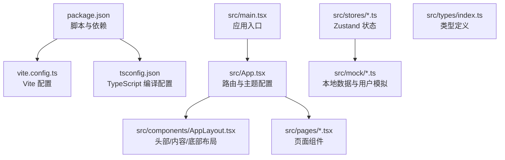
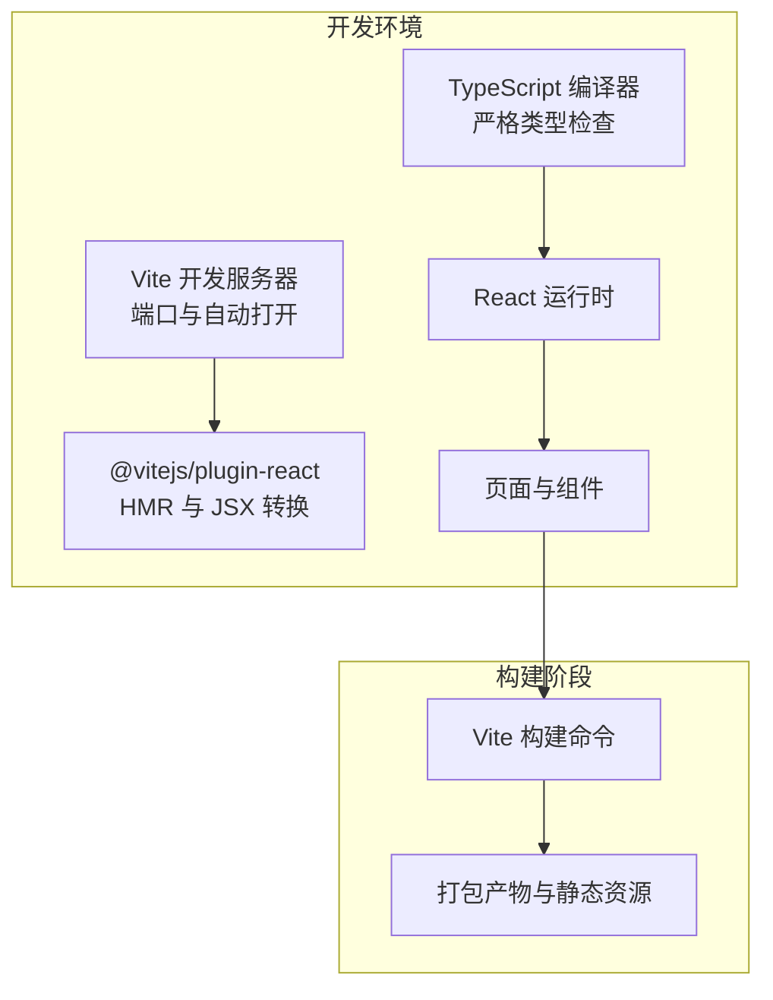
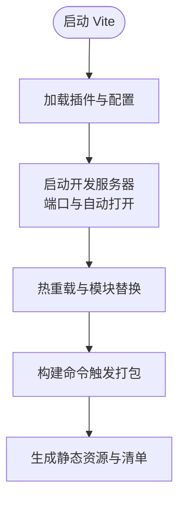
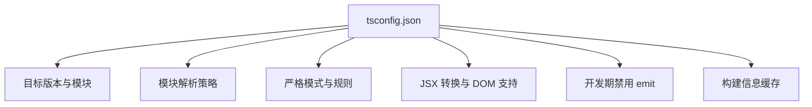
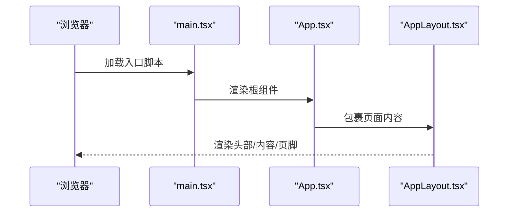
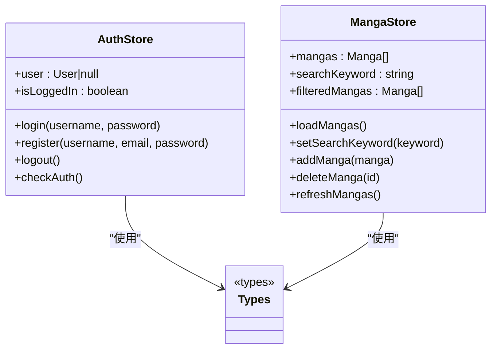
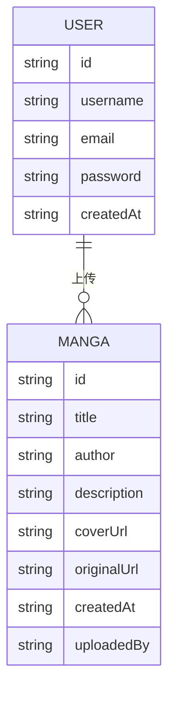
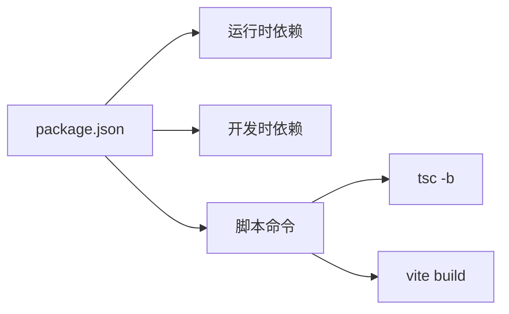

# 开发工具

<cite>
**本文引用的文件**
- [package.json](file://manga-website/package.json)
- [vite.config.ts](file://manga-website/vite.config.ts)
- [tsconfig.json](file://manga-website/tsconfig.json)
- [src/main.tsx](file://manga-website/src/main.tsx)
- [src/App.tsx](file://manga-website/src/App.tsx)
- [src/components/AppLayout.tsx](file://manga-website/src/components/AppLayout.tsx)
- [src/stores/authStore.ts](file://manga-website/src/stores/authStore.ts)
- [src/stores/mangaStore.ts](file://manga-website/src/stores/mangaStore.ts)
- [src/types/index.ts](file://manga-website/src/types/index.ts)
- [src/mock/manga.ts](file://manga-website/src/mock/manga.ts)
- [src/mock/user.ts](file://manga-website/src/mock/user.ts)
</cite>

## 目录
1. [简介](#简介)
2. [项目结构](#项目结构)
3. [核心组件](#核心组件)
4. [架构总览](#架构总览)
5. [详细组件分析](#详细组件分析)
6. [依赖分析](#依赖分析)
7. [性能考虑](#性能考虑)
8. [故障排查指南](#故障排查指南)
9. [结论](#结论)
10. [附录](#附录)

## 简介
本文件面向漫画网站项目的前端开发与构建流程，系统性梳理 Vite 构建工具的配置与优化（开发服务器、代理与构建优化）、TypeScript 编译配置（类型检查、模块解析与输出）、开发调试技巧（浏览器调试、React DevTools、性能分析）、代码质量工具（ESLint、Prettier、TypeScript 检查）以及开发工作流优化（热重载、代码分割、缓存策略）。同时提供常见问题排查与生产构建部署准备的指导。

## 项目结构
该漫画网站采用 React + TypeScript + Vite 的现代前端技术栈，核心入口为应用根组件与路由配置，状态管理通过 Zustand 实现，页面与布局组件按功能分层组织，类型定义集中于 types 目录，本地数据通过 mock 层模拟持久化。

图表来源
- [package.json:1-26](file://manga-website/package.json#L1-L26)
- [vite.config.ts:1-11](file://manga-website/vite.config.ts#L1-L11)
- [tsconfig.json:1-24](file://manga-website/tsconfig.json#L1-L24)
- [src/main.tsx:1-14](file://manga-website/src/main.tsx#L1-L14)
- [src/App.tsx:1-66](file://manga-website/src/App.tsx#L1-L66)
- [src/components/AppLayout.tsx:1-156](file://manga-website/src/components/AppLayout.tsx#L1-L156)
- [src/stores/authStore.ts:1-45](file://manga-website/src/stores/authStore.ts#L1-L45)
- [src/stores/mangaStore.ts:1-62](file://manga-website/src/stores/mangaStore.ts#L1-L62)
- [src/types/index.ts:1-44](file://manga-website/src/types/index.ts#L1-L44)
- [src/mock/manga.ts:1-173](file://manga-website/src/mock/manga.ts#L1-L173)
- [src/mock/user.ts:1-90](file://manga-website/src/mock/user.ts#L1-L90)

章节来源
- [package.json:1-26](file://manga-website/package.json#L1-L26)
- [vite.config.ts:1-11](file://manga-website/vite.config.ts#L1-L11)
- [tsconfig.json:1-24](file://manga-website/tsconfig.json#L1-L24)
- [src/main.tsx:1-14](file://manga-website/src/main.tsx#L1-L14)
- [src/App.tsx:1-66](file://manga-website/src/App.tsx#L1-L66)

## 核心组件
- 应用入口与渲染：在入口文件中挂载 React 根节点，并包裹路由与严格模式，确保开发期行为一致。
- 路由与布局：应用根组件集中声明路由与守卫，Ant Design 主题与语言包在根组件统一注入。
- 布局组件：提供头部导航、搜索、用户菜单与页脚，承载页面 Outlet 内容。
- 状态管理：使用 Zustand 创建认证与漫画列表状态，支持登录、注册、登出、搜索过滤、增删改等操作。
- 类型系统：集中定义漫画、用户、表单等类型，保证跨模块类型一致性。
- 本地数据：通过 localStorage 模拟后端数据与用户会话，便于离线开发与演示。

章节来源
- [src/main.tsx:1-14](file://manga-website/src/main.tsx#L1-L14)
- [src/App.tsx:1-66](file://manga-website/src/App.tsx#L1-L66)
- [src/components/AppLayout.tsx:1-156](file://manga-website/src/components/AppLayout.tsx#L1-L156)
- [src/stores/authStore.ts:1-45](file://manga-website/src/stores/authStore.ts#L1-L45)
- [src/stores/mangaStore.ts:1-62](file://manga-website/src/stores/mangaStore.ts#L1-L62)
- [src/types/index.ts:1-44](file://manga-website/src/types/index.ts#L1-L44)
- [src/mock/manga.ts:1-173](file://manga-website/src/mock/manga.ts#L1-L173)
- [src/mock/user.ts:1-90](file://manga-website/src/mock/user.ts#L1-L90)

## 架构总览
下图展示了从开发到构建的关键路径：Vite 启动开发服务器，加载 React 插件与配置；TypeScript 在开发期进行类型检查与增量编译；应用通过路由与状态驱动页面渲染；构建阶段由 Vite 打包产物并生成静态资源。

图表来源
- [vite.config.ts:1-11](file://manga-website/vite.config.ts#L1-L11)
- [tsconfig.json:1-24](file://manga-website/tsconfig.json#L1-L24)
- [package.json:6-10](file://manga-website/package.json#L6-L10)

## 详细组件分析

### Vite 配置与优化
- 插件体系：启用 React 插件以支持 JSX 转换与开发期 HMR。
- 开发服务器：指定端口与启动后自动打开浏览器，提升开发效率。
- 构建优化：可结合预构建依赖、动态导入与产物拆分进一步优化首屏与交互体验（见“性能考虑”）。

图表来源
- [vite.config.ts:1-11](file://manga-website/vite.config.ts#L1-L11)
- [package.json:6-10](file://manga-website/package.json#L6-L10)

章节来源
- [vite.config.ts:1-11](file://manga-website/vite.config.ts#L1-L11)
- [package.json:6-10](file://manga-website/package.json#L6-L10)

### TypeScript 编译配置与最佳实践
- 目标与模块：目标版本与模块系统适配现代浏览器与打包器。
- 模块解析：采用 bundler 解析策略，利于打包器进行摇树与优化。
- 严格模式：开启严格检查，减少运行期隐患；对未使用变量与参数可按需放宽。
- JSX 与 DOM：明确 JSX 转换策略与 DOM 类库支持。
- 无 emit：开发期不输出 JS 文件，由 Vite/HMR 处理运行时。
- 构建信息：指定 tsbuildinfo 位置，加速增量编译。

图表来源
- [tsconfig.json:1-24](file://manga-website/tsconfig.json#L1-L24)

章节来源
- [tsconfig.json:1-24](file://manga-website/tsconfig.json#L1-L24)

### 应用入口与路由
- 入口挂载：在入口文件中创建根节点并包裹路由容器。
- 根组件：集中配置 Ant Design 主题、语言与路由表，包含多页面与守卫逻辑。

图表来源
- [src/main.tsx:1-14](file://manga-website/src/main.tsx#L1-L14)
- [src/App.tsx:1-66](file://manga-website/src/App.tsx#L1-L66)
- [src/components/AppLayout.tsx:1-156](file://manga-website/src/components/AppLayout.tsx#L1-L156)

章节来源
- [src/main.tsx:1-14](file://manga-website/src/main.tsx#L1-L14)
- [src/App.tsx:1-66](file://manga-website/src/App.tsx#L1-L66)
- [src/components/AppLayout.tsx:1-156](file://manga-website/src/components/AppLayout.tsx#L1-L156)

### 状态管理（Zustand）
- 认证状态：维护用户信息、登录/注册/登出与会话检查。
- 漫画状态：维护列表、搜索关键词与过滤结果，支持新增与删除。

图表来源
- [src/stores/authStore.ts:1-45](file://manga-website/src/stores/authStore.ts#L1-L45)
- [src/stores/mangaStore.ts:1-62](file://manga-website/src/stores/mangaStore.ts#L1-L62)
- [src/types/index.ts:1-44](file://manga-website/src/types/index.ts#L1-L44)

章节来源
- [src/stores/authStore.ts:1-45](file://manga-website/src/stores/authStore.ts#L1-L45)
- [src/stores/mangaStore.ts:1-62](file://manga-website/src/stores/mangaStore.ts#L1-L62)
- [src/types/index.ts:1-44](file://manga-website/src/types/index.ts#L1-L44)

### 本地数据与类型
- 类型定义：集中声明漫画、用户、表单等接口，保证跨模块一致性。
- 本地数据：通过 localStorage 存储用户与漫画数据，提供增删改查与用户会话管理。

图表来源
- [src/types/index.ts:1-44](file://manga-website/src/types/index.ts#L1-L44)
- [src/mock/manga.ts:1-173](file://manga-website/src/mock/manga.ts#L1-L173)
- [src/mock/user.ts:1-90](file://manga-website/src/mock/user.ts#L1-L90)

章节来源
- [src/types/index.ts:1-44](file://manga-website/src/types/index.ts#L1-L44)
- [src/mock/manga.ts:1-173](file://manga-website/src/mock/manga.ts#L1-L173)
- [src/mock/user.ts:1-90](file://manga-website/src/mock/user.ts#L1-L90)

## 依赖分析
- 运行时依赖：React 生态、Ant Design UI 组件库、路由与状态管理库。
- 开发时依赖：Vite 构建工具、React 插件、TypeScript 与类型声明。
- 脚本命令：开发、构建与预览命令串联 TypeScript 编译与 Vite 打包。

图表来源
- [package.json:1-26](file://manga-website/package.json#L1-L26)

章节来源
- [package.json:1-26](file://manga-website/package.json#L1-L26)

## 性能考虑
- 开发期性能
  - 使用 Vite 的原生 ES 模块与快速冷启动，结合 React 插件的 HMR 提升迭代速度。
  - 将大型第三方库或静态资源放入预构建依赖，减少重复解析。
- 构建期性能
  - 启用代码分割，按路由或组件维度拆分包，降低首屏体积。
  - 利用浏览器缓存策略，为静态资源添加长缓存与版本指纹。
  - 对图片与图标进行压缩与懒加载，减少网络阻塞。
- TypeScript 与打包
  - 保持严格类型检查，避免运行期错误；在开发期禁用 emit，由 Vite 处理运行时。
  - 合理配置模块解析策略，配合打包器进行摇树优化。

## 故障排查指南
- 开发服务器无法访问
  - 检查端口占用与防火墙设置；确认配置中的端口与自动打开选项。
- HMR 不生效
  - 确认 React 插件已正确加载；检查文件保存与语法错误导致的编译失败。
- 类型错误阻断构建
  - 查看严格规则与未使用变量/参数的提示；必要时调整 tsconfig 规则。
- 路由跳转异常
  - 核对路由层级与守卫逻辑；确认布局组件与页面组件的嵌套关系。
- 状态不更新
  - 检查 Zustand 状态更新是否触发；确认依赖的 mock 数据是否正确返回。

章节来源
- [vite.config.ts:1-11](file://manga-website/vite.config.ts#L1-L11)
- [tsconfig.json:1-24](file://manga-website/tsconfig.json#L1-L24)
- [src/App.tsx:1-66](file://manga-website/src/App.tsx#L1-L66)
- [src/stores/authStore.ts:1-45](file://manga-website/src/stores/authStore.ts#L1-L45)
- [src/stores/mangaStore.ts:1-62](file://manga-website/src/stores/mangaStore.ts#L1-L62)

## 结论
本项目以 Vite + React + TypeScript 为基础，结合 Zustand 实现轻量状态管理与 Ant Design 提供的 UI 能力，形成清晰的开发与构建路径。通过合理的配置与最佳实践，可在开发期获得高效迭代体验，在生产期实现稳定可靠的构建与部署。

## 附录
- 开发工作流优化建议
  - 热重载：保持模块边界清晰，避免大面积刷新；利用 React 插件的 HMR。
  - 代码分割：按路由或页面拆分包，结合动态导入减少首屏体积。
  - 缓存策略：静态资源启用长缓存，构建时加入哈希指纹；HTML 与入口脚本短缓存或不缓存。
- 生产构建与部署准备
  - 构建命令：先执行 TypeScript 增量编译，再执行 Vite 打包，确保类型与产物一致。
  - 静态托管：将构建产物部署至静态服务器或 CDN；确保路由回退到 index.html。
  - 环境变量：区分开发与生产环境变量，避免硬编码敏感信息。
- 代码质量工具
  - ESLint：统一代码风格与潜在问题检测；与编辑器集成实现保存即检查。
  - Prettier：自动化格式化，减少团队分歧；与 ESLint 配合使用。
  - TypeScript 检查：在 CI 中强制执行类型检查，防止类型错误进入主干。

章节来源
- [package.json:6-10](file://manga-website/package.json#L6-L10)
- [vite.config.ts:1-11](file://manga-website/vite.config.ts#L1-L11)
- [tsconfig.json:1-24](file://manga-website/tsconfig.json#L1-L24)