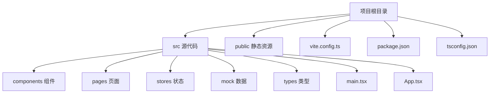
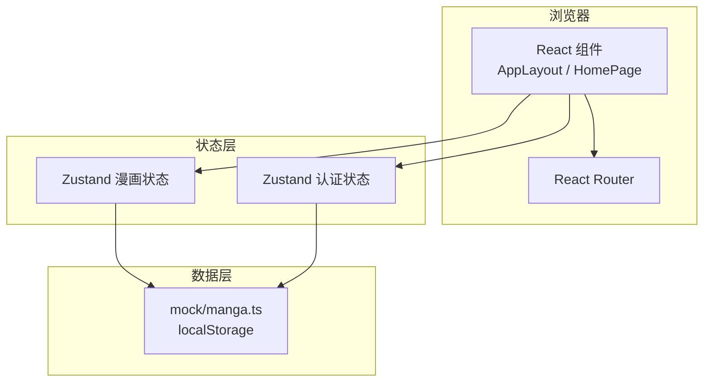
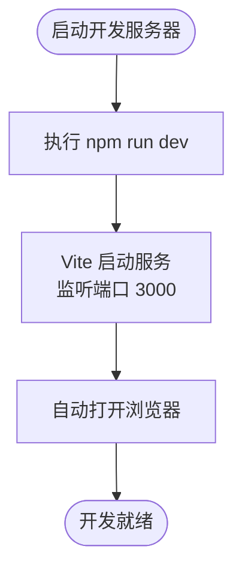
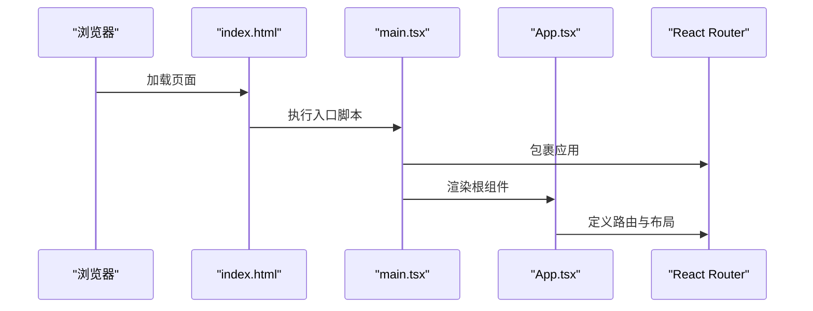
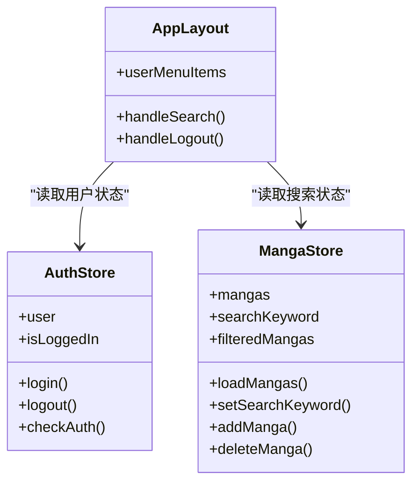
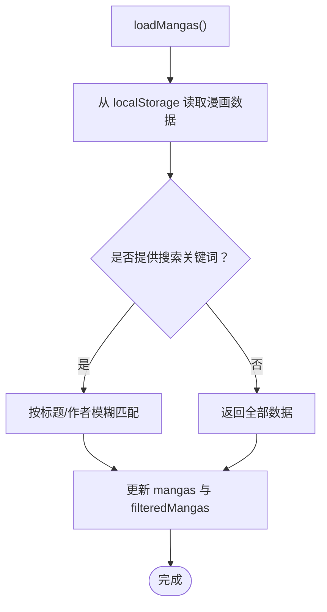
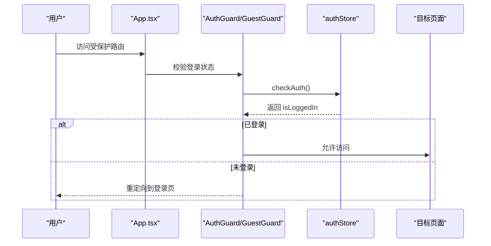
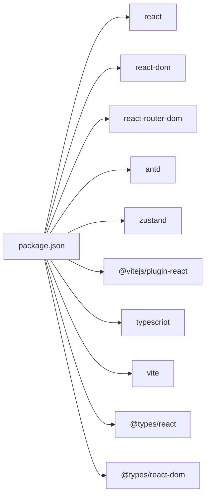

# 快速开始

<cite>
**本文引用的文件**
- [package.json](file://manga-website/package.json)
- [vite.config.ts](file://manga-website/vite.config.ts)
- [tsconfig.json](file://manga-website/tsconfig.json)
- [index.html](file://manga-website/index.html)
- [src/main.tsx](file://manga-website/src/main.tsx)
- [src/App.tsx](file://manga-website/src/App.tsx)
- [src/components/AppLayout.tsx](file://manga-website/src/components/AppLayout.tsx)
- [src/pages/HomePage.tsx](file://manga-website/src/pages/HomePage.tsx)
- [src/stores/authStore.ts](file://manga-website/src/stores/authStore.ts)
- [src/stores/mangaStore.ts](file://manga-website/src/stores/mangaStore.ts)
- [src/mock/manga.ts](file://manga-website/src/mock/manga.ts)
- [src/types/index.ts](file://manga-website/src/types/index.ts)
</cite>

## 目录
1. [简介](#简介)
2. [项目结构](#项目结构)
3. [核心组件](#核心组件)
4. [架构总览](#架构总览)
5. [详细组件分析](#详细组件分析)
6. [依赖关系分析](#依赖关系分析)
7. [性能考虑](#性能考虑)
8. [故障排除指南](#故障排除指南)
9. [结论](#结论)
10. [附录](#附录)

## 简介
本指南面向首次接触漫画网站项目的开发者，帮助你在最短时间内完成环境准备、项目克隆、依赖安装与开发服务器启动，并理解项目的基本结构与常用开发命令。项目基于 React + TypeScript + Vite 构建，采用 Ant Design 组件库与 Zustand 状态管理，提供漫画浏览、搜索、上传与用户认证等基础功能。

## 项目结构
项目采用按功能模块划分的目录组织方式：
- src：源代码根目录
  - components：可复用 UI 组件（如布局、守卫）
  - pages：页面级组件（首页、登录、注册、上传、个人资料）
  - stores：状态管理（用户状态、漫画状态）
  - mock：模拟数据与接口（漫画数据、用户数据）
  - types：TypeScript 类型定义
  - main.tsx：应用入口
  - App.tsx：路由与全局布局
- public：静态资源
- vite.config.ts：Vite 开发服务器与构建配置
- package.json：脚本、依赖与元信息
- tsconfig.json：TypeScript 编译选项

图表来源
- [package.json:1-26](file://manga-website/package.json#L1-L26)
- [vite.config.ts:1-11](file://manga-website/vite.config.ts#L1-L11)
- [tsconfig.json:1-24](file://manga-website/tsconfig.json#L1-L24)

章节来源
- [package.json:1-26](file://manga-website/package.json#L1-L26)
- [vite.config.ts:1-11](file://manga-website/vite.config.ts#L1-L11)
- [tsconfig.json:1-24](file://manga-website/tsconfig.json#L1-L24)

## 核心组件
- 应用入口与渲染
  - main.tsx 负责挂载 React 根节点、引入路由与样式，作为应用启动点。
- 应用主框架
  - App.tsx 定义全局路由与布局容器，集成 Ant Design 国际化与主题配置。
- 布局组件
  - AppLayout.tsx 提供头部导航、搜索栏、用户菜单与页脚，承载页面内容。
- 页面组件
  - HomePage.tsx 展示漫画列表，支持搜索关键词过滤与图片悬停缩放效果。
- 状态管理
  - authStore.ts 管理用户登录、注册、登出与认证检查。
  - mangaStore.ts 管理漫画数据加载、搜索过滤、新增与删除。
- 模拟数据
  - manga.ts 提供本地存储的漫画数据初始化、查询、新增与删除。
- 类型定义
  - index.ts 定义漫画、用户、表单等核心类型。

章节来源
- [src/main.tsx:1-14](file://manga-website/src/main.tsx#L1-L14)
- [src/App.tsx:1-66](file://manga-website/src/App.tsx#L1-L66)
- [src/components/AppLayout.tsx:1-156](file://manga-website/src/components/AppLayout.tsx#L1-L156)
- [src/pages/HomePage.tsx:1-108](file://manga-website/src/pages/HomePage.tsx#L1-L108)
- [src/stores/authStore.ts:1-45](file://manga-website/src/stores/authStore.ts#L1-L45)
- [src/stores/mangaStore.ts:1-62](file://manga-website/src/stores/mangaStore.ts#L1-L62)
- [src/mock/manga.ts:1-173](file://manga-website/src/mock/manga.ts#L1-L173)
- [src/types/index.ts:1-44](file://manga-website/src/types/index.ts#L1-L44)

## 架构总览
应用采用前端单页应用（SPA）架构，通过 React Router 实现页面级路由；Ant Design 提供 UI 组件与主题；Zustand 管理全局状态；mock 层提供本地持久化的数据访问。

图表来源
- [src/App.tsx:1-66](file://manga-website/src/App.tsx#L1-L66)
- [src/components/AppLayout.tsx:1-156](file://manga-website/src/components/AppLayout.tsx#L1-L156)
- [src/pages/HomePage.tsx:1-108](file://manga-website/src/pages/HomePage.tsx#L1-L108)
- [src/stores/authStore.ts:1-45](file://manga-website/src/stores/authStore.ts#L1-L45)
- [src/stores/mangaStore.ts:1-62](file://manga-website/src/stores/mangaStore.ts#L1-L62)
- [src/mock/manga.ts:1-173](file://manga-website/src/mock/manga.ts#L1-L173)

## 详细组件分析

### Vite 开发服务器与端口配置
- 默认端口：3000
- 自动打开浏览器：true
- 插件：@vitejs/plugin-react

图表来源
- [vite.config.ts:1-11](file://manga-website/vite.config.ts#L1-L11)
- [package.json:6-10](file://manga-website/package.json#L6-L10)

章节来源
- [vite.config.ts:1-11](file://manga-website/vite.config.ts#L1-L11)
- [package.json:6-10](file://manga-website/package.json#L6-L10)

### 应用入口与路由初始化
- main.tsx 创建根节点并包裹 BrowserRouter，确保路由可用。
- index.html 中通过 script 引入 main.tsx，形成标准 SPA 结构。

图表来源
- [index.html:1-14](file://manga-website/index.html#L1-L14)
- [src/main.tsx:1-14](file://manga-website/src/main.tsx#L1-L14)
- [src/App.tsx:1-66](file://manga-website/src/App.tsx#L1-L66)

章节来源
- [index.html:1-14](file://manga-website/index.html#L1-L14)
- [src/main.tsx:1-14](file://manga-website/src/main.tsx#L1-L14)
- [src/App.tsx:1-66](file://manga-website/src/App.tsx#L1-L66)

### 布局与导航组件
- AppLayout.tsx 提供头部导航、搜索输入、用户菜单与页脚。
- 支持登录/注册按钮与上传漫画入口，根据登录状态动态显示。
- 使用 Ant Design 的 Layout、Dropdown、Button、Input 等组件。

图表来源
- [src/components/AppLayout.tsx:1-156](file://manga-website/src/components/AppLayout.tsx#L1-L156)
- [src/stores/authStore.ts:1-45](file://manga-website/src/stores/authStore.ts#L1-L45)
- [src/stores/mangaStore.ts:1-62](file://manga-website/src/stores/mangaStore.ts#L1-L62)

章节来源
- [src/components/AppLayout.tsx:1-156](file://manga-website/src/components/AppLayout.tsx#L1-L156)
- [src/stores/authStore.ts:1-45](file://manga-website/src/stores/authStore.ts#L1-L45)
- [src/stores/mangaStore.ts:1-62](file://manga-website/src/stores/mangaStore.ts#L1-L62)

### 漫画数据与搜索逻辑
- mangaStore.ts 负责加载、过滤与更新漫画列表。
- 搜索关键词不区分大小写，按标题或作者匹配。
- mock/manga.ts 提供本地存储的数据初始化与 CRUD 操作。

图表来源
- [src/stores/mangaStore.ts:1-62](file://manga-website/src/stores/mangaStore.ts#L1-L62)
- [src/mock/manga.ts:1-173](file://manga-website/src/mock/manga.ts#L1-L173)

章节来源
- [src/stores/mangaStore.ts:1-62](file://manga-website/src/stores/mangaStore.ts#L1-L62)
- [src/mock/manga.ts:1-173](file://manga-website/src/mock/manga.ts#L1-L173)

### 认证流程与守卫
- App.tsx 中通过 AuthGuard/GuestGuard 控制路由访问权限。
- authStore.ts 提供登录、注册、登出与认证检查方法。
- mock/user.ts 提供用户相关模拟接口（当前项目未直接导入该文件，但类型与调用存在）。

图表来源
- [src/App.tsx:1-66](file://manga-website/src/App.tsx#L1-L66)
- [src/stores/authStore.ts:1-45](file://manga-website/src/stores/authStore.ts#L1-L45)

章节来源
- [src/App.tsx:1-66](file://manga-website/src/App.tsx#L1-L66)
- [src/stores/authStore.ts:1-45](file://manga-website/src/stores/authStore.ts#L1-L45)

## 依赖关系分析
- 运行时依赖：React、React DOM、React Router DOM、Ant Design、Zustand
- 开发依赖：TypeScript、Vite、@vitejs/plugin-react、@types/react、@types/react-dom
- 构建工具链：Vite + React + TypeScript

图表来源
- [package.json:1-26](file://manga-website/package.json#L1-L26)

章节来源
- [package.json:1-26](file://manga-website/package.json#L1-L26)

## 性能考虑
- 图片懒加载与悬停缩放：HomePage 中对封面图使用悬停变换，注意在大量图片场景下的内存占用。
- 搜索过滤：store 中对标题/作者进行字符串匹配，建议在大数据量时增加防抖与分页。
- 本地存储：mock 层使用 localStorage，避免网络请求，但需关注存储上限与序列化开销。
- 构建优化：Vite 默认启用按需编译与热更新，生产构建通过 vite build 生成静态资源。

## 故障排除指南
- 启动失败（端口被占用）
  - 现象：开发服务器无法启动或端口冲突
  - 处理：修改 vite.config.ts 中的端口号，或关闭占用端口的进程
  - 参考：[vite.config.ts:6-8](file://manga-website/vite.config.ts#L6-L8)
- 依赖安装失败（网络/权限问题）
  - 现象：npm install 或 yarn install 报错
  - 处理：更换镜像源、检查代理设置、以管理员权限运行或清理缓存
  - 参考：[package.json:18-24](file://manga-website/package.json#L18-L24)
- TypeScript 编译错误
  - 现象：类型检查报错
  - 处理：根据 tsconfig.json 的严格模式逐项修复类型问题
  - 参考：[tsconfig.json:2-21](file://manga-website/tsconfig.json#L2-L21)
- 浏览器未自动打开
  - 现象：启动成功但未自动打开页面
  - 处理：将 vite.config.ts 中的 open 设置为 true
  - 参考：[vite.config.ts](file://manga-website/vite.config.ts#L8)
- 路由跳转异常
  - 现象：点击导航后页面不刷新或路径不变化
  - 处理：确认 main.tsx 中已包裹 BrowserRouter，且 App.tsx 正确配置路由
  - 参考：[src/main.tsx:3-12](file://manga-website/src/main.tsx#L3-L12), [src/App.tsx:1-66](file://manga-website/src/App.tsx#L1-L66)
- 搜索无结果
  - 现象：输入关键词后无匹配
  - 处理：确认搜索逻辑区分大小写处理与关键词长度，检查 mock 数据是否存在
  - 参考：[src/stores/mangaStore.ts:24-30](file://manga-website/src/stores/mangaStore.ts#L24-L30), [src/mock/manga.ts:138-140](file://manga-website/src/mock/manga.ts#L138-L140)

章节来源
- [vite.config.ts:6-10](file://manga-website/vite.config.ts#L6-L10)
- [package.json:18-24](file://manga-website/package.json#L18-L24)
- [tsconfig.json:2-21](file://manga-website/tsconfig.json#L2-L21)
- [src/main.tsx:3-12](file://manga-website/src/main.tsx#L3-L12)
- [src/App.tsx:1-66](file://manga-website/src/App.tsx#L1-L66)
- [src/stores/mangaStore.ts:24-30](file://manga-website/src/stores/mangaStore.ts#L24-L30)
- [src/mock/manga.ts:138-140](file://manga-website/src/mock/manga.ts#L138-L140)

## 结论
本指南提供了从环境准备到开发启动、从项目结构到常见问题排查的完整路径。建议在本地先完成依赖安装与开发服务器启动，再逐步熟悉各模块职责与交互流程。后续可扩展 mock 层为真实 API，替换状态管理方案，并完善测试与部署流程。

## 附录

### 环境准备与安装步骤
- Node.js 版本要求
  - 项目使用 ES2020 目标与 ESNext 模块解析，建议使用较新的 LTS 版本（如 18.x 或 20.x），以确保兼容性与性能。
  - 参考：[tsconfig.json:4-8](file://manga-website/tsconfig.json#L4-L8)
- 包管理器
  - 推荐使用 npm 或 yarn。若使用 yarn，请确保版本满足 Vite 与 TypeScript 要求。
- 克隆与安装
  - 克隆仓库后进入 manga-website 目录，执行安装命令以下载依赖。
  - 参考：[package.json:18-24](file://manga-website/package.json#L18-L24)

章节来源
- [tsconfig.json:4-8](file://manga-website/tsconfig.json#L4-L8)
- [package.json:18-24](file://manga-website/package.json#L18-L24)

### 开发命令说明
- 启动开发服务器
  - npm run dev
  - 默认端口 3000，自动打开浏览器
  - 参考：[package.json](file://manga-website/package.json#L7), [vite.config.ts:6-8](file://manga-website/vite.config.ts#L6-L8)
- 构建生产版本
  - npm run build
  - 先执行 TypeScript 编译，再进行 Vite 构建
  - 参考：[package.json](file://manga-website/package.json#L8)
- 预览部署效果
  - npm run preview
  - 在本地预览生产构建产物
  - 参考：[package.json](file://manga-website/package.json#L9)

章节来源
- [package.json:7-9](file://manga-website/package.json#L7-L9)
- [vite.config.ts:6-8](file://manga-website/vite.config.ts#L6-L8)