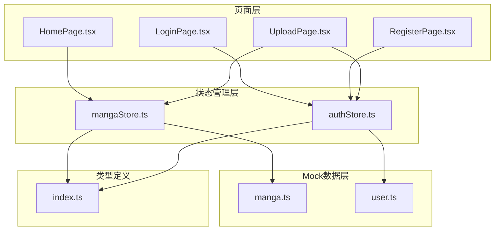
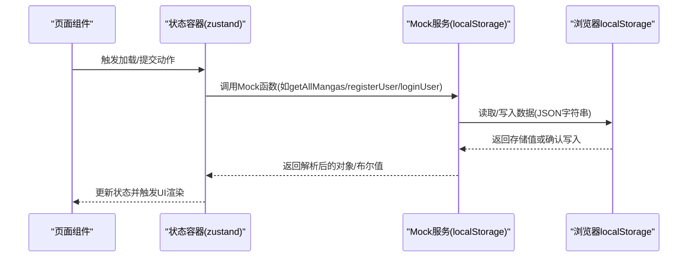
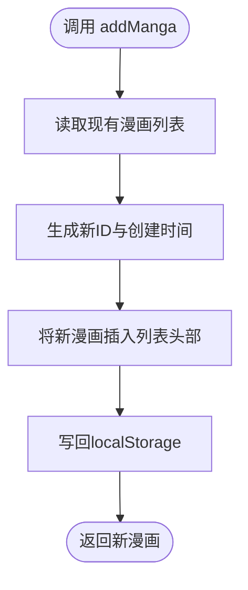
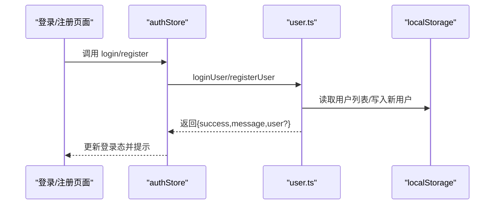
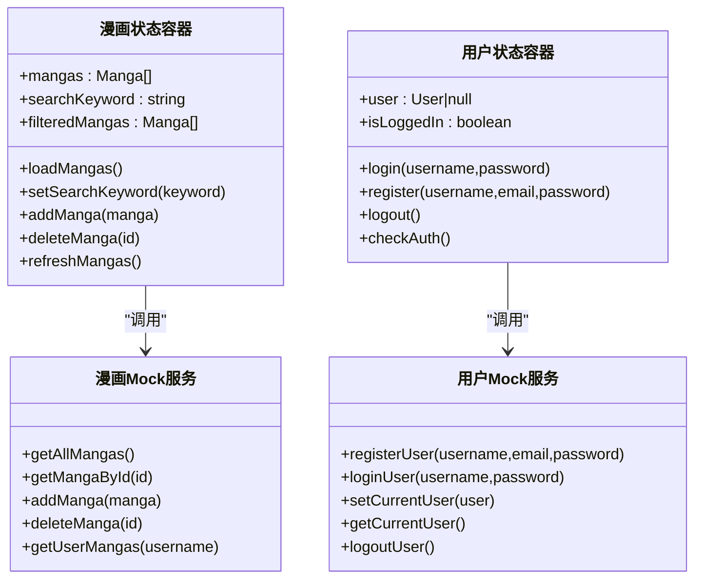
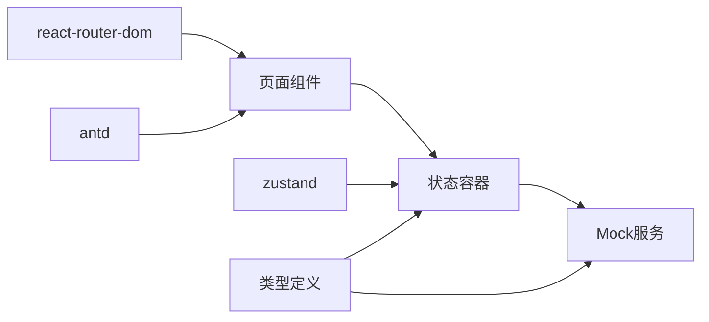

# Mock数据服务

<cite>
**本文引用的文件**
- [manga.ts](file://src/mock/manga.ts)
- [user.ts](file://src/mock/user.ts)
- [mangaStore.ts](file://src/stores/mangaStore.ts)
- [authStore.ts](file://src/stores/authStore.ts)
- [index.ts](file://src/types/index.ts)
- [HomePage.tsx](file://src/pages/HomePage.tsx)
- [LoginPage.tsx](file://src/pages/LoginPage.tsx)
- [RegisterPage.tsx](file://src/pages/RegisterPage.tsx)
- [UploadPage.tsx](file://src/pages/UploadPage.tsx)
- [package.json](file://package.json)
</cite>

## 目录
1. [引言](#引言)
2. [项目结构](#项目结构)
3. [核心组件](#核心组件)
4. [架构总览](#架构总览)
5. [详细组件分析](#详细组件分析)
6. [依赖分析](#依赖分析)
7. [性能考虑](#性能考虑)
8. [故障排查指南](#故障排查指南)
9. [结论](#结论)
10. [附录：扩展与实践指南](#附录扩展与实践指南)

## 引言
本文件系统性梳理漫画网站的Mock数据服务，重点覆盖以下方面：
- localStorage的使用方式：数据存储格式、读取策略与持久化机制
- 漫画数据模拟服务：初始化、增删改查与用户上传关联
- 用户数据模拟服务：注册、登录验证与当前用户状态管理
- Mock API接口设计：通过函数模拟GET/POST/PUT/DELETE行为
- 扩展指南：新增数据类型、修改数据结构与模拟复杂业务逻辑
- 使用示例与调试技巧：帮助理解数据流向与状态管理

## 项目结构
项目采用前端单页应用架构，核心Mock数据位于src/mock目录，状态管理基于zustand，页面组件位于src/pages，类型定义位于src/types。

图表来源
- [mangaStore.ts:1-62](file://src/stores/mangaStore.ts#L1-L62)
- [authStore.ts:1-45](file://src/stores/authStore.ts#L1-L45)
- [manga.ts:1-173](file://src/mock/manga.ts#L1-L173)
- [user.ts:1-90](file://src/mock/user.ts#L1-L90)
- [index.ts:1-44](file://src/types/index.ts#L1-L44)

章节来源
- [package.json:1-26](file://package.json#L1-L26)

## 核心组件
- 类型系统：统一定义漫画与用户的数据模型及表单类型，确保Mock层与UI层契约一致。
- 漫画Mock服务：封装localStorage读写、预置数据初始化、漫画增删查等操作。
- 用户Mock服务：封装用户注册、登录、登出与当前用户状态持久化。
- 状态管理：基于zustand的状态容器，协调页面与Mock服务交互，驱动UI渲染。

章节来源
- [index.ts:1-44](file://src/types/index.ts#L1-L44)
- [manga.ts:1-173](file://src/mock/manga.ts#L1-L173)
- [user.ts:1-90](file://src/mock/user.ts#L1-L90)
- [mangaStore.ts:1-62](file://src/stores/mangaStore.ts#L1-L62)
- [authStore.ts:1-45](file://src/stores/authStore.ts#L1-L45)

## 架构总览
Mock数据服务通过localStorage实现前端本地持久化，避免真实后端依赖；页面组件通过状态容器触发Mock服务，完成数据的读取与更新。整体流程如下：

图表来源
- [mangaStore.ts:16-61](file://src/stores/mangaStore.ts#L16-L61)
- [authStore.ts:14-44](file://src/stores/authStore.ts#L14-L44)
- [manga.ts:119-135](file://src/mock/manga.ts#L119-L135)
- [user.ts:7-23](file://src/mock/user.ts#L7-L23)

## 详细组件分析

### localStorage使用与持久化机制
- 存储键位
  - 漫画数据：使用固定键名保存漫画数组（JSON字符串）
  - 用户数据：使用固定键名保存用户数组（JSON字符串）
  - 当前登录用户：使用独立键名保存当前用户对象（JSON字符串）
- 初始化策略
  - 若localStorage中不存在对应键，则写入预置数据或空数组，并返回默认集合
  - 若存在旧数据且可解析则直接返回；若解析失败则回退到预置数据/空数组
- 读取与写入
  - 读取：从localStorage取出字符串并解析为对象数组
  - 写入：将内存中的对象数组序列化为JSON字符串后写入localStorage
- 数据格式
  - 漫画：包含标识、标题、作者、描述、封面URL、原始链接、创建时间、可选上传者字段
  - 用户：包含标识、用户名、邮箱、密码、创建时间
- 持久化效果
  - 页面刷新或关闭后，数据仍可通过键名恢复，实现跨会话持久化

章节来源
- [manga.ts:3-135](file://src/mock/manga.ts#L3-L135)
- [user.ts:3-23](file://src/mock/user.ts#L3-L23)
- [index.ts:2-20](file://src/types/index.ts#L2-L20)

### 漫画数据模拟服务
- 初始化与读取
  - 首次访问时写入预置漫画集合；后续直接从localStorage读取
  - 提供获取全部漫画与按ID查询的方法
- 增删改查
  - 新增：生成唯一ID与创建时间，插入数组头部，写回localStorage
  - 删除：过滤掉指定ID的条目，若长度未变化表示未命中，否则写回localStorage
  - 查询：支持按关键词筛选标题/作者，以及按上传者筛选用户上传的漫画
- 关联用户上传
  - 在上传表单中将当前登录用户名写入漫画记录的可选字段，便于后续按用户筛选

图表来源
- [manga.ts:148-158](file://src/mock/manga.ts#L148-L158)

章节来源
- [manga.ts:119-173](file://src/mock/manga.ts#L119-L173)

### 用户数据模拟服务
- 注册
  - 校验用户名与邮箱唯一性，失败则返回错误信息
  - 成功则生成用户ID与创建时间，追加到用户列表并写回localStorage
- 登录
  - 查找用户并校验密码，成功则设置当前登录用户状态
- 当前用户状态
  - 读取当前用户信息用于页面鉴权与功能展示
  - 登出时移除当前用户键，清空登录态
- 错误处理
  - 对localStorage解析异常进行兜底，避免因损坏数据导致崩溃

图表来源
- [authStore.ts:18-32](file://src/stores/authStore.ts#L18-L32)
- [user.ts:26-64](file://src/mock/user.ts#L26-L64)

章节来源
- [user.ts:26-90](file://src/mock/user.ts#L26-L90)
- [authStore.ts:14-44](file://src/stores/authStore.ts#L14-L44)

### 状态容器与页面交互
- 漫画状态容器
  - 维护漫画列表、搜索关键词与筛选结果
  - 提供加载、搜索、新增、删除与刷新方法，内部调用Mock服务并同步UI
- 用户状态容器
  - 维护当前用户与登录态
  - 提供登录、注册、登出与鉴权检查方法，内部调用Mock服务并同步UI

图表来源
- [mangaStore.ts:5-61](file://src/stores/mangaStore.ts#L5-L61)
- [authStore.ts:5-44](file://src/stores/authStore.ts#L5-L44)
- [manga.ts:138-172](file://src/mock/manga.ts#L138-L172)
- [user.ts:26-89](file://src/mock/user.ts#L26-L89)

章节来源
- [mangaStore.ts:1-62](file://src/stores/mangaStore.ts#L1-L62)
- [authStore.ts:1-45](file://src/stores/authStore.ts#L1-L45)

### 页面组件与Mock服务的协作
- 首页
  - 首次渲染时加载漫画列表；支持关键词搜索并展示筛选结果
- 登录/注册
  - 表单提交后调用状态容器的登录/注册方法，根据返回结果提示并跳转
- 上传
  - 图片上传为Base64，表单提交后调用状态容器新增漫画方法，成功后跳转首页

章节来源
- [HomePage.tsx:8-107](file://src/pages/HomePage.tsx#L8-L107)
- [LoginPage.tsx:9-85](file://src/pages/LoginPage.tsx#L9-L85)
- [RegisterPage.tsx:9-120](file://src/pages/RegisterPage.tsx#L9-L120)
- [UploadPage.tsx:13-186](file://src/pages/UploadPage.tsx#L13-L186)

## 依赖分析
- 外部依赖
  - antd：UI组件库，提供表单、卡片、消息提示等
  - react/react-router-dom：前端框架与路由
  - zustand：轻量状态管理
- 内部依赖
  - 类型定义被Mock服务与状态容器共同引用
  - 页面组件依赖状态容器，状态容器依赖Mock服务

图表来源
- [package.json:11-24](file://package.json#L11-L24)
- [index.ts:1-44](file://src/types/index.ts#L1-L44)
- [mangaStore.ts:1-3](file://src/stores/mangaStore.ts#L1-L3)
- [authStore.ts:1-3](file://src/stores/authStore.ts#L1-L3)

章节来源
- [package.json:1-26](file://package.json#L1-L26)

## 性能考虑
- 本地存储读写
  - 读取与写入均为O(n)扫描与序列化，建议控制单次写入规模，避免频繁大对象写入
- 列表渲染
  - 首屏渲染时一次性读取并筛选，建议在数据量增大时引入分页或虚拟滚动
- 状态更新
  - 使用局部状态更新减少不必要的重渲染；对搜索关键词变更采用节流策略
- 缓存与去抖
  - 对高频操作（如搜索）可在状态容器中增加防抖逻辑，降低重复计算

## 故障排查指南
- 现象：页面空白或报错
  - 排查localStorage中数据是否损坏（无法JSON解析），Mock服务会在解析失败时回退到默认数据
- 现象：登录/注册无效
  - 检查用户名/邮箱唯一性校验与密码匹配逻辑；确认当前用户键是否正确写入/移除
- 现象：新增漫画后未显示
  - 确认新增后是否调用刷新方法；检查localStorage是否成功写入
- 现象：搜索无结果
  - 检查关键词大小写与筛选逻辑；确认列表是否已加载

章节来源
- [manga.ts:125-130](file://src/mock/manga.ts#L125-L130)
- [user.ts:13-18](file://src/mock/user.ts#L13-L18)
- [mangaStore.ts:21-32](file://src/stores/mangaStore.ts#L21-L32)
- [authStore.ts:18-24](file://src/stores/authStore.ts#L18-L24)

## 结论
该Mock数据服务通过localStorage实现了完整的前端数据生命周期管理，结合zustand状态容器与Ant Design组件，快速搭建了漫画网站的核心功能原型。其设计具备良好的可扩展性，适合在开发阶段替代真实后端，同时为后续接入真实API提供清晰的迁移路径。

## 附录：扩展与实践指南

### 新增数据类型与Mock服务
- 定义类型
  - 在类型文件中新增接口，明确字段与约束
- 实现Mock服务
  - 新建Mock模块，实现初始化、读取、新增、更新、删除等方法
  - 使用独立键名保存数据，遵循现有初始化与持久化策略
- 状态容器集成
  - 在状态容器中新增对应动作与派生状态，调用Mock服务并同步UI
- 页面集成
  - 在页面组件中调用状态容器动作，完成数据展示与提交

章节来源
- [index.ts:1-44](file://src/types/index.ts#L1-L44)
- [manga.ts:119-173](file://src/mock/manga.ts#L119-L173)
- [user.ts:7-23](file://src/mock/user.ts#L7-L23)
- [mangaStore.ts:16-61](file://src/stores/mangaStore.ts#L16-L61)
- [authStore.ts:14-44](file://src/stores/authStore.ts#L14-L44)

### 修改数据结构与兼容策略
- 向后兼容
  - 新增字段时保持默认值，避免影响历史数据解析
- 渐进迁移
  - 通过版本号或标志位区分数据结构版本，逐步迁移旧数据
- 类型约束
  - 在类型文件中严格定义必填/可选字段，减少运行期错误

章节来源
- [index.ts:2-20](file://src/types/index.ts#L2-L20)

### 模拟复杂业务逻辑
- 权限控制
  - 在Mock服务中增加角色字段与权限校验，结合当前用户状态实现页面与按钮级控制
- 分页与排序
  - 在Mock服务中实现分页与排序方法，状态容器中维护分页参数与排序规则
- 事务与一致性
  - 对多步操作（如上传+标签）在状态容器中统一调度，失败时回滚或提示

### 使用示例与调试技巧
- 快速开始
  - 在页面组件中注入状态容器动作，调用加载/提交方法即可完成数据流转
- 调试要点
  - 打开浏览器开发者工具，观察localStorage中键值变化
  - 在状态容器中打印动作触发与返回值，定位数据更新问题
  - 对高频操作增加日志输出，追踪数据流向