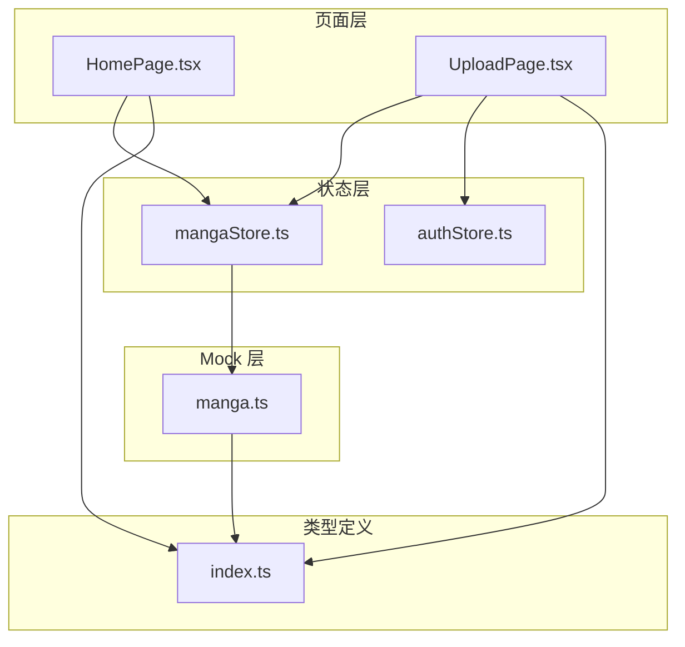
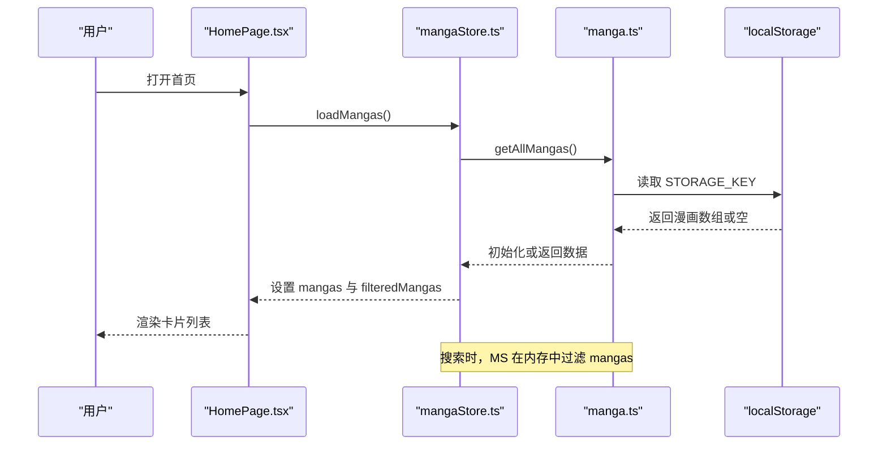
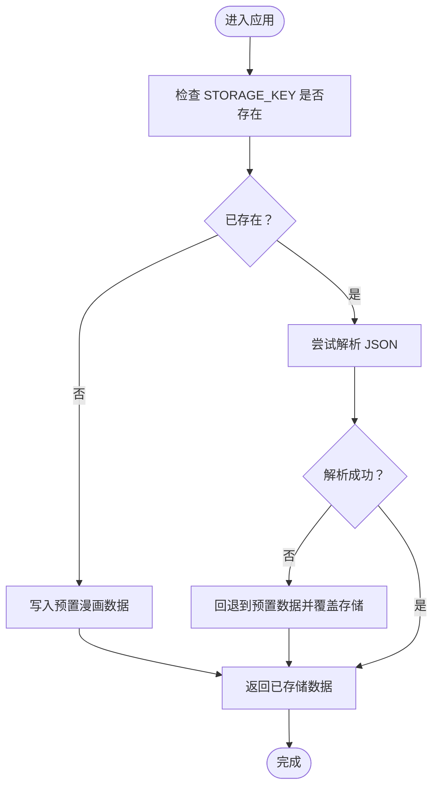
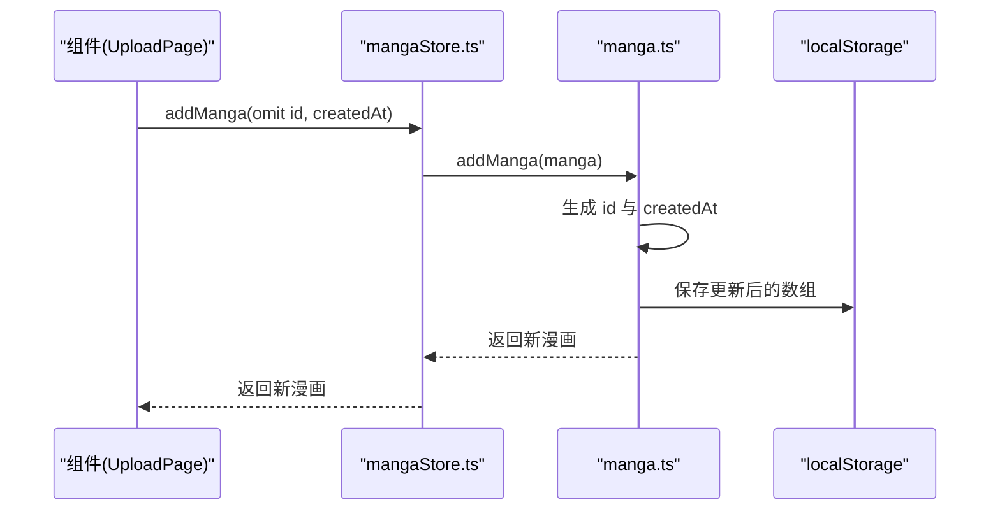
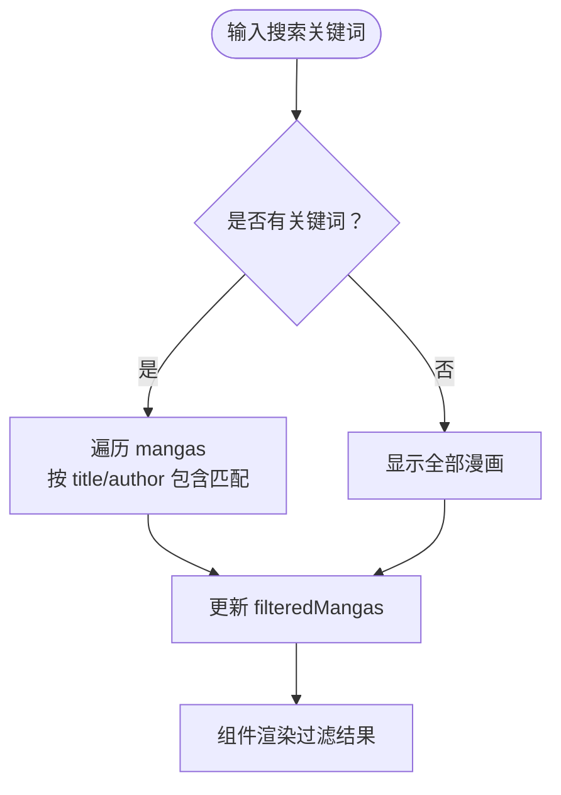
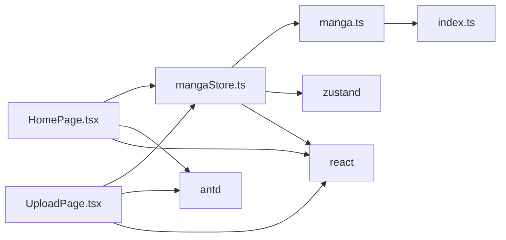
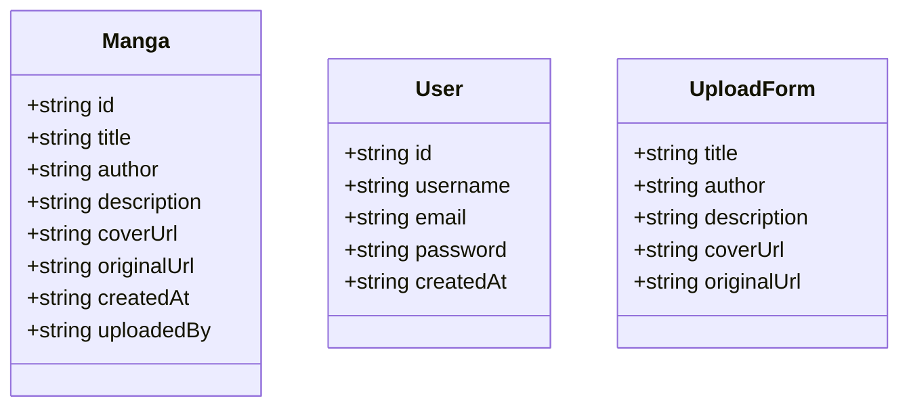

# 漫画数据模拟服务

<cite>
**本文引用的文件**
- [manga.ts](file://manga-website/src/mock/manga.ts)
- [mangaStore.ts](file://manga-website/src/stores/mangaStore.ts)
- [index.ts](file://manga-website/src/types/index.ts)
- [HomePage.tsx](file://manga-website/src/pages/HomePage.tsx)
- [UploadPage.tsx](file://manga-website/src/pages/UploadPage.tsx)
- [authStore.ts](file://manga-website/src/stores/authStore.ts)
- [package.json](file://manga-website/package.json)
</cite>

## 目录
1. [引言](#引言)
2. [项目结构](#项目结构)
3. [核心组件](#核心组件)
4. [架构总览](#架构总览)
5. [详细组件分析](#详细组件分析)
6. [依赖分析](#依赖分析)
7. [性能考虑](#性能考虑)
8. [故障排查指南](#故障排查指南)
9. [结论](#结论)
10. [附录](#附录)

## 引言
本文件面向“漫画数据模拟服务”的使用者与维护者，系统性阐述基于浏览器 localStorage 的漫画数据存储与 CRUD 实现，涵盖数据结构设计、初始化与持久化策略、CRUD 方法、搜索与过滤、使用示例、缓存与性能优化建议，以及扩展方向。该服务采用前端纯模拟方案，不依赖后端 API，适合开发与演示阶段快速迭代。

## 项目结构
项目采用 React + TypeScript + Zustand 状态管理的前端架构，核心模块如下：
- 类型定义：统一声明漫画与用户的数据模型与表单类型
- Mock 层：封装 localStorage 的漫画数据读写与预置数据初始化
- 状态层：使用 Zustand 管理漫画列表、搜索关键词与过滤结果
- 页面层：首页用于浏览与搜索，上传页用于新增漫画
- 认证状态：用户登录态与权限控制（与漫画数据服务协同）

图表来源
- [mangaStore.ts:1-62](file://manga-website/src/stores/mangaStore.ts#L1-L62)
- [manga.ts:1-173](file://manga-website/src/mock/manga.ts#L1-L173)
- [index.ts:1-44](file://manga-website/src/types/index.ts#L1-L44)
- [HomePage.tsx:1-108](file://manga-website/src/pages/HomePage.tsx#L1-L108)
- [UploadPage.tsx:1-187](file://manga-website/src/pages/UploadPage.tsx#L1-L187)
- [authStore.ts:1-45](file://manga-website/src/stores/authStore.ts#L1-L45)

章节来源
- [package.json:1-26](file://manga-website/package.json#L1-L26)

## 核心组件
- 数据模型与类型
  - 漫画接口包含必需字段与可选字段，用于统一前后端契约
- Mock 数据服务
  - 基于 localStorage 的初始化、读取、保存与 CRUD
- 状态管理
  - 使用 Zustand 维护漫画列表、搜索关键词与过滤结果，并桥接 Mock 层
- 页面组件
  - 首页负责渲染与搜索展示；上传页负责新增漫画并联动状态刷新

章节来源
- [index.ts:1-44](file://manga-website/src/types/index.ts#L1-L44)
- [manga.ts:1-173](file://manga-website/src/mock/manga.ts#L1-L173)
- [mangaStore.ts:1-62](file://manga-website/src/stores/mangaStore.ts#L1-L62)
- [HomePage.tsx:1-108](file://manga-website/src/pages/HomePage.tsx#L1-L108)
- [UploadPage.tsx:1-187](file://manga-website/src/pages/UploadPage.tsx#L1-L187)

## 架构总览
下图展示了从页面到状态、再到 Mock 层与本地存储的数据流：

图表来源
- [mangaStore.ts:21-32](file://manga-website/src/stores/mangaStore.ts#L21-L32)
- [manga.ts:119-140](file://manga-website/src/mock/manga.ts#L119-L140)

## 详细组件分析

### 数据模型与格式规范
- 漫画实体字段
  - 必需字段：id、title、author、description、coverUrl、originalUrl、createdAt
  - 可选字段：uploadedBy（标识上传用户）
  - 字段类型：字符串（日期字段为 ISO 8601 字符串）
- 表单字段
  - UploadForm：title、author、description、coverUrl、originalUrl
- 设计要点
  - 通过类型约束保证数据一致性
  - 上传表单与实体字段保持一致，便于直接映射

章节来源
- [index.ts:1-44](file://manga-website/src/types/index.ts#L1-L44)

### localStorage 存储机制与持久化策略
- 存储键
  - 主数据键：STORAGE_KEY（漫画主数据）
  - 用户上传键：USER_UPLOADS_KEY（预留，当前未使用）
- 初始化流程
  - 首次访问：若不存在则写入预置漫画数据
  - 后续访问：尝试解析已有数据，异常则回退到预置数据
- 持久化策略
  - 写入时机：新增、删除等变更后立即保存
  - 数据格式：JSON 序列化存储

图表来源
- [manga.ts:119-131](file://manga-website/src/mock/manga.ts#L119-L131)

章节来源
- [manga.ts:1-173](file://manga-website/src/mock/manga.ts#L1-L173)

### CRUD 操作实现
- 获取全部漫画
  - 方法：getAllMangas
  - 行为：初始化后返回当前数据
- 根据 ID 获取漫画
  - 方法：getMangaById
  - 行为：在内存中查找匹配项
- 新增漫画
  - 方法：addManga
  - 行为：生成唯一 id 与创建时间，插入到数组首位，保存到 localStorage
- 删除漫画
  - 方法：deleteManga
  - 行为：过滤掉指定 id 的条目，若长度变化则保存
- 获取用户上传的漫画
  - 方法：getUserMangas
  - 行为：按 uploadedBy 过滤（当前仅在上传页设置该字段）

图表来源
- [mangaStore.ts:46-50](file://manga-website/src/stores/mangaStore.ts#L46-L50)
- [manga.ts:148-158](file://manga-website/src/mock/manga.ts#L148-L158)

章节来源
- [manga.ts:137-173](file://manga-website/src/mock/manga.ts#L137-L173)
- [mangaStore.ts:16-61](file://manga-website/src/stores/mangaStore.ts#L16-L61)

### 搜索与过滤功能
- 关键词来源
  - 来自状态层的 searchKeyword
- 过滤逻辑
  - 仅对 title 与 author 进行包含匹配（大小写不敏感）
  - 若无关键词则返回全部数据
- 触发时机
  - 初始加载与每次关键词变更时均进行过滤

图表来源
- [mangaStore.ts:24-44](file://manga-website/src/stores/mangaStore.ts#L24-L44)

章节来源
- [mangaStore.ts:16-61](file://manga-website/src/stores/mangaStore.ts#L16-L61)

### 使用示例与最佳实践
- 在组件中调用 Mock API
  - 加载数据：在页面挂载时调用 loadMangas
  - 设置搜索：调用 setSearchKeyword 更新过滤
  - 新增漫画：调用 addManga 并传入除 id 与 createdAt 外的字段
  - 删除漫画：调用 deleteManga 并处理返回值
- 上传页集成
  - 上传页通过表单收集 UploadForm 字段，结合认证状态设置 uploadedBy
  - 成功后自动刷新列表并跳转首页

章节来源
- [HomePage.tsx:8-13](file://manga-website/src/pages/HomePage.tsx#L8-L13)
- [HomePage.tsx:34-104](file://manga-website/src/pages/HomePage.tsx#L34-L104)
- [UploadPage.tsx:13-74](file://manga-website/src/pages/UploadPage.tsx#L13-L74)
- [mangaStore.ts:16-61](file://manga-website/src/stores/mangaStore.ts#L16-L61)

### 错误处理与边界情况
- 初始化异常
  - 当 localStorage 中数据损坏时，回退到预置数据并覆盖存储
- 删除无效
  - 若未找到匹配 id，删除操作返回 false，不触发保存
- 搜索无结果
  - 首页在无关键词时显示全部，有关键词且无匹配时显示空状态

章节来源
- [manga.ts:125-131](file://manga-website/src/mock/manga.ts#L125-L131)
- [manga.ts:160-167](file://manga-website/src/mock/manga.ts#L160-L167)
- [HomePage.tsx:15-21](file://manga-website/src/pages/HomePage.tsx#L15-L21)

## 依赖分析
- 组件耦合
  - 页面组件仅依赖状态层；状态层依赖 Mock 层；Mock 层依赖类型定义
- 外部依赖
  - Zustand：轻量状态管理
  - Ant Design：UI 组件库
  - React/React-DOM、react-router-dom：前端框架与路由
- 版本与脚本
  - 开发与构建脚本通过 Vite 与 TypeScript 驱动

图表来源
- [package.json:11-25](file://manga-website/package.json#L11-L25)
- [mangaStore.ts:1](file://manga-website/src/stores/mangaStore.ts#L1)
- [manga.ts:1](file://manga-website/src/mock/manga.ts#L1)
- [index.ts:1](file://manga-website/src/types/index.ts#L1)

章节来源
- [package.json:1-26](file://manga-website/package.json#L1-L26)

## 性能考虑
- 内存与渲染
  - 过滤在内存中进行，适合中小规模数据；如数据量增大，建议分页或服务端筛选
- 本地存储
  - localStorage 为同步 API，频繁写入可能阻塞主线程；可在批量操作后一次性保存
- 图片加载
  - 封面图使用懒加载与缩放动画，提升交互体验
- 状态更新
  - 使用 Zustand 的局部更新避免不必要的重渲染

## 故障排查指南
- 无法看到漫画
  - 检查 STORAGE_KEY 是否存在或是否被清空；确认初始化流程是否正常
- 搜索无结果
  - 确认搜索关键词是否正确；当前仅匹配 title 与 author
- 上传失败
  - 检查封面是否上传成功；确认表单必填项是否完整；查看控制台错误信息
- 删除无效
  - 确认传入的 id 是否正确；检查 localStorage 中是否存在该 id

章节来源
- [manga.ts:119-131](file://manga-website/src/mock/manga.ts#L119-L131)
- [mangaStore.ts:24-44](file://manga-website/src/stores/mangaStore.ts#L24-L44)
- [UploadPage.tsx:46-74](file://manga-website/src/pages/UploadPage.tsx#L46-L74)
- [manga.ts:160-167](file://manga-website/src/mock/manga.ts#L160-L167)

## 结论
该漫画数据模拟服务以 localStorage 为核心，结合类型约束与 Zustand 状态管理，提供了完整的前端 CRUD 与搜索能力。其设计简洁、易于扩展，适合在开发与演示阶段快速落地。随着业务增长，可逐步引入服务端、数据库与更复杂的搜索索引策略。

## 附录

### 数据模型类图

图表来源
- [index.ts:1-44](file://manga-website/src/types/index.ts#L1-L44)

### 扩展建议
- 增加分类标签与标签过滤
- 引入服务端与数据库，替换 localStorage
- 增加分页与排序
- 增强搜索：全文检索、同义词、拼音首字母
- 增加缓存策略：内存缓存 + localStorage 双层缓存
- 增加数据校验与导入导出