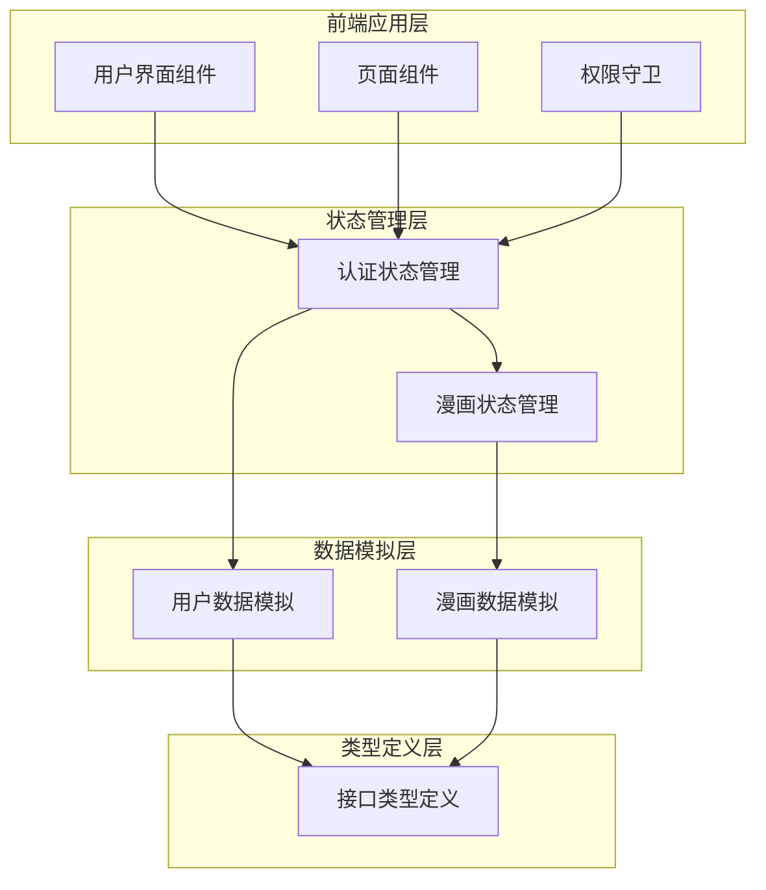
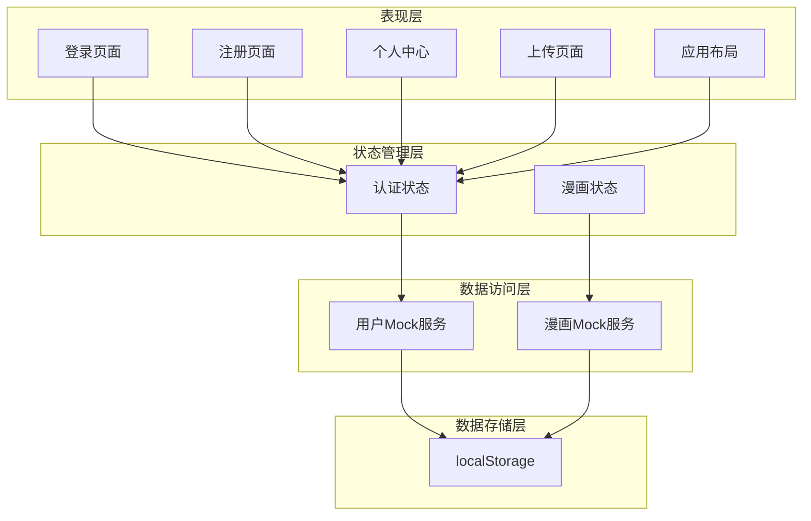
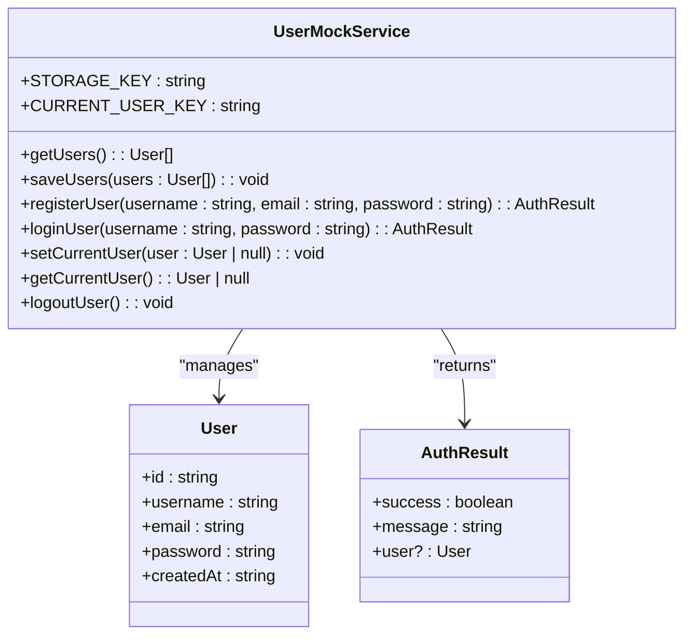
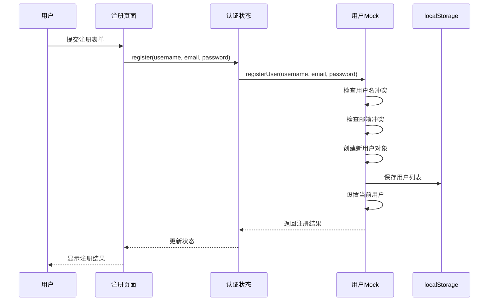
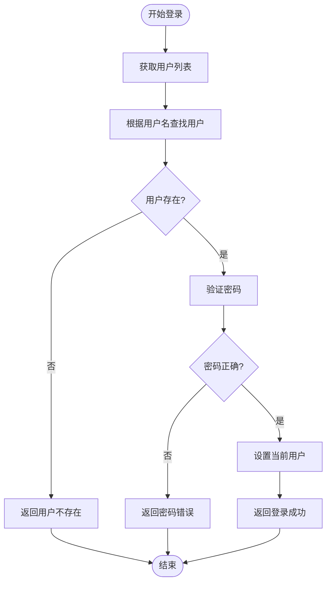
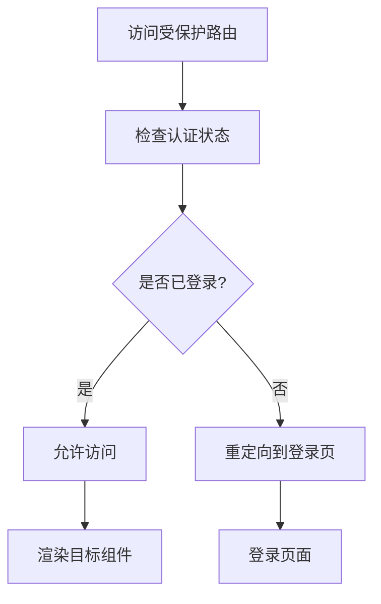
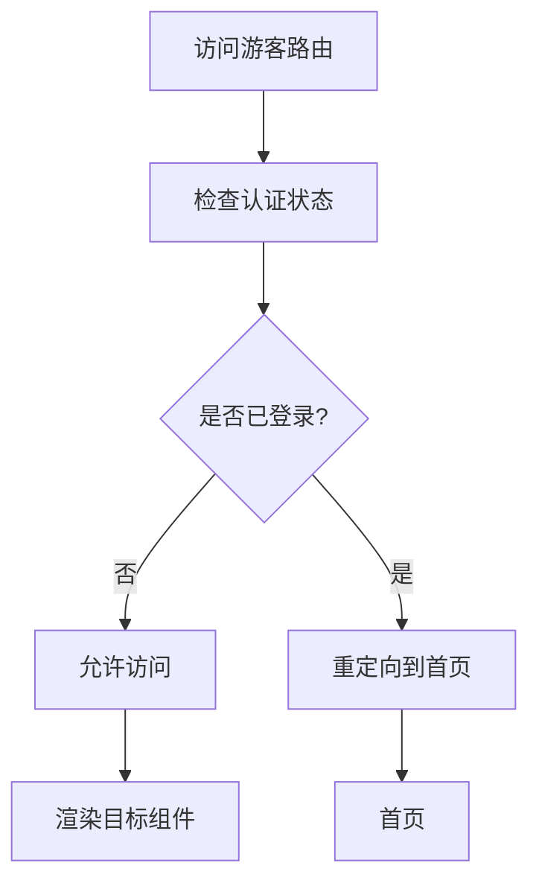
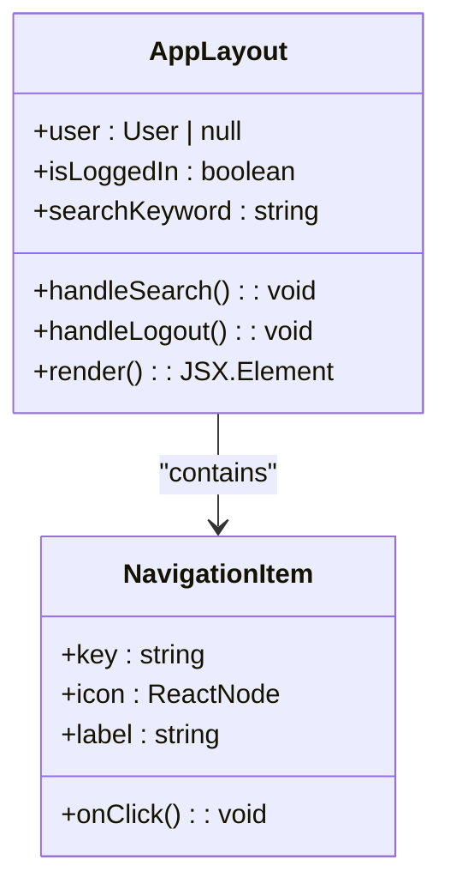
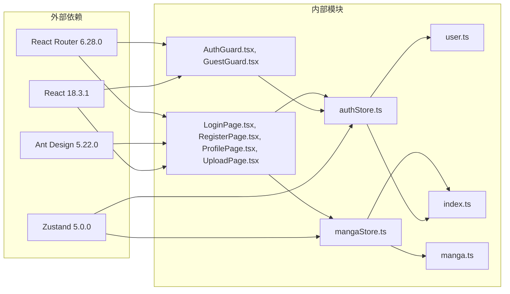
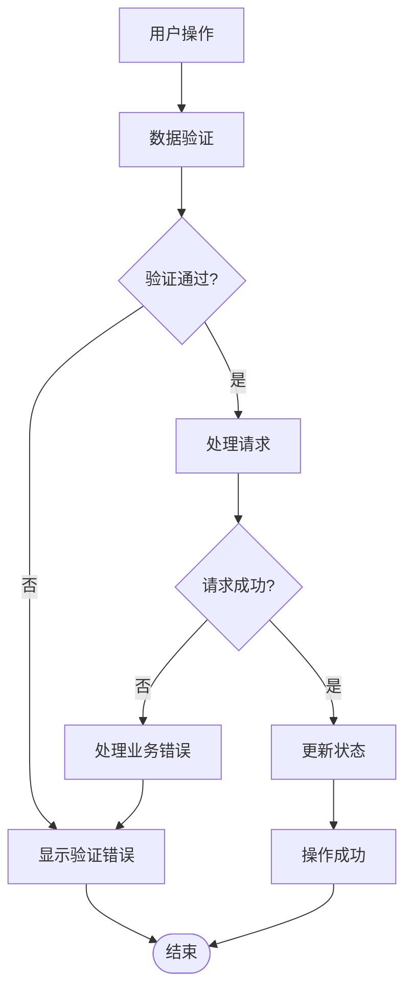

# 用户数据模拟服务

<cite>
**本文档引用的文件**
- [user.ts](file://manga-website/src/mock/user.ts)
- [authStore.ts](file://manga-website/src/stores/authStore.ts)
- [index.ts](file://manga-website/src/types/index.ts)
- [AppLayout.tsx](file://manga-website/src/components/AppLayout.tsx)
- [AuthGuard.tsx](file://manga-website/src/components/AuthGuard.tsx)
- [GuestGuard.tsx](file://manga-website/src/components/GuestGuard.tsx)
- [LoginPage.tsx](file://manga-website/src/pages/LoginPage.tsx)
- [RegisterPage.tsx](file://manga-website/src/pages/RegisterPage.tsx)
- [ProfilePage.tsx](file://manga-website/src/pages/ProfilePage.tsx)
- [UploadPage.tsx](file://manga-website/src/pages/UploadPage.tsx)
- [manga.ts](file://manga-website/src/mock/manga.ts)
- [mangaStore.ts](file://manga-website/src/stores/mangaStore.ts)
- [package.json](file://manga-website/package.json)
</cite>

## 目录
1. [简介](#简介)
2. [项目结构](#项目结构)
3. [核心组件](#核心组件)
4. [架构概览](#架构概览)
5. [详细组件分析](#详细组件分析)
6. [依赖关系分析](#依赖关系分析)
7. [性能考虑](#性能考虑)
8. [故障排除指南](#故障排除指南)
9. [结论](#结论)
10. [附录](#附录)

## 简介

本项目是一个基于React和TypeScript构建的漫画展示平台，实现了完整的用户数据模拟服务。该服务通过localStorage提供用户认证、会话管理和数据持久化功能，支持用户注册、登录、登出等核心功能，并集成了权限控制机制。

项目采用Mock服务模式，所有用户数据都存储在浏览器的localStorage中，无需后端服务器即可运行。这种设计使得开发者可以快速原型开发和测试，同时保持良好的用户体验。

## 项目结构

项目采用模块化的组织方式，主要分为以下几个核心模块：



**图表来源**
- [user.ts:1-90](file://manga-website/src/mock/user.ts#L1-L90)
- [authStore.ts:1-45](file://manga-website/src/stores/authStore.ts#L1-L45)
- [manga.ts:1-173](file://manga-website/src/mock/manga.ts#L1-L173)

**章节来源**
- [package.json:1-26](file://manga-website/package.json#L1-L26)

## 核心组件

### 用户数据模型

系统定义了标准的用户数据结构，包含以下关键字段：

- **用户标识**: 唯一的用户ID（字符串）
- **用户名**: 用户登录使用的标识符
- **邮箱**: 用户的联系邮箱地址
- **密码**: 用户认证凭证
- **注册时间**: 用户账户创建的时间戳

这些数据结构确保了用户信息的完整性和一致性，为后续的认证和权限管理提供了基础。

### 认证状态管理

应用使用Zustand状态管理库实现全局认证状态管理，提供以下核心功能：

- **用户状态**: 当前登录用户信息
- **登录状态**: 用户是否已认证的布尔值
- **认证方法**: 登录、注册、登出操作
- **状态检查**: 应用启动时的认证状态初始化

**章节来源**
- [index.ts:13-20](file://manga-website/src/types/index.ts#L13-L20)
- [authStore.ts:5-12](file://manga-website/src/stores/authStore.ts#L5-L12)

## 架构概览

系统采用分层架构设计，各层职责明确，耦合度低：



**图表来源**
- [AppLayout.tsx:19-156](file://manga-website/src/components/AppLayout.tsx#L19-L156)
- [authStore.ts:14-44](file://manga-website/src/stores/authStore.ts#L14-L44)
- [mangaStore.ts:16-61](file://manga-website/src/stores/mangaStore.ts#L16-L61)

## 详细组件分析

### 用户数据模拟服务

用户数据模拟服务是整个认证系统的核心，负责处理所有用户相关的数据操作。

#### 数据存储方案

服务采用localStorage作为持久化存储，包含两个主要键值：

- **users_data**: 存储所有用户注册信息的数组
- **current_user**: 存储当前登录用户的JSON序列化数据



**图表来源**
- [user.ts:1-90](file://manga-website/src/mock/user.ts#L1-L90)
- [index.ts:13-20](file://manga-website/src/types/index.ts#L13-L20)

#### 注册流程实现

用户注册流程包含完整的数据验证和冲突检测：



**图表来源**
- [RegisterPage.tsx:14-22](file://manga-website/src/pages/RegisterPage.tsx#L14-L22)
- [authStore.ts:26-33](file://manga-website/src/stores/authStore.ts#L26-L33)
- [user.ts:26-48](file://manga-website/src/mock/user.ts#L26-L48)

#### 登录认证流程

登录认证过程包含用户查找、密码验证和会话建立：



**图表来源**
- [user.ts:51-64](file://manga-website/src/mock/user.ts#L51-L64)
- [authStore.ts:18-24](file://manga-website/src/stores/authStore.ts#L18-L24)

**章节来源**
- [user.ts:25-89](file://manga-website/src/mock/user.ts#L25-L89)

### 权限控制系统

系统实现了基于路由的权限控制，通过守卫组件确保用户访问的安全性。

#### 认证守卫（AuthGuard）

认证守卫确保只有已登录用户才能访问受保护的页面：



**图表来源**
- [AuthGuard.tsx:8-16](file://manga-website/src/components/AuthGuard.tsx#L8-L16)

#### 游客守卫（GuestGuard）

游客守卫防止已登录用户访问登录和注册页面：



**图表来源**
- [GuestGuard.tsx:8-16](file://manga-website/src/components/GuestGuard.tsx#L8-L16)

**章节来源**
- [AuthGuard.tsx:1-17](file://manga-website/src/components/AuthGuard.tsx#L1-L17)
- [GuestGuard.tsx:1-17](file://manga-website/src/components/GuestGuard.tsx#L1-L17)

### 用户界面组件

#### 应用布局组件

应用布局组件提供统一的导航界面，根据用户登录状态显示不同的菜单选项：



**图表来源**
- [AppLayout.tsx:19-156](file://manga-website/src/components/AppLayout.tsx#L19-L156)

#### 页面组件交互

每个页面组件都通过状态管理器与Mock服务进行交互，实现数据的双向绑定和状态同步。

**章节来源**
- [AppLayout.tsx:19-156](file://manga-website/src/components/AppLayout.tsx#L19-L156)

## 依赖关系分析

系统采用松耦合的设计，各模块之间的依赖关系清晰明确：



**图表来源**
- [package.json:11-24](file://manga-website/package.json#L11-L24)
- [user.ts:1](file://manga-website/src/mock/user.ts#L1)
- [authStore.ts:1](file://manga-website/src/stores/authStore.ts#L1)

**章节来源**
- [package.json:1-26](file://manga-website/package.json#L1-L26)

## 性能考虑

### 数据存储优化

系统采用localStorage进行数据持久化，具有以下性能特点：

- **本地存储**: 数据存储在客户端，避免网络延迟
- **JSON序列化**: 使用高效的JSON格式进行数据序列化
- **批量操作**: 批量读取和写入减少存储访问次数

### 状态管理优化

Zustand状态管理库提供了轻量级的状态解决方案：

- **原子化状态**: 状态按需更新，避免不必要的重新渲染
- **选择器模式**: 只订阅需要的状态变化
- **中间件支持**: 支持调试和日志记录

### 缓存策略

系统实现了多层缓存机制：

- **内存缓存**: 当前会话中的数据缓存
- **localStorage缓存**: 浏览器级别的数据持久化
- **组件缓存**: React组件的渲染优化

## 故障排除指南

### 常见问题及解决方案

#### 用户名重复注册

当用户尝试使用已存在的用户名注册时，系统会返回相应的错误信息。解决方案：
- 提示用户选择其他用户名
- 在前端提供实时用户名可用性检查
- 实施更严格的用户名验证规则

#### 邮箱重复注册

邮箱重复注册问题的处理：
- 实施邮箱唯一性验证
- 提供邮箱格式验证
- 发送确认邮件进行二次验证

#### 登录失败处理

登录失败的常见原因及处理：
- 用户名不存在：提示用户检查用户名
- 密码错误：提供密码重置功能
- 账户锁定：实施安全的账户保护机制

#### 数据恢复

当localStorage数据损坏时的恢复策略：
- 实现数据完整性检查
- 提供数据备份和恢复功能
- 实施自动数据修复机制

**章节来源**
- [user.ts:29-34](file://manga-website/src/mock/user.ts#L29-L34)
- [user.ts:55-60](file://manga-website/src/mock/user.ts#L55-L60)

### 错误处理机制

系统实现了多层次的错误处理机制：



**图表来源**
- [LoginPage.tsx:14-22](file://manga-website/src/pages/LoginPage.tsx#L14-L22)
- [RegisterPage.tsx:14-22](file://manga-website/src/pages/RegisterPage.tsx#L14-L22)

## 结论

本用户数据模拟服务为漫画展示平台提供了完整的认证和权限管理解决方案。通过localStorage的使用，系统实现了无需后端服务器即可运行的功能，同时保持了良好的用户体验。

### 主要优势

1. **简单易用**: 基于localStorage的实现降低了系统的复杂性
2. **性能优异**: 本地存储避免了网络延迟，提升了响应速度
3. **易于扩展**: 模块化设计便于功能扩展和维护
4. **安全性考虑**: 实现了基本的用户数据保护机制

### 技术特色

- **Mock服务模式**: 完整的前端数据模拟解决方案
- **状态管理**: 基于Zustand的现代化状态管理
- **权限控制**: 基于路由的细粒度权限管理
- **类型安全**: 完整的TypeScript类型定义

### 改进建议

1. **密码加密**: 实现密码哈希存储
2. **会话管理**: 添加会话超时和自动登出功能
3. **数据同步**: 实现多设备间的数据同步
4. **安全增强**: 添加CSRF保护和XSS防护

## 附录

### 使用示例

#### 集成认证服务

```typescript
// 在组件中使用认证状态
import { useAuthStore } from '../stores/authStore';

function MyComponent() {
  const { user, isLoggedIn, login, logout } = useAuthStore();
  
  const handleLogin = () => {
    const result = login('username', 'password');
    if (result.success) {
      // 处理登录成功
    }
  };
  
  return (
    <div>
      {isLoggedIn ? (
        <span>欢迎 {user?.username}</span>
      ) : (
        <button onClick={handleLogin}>登录</button>
      )}
    </div>
  );
}
```

#### 实现自定义权限控制

```typescript
// 创建自定义守卫组件
import { Navigate } from 'react-router-dom';
import { useAuthStore } from '../stores/authStore';

function AdminGuard({ children }: { children: React.ReactNode }) {
  const { user } = useAuthStore();
  
  if (!user || user.role !== 'admin') {
    return <Navigate to="/" replace />;
  }
  
  return <>{children}</>;
}
```

### 最佳实践

1. **状态管理**: 使用Zustand进行全局状态管理
2. **类型安全**: 始终使用TypeScript接口定义数据结构
3. **错误处理**: 实现统一的错误处理和用户反馈机制
4. **性能优化**: 合理使用React.memo和useMemo进行性能优化
5. **安全性**: 实施基本的安全措施，如输入验证和XSS防护

### 安全考虑

1. **数据保护**: localStorage中的敏感数据应进行适当的保护
2. **会话安全**: 实现会话超时和自动登出机制
3. **输入验证**: 对所有用户输入进行严格的验证
4. **权限控制**: 实施最小权限原则和角色分离
5. **数据备份**: 实现数据备份和恢复机制