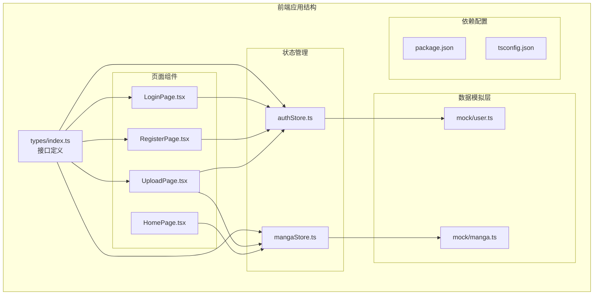
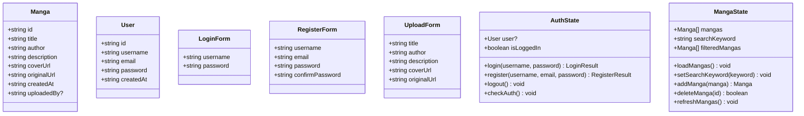
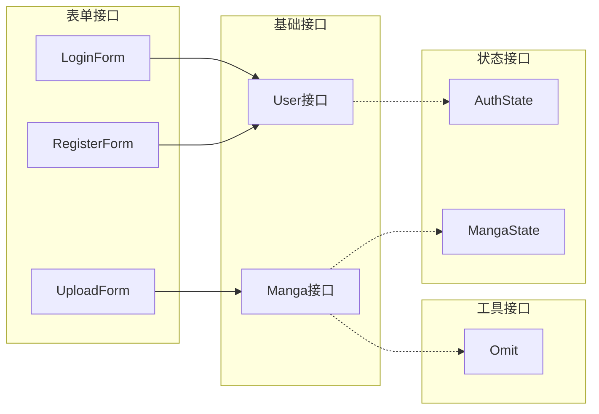
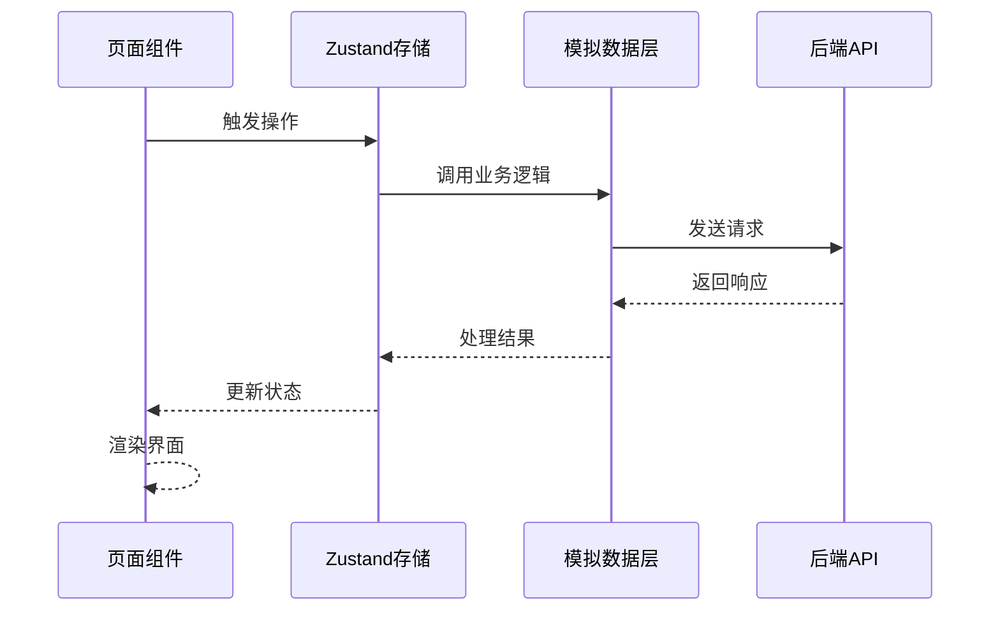
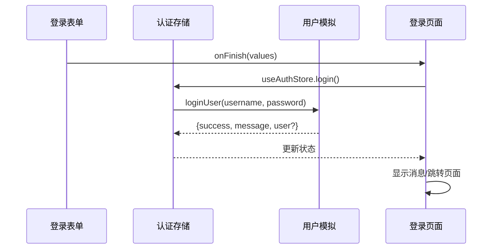
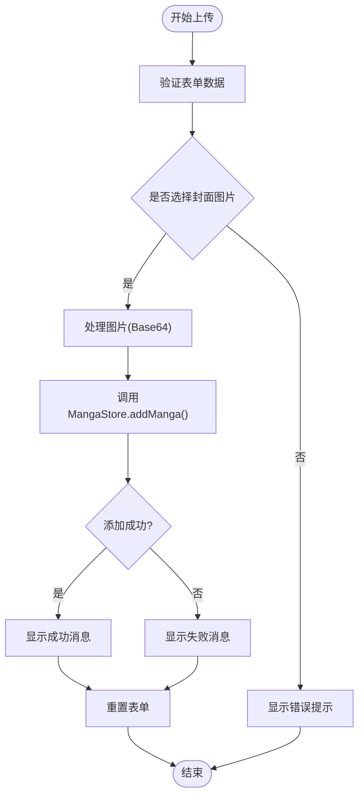
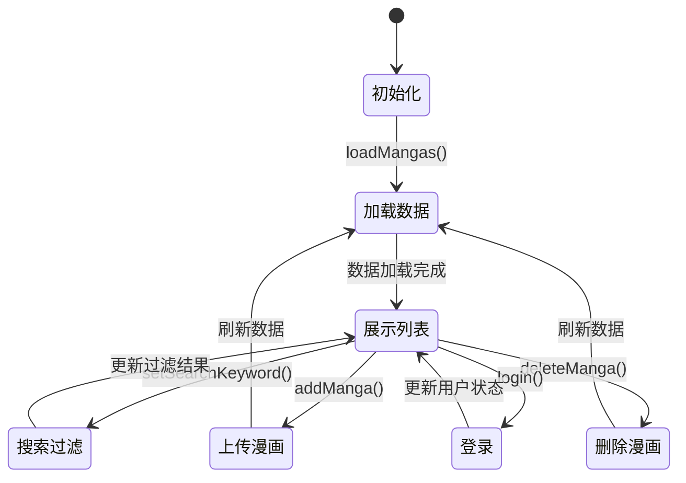

# TypeScript接口定义

<cite>
**本文档引用的文件**
- [index.ts](file://manga-website/src/types/index.ts)
- [manga.ts](file://manga-website/src/mock/manga.ts)
- [user.ts](file://manga-website/src/mock/user.ts)
- [authStore.ts](file://manga-website/src/stores/authStore.ts)
- [mangaStore.ts](file://manga-website/src/stores/mangaStore.ts)
- [LoginPage.tsx](file://manga-website/src/pages/LoginPage.tsx)
- [RegisterPage.tsx](file://manga-website/src/pages/RegisterPage.tsx)
- [UploadPage.tsx](file://manga-website/src/pages/UploadPage.tsx)
- [HomePage.tsx](file://manga-website/src/pages/HomePage.tsx)
- [package.json](file://manga-website/package.json)
- [tsconfig.json](file://manga-website/tsconfig.json)
</cite>

## 目录
1. [项目概述](#项目概述)
2. [项目结构](#项目结构)
3. [核心接口设计](#核心接口设计)
4. [接口关系架构](#接口关系架构)
5. [详细接口分析](#详细接口分析)
6. [接口使用模式](#接口使用模式)
7. [最佳实践指南](#最佳实践指南)
8. [性能考虑](#性能考虑)
9. [故障排除指南](#故障排除指南)
10. [总结](#总结)

## 项目概述

这是一个基于React和TypeScript构建的漫画网站，采用现代化的前端架构设计。项目使用Vite作为构建工具，Zustand进行状态管理，Ant Design作为UI组件库。系统通过TypeScript接口定义确保类型安全，提供完整的漫画浏览、用户认证和漫画上传功能。

## 项目结构



**图表来源**
- [index.ts:1-44](file://manga-website/src/types/index.ts#L1-L44)
- [authStore.ts:1-45](file://manga-website/src/stores/authStore.ts#L1-L45)
- [mangaStore.ts:1-62](file://manga-website/src/stores/mangaStore.ts#L1-L62)

**章节来源**
- [package.json:1-26](file://manga-website/package.json#L1-L26)
- [tsconfig.json:1-24](file://manga-website/tsconfig.json#L1-L24)

## 核心接口设计

### 接口分类体系

系统采用清晰的接口分类设计，主要分为三大类：

1. **数据实体接口**：Manga、User
2. **表单接口**：LoginForm、RegisterForm、UploadForm
3. **状态接口**：AuthState、MangaState



**图表来源**
- [index.ts:1-44](file://manga-website/src/types/index.ts#L1-L44)
- [authStore.ts:5-12](file://manga-website/src/stores/authStore.ts#L5-L12)
- [mangaStore.ts:5-14](file://manga-website/src/stores/mangaStore.ts#L5-L14)

## 接口关系架构

### 继承与组合关系

系统中的接口设计遵循最小化原则，通过组合而非继承实现功能扩展：



**图表来源**
- [manga.ts:148-158](file://manga-website/src/mock/manga.ts#L148-L158)
- [mangaStore.ts:11](file://manga-website/src/stores/mangaStore.ts#L11)

### 数据流关系



**图表来源**
- [authStore.ts:14-44](file://manga-website/src/stores/authStore.ts#L14-L44)
- [mangaStore.ts:16-61](file://manga-website/src/stores/mangaStore.ts#L16-L61)

## 详细接口分析

### Manga接口详解

Manga接口是系统的核心数据模型，用于表示漫画作品信息：

| 字段名 | 类型 | 必填 | 描述 | 约束条件 |
|--------|------|------|------|----------|
| id | string | 是 | 漫画唯一标识符 | 唯一性，格式为数字字符串 |
| title | string | 是 | 漫画标题 | 最大长度50字符 |
| author | string | 是 | 作者名称 | 最大长度30字符 |
| description | string | 是 | 漫画简介 | 最大长度300字符 |
| coverUrl | string | 是 | 封面图片URL | 有效的URL格式 |
| originalUrl | string | 是 | 原始漫画链接 | 有效的URL格式 |
| createdAt | string | 是 | 创建时间 | ISO 8601日期格式 |
| uploadedBy | string | 否 | 上传用户 | 用户名字符串 |

**章节来源**
- [index.ts:2-11](file://manga-website/src/types/index.ts#L2-L11)
- [manga.ts:7-116](file://manga-website/src/mock/manga.ts#L7-L116)

### User接口详解

User接口定义了用户账户的基本信息：

| 字段名 | 类型 | 必填 | 描述 | 约束条件 |
|--------|------|------|------|----------|
| id | string | 是 | 用户唯一标识符 | 唯一性，数字字符串 |
| username | string | 是 | 用户名 | 3-20字符，唯一性 |
| email | string | 是 | 邮箱地址 | 有效邮箱格式，唯一性 |
| password | string | 是 | 密码 | 至少6字符 |
| createdAt | string | 是 | 注册时间 | ISO 8601日期格式 |

**章节来源**
- [index.ts:14-20](file://manga-website/src/types/index.ts#L14-L20)
- [user.ts:26-48](file://manga-website/src/mock/user.ts#L26-L48)

### 表单接口详解

#### LoginForm接口
用于用户登录验证：
- username: 必填，用户名
- password: 必填，密码

#### RegisterForm接口
用于用户注册：
- username: 必填，用户名（3-20字符）
- email: 必填，邮箱地址
- password: 必填，密码（至少6字符）
- confirmPassword: 必填，确认密码

#### UploadForm接口
用于漫画上传：
- title: 必填，漫画标题（最大50字符）
- author: 必填，作者名称（最大30字符）
- description: 必填，简介（最大300字符）
- coverUrl: 必填，封面图片Base64编码
- originalUrl: 必填，原始链接（有效URL）

**章节来源**
- [index.ts:22-43](file://manga-website/src/types/index.ts#L22-L43)
- [LoginPage.tsx:14](file://manga-website/src/pages/LoginPage.tsx#L14)
- [RegisterPage.tsx:14](file://manga-website/src/pages/RegisterPage.tsx#L14)
- [UploadPage.tsx:46](file://manga-website/src/pages/UploadPage.tsx#L46)

## 接口使用模式

### 组件中的接口使用

#### 登录页面使用示例



**图表来源**
- [LoginPage.tsx:14-22](file://manga-website/src/pages/LoginPage.tsx#L14-L22)
- [authStore.ts:18-24](file://manga-website/src/stores/authStore.ts#L18-L24)

#### 上传页面使用示例



**图表来源**
- [UploadPage.tsx:46-74](file://manga-website/src/pages/UploadPage.tsx#L46-L74)
- [mangaStore.ts:46-50](file://manga-website/src/stores/mangaStore.ts#L46-L50)

**章节来源**
- [LoginPage.tsx:1-86](file://manga-website/src/pages/LoginPage.tsx#L1-L86)
- [RegisterPage.tsx:1-121](file://manga-website/src/pages/RegisterPage.tsx#L1-L121)
- [UploadPage.tsx:1-187](file://manga-website/src/pages/UploadPage.tsx#L1-L187)

### 状态管理模式



**图表来源**
- [mangaStore.ts:21-61](file://manga-website/src/stores/mangaStore.ts#L21-L61)
- [authStore.ts:14-44](file://manga-website/src/stores/authStore.ts#L14-L44)

## 最佳实践指南

### 类型安全检查

1. **严格模式配置**：启用TypeScript严格模式，确保类型检查的准确性
2. **接口完整性**：所有接口字段都应明确类型定义
3. **可选字段处理**：对于可能为空的字段，使用可选属性标记

### 可选字段处理策略

```typescript
// 使用可选属性标记
interface Manga {
  id: string;
  title: string;
  author: string;
  description: string;
  coverUrl: string;
  originalUrl: string;
  createdAt: string;
  uploadedBy?: string; // 可选字段
}

// 使用类型守卫检查
function processManga(manga: Manga) {
  if (manga.uploadedBy) {
    console.log(`由用户 ${manga.uploadedBy} 上传`);
  }
}
```

### 默认值设置

```typescript
// 使用解构赋值设置默认值
interface MangaState {
  mangas: Manga[] = [];
  searchKeyword: string = '';
  filteredMangas: Manga[] = [];
}
```

### 错误处理模式

```typescript
// 使用Result模式处理异步操作
interface LoginResult {
  success: boolean;
  message: string;
  user?: User;
}

// 在store中返回统一格式的结果
export const useAuthStore = create<AuthState>((set) => ({
  login: (username: string, password: string): LoginResult => {
    const user = userMock.loginUser(username, password);
    if (user.success) {
      set({ user: user.user, isLoggedIn: true });
    }
    return user;
  }
}));
```

**章节来源**
- [tsconfig.json:15-20](file://manga-website/tsconfig.json#L15-L20)
- [authStore.ts:18-33](file://manga-website/src/stores/authStore.ts#L18-L33)

## 性能考虑

### 内存优化

1. **状态分片**：将大型数据集分片存储，避免不必要的重新渲染
2. **懒加载**：对图片资源进行懒加载处理
3. **缓存策略**：合理使用localStorage缓存用户数据

### 渲染优化

```typescript
// 使用React.memo优化组件渲染
const MangaCard = React.memo(({ manga }: { manga: Manga }) => {
  return (
    <Card>
      
      <h3>{manga.title}</h3>
    </Card>
  );
});
```

### 异步处理

```typescript
// 使用防抖处理搜索输入
const debouncedSearch = useCallback(
  debounce((keyword: string) => {
    setSearchKeyword(keyword);
  }, 300),
  []
);
```

## 故障排除指南

### 常见问题及解决方案

#### 类型错误
**问题**：编译时报错，提示类型不匹配
**解决方案**：
1. 检查接口定义是否完整
2. 确认可选字段的使用
3. 验证数据转换逻辑

#### 状态同步问题
**问题**：组件状态不同步或更新延迟
**解决方案**：
1. 检查store的订阅机制
2. 确认状态更新的时机
3. 验证副作用函数的清理

#### 数据持久化问题
**问题**：刷新页面后数据丢失
**解决方案**：
1. 检查localStorage的读写逻辑
2. 验证JSON序列化的正确性
3. 处理异常数据的降级

**章节来源**
- [manga.ts:119-131](file://manga-website/src/mock/manga.ts#L119-L131)
- [user.ts:7-19](file://manga-website/src/mock/user.ts#L7-L19)

## 总结

本项目通过精心设计的TypeScript接口定义，建立了清晰、类型安全的前端架构。接口设计遵循单一职责原则，通过组合模式实现功能扩展，避免了复杂的继承层次。配合Zustand状态管理和Ant Design组件库，实现了良好的用户体验和开发体验。

关键优势包括：
- **类型安全**：完整的接口定义确保编译时类型检查
- **可维护性**：清晰的接口分离和模块化设计
- **扩展性**：灵活的组合模式支持功能扩展
- **性能**：合理的状态管理和渲染优化策略

建议在实际开发中继续遵循这些设计原则，确保系统的长期可维护性和可扩展性。