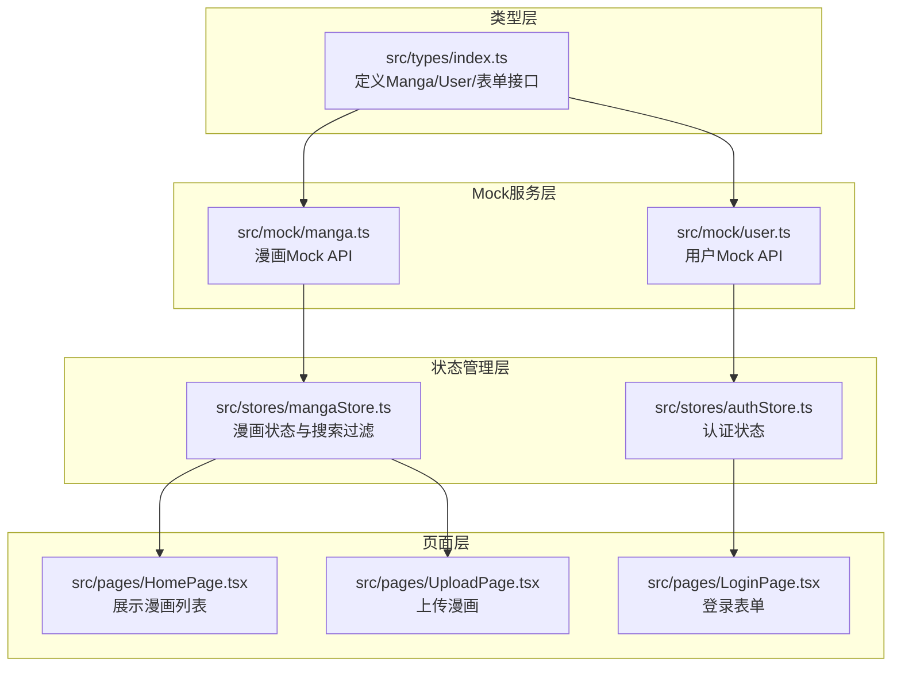
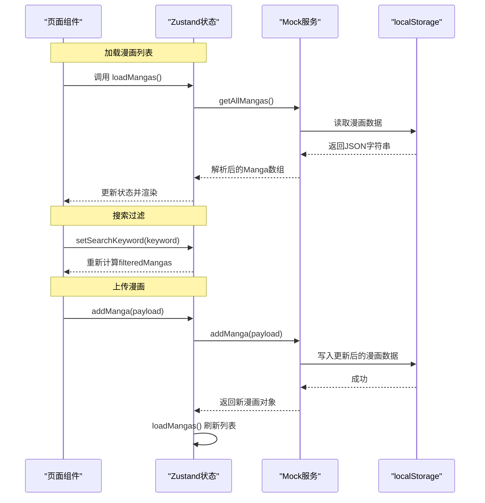
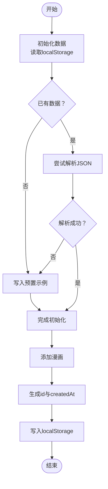
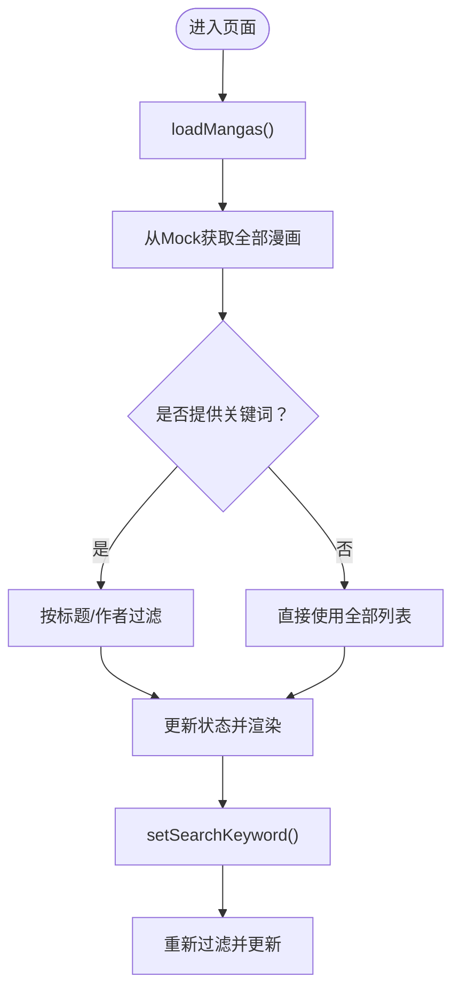
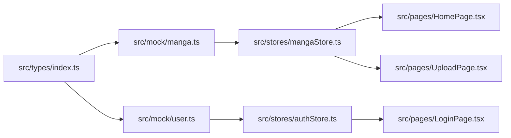

# 数据模型

<cite>
**本文引用的文件列表**
- [src/types/index.ts](file://manga-website/src/types/index.ts)
- [src/mock/manga.ts](file://manga-website/src/mock/manga.ts)
- [src/mock/user.ts](file://manga-website/src/mock/user.ts)
- [src/stores/mangaStore.ts](file://manga-website/src/stores/mangaStore.ts)
- [src/stores/authStore.ts](file://manga-website/src/stores/authStore.ts)
- [src/pages/HomePage.tsx](file://manga-website/src/pages/HomePage.tsx)
- [src/pages/LoginPage.tsx](file://manga-website/src/pages/LoginPage.tsx)
- [src/pages/UploadPage.tsx](file://manga-website/src/pages/UploadPage.tsx)
- [package.json](file://manga-website/package.json)
</cite>

## 目录
1. [引言](#引言)
2. [项目结构](#项目结构)
3. [核心数据模型](#核心数据模型)
4. [架构总览](#架构总览)
5. [详细组件分析](#详细组件分析)
6. [依赖关系分析](#依赖关系分析)
7. [性能考量](#性能考量)
8. [故障排查指南](#故障排查指南)
9. [结论](#结论)
10. [附录：扩展与最佳实践](#附录扩展与最佳实践)

## 引言
本文件系统性梳理漫画网站的数据模型与Mock服务实现，覆盖以下主题：
- TypeScript接口设计与字段语义、类型约束与验证规则
- Mock数据服务的localStorage持久化策略与API模拟机制
- 数据模型之间的关系（用户与漫画的关联、搜索过滤逻辑、数据更新策略）
- 扩展指南（新增字段、约束变更、向后兼容）
- 使用示例与最佳实践

## 项目结构
该项目采用前端单页应用结构，围绕“类型定义 → Mock服务 → Zustand状态管理 → 页面组件”的分层组织方式：
- 类型定义集中于 src/types/index.ts，统一声明Manga、User及各类表单接口
- Mock服务位于 src/mock，封装localStorage读写与业务方法（增删改查、用户认证等）
- 状态管理使用 zustand，分别在 src/stores 下维护漫画与认证状态
- 页面组件位于 src/pages，消费状态并触发Mock服务进行数据操作

图表来源
- [src/types/index.ts:1-44](file://manga-website/src/types/index.ts#L1-L44)
- [src/mock/manga.ts:1-173](file://manga-website/src/mock/manga.ts#L1-L173)
- [src/mock/user.ts:1-90](file://manga-website/src/mock/user.ts#L1-L90)
- [src/stores/mangaStore.ts:1-62](file://manga-website/src/stores/mangaStore.ts#L1-L62)
- [src/stores/authStore.ts:1-45](file://manga-website/src/stores/authStore.ts#L1-L45)
- [src/pages/HomePage.tsx:1-108](file://manga-website/src/pages/HomePage.tsx#L1-L108)
- [src/pages/LoginPage.tsx:1-86](file://manga-website/src/pages/LoginPage.tsx#L1-L86)
- [src/pages/UploadPage.tsx:1-187](file://manga-website/src/pages/UploadPage.tsx#L1-L187)

章节来源
- [package.json:1-26](file://manga-website/package.json#L1-L26)

## 核心数据模型
本节对Manga、User以及各表单接口进行逐项说明，包括字段含义、可选性、类型约束与验证规则。

- Manga 接口
  - 字段与语义
    - id: 字符串，唯一标识
    - title: 字符串，漫画标题
    - author: 字符串，作者名
    - description: 字符串，简介
    - coverUrl: 字符串，封面URL或Base64
    - originalUrl: 字符串，原网站链接（URL格式）
    - createdAt: 字符串，ISO时间戳
    - uploadedBy?: 字符串，可选，标记上传者用户名
  - 类型约束与验证规则
    - 必填字段：id、title、author、description、coverUrl、originalUrl、createdAt
    - 可选字段：uploadedBy
    - 原网站链接需满足URL格式；封面支持Base64或远程URL
  - 复杂度与存储
    - Mock层在添加时自动生成id与createdAt，便于本地快速演示

- User 接口
  - 字段与语义
    - id: 字符串，唯一标识
    - username: 字符串，用户名
    - email: 字符串，邮箱
    - password: 字符串，密码（明文存储用于演示）
    - createdAt: 字符串，ISO时间戳
  - 类型约束与验证规则
    - 必填字段：id、username、email、password、createdAt
    - 用户名与邮箱唯一性由Mock层保证
  - 安全提示
    - 当前实现为演示用途，不建议在生产环境使用明文密码

- 表单接口
  - LoginForm
    - username: 字符串
    - password: 字符串
  - RegisterForm
    - username: 字符串
    - email: 字符串
    - password: 字符串
    - confirmPassword: 字符串（前端校验）
  - UploadForm
    - title: 字符串
    - author: 字符串
    - description: 字符串
    - coverUrl: 字符串（Base64或URL）
    - originalUrl: 字符串（URL）

章节来源
- [src/types/index.ts:1-44](file://manga-website/src/types/index.ts#L1-L44)

## 架构总览
从类型到Mock再到状态与页面的调用链如下所示：

图表来源
- [src/stores/mangaStore.ts:16-61](file://manga-website/src/stores/mangaStore.ts#L16-L61)
- [src/mock/manga.ts:138-158](file://manga-website/src/mock/manga.ts#L138-L158)
- [src/pages/HomePage.tsx:8-13](file://manga-website/src/pages/HomePage.tsx#L8-L13)
- [src/pages/UploadPage.tsx:46-74](file://manga-website/src/pages/UploadPage.tsx#L46-L74)

## 详细组件分析

### 数据模型与Mock服务
- Mock服务职责
  - 初始化与持久化：通过localStorage键值保存与读取数据
  - 增删改查：提供getAllMangas、getMangaById、addManga、deleteManga、getUserMangas等方法
  - 用户认证：注册、登录、设置当前用户、获取当前用户、登出
- 关键流程
  - 初始化：若localStorage中无数据则写入预置示例；解析失败则回退到预置数据
  - 添加：生成唯一id与创建时间，插入数组首部并持久化
  - 删除：过滤掉目标id并持久化
  - 用户相关：注册时校验用户名与邮箱唯一性；登录时匹配凭据并设置当前用户

图表来源
- [src/mock/manga.ts:119-135](file://manga-website/src/mock/manga.ts#L119-L135)
- [src/mock/manga.ts:148-158](file://manga-website/src/mock/manga.ts#L148-L158)

章节来源
- [src/mock/manga.ts:1-173](file://manga-website/src/mock/manga.ts#L1-L173)
- [src/mock/user.ts:1-90](file://manga-website/src/mock/user.ts#L1-L90)

### 状态管理与搜索过滤
- 漫画状态
  - 状态字段：mangas、searchKeyword、filteredMangas
  - 方法：loadMangas、setSearchKeyword、addManga、deleteManga、refreshMangas
  - 过滤逻辑：当存在关键词时，按标题或作者进行不区分大小写的包含匹配
- 认证状态
  - 状态字段：user、isLoggedIn
  - 方法：login、register、logout、checkAuth
  - 当前用户来自localStorage，登录/注册成功后同步更新

图表来源
- [src/stores/mangaStore.ts:21-44](file://manga-website/src/stores/mangaStore.ts#L21-L44)

章节来源
- [src/stores/mangaStore.ts:1-62](file://manga-website/src/stores/mangaStore.ts#L1-L62)
- [src/stores/authStore.ts:1-45](file://manga-website/src/stores/authStore.ts#L1-L45)

### 页面组件中的数据模型使用
- 首页（HomePage）
  - 在挂载时加载漫画列表
  - 若存在搜索关键词且无结果，显示空状态
  - 渲染卡片列表，展示封面、标题、作者、简介与跳转链接
  - 对用户上传的漫画显示特殊标签
- 登录页（LoginPage）
  - 使用LoginForm表单，提交时调用认证store的login方法
  - 成功后跳转首页
- 上传页（UploadPage）
  - 使用UploadForm表单，结合Ant Design上传组件限制图片类型与大小
  - 提交时调用漫画store的addManga，并附带当前用户信息
  - 成功后提示并返回首页

章节来源
- [src/pages/HomePage.tsx:1-108](file://manga-website/src/pages/HomePage.tsx#L1-L108)
- [src/pages/LoginPage.tsx:1-86](file://manga-website/src/pages/LoginPage.tsx#L1-L86)
- [src/pages/UploadPage.tsx:1-187](file://manga-website/src/pages/UploadPage.tsx#L1-L187)

## 依赖关系分析
- 类型依赖
  - Mock服务与页面组件均依赖 src/types 中的接口定义
- 状态依赖
  - 漫画store依赖mock/manga.ts
  - 认证store依赖mock/user.ts
- 组件依赖
  - 页面组件通过hooks消费store状态
- 外部依赖
  - 使用 antd 作为UI库，zustand 作为轻量状态管理

图表来源
- [src/types/index.ts:1-44](file://manga-website/src/types/index.ts#L1-L44)
- [src/mock/manga.ts:1-173](file://manga-website/src/mock/manga.ts#L1-L173)
- [src/mock/user.ts:1-90](file://manga-website/src/mock/user.ts#L1-L90)
- [src/stores/mangaStore.ts:1-62](file://manga-website/src/stores/mangaStore.ts#L1-L62)
- [src/stores/authStore.ts:1-45](file://manga-website/src/stores/authStore.ts#L1-L45)
- [src/pages/HomePage.tsx:1-108](file://manga-website/src/pages/HomePage.tsx#L1-L108)
- [src/pages/LoginPage.tsx:1-86](file://manga-website/src/pages/LoginPage.tsx#L1-L86)
- [src/pages/UploadPage.tsx:1-187](file://manga-website/src/pages/UploadPage.tsx#L1-L187)

章节来源
- [package.json:11-24](file://manga-website/package.json#L11-L24)

## 性能考量
- Mock层读写localStorage
  - 优点：无需网络请求，开发阶段响应快
  - 注意：localStorage为同步I/O，大数据量时可能阻塞主线程
- 过滤策略
  - 当前为内存过滤，适合中小规模数据；大规模数据建议服务端分页或索引优化
- 状态更新
  - Zustand按需更新，避免不必要的重渲染
- 建议
  - 开发阶段可接受；生产迁移时建议替换为真实API与数据库

## 故障排查指南
- 常见问题与定位
  - 数据未持久化：检查localStorage键名是否一致（漫画与用户各自独立键）
  - 初始化失败：Mock层在解析异常时会回退到预置数据，确认键值内容是否为合法JSON
  - 重复注册：用户名或邮箱重复会导致注册失败，需提示用户更换
  - 登录失败：用户名不存在或密码错误，需明确提示
  - 上传失败：封面为空、类型不符或大小超限，需在前端拦截并提示
- 诊断步骤
  - 打开浏览器开发者工具，查看Network与Application面板
  - 检查localStorage中对应键值是否存在与格式是否正确
  - 在控制台打印store状态，确认过滤与更新流程

章节来源
- [src/mock/manga.ts:119-135](file://manga-website/src/mock/manga.ts#L119-L135)
- [src/mock/user.ts:26-64](file://manga-website/src/mock/user.ts#L26-L64)
- [src/pages/UploadPage.tsx:22-44](file://manga-website/src/pages/UploadPage.tsx#L22-L44)

## 结论
本项目通过清晰的类型定义、Mock服务与Zustand状态管理，构建了一个可运行的漫画网站原型。数据模型简洁明确，Mock层提供了完整的CRUD与认证能力，页面组件通过store解耦地消费数据。建议在后续迭代中引入服务端API、数据库与更严格的验证与安全策略。

## 附录：扩展与最佳实践

### 数据模型扩展指南
- 新增字段
  - 在类型定义中添加字段，并标注可选性
  - 在Mock层的addManga中补充默认值或必填校验
  - 在页面表单中增加输入项与校验规则
  - 在store中更新过滤与渲染逻辑
- 修改约束
  - 如需强类型校验（如邮箱、URL），可在类型层面使用更严格的约束或辅助类型
  - 在Mock层增加前置校验与错误提示
- 向后兼容
  - 保持现有字段不变，新增字段设为可选
  - 在Mock层解析时对缺失字段提供默认值
  - 避免破坏localStorage中既有数据结构

### 最佳实践
- 类型优先：先在types中定义接口，再实现Mock与store
- 明确职责：Mock只负责数据持久化与简单校验，复杂逻辑上移至store或页面
- 错误处理：在store与页面中统一处理错误消息，提升用户体验
- 安全意识：演示环境可使用明文密码，生产环境必须加密存储与传输
- 可测试性：Mock层方法可被单元测试覆盖，便于验证数据一致性