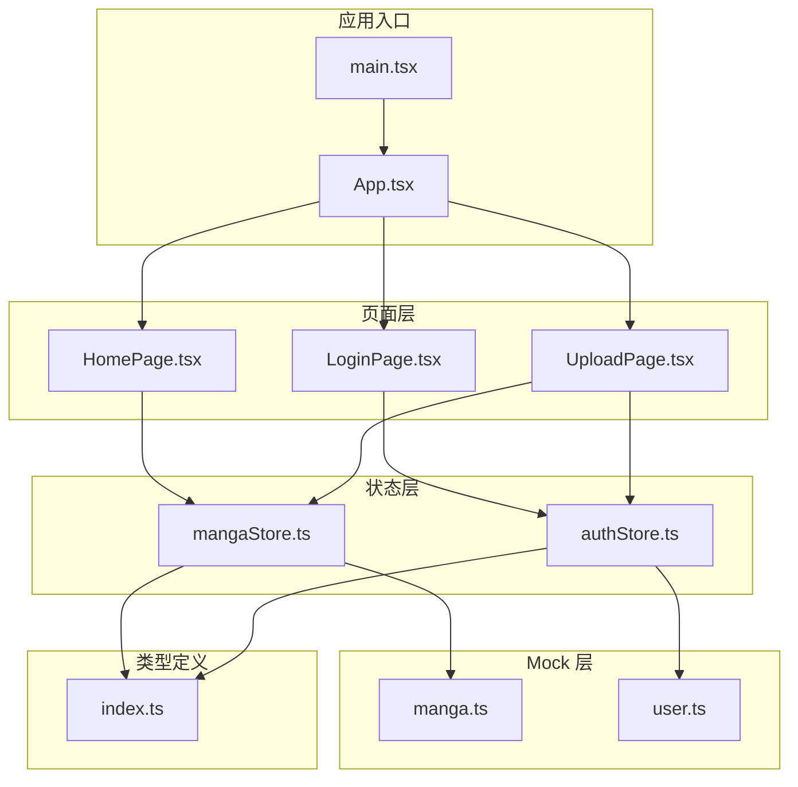
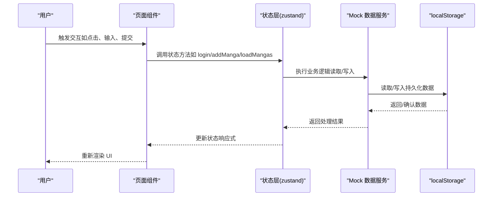
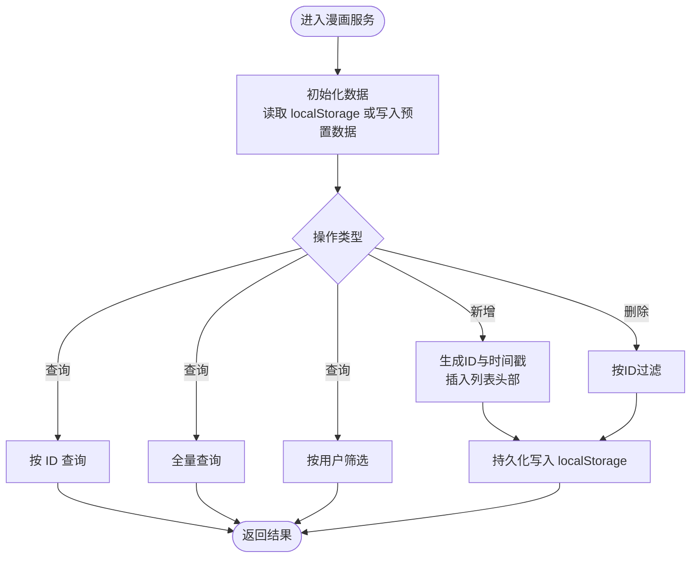
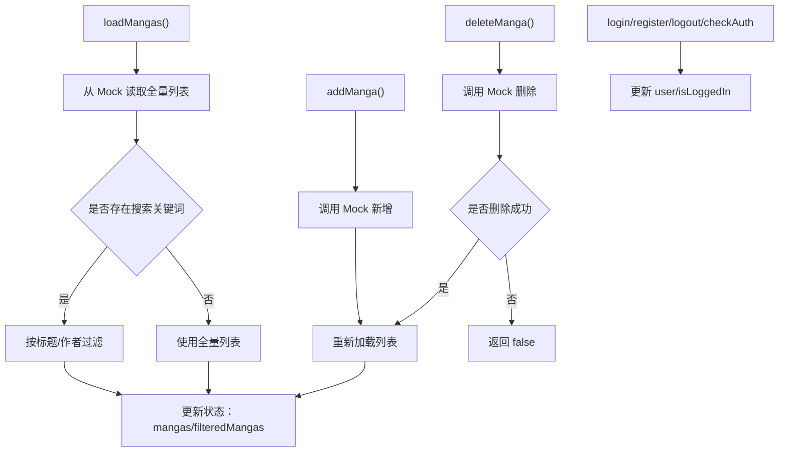
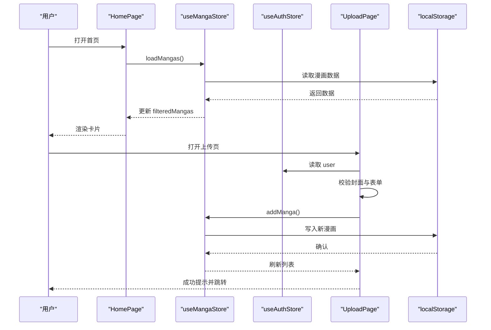
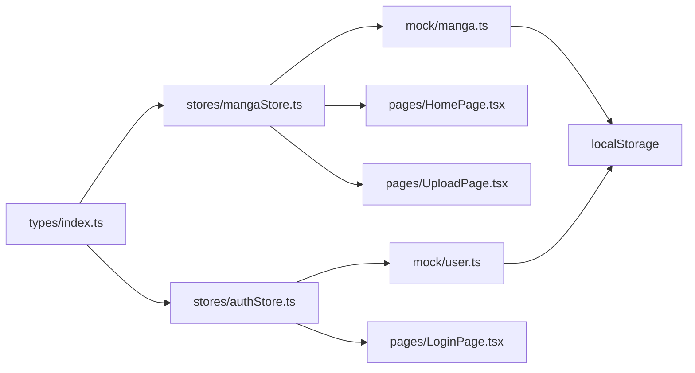
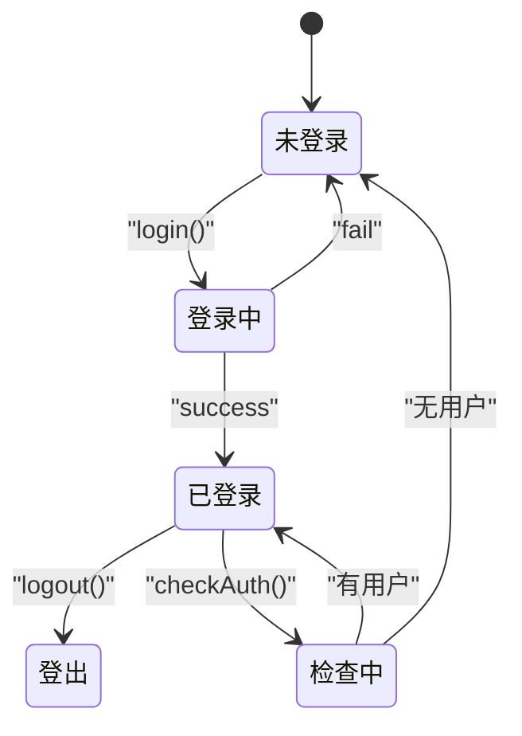

# 数据流架构

<cite>
**本文引用的文件**
- [manga.ts](file://src/mock/manga.ts)
- [user.ts](file://src/mock/user.ts)
- [mangaStore.ts](file://src/stores/mangaStore.ts)
- [authStore.ts](file://src/stores/authStore.ts)
- [index.ts](file://src/types/index.ts)
- [HomePage.tsx](file://src/pages/HomePage.tsx)
- [LoginPage.tsx](file://src/pages/LoginPage.tsx)
- [UploadPage.tsx](file://src/pages/UploadPage.tsx)
- [App.tsx](file://src/App.tsx)
- [main.tsx](file://src/main.tsx)
</cite>

## 目录
1. [引言](#引言)
2. [项目结构](#项目结构)
3. [核心组件](#核心组件)
4. [架构总览](#架构总览)
5. [详细组件分析](#详细组件分析)
6. [依赖关系分析](#依赖关系分析)
7. [性能考虑](#性能考虑)
8. [故障排查指南](#故障排查指南)
9. [结论](#结论)
10. [附录](#附录)

## 引言
本文件面向开发者，系统性梳理漫画网站项目的数据流架构，覆盖从“用户操作”到“UI 重新渲染”的完整路径：用户操作 → 组件事件 → 状态更新 → Mock 数据持久化 → UI 重新渲染。重点解析 Mock 数据服务（基于 localStorage）的实现与持久化策略，阐述数据获取、处理与展示流程（含异步加载、错误处理与状态管理），并给出数据验证、缓存与性能优化建议。文末提供数据流图与状态转换图，帮助快速理解数据在各层之间的传递与处理。

## 项目结构
项目采用前端单页应用结构，按功能分层组织：
- 类型定义：统一声明漫画与用户数据模型及表单类型
- Mock 层：提供本地存储的增删改查接口，作为“数据源”
- 状态层：使用 zustand 管理全局状态（漫画列表、搜索关键词；用户登录态）
- 页面层：组件通过状态钩子读取/写入状态，触发数据变更
- 应用入口：配置路由与主题，并挂载根组件

图表来源
- [main.tsx:1-14](file://src/main.tsx#L1-L14)
- [App.tsx:1-66](file://src/App.tsx#L1-L66)
- [HomePage.tsx:1-108](file://src/pages/HomePage.tsx#L1-L108)
- [LoginPage.tsx:1-86](file://src/pages/LoginPage.tsx#L1-L86)
- [UploadPage.tsx:1-187](file://src/pages/UploadPage.tsx#L1-L187)
- [mangaStore.ts:1-62](file://src/stores/mangaStore.ts#L1-L62)
- [authStore.ts:1-45](file://src/stores/authStore.ts#L1-L45)
- [manga.ts:1-173](file://src/mock/manga.ts#L1-L173)
- [user.ts:1-90](file://src/mock/user.ts#L1-L90)
- [index.ts:1-44](file://src/types/index.ts#L1-L44)

章节来源
- [main.tsx:1-14](file://src/main.tsx#L1-L14)
- [App.tsx:1-66](file://src/App.tsx#L1-L66)

## 核心组件
- 类型系统：统一定义漫画与用户字段、表单字段，确保跨层一致性
- Mock 数据服务：
  - 漫画：提供初始化、查询、新增、删除、按用户筛选等方法，基于 localStorage 存储
  - 用户：提供注册、登录、登出、当前用户读取与设置等方法，基于 localStorage 存储
- 状态管理：
  - 漫画状态：维护列表、搜索关键词与过滤后的列表，封装加载、搜索、新增、删除、刷新
  - 认证状态：维护用户信息与登录态，封装登录、注册、登出、检查登录态
- 页面组件：负责 UI 呈现与交互，调用状态层方法完成数据流转

章节来源
- [index.ts:1-44](file://src/types/index.ts#L1-L44)
- [manga.ts:1-173](file://src/mock/manga.ts#L1-L173)
- [user.ts:1-90](file://src/mock/user.ts#L1-L90)
- [mangaStore.ts:1-62](file://src/stores/mangaStore.ts#L1-L62)
- [authStore.ts:1-45](file://src/stores/authStore.ts#L1-L45)

## 架构总览
下面以“用户操作 → 组件事件 → 状态更新 → 数据持久化 → UI 重新渲染”为主线，绘制端到端数据流图。

图表来源
- [mangaStore.ts:16-61](file://src/stores/mangaStore.ts#L16-L61)
- [authStore.ts:14-44](file://src/stores/authStore.ts#L14-L44)
- [manga.ts:119-135](file://src/mock/manga.ts#L119-L135)
- [user.ts:7-23](file://src/mock/user.ts#L7-L23)
- [HomePage.tsx:9-13](file://src/pages/HomePage.tsx#L9-L13)
- [UploadPage.tsx:15-74](file://src/pages/UploadPage.tsx#L15-L74)
- [LoginPage.tsx:14-22](file://src/pages/LoginPage.tsx#L14-L22)

## 详细组件分析

### Mock 数据服务：漫画与用户
- 漫画服务
  - 初始化策略：首次访问时写入预置数据，后续从 localStorage 读取；异常时回退到预置数据
  - 查询：支持按 ID 查询、按上传者筛选、全量查询
  - 写入：新增漫画时生成唯一 ID 与时间戳，插入列表头部并持久化
  - 删除：根据 ID 过滤列表，若长度变化则持久化
- 用户服务
  - 注册：校验用户名与邮箱唯一性，创建新用户并持久化
  - 登录：查找用户并比对密码，成功后设置当前用户
  - 当前用户：读取/移除当前登录用户信息
  - 登出：清除当前用户

图表来源
- [manga.ts:119-172](file://src/mock/manga.ts#L119-L172)

章节来源
- [manga.ts:1-173](file://src/mock/manga.ts#L1-L173)
- [user.ts:1-90](file://src/mock/user.ts#L1-L90)

### 状态层：漫画与认证
- 漫画状态
  - 列表与过滤：加载时从 Mock 读取并按关键词过滤；搜索时即时过滤
  - 新增/删除：调用 Mock 并触发重新加载
  - 刷新：强制重新加载
- 认证状态
  - 登录/注册：调用 Mock 并更新登录态
  - 登出：清除当前用户并更新登录态
  - 检查登录态：启动时读取当前用户

图表来源
- [mangaStore.ts:21-61](file://src/stores/mangaStore.ts#L21-L61)
- [authStore.ts:18-43](file://src/stores/authStore.ts#L18-L43)

章节来源
- [mangaStore.ts:1-62](file://src/stores/mangaStore.ts#L1-L62)
- [authStore.ts:1-45](file://src/stores/authStore.ts#L1-L45)

### 页面层：交互到渲染
- 首页
  - 首次挂载触发加载；根据过滤后的列表渲染卡片；关键词存在且为空时显示空状态
- 登录页
  - 表单提交触发登录；成功跳转首页，失败提示错误
- 上传页
  - 图片校验与 Base64 转换；提交时调用新增漫画；成功后提示并跳转首页

图表来源
- [HomePage.tsx:9-13](file://src/pages/HomePage.tsx#L9-L13)
- [UploadPage.tsx:15-74](file://src/pages/UploadPage.tsx#L15-L74)
- [mangaStore.ts:46-50](file://src/stores/mangaStore.ts#L46-L50)
- [authStore.ts:15-16](file://src/stores/authStore.ts#L15-L16)

章节来源
- [HomePage.tsx:1-108](file://src/pages/HomePage.tsx#L1-L108)
- [LoginPage.tsx:1-86](file://src/pages/LoginPage.tsx#L1-L86)
- [UploadPage.tsx:1-187](file://src/pages/UploadPage.tsx#L1-L187)

### 数据验证与错误处理
- 表单验证
  - 登录页：用户名/密码必填
  - 上传页：标题/作者/简介必填；原链接需为有效 URL；封面仅允许图片且小于 2MB
- 错误处理
  - 登录/注册：根据返回消息提示成功或失败
  - 上传：捕获异常并提示失败；加载状态避免重复提交
- 状态管理
  - 登录态变更同步至 localStorage，重启后可恢复

章节来源
- [LoginPage.tsx:52-64](file://src/pages/LoginPage.tsx#L52-L64)
- [UploadPage.tsx:22-44](file://src/pages/UploadPage.tsx#L22-L44)
- [UploadPage.tsx:69-73](file://src/pages/UploadPage.tsx#L69-L73)
- [authStore.ts:18-32](file://src/stores/authStore.ts#L18-L32)

### 缓存策略与性能优化
- 浏览器缓存
  - 使用 localStorage 作为持久化介质，减少网络依赖，提升首屏加载速度
- 本地过滤
  - 搜索关键词在内存中过滤，避免频繁请求
- 事件节流
  - 上传页对图片转换与提交进行状态控制，避免重复提交
- UI 性能
  - 首页卡片使用懒加载与缩略图，减少初始渲染压力

章节来源
- [manga.ts:119-135](file://src/mock/manga.ts#L119-L135)
- [mangaStore.ts:34-44](file://src/stores/mangaStore.ts#L34-L44)
- [UploadPage.tsx:18-20](file://src/pages/UploadPage.tsx#L18-L20)

## 依赖关系分析
- 组件依赖状态层：页面通过 hooks 访问状态，解耦 UI 与数据
- 状态层依赖 Mock：状态方法内部调用 Mock 接口，保证数据一致性
- Mock 依赖 localStorage：作为唯一持久化存储，简化部署与调试
- 类型定义贯穿全栈：确保数据结构一致，降低耦合

图表来源
- [index.ts:1-44](file://src/types/index.ts#L1-L44)
- [mangaStore.ts:1-62](file://src/stores/mangaStore.ts#L1-L62)
- [authStore.ts:1-45](file://src/stores/authStore.ts#L1-L45)
- [manga.ts:1-173](file://src/mock/manga.ts#L1-L173)
- [user.ts:1-90](file://src/mock/user.ts#L1-L90)
- [HomePage.tsx:1-108](file://src/pages/HomePage.tsx#L1-L108)
- [LoginPage.tsx:1-86](file://src/pages/LoginPage.tsx#L1-L86)
- [UploadPage.tsx:1-187](file://src/pages/UploadPage.tsx#L1-L187)

章节来源
- [index.ts:1-44](file://src/types/index.ts#L1-L44)
- [mangaStore.ts:1-62](file://src/stores/mangaStore.ts#L1-L62)
- [authStore.ts:1-45](file://src/stores/authStore.ts#L1-L45)

## 性能考虑
- 读写分离：初始化只在首次读取时写入预置数据，后续读取直接从 localStorage 获取
- 内存过滤：搜索在已加载列表上进行，避免重复 IO
- 事件驱动：状态变更触发组件重渲染，减少不必要的计算
- 图片处理：上传页对图片进行本地 Base64 转换，避免额外网络请求

## 故障排查指南
- 无法加载漫画
  - 检查 localStorage 中是否存在漫画数据键值
  - 若损坏，Mock 初始化会回退到预置数据
- 登录失败
  - 核对用户名/密码是否匹配
  - 检查当前用户键值是否正确写入
- 上传失败
  - 确认封面格式与大小限制
  - 捕获异常并查看提示信息
- 刷新后丢失登录态
  - 检查当前用户键值是否被清理或序列化异常

章节来源
- [manga.ts:119-135](file://src/mock/manga.ts#L119-L135)
- [user.ts:67-89](file://src/mock/user.ts#L67-L89)
- [UploadPage.tsx:69-73](file://src/pages/UploadPage.tsx#L69-L73)

## 结论
该漫画网站采用“页面层 → 状态层 → Mock 层 → localStorage”的清晰数据流设计，结合内存过滤与本地持久化，实现了低门槛、高性能的数据展示与交互体验。通过统一类型定义与状态管理，系统具备良好的可维护性与扩展性。后续可在 Mock 层引入真实 API 适配器，平滑过渡到线上环境。

## 附录
- 关键流程回顾
  - 用户在上传页提交表单 → 组件调用状态层新增方法 → 状态层调用 Mock 写入 → Mock 持久化到 localStorage → 状态层刷新列表 → 页面重新渲染
- 状态转换图（认证）

图表来源
- [authStore.ts:18-43](file://src/stores/authStore.ts#L18-L43)
- [user.ts:67-89](file://src/mock/user.ts#L67-L89)