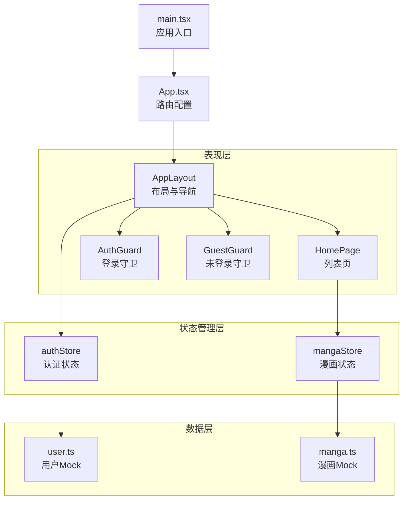
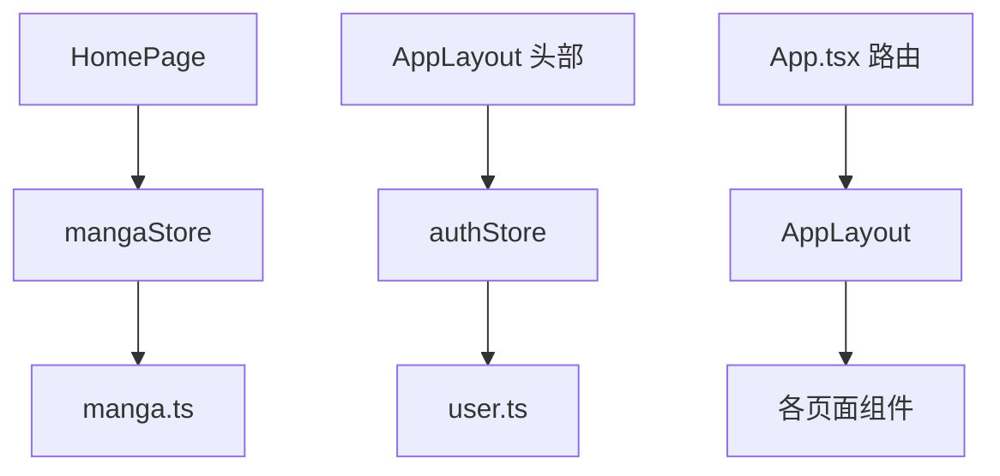
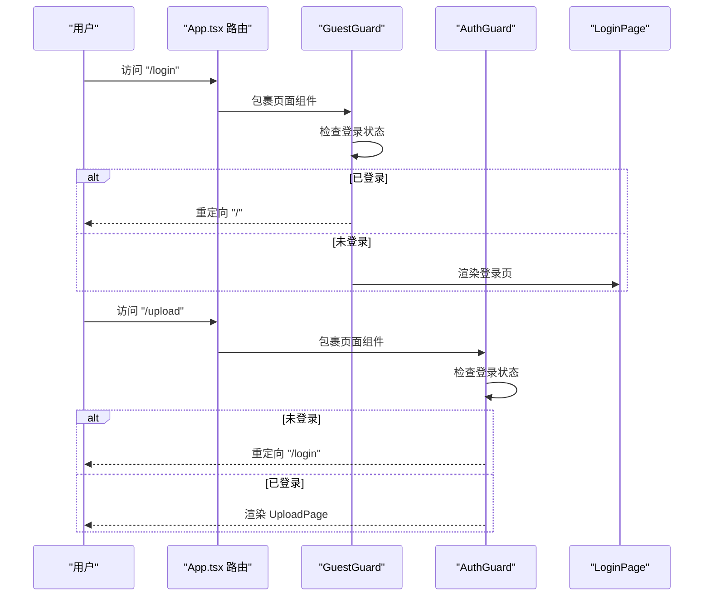
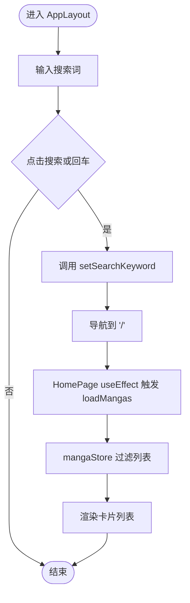
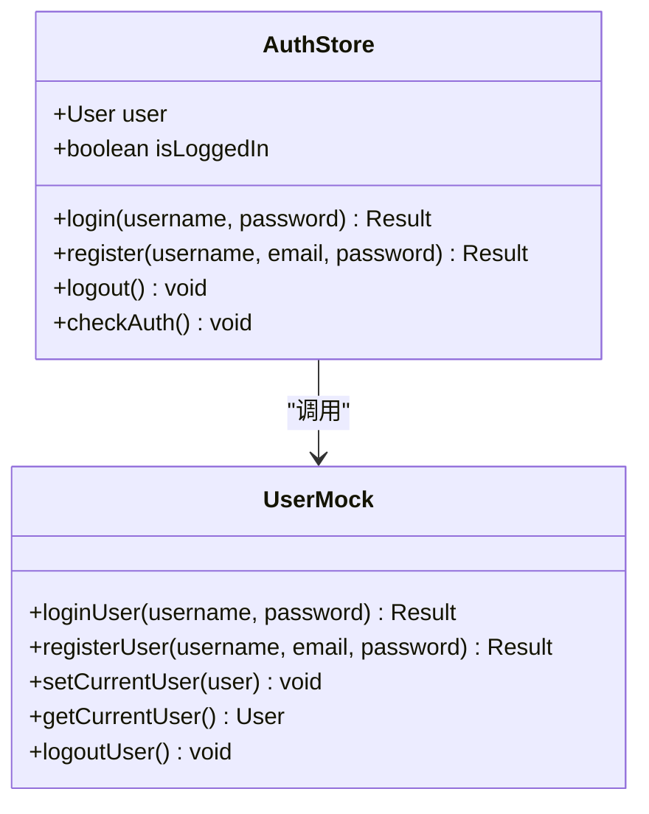
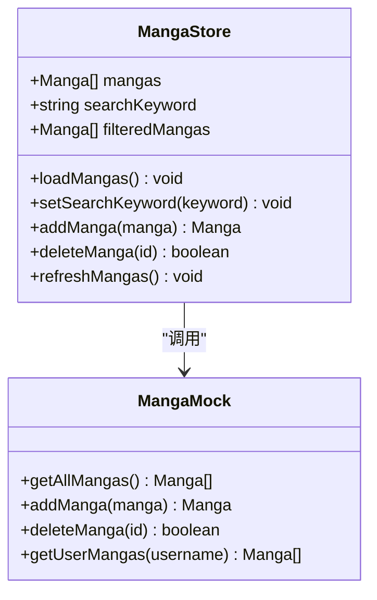
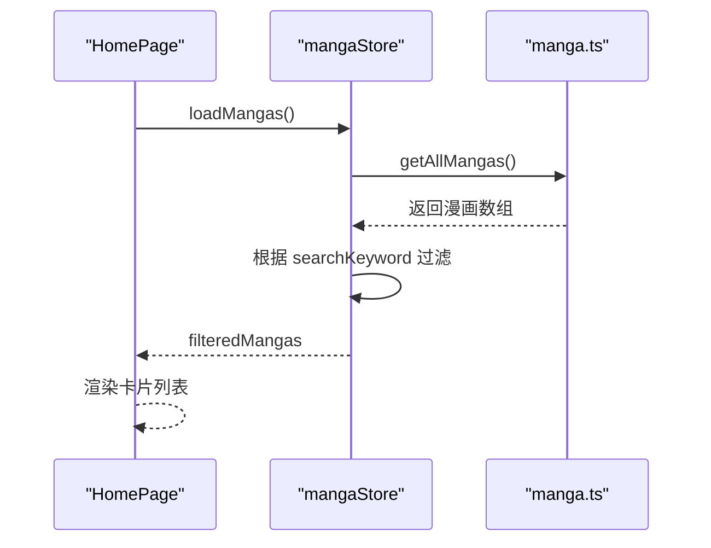
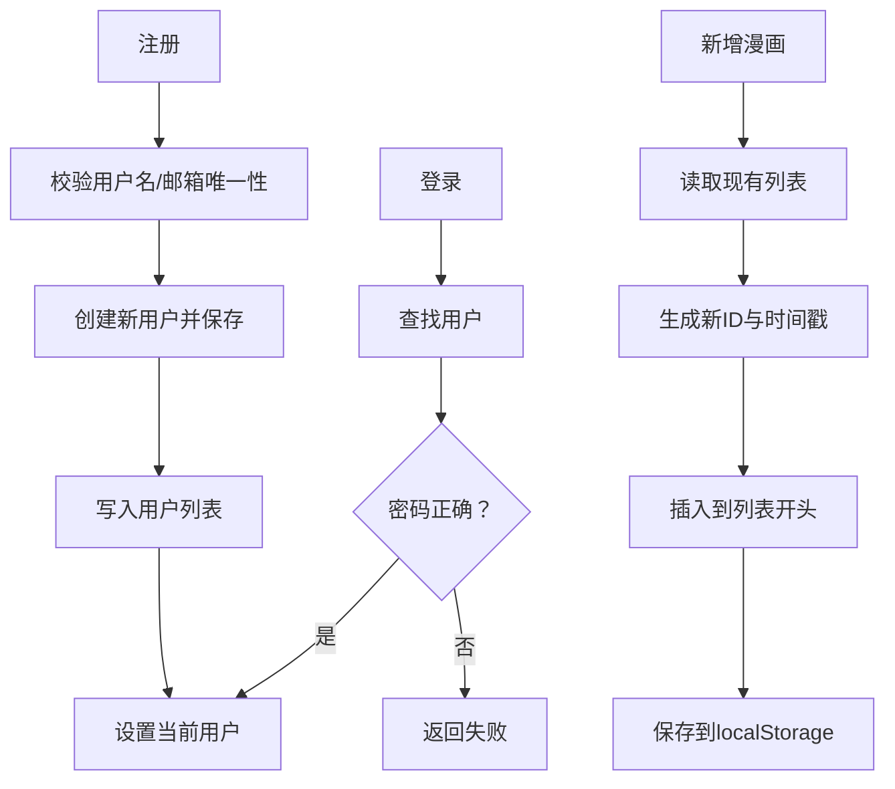
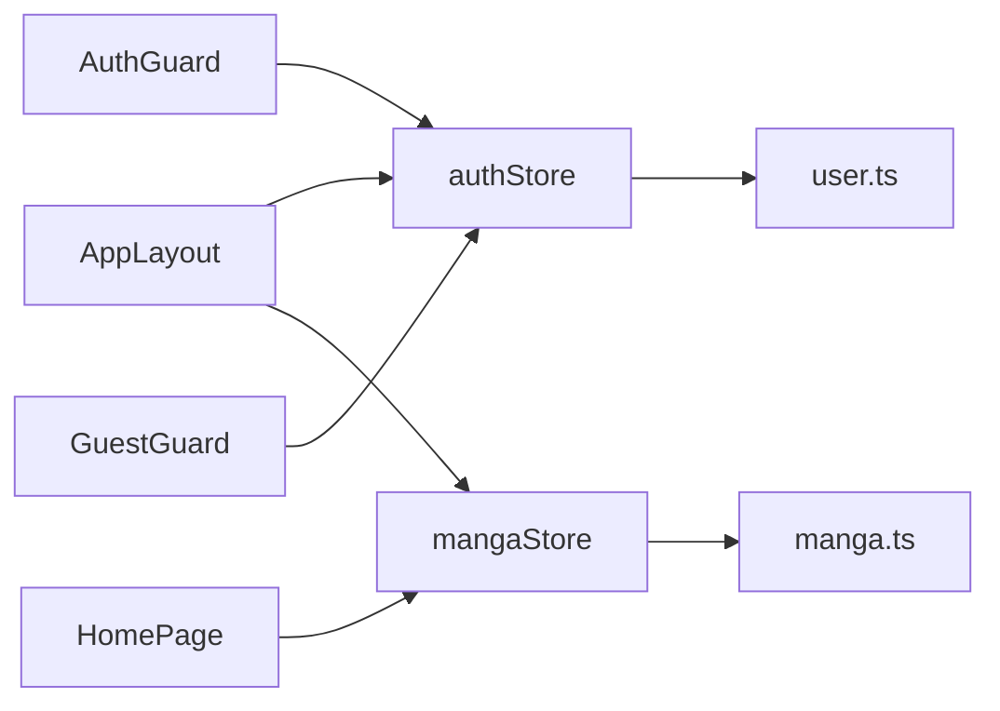

# 架构设计

<cite>
**本文引用的文件**
- [src/main.tsx](file://src/main.tsx)
- [src/App.tsx](file://src/App.tsx)
- [src/components/AppLayout.tsx](file://src/components/AppLayout.tsx)
- [src/components/AuthGuard.tsx](file://src/components/AuthGuard.tsx)
- [src/components/GuestGuard.tsx](file://src/components/GuestGuard.tsx)
- [src/stores/authStore.ts](file://src/stores/authStore.ts)
- [src/stores/mangaStore.ts](file://src/stores/mangaStore.ts)
- [src/pages/HomePage.tsx](file://src/pages/HomePage.tsx)
- [src/mock/manga.ts](file://src/mock/manga.ts)
- [src/mock/user.ts](file://src/mock/user.ts)
- [src/types/index.ts](file://src/types/index.ts)
</cite>

## 目录
1. [引言](#引言)
2. [项目结构](#项目结构)
3. [核心组件](#核心组件)
4. [架构总览](#架构总览)
5. [详细组件分析](#详细组件分析)
6. [依赖分析](#依赖分析)
7. [性能考虑](#性能考虑)
8. [故障排查指南](#故障排查指南)
9. [结论](#结论)
10. [附录](#附录)

## 引言
本项目为一个基于 React 的漫画网站前端应用，采用函数组件与 Hooks 的现代开发范式，结合 Zustand 状态管理库实现轻量级的状态集中化，配合 Mock 数据层模拟真实业务数据与用户态。应用通过 React Router 实现页面级路由与权限守卫，Ant Design 提供统一的 UI 组件与主题风格。

该架构遵循“表现层（UI 组件）—业务逻辑层（状态管理）—数据层（Mock 服务）”的清晰分层，组件间通过状态共享与事件回调进行通信，数据流自上而下、状态更新自下而上，形成稳定可维护的前端体系。

## 项目结构
项目采用按功能域组织的目录结构，主要模块如下：
- 表现层（UI 组件与页面）
  - 布局组件：AppLayout
  - 页面组件：HomePage、LoginPage、RegisterPage、UploadPage、ProfilePage
  - 权限守卫：AuthGuard、GuestGuard
- 状态管理层（Zustand Store）
  - 认证状态：authStore
  - 漫画状态：mangaStore
- 数据层（Mock 服务）
  - 用户 Mock：user.ts
  - 漫画 Mock：manga.ts
- 类型定义
  - types/index.ts
- 应用入口与路由配置
  - main.tsx、App.tsx

**图表来源**
- [src/main.tsx:1-14](file://src/main.tsx#L1-L14)
- [src/App.tsx:1-66](file://src/App.tsx#L1-L66)
- [src/components/AppLayout.tsx:1-156](file://src/components/AppLayout.tsx#L1-L156)
- [src/components/AuthGuard.tsx:1-17](file://src/components/AuthGuard.tsx#L1-L17)
- [src/components/GuestGuard.tsx:1-17](file://src/components/GuestGuard.tsx#L1-L17)
- [src/stores/authStore.ts:1-45](file://src/stores/authStore.ts#L1-L45)
- [src/stores/mangaStore.ts:1-62](file://src/stores/mangaStore.ts#L1-L62)
- [src/mock/user.ts:1-90](file://src/mock/user.ts#L1-L90)
- [src/mock/manga.ts:1-173](file://src/mock/manga.ts#L1-L173)

**章节来源**
- [src/main.tsx:1-14](file://src/main.tsx#L1-L14)
- [src/App.tsx:1-66](file://src/App.tsx#L1-L66)

## 核心组件
- 应用入口与路由
  - 应用根节点在 main.tsx 中挂载 BrowserRouter 并渲染 App。
  - App.tsx 定义全局路由与布局嵌套，设置 Ant Design 主题与语言包。
- 布局与导航
  - AppLayout 负责头部导航、搜索、用户菜单与内容区 Outlet 渲染，贯穿所有页面。
- 权限守卫
  - AuthGuard 用于需要登录才能访问的页面；GuestGuard 用于禁止已登录用户访问的页面。
- 状态管理
  - authStore：封装用户登录、注册、登出与当前用户检查。
  - mangaStore：封装漫画列表加载、搜索过滤、新增与删除。
- Mock 数据
  - user.ts：用户注册、登录、当前用户持久化。
  - manga.ts：漫画数据初始化、增删改查与用户上传过滤。

**章节来源**
- [src/main.tsx:1-14](file://src/main.tsx#L1-L14)
- [src/App.tsx:1-66](file://src/App.tsx#L1-L66)
- [src/components/AppLayout.tsx:1-156](file://src/components/AppLayout.tsx#L1-L156)
- [src/components/AuthGuard.tsx:1-17](file://src/components/AuthGuard.tsx#L1-L17)
- [src/components/GuestGuard.tsx:1-17](file://src/components/GuestGuard.tsx#L1-L17)
- [src/stores/authStore.ts:1-45](file://src/stores/authStore.ts#L1-L45)
- [src/stores/mangaStore.ts:1-62](file://src/stores/mangaStore.ts#L1-L62)
- [src/mock/user.ts:1-90](file://src/mock/user.ts#L1-L90)
- [src/mock/manga.ts:1-173](file://src/mock/manga.ts#L1-L173)

## 架构总览
整体采用三层架构：
- 表示层（UI 组件）
  - 使用函数组件与 Hooks（useState、useEffect、useNavigate、useAuthStore、useMangaStore）实现交互与状态绑定。
- 业务逻辑层（状态管理）
  - 使用 Zustand 将状态与动作集中在一个 store 中，避免深层 props 传递与样板代码。
- 数据层（Mock 服务）
  - 通过 localStorage 模拟后端存储，提供用户与漫画的 CRUD 能力。

**图表来源**
- [src/pages/HomePage.tsx:1-108](file://src/pages/HomePage.tsx#L1-L108)
- [src/components/AppLayout.tsx:1-156](file://src/components/AppLayout.tsx#L1-L156)
- [src/stores/mangaStore.ts:1-62](file://src/stores/mangaStore.ts#L1-L62)
- [src/stores/authStore.ts:1-45](file://src/stores/authStore.ts#L1-L45)
- [src/mock/manga.ts:1-173](file://src/mock/manga.ts#L1-L173)
- [src/mock/user.ts:1-90](file://src/mock/user.ts#L1-L90)
- [src/App.tsx:1-66](file://src/App.tsx#L1-L66)

## 详细组件分析

### 路由与权限守卫
- 路由配置
  - 根路由包裹 AppLayout，子路由包含首页、登录、注册、上传、个人中心等。
  - 使用 ConfigProvider 设置 Ant Design 主题与本地化。
- 权限守卫
  - AuthGuard：当未登录时重定向到登录页。
  - GuestGuard：当已登录时重定向到首页。

**图表来源**
- [src/App.tsx:1-66](file://src/App.tsx#L1-L66)
- [src/components/AuthGuard.tsx:1-17](file://src/components/AuthGuard.tsx#L1-L17)
- [src/components/GuestGuard.tsx:1-17](file://src/components/GuestGuard.tsx#L1-L17)

**章节来源**
- [src/App.tsx:1-66](file://src/App.tsx#L1-L66)
- [src/components/AuthGuard.tsx:1-17](file://src/components/AuthGuard.tsx#L1-L17)
- [src/components/GuestGuard.tsx:1-17](file://src/components/GuestGuard.tsx#L1-L17)

### 布局与导航（AppLayout）
- 功能要点
  - 顶部导航包含 Logo、搜索框、登录/注册按钮或用户菜单。
  - 搜索框支持清空与回车提交，触发 mangaStore 的关键词更新并跳转首页。
  - 用户菜单提供个人中心、上传漫画、退出登录等操作。
- 交互流程
  - 输入搜索词 -> 更新本地输入值 -> 提交时写入全局搜索关键词 -> 导航至首页 -> 触发列表刷新。

**图表来源**
- [src/components/AppLayout.tsx:1-156](file://src/components/AppLayout.tsx#L1-L156)
- [src/stores/mangaStore.ts:1-62](file://src/stores/mangaStore.ts#L1-L62)
- [src/pages/HomePage.tsx:1-108](file://src/pages/HomePage.tsx#L1-L108)

**章节来源**
- [src/components/AppLayout.tsx:1-156](file://src/components/AppLayout.tsx#L1-L156)

### 状态管理（Zustand）

#### 认证状态（authStore）
- 状态字段
  - user：当前用户对象或空
  - isLoggedIn：是否登录
- 动作方法
  - login：调用 user.ts 登录，成功则更新状态
  - register：调用 user.ts 注册，成功则持久化当前用户并更新状态
  - logout：清除当前用户并更新状态
  - checkAuth：从本地读取当前用户并同步状态

**图表来源**
- [src/stores/authStore.ts:1-45](file://src/stores/authStore.ts#L1-L45)
- [src/mock/user.ts:1-90](file://src/mock/user.ts#L1-L90)

**章节来源**
- [src/stores/authStore.ts:1-45](file://src/stores/authStore.ts#L1-L45)
- [src/mock/user.ts:1-90](file://src/mock/user.ts#L1-L90)

#### 漫画状态（mangaStore）
- 状态字段
  - mangas：完整列表
  - searchKeyword：当前搜索关键词
  - filteredMangas：根据关键词过滤后的列表
- 动作方法
  - loadMangas：从 manga.ts 加载数据并按关键词过滤
  - setSearchKeyword：更新关键词并即时过滤
  - addManga：新增漫画并刷新列表
  - deleteManga：删除漫画并刷新列表
  - refreshMangas：重新加载列表

**图表来源**
- [src/stores/mangaStore.ts:1-62](file://src/stores/mangaStore.ts#L1-L62)
- [src/mock/manga.ts:1-173](file://src/mock/manga.ts#L1-L173)

**章节来源**
- [src/stores/mangaStore.ts:1-62](file://src/stores/mangaStore.ts#L1-L62)
- [src/mock/manga.ts:1-173](file://src/mock/manga.ts#L1-L173)

### 页面组件（HomePage）
- 生命周期
  - 在组件挂载时调用 loadMangas，确保页面渲染前完成数据准备。
- 展示逻辑
  - 若存在搜索关键词且无匹配结果，显示空状态。
  - 否则按响应式网格展示卡片，包含封面、标题、作者、简介与外部链接操作。

**图表来源**
- [src/pages/HomePage.tsx:1-108](file://src/pages/HomePage.tsx#L1-L108)
- [src/stores/mangaStore.ts:1-62](file://src/stores/mangaStore.ts#L1-L62)
- [src/mock/manga.ts:1-173](file://src/mock/manga.ts#L1-L173)

**章节来源**
- [src/pages/HomePage.tsx:1-108](file://src/pages/HomePage.tsx#L1-L108)

### 数据层（Mock 服务）
- 用户 Mock（user.ts）
  - 提供注册、登录、当前用户持久化与登出能力。
  - 使用 localStorage 存储用户列表与当前登录用户。
- 漫画 Mock（manga.ts）
  - 提供预置数据初始化、增删改查与用户上传过滤。
  - 使用 localStorage 存储漫画数据。

**图表来源**
- [src/mock/user.ts:1-90](file://src/mock/user.ts#L1-L90)
- [src/mock/manga.ts:1-173](file://src/mock/manga.ts#L1-L173)

**章节来源**
- [src/mock/user.ts:1-90](file://src/mock/user.ts#L1-L90)
- [src/mock/manga.ts:1-173](file://src/mock/manga.ts#L1-L173)

## 依赖分析
- 组件耦合
  - AppLayout 依赖 authStore 与 mangaStore，承担导航与搜索入口。
  - HomePage 依赖 mangaStore，负责渲染列表。
  - AuthGuard/GuestGuard 依赖 authStore，实现路由级权限控制。
- 状态依赖
  - mangaStore 依赖 manga.ts；authStore 依赖 user.ts。
- 外部依赖
  - react-router-dom：路由与导航
  - antd：UI 组件与主题
  - zustand：状态管理

**图表来源**
- [src/components/AppLayout.tsx:1-156](file://src/components/AppLayout.tsx#L1-L156)
- [src/pages/HomePage.tsx:1-108](file://src/pages/HomePage.tsx#L1-L108)
- [src/components/AuthGuard.tsx:1-17](file://src/components/AuthGuard.tsx#L1-L17)
- [src/components/GuestGuard.tsx:1-17](file://src/components/GuestGuard.tsx#L1-L17)
- [src/stores/authStore.ts:1-45](file://src/stores/authStore.ts#L1-L45)
- [src/stores/mangaStore.ts:1-62](file://src/stores/mangaStore.ts#L1-L62)
- [src/mock/user.ts:1-90](file://src/mock/user.ts#L1-L90)
- [src/mock/manga.ts:1-173](file://src/mock/manga.ts#L1-L173)

**章节来源**
- [src/components/AppLayout.tsx:1-156](file://src/components/AppLayout.tsx#L1-L156)
- [src/pages/HomePage.tsx:1-108](file://src/pages/HomePage.tsx#L1-L108)
- [src/components/AuthGuard.tsx:1-17](file://src/components/AuthGuard.tsx#L1-L17)
- [src/components/GuestGuard.tsx:1-17](file://src/components/GuestGuard.tsx#L1-L17)
- [src/stores/authStore.ts:1-45](file://src/stores/authStore.ts#L1-L45)
- [src/stores/mangaStore.ts:1-62](file://src/stores/mangaStore.ts#L1-L62)
- [src/mock/user.ts:1-90](file://src/mock/user.ts#L1-L90)
- [src/mock/manga.ts:1-173](file://src/mock/manga.ts#L1-L173)

## 性能考虑
- 列表渲染
  - 使用响应式栅格与卡片组件，合理设置图片尺寸与悬停缩放，避免大图频繁重绘。
- 状态更新
  - mangaStore 的过滤逻辑在内存中进行，建议在数据量增大时引入分页或服务端筛选。
- 本地存储
  - 所有数据持久化于 localStorage，注意序列化/反序列化异常处理与数据大小限制。
- 路由守卫
  - 守卫组件在渲染前进行状态判断，避免不必要的页面渲染与请求。

## 故障排查指南
- 登录/注册无效
  - 检查 user.ts 的注册与登录逻辑，确认用户名/邮箱唯一性与密码比对。
- 搜索无结果
  - 检查 mangaStore 的过滤逻辑与 searchKeyword 是否正确更新。
- 上传/删除失败
  - 检查 mangaStore 的 addManga/deleteManga 与 manga.ts 的本地存储写入。
- 权限跳转异常
  - 检查 AuthGuard/GuestGuard 的 isLoggedIn 判断与路由路径。

**章节来源**
- [src/mock/user.ts:1-90](file://src/mock/user.ts#L1-L90)
- [src/stores/mangaStore.ts:1-62](file://src/stores/mangaStore.ts#L1-L62)
- [src/mock/manga.ts:1-173](file://src/mock/manga.ts#L1-L173)
- [src/components/AuthGuard.tsx:1-17](file://src/components/AuthGuard.tsx#L1-L17)
- [src/components/GuestGuard.tsx:1-17](file://src/components/GuestGuard.tsx#L1-L17)

## 结论
本项目通过函数组件与 Hooks 的组合，配合 Zustand 的轻量状态管理与 Mock 数据层，构建了清晰的三层架构。路由与权限守卫保证了页面访问的安全性与一致性，布局组件统一了用户体验。该架构易于扩展与维护，适合快速迭代的前端项目。

## 附录
- 类型定义
  - types/index.ts：定义 User 与 Manga 接口，确保状态与 Mock 数据的类型一致性。

**章节来源**
- [src/types/index.ts](file://src/types/index.ts)