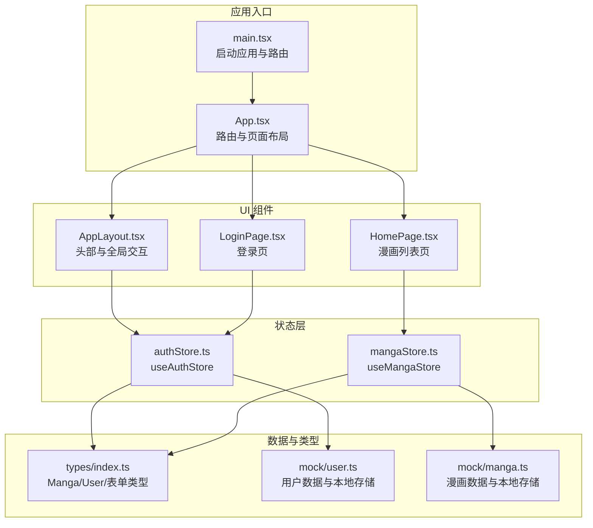
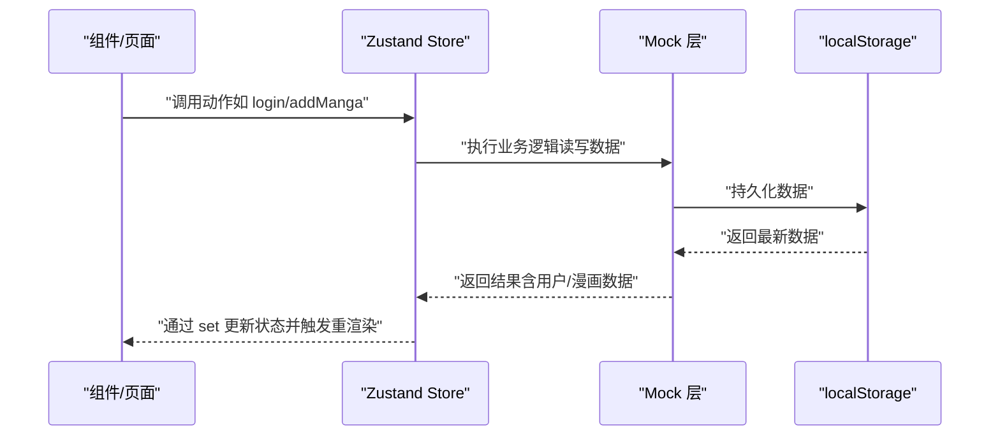
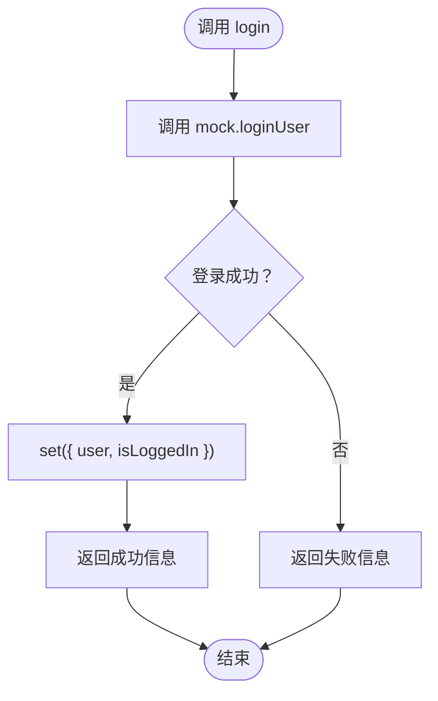
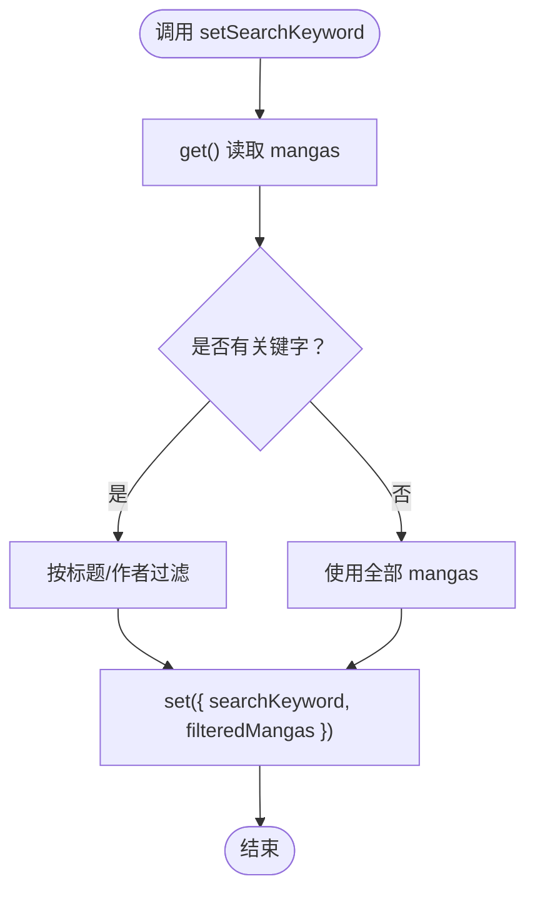
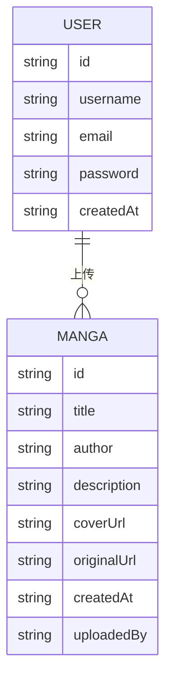
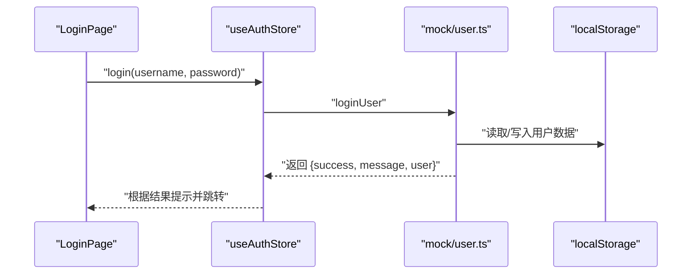
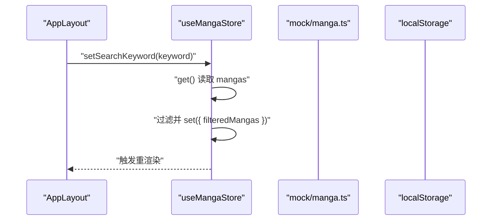
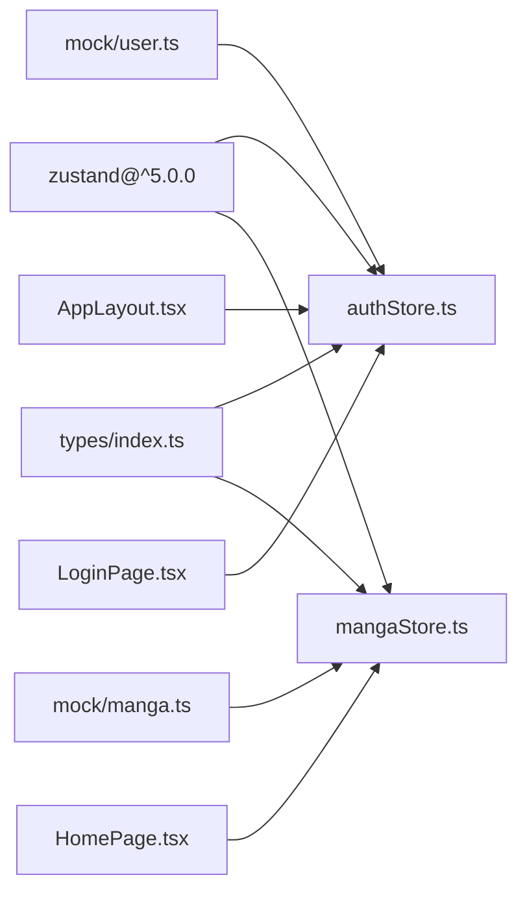

# 状态管理架构

<cite>
**本文引用的文件**
- [authStore.ts](file://manga-website/src/stores/authStore.ts)
- [mangaStore.ts](file://manga-website/src/stores/mangaStore.ts)
- [index.ts](file://manga-website/src/types/index.ts)
- [user.ts](file://manga-website/src/mock/user.ts)
- [manga.ts](file://manga-website/src/mock/manga.ts)
- [AppLayout.tsx](file://manga-website/src/components/AppLayout.tsx)
- [LoginPage.tsx](file://manga-website/src/pages/LoginPage.tsx)
- [HomePage.tsx](file://manga-website/src/pages/HomePage.tsx)
- [App.tsx](file://manga-website/src/App.tsx)
- [main.tsx](file://manga-website/src/main.tsx)
- [package.json](file://manga-website/package.json)
</cite>

## 目录
1. [简介](#简介)
2. [项目结构](#项目结构)
3. [核心组件](#核心组件)
4. [架构总览](#架构总览)
5. [详细组件分析](#详细组件分析)
6. [依赖关系分析](#依赖关系分析)
7. [性能考量](#性能考量)
8. [故障排查指南](#故障排查指南)
9. [结论](#结论)
10. [附录](#附录)

## 简介
本项目采用 Zustand 作为前端状态管理方案，围绕“认证状态管理”和“漫画数据状态管理”两大核心 store 构建状态层。Zustand 在本项目中的优势在于其极简的 API 设计、无需 Provider 包装、易于组合与测试，以及对 TypeScript 的良好支持。通过 mock 层模拟数据持久化与业务逻辑，实现登录注册、搜索过滤、增删改查等典型场景。

## 项目结构
- store 层：位于 src/stores，包含认证与漫画两类 store，分别导出 useXxxStore Hook。
- 类型系统：位于 src/types，统一定义 Manga、User 及表单类型。
- mock 层：位于 src/mock，封装 localStorage 存取与预置数据，隔离真实后端。
- 页面与组件：位于 src/pages 与 src/components，通过 hooks 订阅 store 并渲染 UI。
- 应用入口：src/main.tsx 引入路由与应用根组件；src/App.tsx 定义路由与守卫。

图表来源
- [main.tsx:1-14](file://manga-website/src/main.tsx#L1-L14)
- [App.tsx:1-66](file://manga-website/src/App.tsx#L1-L66)
- [AppLayout.tsx:1-156](file://manga-website/src/components/AppLayout.tsx#L1-L156)
- [HomePage.tsx:1-108](file://manga-website/src/pages/HomePage.tsx#L1-L108)
- [LoginPage.tsx:1-86](file://manga-website/src/pages/LoginPage.tsx#L1-L86)
- [authStore.ts:1-45](file://manga-website/src/stores/authStore.ts#L1-L45)
- [mangaStore.ts:1-62](file://manga-website/src/stores/mangaStore.ts#L1-L62)
- [index.ts:1-44](file://manga-website/src/types/index.ts#L1-L44)
- [user.ts:1-90](file://manga-website/src/mock/user.ts#L1-L90)
- [manga.ts:1-173](file://manga-website/src/mock/manga.ts#L1-L173)

章节来源
- [main.tsx:1-14](file://manga-website/src/main.tsx#L1-L14)
- [App.tsx:1-66](file://manga-website/src/App.tsx#L1-L66)

## 核心组件
- 认证状态管理（useAuthStore）
  - 职责：维护当前登录用户信息与登录态，提供登录、注册、登出、检查登录态等动作。
  - 数据结构：user（用户对象或空）、isLoggedIn（布尔值）。
  - 关键动作：login、register、logout、checkAuth。
- 漫画数据状态管理（useMangaStore）
  - 职责：加载、筛选、新增、删除漫画数据，并维护搜索关键字与过滤后的列表。
  - 数据结构：mangas（全部漫画）、searchKeyword（当前搜索词）、filteredMangas（过滤后的列表）。
  - 关键动作：loadMangas、setSearchKeyword、addManga、deleteManga、refreshMangas。

章节来源
- [authStore.ts:5-12](file://manga-website/src/stores/authStore.ts#L5-L12)
- [mangaStore.ts:5-14](file://manga-website/src/stores/mangaStore.ts#L5-L14)

## 架构总览
Zustand 通过 create 函数创建 store，内部以 set/get 访问器驱动状态更新与读取。mock 层负责数据持久化与业务逻辑，store 将 UI 与数据层解耦，组件通过 hooks 订阅状态变化并触发动作。

图表来源
- [authStore.ts:14-44](file://manga-website/src/stores/authStore.ts#L14-L44)
- [mangaStore.ts:16-61](file://manga-website/src/stores/mangaStore.ts#L16-L61)
- [user.ts:26-89](file://manga-website/src/mock/user.ts#L26-L89)
- [manga.ts:138-167](file://manga-website/src/mock/manga.ts#L138-L167)

## 详细组件分析

### 认证状态管理（useAuthStore）
- 设计模式
  - 基于函数式 store：以 create 包裹状态与动作，避免类与样板代码。
  - 动作内聚：login/register/logout/checkAuth 聚合到单一 store，便于跨组件共享。
- 状态结构
  - user：当前用户或空。
  - isLoggedIn：是否已登录。
- 动作说明
  - login：调用 mock 登录，成功则 set 状态并返回结果。
  - register：调用 mock 注册，成功则设置当前用户并 set 状态。
  - logout：清空当前用户并 set 空状态。
  - checkAuth：从本地存储读取当前用户并同步状态。
- 订阅与使用
  - AppLayout 读取 user 与 isLoggedIn 控制导航按钮显示。
  - LoginPage 通过选择器订阅 login 动作，提交表单后根据返回结果提示与跳转。

图表来源
- [authStore.ts:18-24](file://manga-website/src/stores/authStore.ts#L18-L24)
- [user.ts:51-64](file://manga-website/src/mock/user.ts#L51-L64)

章节来源
- [authStore.ts:14-44](file://manga-website/src/stores/authStore.ts#L14-L44)
- [AppLayout.tsx:21-34](file://manga-website/src/components/AppLayout.tsx#L21-L34)
- [LoginPage.tsx:14-22](file://manga-website/src/pages/LoginPage.tsx#L14-L22)

### 漫画数据状态管理（useMangaStore）
- 设计模式
  - get/set 双访问器：set 用于更新状态，get 用于读取当前状态进行派生计算。
  - 动作组合：addManga/deleteManga 内部调用 loadMangas 刷新列表，保证视图一致性。
- 状态结构
  - mangas：全部漫画数组。
  - searchKeyword：当前搜索关键字。
  - filteredMangas：基于关键字过滤后的数组。
- 动作说明
  - loadMangas：从 mock 读取全部漫画，结合 searchKeyword 过滤并 set。
  - setSearchKeyword：更新关键字并即时过滤。
  - addManga：新增漫画后刷新列表。
  - deleteManga：删除漫画后按需刷新列表。
  - refreshMangas：直接重新加载列表。
- 订阅与使用
  - HomePage 在挂载时调用 loadMangas 加载数据；根据 filteredMangas 渲染卡片列表。

图表来源
- [mangaStore.ts:34-44](file://manga-website/src/stores/mangaStore.ts#L34-L44)
- [manga.ts:138-140](file://manga-website/src/mock/manga.ts#L138-L140)

章节来源
- [mangaStore.ts:16-61](file://manga-website/src/stores/mangaStore.ts#L16-L61)
- [HomePage.tsx:9-13](file://manga-website/src/pages/HomePage.tsx#L9-L13)

### 类型系统与数据模型
- 类型定义
  - Manga：包含 id、title、author、description、coverUrl、originalUrl、createdAt、uploadedBy。
  - User：包含 id、username、email、password、createdAt。
  - 表单类型：LoginForm、RegisterForm、UploadForm。
- 作用
  - 为 store、mock、页面与组件提供强类型约束，减少运行期错误。

图表来源
- [index.ts:2-20](file://manga-website/src/types/index.ts#L2-L20)

章节来源
- [index.ts:1-44](file://manga-website/src/types/index.ts#L1-L44)

### 状态持久化策略
- 用户数据持久化
  - 使用 localStorage 存储用户集合与当前登录用户标识，避免刷新丢失。
  - 提供 setCurrentUser、getCurrentUser、logoutUser 等方法。
- 漫画数据持久化
  - 使用 localStorage 存储漫画集合，首次访问自动初始化预置数据。
  - 新增/删除漫画后同步更新本地存储。
- 策略优势
  - 无需后端即可演示完整流程；适合开发与演示阶段。
  - 通过 mock 抽象，便于后续替换为真实 API。

章节来源
- [user.ts:3-23](file://manga-website/src/mock/user.ts#L3-L23)
- [user.ts:67-89](file://manga-website/src/mock/user.ts#L67-L89)
- [manga.ts:3-135](file://manga-website/src/mock/manga.ts#L3-L135)

### 跨组件状态共享与订阅机制
- 订阅方式
  - AppLayout 订阅认证状态（user、isLoggedIn）与搜索关键字（searchKeyword）。
  - LoginPage 订阅登录动作 login。
  - HomePage 订阅漫画列表与搜索关键字，并在挂载时加载数据。
- 共享原则
  - store 作为单一事实来源，组件通过 hooks 选择性订阅所需字段或动作，避免不必要的重渲染。
  - 动作内部可组合其他动作（如 addManga 调用 loadMangas），确保状态一致性。

章节来源
- [AppLayout.tsx:21-29](file://manga-website/src/components/AppLayout.tsx#L21-L29)
- [LoginPage.tsx:11-22](file://manga-website/src/pages/LoginPage.tsx#L11-L22)
- [HomePage.tsx:9-13](file://manga-website/src/pages/HomePage.tsx#L9-L13)

### 状态流转图
- 登录流程

图表来源
- [LoginPage.tsx:14-22](file://manga-website/src/pages/LoginPage.tsx#L14-L22)
- [authStore.ts:18-24](file://manga-website/src/stores/authStore.ts#L18-L24)
- [user.ts:51-64](file://manga-website/src/mock/user.ts#L51-L64)

- 搜索流程

图表来源
- [AppLayout.tsx:26-29](file://manga-website/src/components/AppLayout.tsx#L26-L29)
- [mangaStore.ts:34-44](file://manga-website/src/stores/mangaStore.ts#L34-L44)
- [manga.ts:138-140](file://manga-website/src/mock/manga.ts#L138-L140)

## 依赖关系分析
- 外部依赖
  - Zustand：提供轻量级状态管理。
  - React/React-DOM、react-router-dom：构建 UI 与路由。
  - antd：提供 UI 组件库。
- 内部依赖
  - store 依赖 types 定义数据结构。
  - store 依赖 mock 层进行数据读写与持久化。
  - 组件依赖 store 提供的动作与状态。

图表来源
- [package.json:11-24](file://manga-website/package.json#L11-L24)
- [authStore.ts:1-3](file://manga-website/src/stores/authStore.ts#L1-L3)
- [mangaStore.ts:1-3](file://manga-website/src/stores/mangaStore.ts#L1-L3)
- [index.ts:1-44](file://manga-website/src/types/index.ts#L1-L44)
- [user.ts:1-2](file://manga-website/src/mock/user.ts#L1-L2)
- [manga.ts:1-3](file://manga-website/src/mock/manga.ts#L1-L3)
- [AppLayout.tsx:13-14](file://manga-website/src/components/AppLayout.tsx#L13-L14)
- [HomePage.tsx:4](file://manga-website/src/pages/HomePage.tsx#L4)
- [LoginPage.tsx:4](file://manga-website/src/pages/LoginPage.tsx#L4)

章节来源
- [package.json:11-24](file://manga-website/package.json#L11-L24)

## 性能考量
- 选择器订阅：组件通过选择器订阅需要的字段或动作，避免无关状态变更导致的重渲染。
- 动作内组合：如 addManga/deleteManga 内部调用 loadMangas，减少重复逻辑与状态不一致风险。
- 本地存储：使用 localStorage 缓存数据，减少网络请求开销；注意在大规模数据时的序列化/反序列化成本。
- 搜索过滤：在 setSearchKeyword 中对现有列表进行过滤，避免重复拉取；可在大数据量时考虑分页或服务端搜索。

## 故障排查指南
- 登录失败
  - 检查用户名是否存在与密码是否匹配；确认 mock 是否正确保存用户数据。
  - 参考路径：[authStore.ts:18-24](file://manga-website/src/stores/authStore.ts#L18-L24)、[user.ts:51-64](file://manga-website/src/mock/user.ts#L51-L64)
- 注册失败
  - 检查用户名与邮箱是否重复；确认用户集合是否正确写入 localStorage。
  - 参考路径：[authStore.ts:26-33](file://manga-website/src/stores/authStore.ts#L26-L33)、[user.ts:26-48](file://manga-website/src/mock/user.ts#L26-L48)
- 搜索无结果
  - 确认 searchKeyword 是否为空；检查过滤逻辑是否覆盖标题与作者。
  - 参考路径：[mangaStore.ts:34-44](file://manga-website/src/stores/mangaStore.ts#L34-L44)
- 列表不更新
  - 确认动作是否调用了 loadMangas 或 refreshMangas；检查 mock 是否正确持久化数据。
  - 参考路径：[mangaStore.ts:46-60](file://manga-website/src/stores/mangaStore.ts#L46-L60)、[manga.ts:138-167](file://manga-website/src/mock/manga.ts#L138-L167)

章节来源
- [authStore.ts:18-33](file://manga-website/src/stores/authStore.ts#L18-L33)
- [mangaStore.ts:34-60](file://manga-website/src/stores/mangaStore.ts#L34-L60)
- [user.ts:26-64](file://manga-website/src/mock/user.ts#L26-L64)
- [manga.ts:138-167](file://manga-website/src/mock/manga.ts#L138-L167)

## 结论
本项目以 Zustand 为核心，结合 mock 层实现了认证与漫画数据的完整状态管理闭环。通过清晰的数据结构、动作定义与订阅机制，实现了跨组件的状态共享与高效更新。建议在后续迭代中逐步替换 mock 为真实 API，并引入更完善的错误处理与副作用管理（如中间件或异步动作），以提升系统的可维护性与扩展性。

## 附录
- 最佳实践清单
  - 状态结构设计：保持扁平化，避免深层嵌套；必要时拆分为多个 store。
  - 动作命名规范：使用动词短语，如 loadXxx、setXxx、addXxx、deleteXxx。
  - 副作用处理：将网络请求、本地存储等副作用集中在动作内部或通过中间件统一处理。
  - 订阅优化：优先使用选择器订阅，减少不必要的重渲染。
  - 类型安全：所有状态与动作参数均使用 TypeScript 明确定义，确保编译期校验。