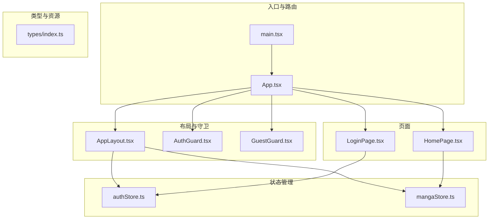
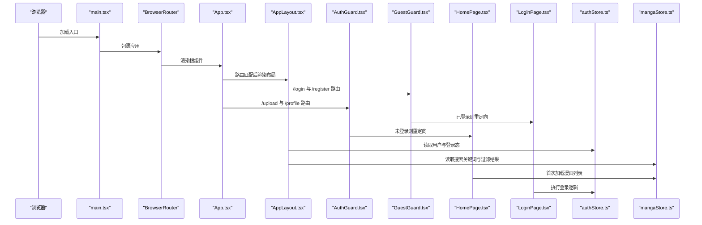
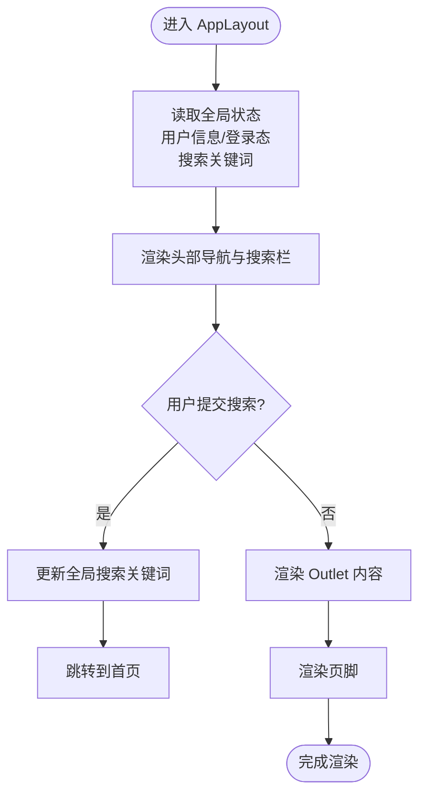
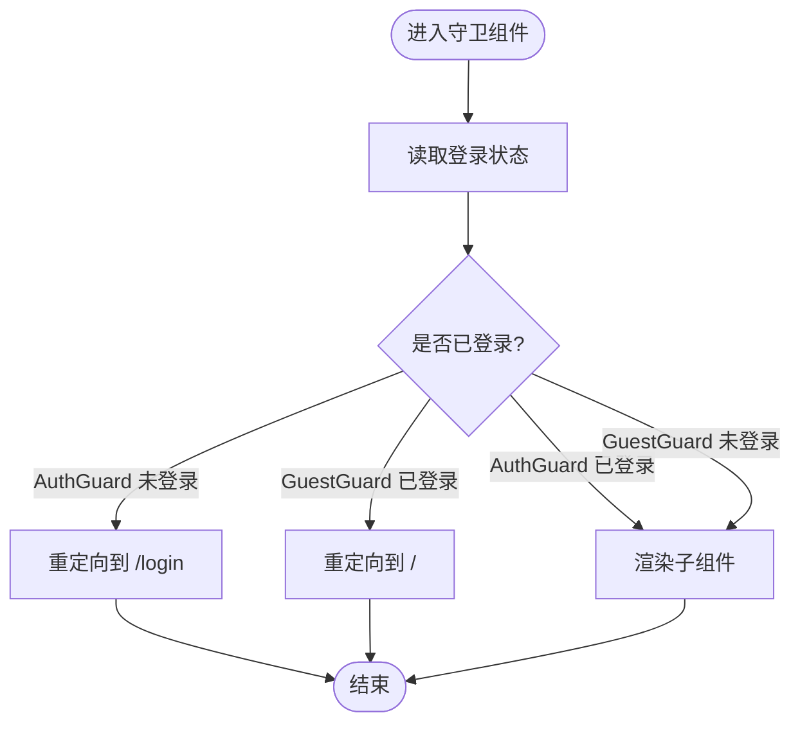
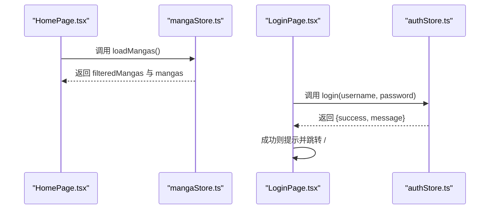
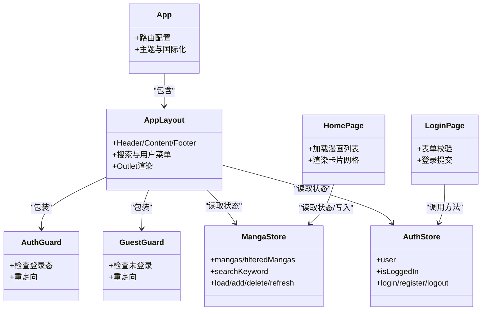
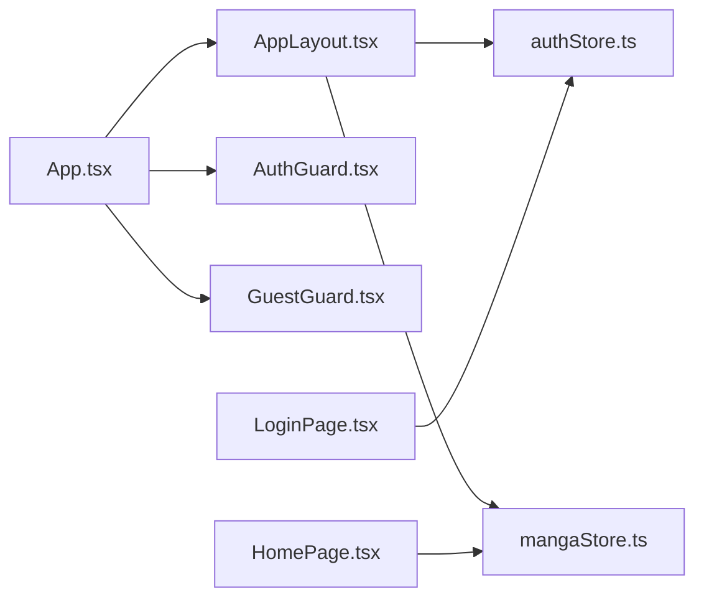

# 组件架构

<cite>
**本文引用的文件**
- [App.tsx](file://manga-website/src/App.tsx)
- [AppLayout.tsx](file://manga-website/src/components/AppLayout.tsx)
- [AuthGuard.tsx](file://manga-website/src/components/AuthGuard.tsx)
- [GuestGuard.tsx](file://manga-website/src/components/GuestGuard.tsx)
- [authStore.ts](file://manga-website/src/stores/authStore.ts)
- [mangaStore.ts](file://manga-website/src/stores/mangaStore.ts)
- [HomePage.tsx](file://manga-website/src/pages/HomePage.tsx)
- [LoginPage.tsx](file://manga-website/src/pages/LoginPage.tsx)
- [index.ts](file://manga-website/src/types/index.ts)
- [main.tsx](file://manga-website/src/main.tsx)
</cite>

## 目录
1. [简介](#简介)
2. [项目结构](#项目结构)
3. [核心组件](#核心组件)
4. [架构总览](#架构总览)
5. [详细组件分析](#详细组件分析)
6. [依赖分析](#依赖分析)
7. [性能考虑](#性能考虑)
8. [故障排查指南](#故障排查指南)
9. [结论](#结论)
10. [附录](#附录)

## 简介
本项目是一个基于 React 的漫画网站前端应用，采用函数组件与 Hooks 的现代开发范式，结合 Zustand 状态管理与 Ant Design UI 库，构建了清晰的组件层次与权限控制体系。本文档围绕以下目标展开：解释 React 函数组件的设计模式与 Hooks 使用策略（如 useState、useEffect、useNavigate），梳理根组件 App.tsx、布局组件 AppLayout.tsx、权限守卫组件（AuthGuard、GuestGuard）的职责与协作方式；阐述组件间通信机制（Props、事件处理、状态共享）、职责分离与可复用性设计，并通过图示展示组件关系与生命周期管理，帮助开发者快速理解并扩展该架构。

## 项目结构
项目采用按功能域划分的目录组织方式，主要模块如下：
- 根入口与路由配置：main.tsx、App.tsx
- 布局与守卫：components/AppLayout.tsx、components/AuthGuard.tsx、components/GuestGuard.tsx
- 页面组件：pages/HomePage.tsx、pages/LoginPage.tsx 及其他页面
- 状态管理：stores/authStore.ts、stores/mangaStore.ts
- 类型定义：types/index.ts
- Mock 数据：mock/manga.ts、mock/user.ts（在 store 中被引入）

图表来源
- [main.tsx:1-14](file://manga-website/src/main.tsx#L1-L14)
- [App.tsx:1-66](file://manga-website/src/App.tsx#L1-L66)
- [AppLayout.tsx:1-156](file://manga-website/src/components/AppLayout.tsx#L1-L156)
- [AuthGuard.tsx:1-17](file://manga-website/src/components/AuthGuard.tsx#L1-L17)
- [GuestGuard.tsx:1-17](file://manga-website/src/components/GuestGuard.tsx#L1-L17)
- [authStore.ts:1-45](file://manga-website/src/stores/authStore.ts#L1-L45)
- [mangaStore.ts:1-62](file://manga-website/src/stores/mangaStore.ts#L1-L62)
- [HomePage.tsx:1-108](file://manga-website/src/pages/HomePage.tsx#L1-L108)
- [LoginPage.tsx:1-86](file://manga-website/src/pages/LoginPage.tsx#L1-L86)
- [index.ts:1-44](file://manga-website/src/types/index.ts#L1-L44)

章节来源
- [main.tsx:1-14](file://manga-website/src/main.tsx#L1-L14)
- [App.tsx:1-66](file://manga-website/src/App.tsx#L1-L66)

## 核心组件
本节聚焦于三个关键组件及其职责：
- App.tsx：应用根组件，负责全局路由配置与主题配置，将页面组件包裹在布局组件之下，并通过守卫组件实现访问控制。
- AppLayout.tsx：应用布局组件，提供统一的头部导航、搜索栏、用户菜单与页脚，同时通过 Zustand 访问认证与漫画状态，承载 Outlet 渲染当前路由内容。
- AuthGuard.tsx 与 GuestGuard.tsx：权限守卫组件，分别用于“已登录才可访问”和“未登录才可访问”的场景，通过读取认证状态决定是否渲染子组件或重定向。

Hooks 使用策略要点：
- useState：在 AppLayout.tsx 中用于本地受控表单输入（搜索框），并与全局状态同步。
- useEffect：在 HomePage.tsx 中用于首次加载漫画列表。
- useNavigate：在 AppLayout.tsx 与 LoginPage.tsx 中用于程序化路由跳转。
- 自定义 Hooks：通过 Zustand 的选择器读取状态（如 useAuthStore(s => s.isLoggedIn)）以减少渲染范围。

章节来源
- [App.tsx:13-66](file://manga-website/src/App.tsx#L13-L66)
- [AppLayout.tsx:19-156](file://manga-website/src/components/AppLayout.tsx#L19-L156)
- [AuthGuard.tsx:8-17](file://manga-website/src/components/AuthGuard.tsx#L8-L17)
- [GuestGuard.tsx:8-17](file://manga-website/src/components/GuestGuard.tsx#L8-L17)
- [HomePage.tsx:8-108](file://manga-website/src/pages/HomePage.tsx#L8-L108)
- [LoginPage.tsx:9-86](file://manga-website/src/pages/LoginPage.tsx#L9-L86)

## 架构总览
下图展示了从入口到页面渲染、状态管理与权限控制的整体流程：

图表来源
- [main.tsx:7-13](file://manga-website/src/main.tsx#L7-L13)
- [App.tsx:24-60](file://manga-website/src/App.tsx#L24-L60)
- [AppLayout.tsx:20-34](file://manga-website/src/components/AppLayout.tsx#L20-L34)
- [AuthGuard.tsx:8-16](file://manga-website/src/components/AuthGuard.tsx#L8-L16)
- [GuestGuard.tsx:8-16](file://manga-website/src/components/GuestGuard.tsx#L8-L16)
- [HomePage.tsx:9-13](file://manga-website/src/pages/HomePage.tsx#L9-L13)
- [LoginPage.tsx:10-22](file://manga-website/src/pages/LoginPage.tsx#L10-L22)
- [authStore.ts:14-44](file://manga-website/src/stores/authStore.ts#L14-L44)
- [mangaStore.ts:16-32](file://manga-website/src/stores/mangaStore.ts#L16-L32)

## 详细组件分析

### 根组件 App.tsx
- 职责：集中配置全局主题、国际化与路由树；将页面组件包裹在 AppLayout 下，利用 AuthGuard/GuestGuard 实现访问控制。
- 关键点：
  - 使用 ConfigProvider 设置 Ant Design 主题与语言。
  - 路由嵌套：所有页面均位于 AppLayout 的 Outlet 内，形成统一布局。
  - 权限控制：登录/注册路由使用 GuestGuard，上传/个人中心使用 AuthGuard。
- 设计模式：高内聚的路由配置，低耦合的页面与守卫组件。

章节来源
- [App.tsx:13-66](file://manga-website/src/App.tsx#L13-L66)

### 布局组件 AppLayout.tsx
- 职责：提供统一头部导航、搜索栏、用户菜单与页脚；通过 Outlet 渲染当前路由内容；协调认证与漫画状态。
- 关键点：
  - 本地状态：使用 useState 同步搜索框输入值，避免每次输入都触发全局更新。
  - 全局状态：useAuthStore 获取用户信息与登录态；useMangaStore 获取搜索关键词与过滤结果。
  - 交互行为：搜索提交时更新全局搜索关键词并返回首页；登出时调用 logout 并重定向。
  - 导航行为：使用 useNavigate 实现按钮点击与菜单项跳转。
- 设计模式：职责分离（UI 展示 vs 状态管理），局部状态与全局状态协同。

图表来源
- [AppLayout.tsx:19-156](file://manga-website/src/components/AppLayout.tsx#L19-L156)
- [authStore.ts:14-44](file://manga-website/src/stores/authStore.ts#L14-L44)
- [mangaStore.ts:16-44](file://manga-website/src/stores/mangaStore.ts#L16-L44)

章节来源
- [AppLayout.tsx:19-156](file://manga-website/src/components/AppLayout.tsx#L19-L156)

### 权限守卫组件
- AuthGuard.tsx：当用户未登录时重定向至登录页，已登录则渲染子组件。
- GuestGuard.tsx：当用户已登录时重定向至首页，未登录则渲染子组件。
- 设计模式：以高阶组件形式封装路由级访问控制，保持页面组件的纯净与可复用。

图表来源
- [AuthGuard.tsx:8-16](file://manga-website/src/components/AuthGuard.tsx#L8-L16)
- [GuestGuard.tsx:8-16](file://manga-website/src/components/GuestGuard.tsx#L8-L16)
- [authStore.ts:14-44](file://manga-website/src/stores/authStore.ts#L14-L44)

章节来源
- [AuthGuard.tsx:8-17](file://manga-website/src/components/AuthGuard.tsx#L8-L17)
- [GuestGuard.tsx:8-17](file://manga-website/src/components/GuestGuard.tsx#L8-L17)

### 页面组件与状态共享
- HomePage.tsx：在挂载时通过 useEffect 调用 loadMangas 加载漫画列表；根据 filteredMangas 与 searchKeyword 渲染空状态或卡片网格。
- LoginPage.tsx：使用 Ant Design 表单与校验，提交时调用 useAuthStore 的 login 方法，成功后提示并跳转首页。
- 状态共享：两个页面均通过各自的 Zustand store 访问全局状态，实现跨组件的数据一致性与最小化渲染。

图表来源
- [HomePage.tsx:9-13](file://manga-website/src/pages/HomePage.tsx#L9-L13)
- [mangaStore.ts:16-32](file://manga-website/src/stores/mangaStore.ts#L16-L32)
- [LoginPage.tsx:10-22](file://manga-website/src/pages/LoginPage.tsx#L10-L22)
- [authStore.ts:14-44](file://manga-website/src/stores/authStore.ts#L14-L44)

章节来源
- [HomePage.tsx:8-108](file://manga-website/src/pages/HomePage.tsx#L8-L108)
- [LoginPage.tsx:9-86](file://manga-website/src/pages/LoginPage.tsx#L9-L86)
- [mangaStore.ts:16-62](file://manga-website/src/stores/mangaStore.ts#L16-L62)
- [authStore.ts:14-45](file://manga-website/src/stores/authStore.ts#L14-L45)

### 组件关系图

图表来源
- [App.tsx:13-66](file://manga-website/src/App.tsx#L13-L66)
- [AppLayout.tsx:19-156](file://manga-website/src/components/AppLayout.tsx#L19-L156)
- [AuthGuard.tsx:8-17](file://manga-website/src/components/AuthGuard.tsx#L8-L17)
- [GuestGuard.tsx:8-17](file://manga-website/src/components/GuestGuard.tsx#L8-L17)
- [HomePage.tsx:8-108](file://manga-website/src/pages/HomePage.tsx#L8-L108)
- [LoginPage.tsx:9-86](file://manga-website/src/pages/LoginPage.tsx#L9-L86)
- [authStore.ts:14-45](file://manga-website/src/stores/authStore.ts#L14-L45)
- [mangaStore.ts:16-62](file://manga-website/src/stores/mangaStore.ts#L16-L62)

## 依赖分析
- 组件耦合度：
  - App.tsx 与 AppLayout.tsx 为父子关系，耦合度低，职责清晰。
  - 守卫组件仅依赖认证状态，不直接依赖具体页面，具备高复用性。
  - 页面组件通过 store 间接依赖，避免了跨层级 Props 传递。
- 外部依赖：
  - react-router-dom：路由与导航。
  - antd 与 @ant-design/icons：UI 组件与图标。
  - zustand：轻量状态管理库。
- 循环依赖：未发现循环依赖，组件导入方向单一。

图表来源
- [App.tsx:13-66](file://manga-website/src/App.tsx#L13-L66)
- [AppLayout.tsx:19-156](file://manga-website/src/components/AppLayout.tsx#L19-L156)
- [AuthGuard.tsx:8-17](file://manga-website/src/components/AuthGuard.tsx#L8-L17)
- [GuestGuard.tsx:8-17](file://manga-website/src/components/GuestGuard.tsx#L8-L17)
- [HomePage.tsx:8-108](file://manga-website/src/pages/HomePage.tsx#L8-L108)
- [LoginPage.tsx:9-86](file://manga-website/src/pages/LoginPage.tsx#L9-L86)
- [authStore.ts:14-45](file://manga-website/src/stores/authStore.ts#L14-L45)
- [mangaStore.ts:16-62](file://manga-website/src/stores/mangaStore.ts#L16-L62)

章节来源
- [App.tsx:13-66](file://manga-website/src/App.tsx#L13-L66)
- [authStore.ts:14-45](file://manga-website/src/stores/authStore.ts#L14-L45)
- [mangaStore.ts:16-62](file://manga-website/src/stores/mangaStore.ts#L16-L62)

## 性能考虑
- 最小化渲染：
  - 使用 Zustand 选择器读取状态（如 useAuthStore(s => s.isLoggedIn)）仅在相关字段变化时触发重渲染。
  - AppLayout.tsx 中的搜索框使用本地 useState，避免每次输入都更新全局状态。
- 异步加载：
  - HomePage.tsx 在首次挂载时加载数据，避免重复请求。
- UI 优化：
  - Ant Design 的 Card 与图片悬停缩放使用 CSS 过渡，保证流畅体验。
- 建议：
  - 对高频交互（如搜索）可增加防抖策略以进一步降低请求频率。
  - 对大列表渲染可考虑虚拟滚动（如后续扩展）。

## 故障排查指南
- 登录后仍被重定向到登录页
  - 检查认证状态是否正确更新（authStore 的 login 是否设置 user 与 isLoggedIn）。
  - 确认守卫组件读取的是最新状态。
- 搜索无结果
  - 检查搜索关键词是否同步到全局状态（AppLayout 的 handleSearch 与 useMangaStore.setSearchKeyword）。
  - 确认 loadMangas 是否在 HomePage 首次渲染时执行。
- 上传/个人中心页面无法访问
  - 检查 AuthGuard 的登录态判断逻辑与路由配置。
- 路由跳转无效
  - 确认 useNavigate 的调用位置与参数（如 replace、目标路径）。

章节来源
- [authStore.ts:14-44](file://manga-website/src/stores/authStore.ts#L14-L44)
- [mangaStore.ts:16-44](file://manga-website/src/stores/mangaStore.ts#L16-L44)
- [AppLayout.tsx:20-34](file://manga-website/src/components/AppLayout.tsx#L20-L34)
- [HomePage.tsx:9-13](file://manga-website/src/pages/HomePage.tsx#L9-L13)
- [AuthGuard.tsx:8-16](file://manga-website/src/components/AuthGuard.tsx#L8-L16)

## 结论
该漫画网站的组件架构以函数组件与 Hooks 为核心，结合 Zustand 实现轻量状态管理，配合守卫组件完成路由级权限控制。AppLayout 提供统一布局与状态协调，页面组件专注于业务渲染，实现了良好的职责分离与可复用性。通过合理的 Hooks 使用策略与状态共享机制，系统在可维护性与性能之间取得了平衡。建议在后续迭代中引入更完善的错误边界、防抖与虚拟滚动等优化手段，持续提升用户体验。

## 附录
- 类型定义概览（摘自 types/index.ts）
  - 漫画类型：包含标题、作者、封面、原始链接、创建时间等字段。
  - 用户类型：包含用户名、邮箱、密码等字段。
  - 表单类型：登录、注册、上传表单的字段集合。

章节来源
- [index.ts:1-44](file://manga-website/src/types/index.ts#L1-L44)