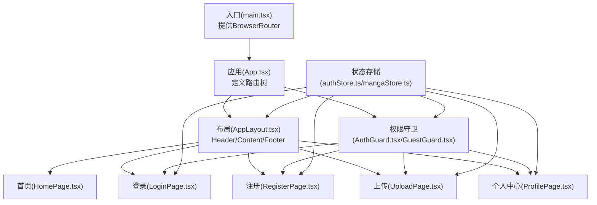
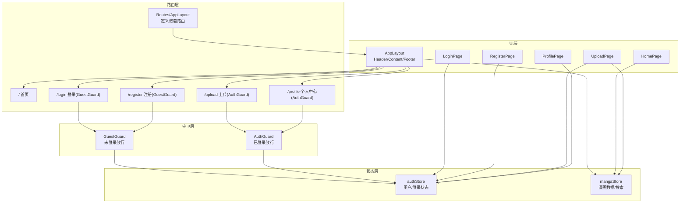
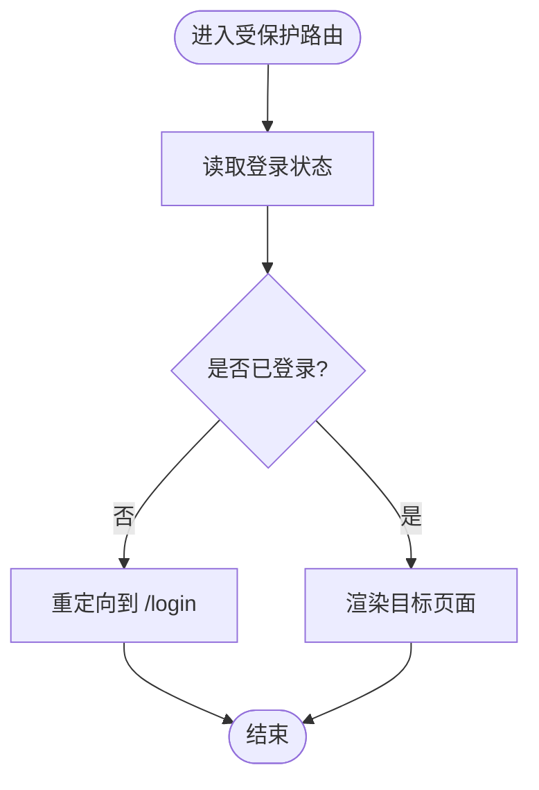
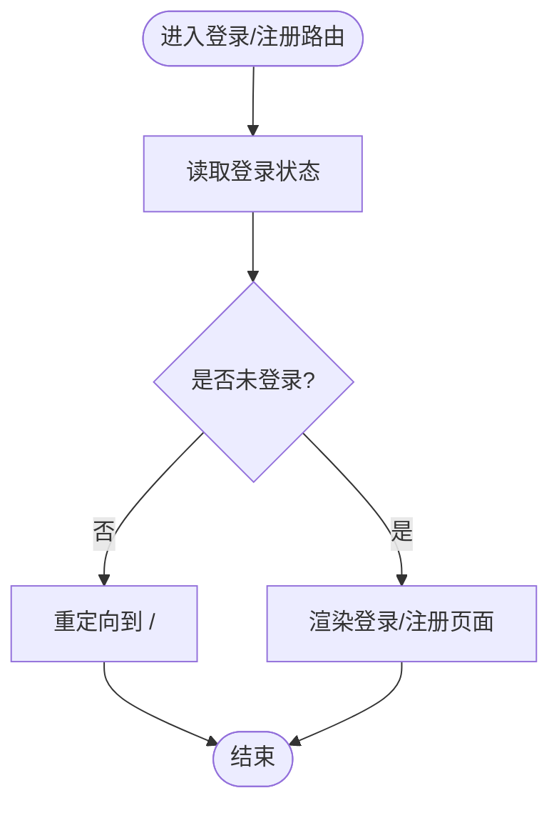
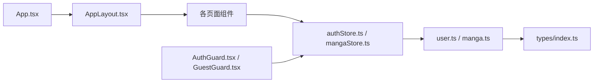

# 路由导航架构

<cite>
**本文档引用的文件**
- [App.tsx](file://manga-website/src/App.tsx)
- [main.tsx](file://manga-website/src/main.tsx)
- [AuthGuard.tsx](file://manga-website/src/components/AuthGuard.tsx)
- [GuestGuard.tsx](file://manga-website/src/components/GuestGuard.tsx)
- [AppLayout.tsx](file://manga-website/src/components/AppLayout.tsx)
- [authStore.ts](file://manga-website/src/stores/authStore.ts)
- [mangaStore.ts](file://manga-website/src/stores/mangaStore.ts)
- [user.ts](file://manga-website/src/mock/user.ts)
- [manga.ts](file://manga-website/src/mock/manga.ts)
- [index.ts](file://manga-website/src/types/index.ts)
- [HomePage.tsx](file://manga-website/src/pages/HomePage.tsx)
- [LoginPage.tsx](file://manga-website/src/pages/LoginPage.tsx)
- [RegisterPage.tsx](file://manga-website/src/pages/RegisterPage.tsx)
- [UploadPage.tsx](file://manga-website/src/pages/UploadPage.tsx)
- [ProfilePage.tsx](file://manga-website/src/pages/ProfilePage.tsx)
</cite>

## 目录
1. [引言](#引言)
2. [项目结构](#项目结构)
3. [核心组件](#核心组件)
4. [架构总览](#架构总览)
5. [详细组件分析](#详细组件分析)
6. [依赖关系分析](#依赖关系分析)
7. [性能考虑](#性能考虑)
8. [故障排除指南](#故障排除指南)
9. [结论](#结论)

## 引言
本文件面向漫画网站项目的前端路由导航架构，系统性阐述基于 React Router 的路由配置与使用模式，包括：
- 路由定义与嵌套路由组织
- 权限控制机制（Auth Guard 与 Guest Guard）
- 导航守卫的实现策略（拦截、验证与重定向）
- 路由参数传递、查询字符串处理与路由状态管理
- 路由配置图与导航流程图，帮助开发者快速理解设计思路与实现细节

## 项目结构
该漫画网站采用模块化组织方式，路由系统围绕应用入口、布局组件、页面组件与状态存储展开，形成清晰的分层结构：
- 应用入口：在入口文件中包裹 BrowserRouter，提供路由上下文
- 布局组件：统一头部导航、内容区域与页脚，承载 Outlet 以渲染子路由
- 页面组件：各功能页面（首页、登录、注册、上传、个人中心）
- 权限守卫：Auth Guard 与 Guest Guard 实现访问控制
- 状态存储：Zustand 管理认证状态与漫画数据状态

图表来源
- [main.tsx:1-14](file://manga-website/src/main.tsx#L1-L14)
- [App.tsx:13-66](file://manga-website/src/App.tsx#L13-L66)
- [AppLayout.tsx:19-156](file://manga-website/src/components/AppLayout.tsx#L19-L156)
- [AuthGuard.tsx:8-16](file://manga-website/src/components/AuthGuard.tsx#L8-L16)
- [GuestGuard.tsx:8-16](file://manga-website/src/components/GuestGuard.tsx#L8-L16)
- [authStore.ts:14-44](file://manga-website/src/stores/authStore.ts#L14-L44)
- [mangaStore.ts:16-61](file://manga-website/src/stores/mangaStore.ts#L16-L61)

章节来源
- [main.tsx:1-14](file://manga-website/src/main.tsx#L1-L14)
- [App.tsx:13-66](file://manga-website/src/App.tsx#L13-L66)

## 核心组件
本节聚焦路由系统的关键构件及其职责：
- 应用入口与路由容器
  - 在入口文件中通过 BrowserRouter 包裹应用，确保所有组件可使用路由能力
  - 应用根组件定义顶层 Routes，组织路由树
- 布局组件
  - AppLayout 提供统一的头部导航、内容区与页脚，内部包含 Outlet 用于渲染子路由
  - 头部集成搜索、用户菜单与登录/注册按钮，支持程序化导航
- 权限守卫
  - AuthGuard：仅允许已登录用户访问受保护页面
  - GuestGuard：仅允许未登录用户访问登录/注册页面
- 状态存储
  - authStore：维护用户信息与登录状态，提供登录、注册、登出与认证检查方法
  - mangaStore：维护漫画列表、搜索关键词与过滤后的漫画集合，提供加载、添加、删除与刷新方法

章节来源
- [main.tsx:7-13](file://manga-website/src/main.tsx#L7-L13)
- [App.tsx:24-59](file://manga-website/src/App.tsx#L24-L59)
- [AppLayout.tsx:19-156](file://manga-website/src/components/AppLayout.tsx#L19-L156)
- [AuthGuard.tsx:8-16](file://manga-website/src/components/AuthGuard.tsx#L8-L16)
- [GuestGuard.tsx:8-16](file://manga-website/src/components/GuestGuard.tsx#L8-L16)
- [authStore.ts:14-44](file://manga-website/src/stores/authStore.ts#L14-L44)
- [mangaStore.ts:16-61](file://manga-website/src/stores/mangaStore.ts#L16-L61)

## 架构总览
下图展示了路由系统的整体架构与交互关系，包括路由树、守卫机制与状态驱动的数据流。

图表来源
- [App.tsx:24-59](file://manga-website/src/App.tsx#L24-L59)
- [AppLayout.tsx:19-156](file://manga-website/src/components/AppLayout.tsx#L19-L156)
- [AuthGuard.tsx:8-16](file://manga-website/src/components/AuthGuard.tsx#L8-L16)
- [GuestGuard.tsx:8-16](file://manga-website/src/components/GuestGuard.tsx#L8-L16)
- [authStore.ts:14-44](file://manga-website/src/stores/authStore.ts#L14-L44)
- [mangaStore.ts:16-61](file://manga-website/src/stores/mangaStore.ts#L16-L61)

## 详细组件分析

### 路由定义与嵌套路由
- 顶层路由树
  - 使用 Routes 定义顶层路由，AppLayout 作为根布局组件，内部包含多个子路由
  - 子路由覆盖首页、登录、注册、上传与个人中心等路径
- 嵌套路由
  - AppLayout 内部通过 Outlet 渲染子路由内容，形成“布局 + 页面”的嵌套结构
  - 布局组件负责全局导航与状态共享，页面组件专注业务逻辑
- 动态路由
  - 当前路由配置未使用动态段（如 :id），但可通过扩展在后续版本中引入参数化路由

章节来源
- [App.tsx:24-59](file://manga-website/src/App.tsx#L24-L59)
- [AppLayout.tsx:140](file://manga-website/src/components/AppLayout.tsx#L140)

### 权限控制机制（Auth Guard 与 Guest Guard）
- Auth Guard
  - 作用：仅当用户已登录时才渲染被保护页面；否则重定向到登录页
  - 实现：读取 authStore 中的登录状态，未登录则返回 Navigate 组件进行重定向
- Guest Guard
  - 作用：仅当用户未登录时才渲染登录/注册页面；否则重定向到首页
  - 实现：读取 authStore 中的登录状态，已登录则返回 Navigate 组件进行重定向
- 应用场景
  - /upload 与 /profile 受保护，必须登录后访问
  - /login 与 /register 对访客开放，已登录用户不应看到这些页面

图表来源
- [AuthGuard.tsx:8-16](file://manga-website/src/components/AuthGuard.tsx#L8-L16)

图表来源
- [GuestGuard.tsx:8-16](file://manga-website/src/components/GuestGuard.tsx#L8-L16)

章节来源
- [AuthGuard.tsx:8-16](file://manga-website/src/components/AuthGuard.tsx#L8-L16)
- [GuestGuard.tsx:8-16](file://manga-website/src/components/GuestGuard.tsx#L8-L16)
- [authStore.ts:14-44](file://manga-website/src/stores/authStore.ts#L14-L44)

### 导航守卫的实现策略
- 路由拦截
  - 通过在路由元素上包裹 AuthGuard 或 GuestGuard 实现拦截
  - 拦截发生在渲染阶段，基于状态判断决定是否放行
- 权限验证
  - 认证状态来自 authStore，初始化时从本地存储读取当前用户
  - 提供 login、register、logout 与 checkAuth 方法，支撑完整的认证生命周期
- 重定向逻辑
  - 未登录访问受保护路由时，重定向至 /login 并使用 replace 防止历史栈污染
  - 已登录访问登录/注册路由时，重定向至 / 并使用 replace

章节来源
- [App.tsx:27-58](file://manga-website/src/App.tsx#L27-L58)
- [AuthGuard.tsx:11-12](file://manga-website/src/components/AuthGuard.tsx#L11-L12)
- [GuestGuard.tsx:11-12](file://manga-website/src/components/GuestGuard.tsx#L11-L12)
- [authStore.ts:18-43](file://manga-website/src/stores/authStore.ts#L18-L43)

### 路由参数传递、查询字符串处理与路由状态管理
- 路由参数传递
  - 当前路由未使用动态段，因此不涉及参数提取与传递
  - 若需扩展，可在路由定义中添加动态段并在页面组件中使用 useParams 获取
- 查询字符串处理
  - 当前路由未直接使用查询参数，但 AppLayout 的搜索功能通过状态与导航结合实现
  - 搜索值通过 mangaStore 的 setSearchKeyword 更新，随后 navigate('/') 触发页面刷新
- 路由状态管理
  - 认证状态：authStore 管理用户对象与登录布尔值，提供登录、注册、登出与检查方法
  - 漫画状态：mangaStore 管理漫画列表、搜索关键词与过滤结果，提供加载、添加、删除与刷新方法
  - 本地持久化：用户认证状态通过本地存储保存，实现刷新后状态保持

章节来源
- [AppLayout.tsx:26-29](file://manga-website/src/components/AppLayout.tsx#L26-L29)
- [mangaStore.ts:34-44](file://manga-website/src/stores/mangaStore.ts#L34-L44)
- [authStore.ts:18-43](file://manga-website/src/stores/authStore.ts#L18-L43)
- [user.ts:67-89](file://manga-website/src/mock/user.ts#L67-L89)

### 页面组件与路由交互
- 首页（HomePage）
  - 通过 mangaStore 加载与过滤漫画数据，无路由参数需求
- 登录（LoginPage）与注册（RegisterPage）
  - 表单提交后调用 authStore 的 login/register 方法，成功后使用 navigate('/') 返回首页
- 上传（UploadPage）
  - 读取 authStore.user 与 mangaStore.addManga，完成上传后提示并返回首页
- 个人中心（ProfilePage）
  - 读取 authStore.user 与本地存储中的用户漫画，支持删除与刷新

章节来源
- [HomePage.tsx:8-13](file://manga-website/src/pages/HomePage.tsx#L8-L13)
- [LoginPage.tsx:14-22](file://manga-website/src/pages/LoginPage.tsx#L14-L22)
- [RegisterPage.tsx:14-22](file://manga-website/src/pages/RegisterPage.tsx#L14-L22)
- [UploadPage.tsx:13-74](file://manga-website/src/pages/UploadPage.tsx#L13-L74)
- [ProfilePage.tsx:11-33](file://manga-website/src/pages/ProfilePage.tsx#L11-L33)

## 依赖关系分析
- 组件耦合与内聚
  - AppLayout 与各页面组件通过 Outlet 与路由解耦，内聚于各自业务逻辑
  - 权限守卫与状态存储松耦合，通过 authStore 的状态变化触发重定向
- 直接与间接依赖
  - 页面组件依赖状态存储（authStore/mangaStore）
  - 布局组件依赖状态存储与导航钩子（useNavigate）
  - 权限守卫依赖 authStore 的登录状态
- 外部依赖与集成点
  - React Router 提供路由与导航能力
  - Zustand 提供轻量级状态管理
  - Ant Design 提供 UI 组件与主题配置

图表来源
- [App.tsx:10-11](file://manga-website/src/App.tsx#L10-L11)
- [AppLayout.tsx:13-14](file://manga-website/src/components/AppLayout.tsx#L13-L14)
- [authStore.ts:1-44](file://manga-website/src/stores/authStore.ts#L1-L44)
- [mangaStore.ts:1-61](file://manga-website/src/stores/mangaStore.ts#L1-L61)
- [user.ts:1-90](file://manga-website/src/mock/user.ts#L1-L90)
- [index.ts:1-44](file://manga-website/src/types/index.ts#L1-L44)

章节来源
- [App.tsx:10-11](file://manga-website/src/App.tsx#L10-L11)
- [AppLayout.tsx:13-14](file://manga-website/src/components/AppLayout.tsx#L13-L14)
- [authStore.ts:1-44](file://manga-website/src/stores/authStore.ts#L1-L44)
- [mangaStore.ts:1-61](file://manga-website/src/stores/mangaStore.ts#L1-L61)
- [user.ts:1-90](file://manga-website/src/mock/user.ts#L1-L90)
- [index.ts:1-44](file://manga-website/src/types/index.ts#L1-L44)

## 性能考虑
- 路由切换性能
  - 嵌套路由与布局组件复用减少重复渲染，提升切换体验
  - 使用 replace 导航避免历史栈冗余
- 状态更新优化
  - Zustand 精准选择器订阅，仅在相关状态变化时触发重渲染
  - 搜索与过滤在 mangaStore 中集中处理，避免页面重复计算
- 本地存储与初始化
  - 认证状态从本地存储初始化，减少首次加载等待
  - 漫画数据按需加载，避免一次性渲染大量卡片

## 故障排除指南
- 登录后仍被重定向到登录页
  - 检查 authStore 的登录流程是否正确设置用户与登录状态
  - 确认本地存储中是否存在当前用户信息
- 已登录用户仍能看到登录/注册页面
  - 检查 GuestGuard 的条件判断与重定向逻辑
  - 确认 authStore 的登录状态是否同步更新
- 上传页面无法访问
  - 检查 AuthGuard 是否正确包裹 UploadPage
  - 确认用户是否已登录且 authStore 中的登录状态为真
- 搜索无效
  - 检查 AppLayout 的搜索处理逻辑与 mangaStore 的 setSearchKeyword
  - 确认 navigate('/') 是否触发页面重新加载

章节来源
- [authStore.ts:18-43](file://manga-website/src/stores/authStore.ts#L18-L43)
- [user.ts:67-89](file://manga-website/src/mock/user.ts#L67-L89)
- [AppLayout.tsx:26-29](file://manga-website/src/components/AppLayout.tsx#L26-L29)
- [mangaStore.ts:34-44](file://manga-website/src/stores/mangaStore.ts#L34-L44)

## 结论
该漫画网站的路由导航架构以 React Router 为核心，结合自定义权限守卫与 Zustand 状态管理，实现了清晰的嵌套路由、严格的访问控制与良好的用户体验。通过布局组件统一导航与状态共享，页面组件专注于业务逻辑，整体架构具备良好的可扩展性与可维护性。未来可在此基础上引入动态路由参数、查询参数解析与更细粒度的权限控制，进一步增强系统的灵活性与安全性。