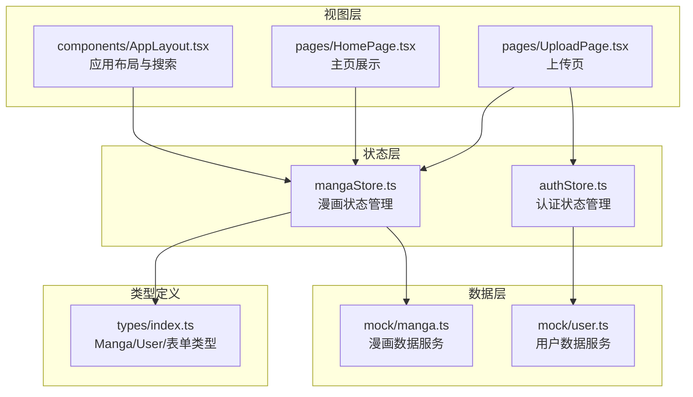
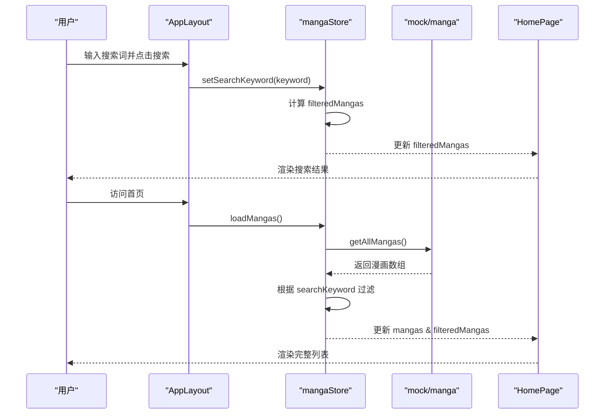
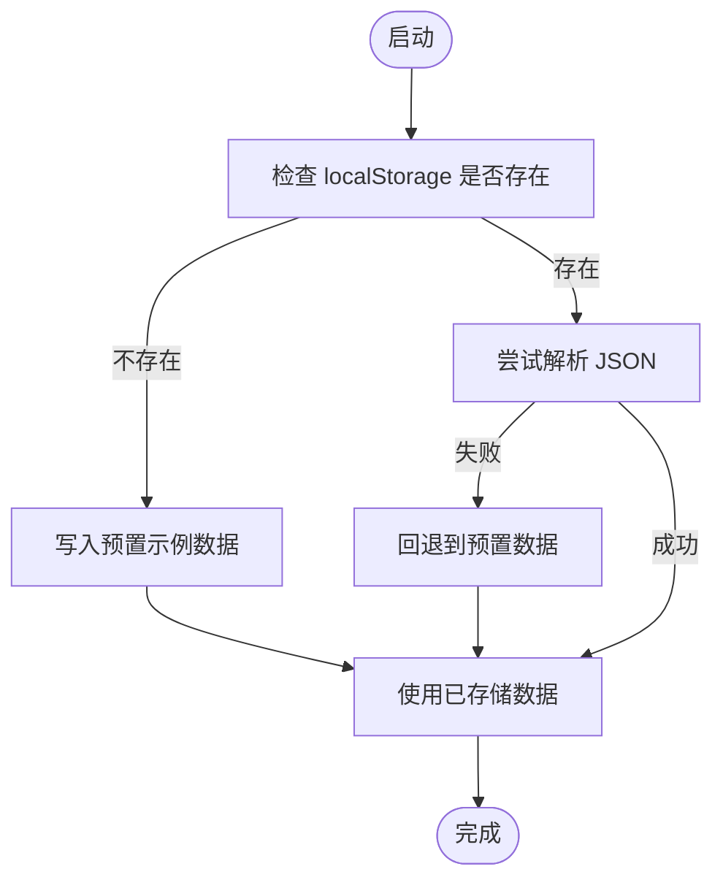
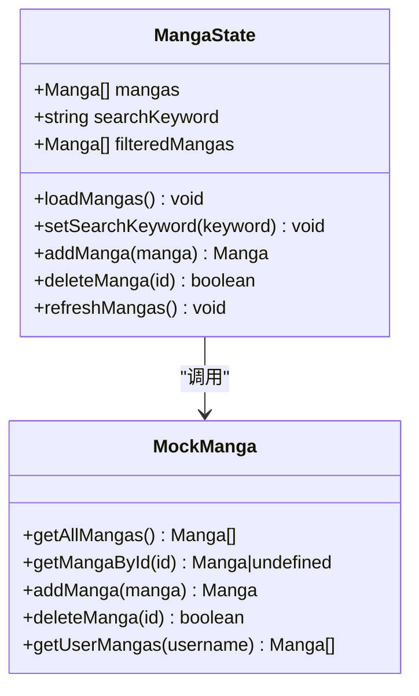
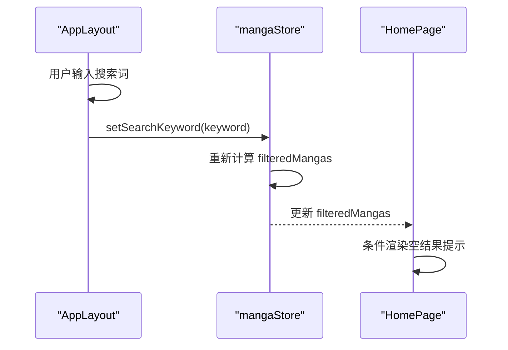
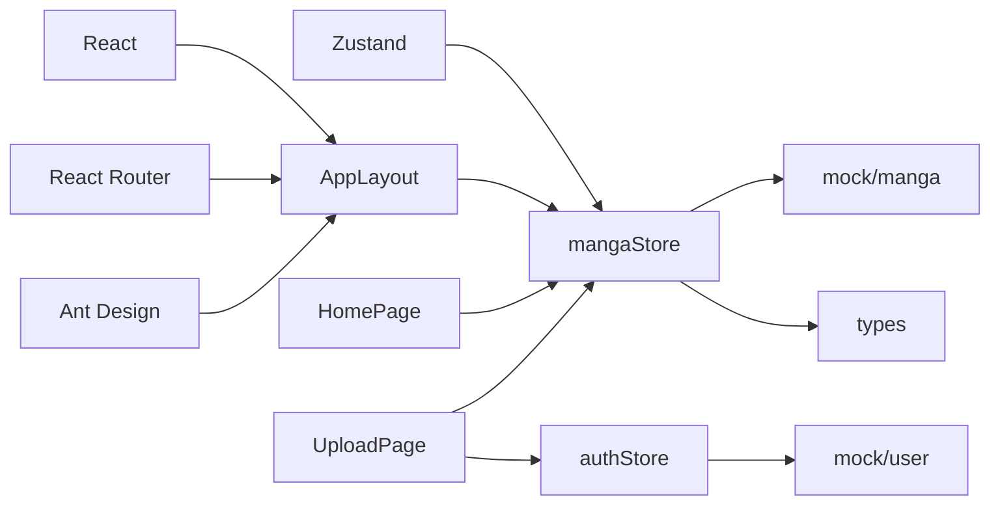

# 漫画数据状态

<cite>
**本文引用的文件**
- [mangaStore.ts](file://manga-website/src/stores/mangaStore.ts)
- [manga.ts](file://manga-website/src/mock/manga.ts)
- [index.ts](file://manga-website/src/types/index.ts)
- [HomePage.tsx](file://manga-website/src/pages/HomePage.tsx)
- [AppLayout.tsx](file://manga-website/src/components/AppLayout.tsx)
- [UploadPage.tsx](file://manga-website/src/pages/UploadPage.tsx)
- [authStore.ts](file://manga-website/src/stores/authStore.ts)
- [package.json](file://manga-website/package.json)
</cite>

## 目录
1. [引言](#引言)
2. [项目结构](#项目结构)
3. [核心组件](#核心组件)
4. [架构总览](#架构总览)
5. [详细组件分析](#详细组件分析)
6. [依赖分析](#依赖分析)
7. [性能考虑](#性能考虑)
8. [故障排查指南](#故障排查指南)
9. [结论](#结论)
10. [附录](#附录)

## 引言
本文件聚焦于漫画数据状态管理模块，系统性解析 mangaStore 的设计与实现，涵盖：
- 漫画数据结构定义与 mock 数据服务交互
- 数据获取 action 的实现逻辑与搜索过滤的状态管理
- 加载机制、缓存策略与更新流程（增删改查）
- 与 mock 数据服务及 localStorage 的持久化策略
- 在组件中的使用示例（主页展示与搜索状态更新）
- 最佳实践：数据结构设计原则、状态更新性能优化与错误处理

## 项目结构
该模块位于前端项目 manga-website 中，采用按功能域划分的目录组织方式：
- stores：状态管理（mangaStore、authStore）
- mock：模拟数据服务（manga、user）
- pages：页面组件（HomePage、UploadPage 等）
- components：通用布局组件（AppLayout）
- types：类型定义（Manga、User、表单等）

图表来源
- [mangaStore.ts:1-62](file://manga-website/src/stores/mangaStore.ts#L1-L62)
- [manga.ts:1-173](file://manga-website/src/mock/manga.ts#L1-L173)
- [index.ts:1-44](file://manga-website/src/types/index.ts#L1-L44)
- [AppLayout.tsx:1-156](file://manga-website/src/components/AppLayout.tsx#L1-L156)
- [HomePage.tsx:1-108](file://manga-website/src/pages/HomePage.tsx#L1-L108)
- [UploadPage.tsx:1-187](file://manga-website/src/pages/UploadPage.tsx#L1-L187)
- [authStore.ts:1-45](file://manga-website/src/stores/authStore.ts#L1-L45)

章节来源
- [package.json:1-26](file://manga-website/package.json#L1-L26)

## 核心组件
- mangaStore：基于 Zustand 的漫画状态容器，负责漫画列表、搜索关键词、过滤后的列表，以及加载、搜索、新增、删除、刷新等动作。
- mock/manga：提供漫画数据的 CRUD 与初始化逻辑，使用 localStorage 进行持久化。
- 类型定义：统一的 Manga 接口与表单接口，确保数据结构一致性。
- 组件集成：AppLayout 负责搜索输入与关键词同步；HomePage 展示过滤后的漫画列表；UploadPage 通过 addManga 完成新增并触发刷新。

章节来源
- [mangaStore.ts:1-62](file://manga-website/src/stores/mangaStore.ts#L1-L62)
- [manga.ts:1-173](file://manga-website/src/mock/manga.ts#L1-L173)
- [index.ts:1-44](file://manga-website/src/types/index.ts#L1-L44)
- [AppLayout.tsx:1-156](file://manga-website/src/components/AppLayout.tsx#L1-L156)
- [HomePage.tsx:1-108](file://manga-website/src/pages/HomePage.tsx#L1-L108)
- [UploadPage.tsx:1-187](file://manga-website/src/pages/UploadPage.tsx#L1-L187)

## 架构总览
mangaStore 作为状态中心，通过调用 mock/manga 的方法完成数据读写，并维护本地过滤视图。AppLayout 负责搜索输入与关键词同步，HomePage 响应状态变化进行渲染，UploadPage 触发新增并刷新列表。

图表来源
- [AppLayout.tsx:22-29](file://manga-website/src/components/AppLayout.tsx#L22-L29)
- [mangaStore.ts:21-44](file://manga-website/src/stores/mangaStore.ts#L21-L44)
- [manga.ts:138-140](file://manga-website/src/mock/manga.ts#L138-L140)
- [HomePage.tsx:9-13](file://manga-website/src/pages/HomePage.tsx#L9-L13)

## 详细组件分析

### 漫画数据结构与类型定义
- Manga 接口包含标识、标题、作者、描述、封面图、原始链接、创建时间与可选上传者字段，满足展示与上传场景的数据需求。
- 表单类型 UploadForm 与 Manga 字段对齐，便于上传页收集与提交。

章节来源
- [index.ts:2-11](file://manga-website/src/types/index.ts#L2-L11)
- [index.ts:37-43](file://manga-website/src/types/index.ts#L37-L43)

### mock 数据服务与持久化策略
- 初始化：首次访问时从 localStorage 读取；若不存在则写入预置示例数据；解析失败时回退到预置数据。
- 读取：getAllMangas 返回当前存储的漫画数组。
- 新增：生成新 ID 与创建时间，插入数组首部，保存至 localStorage。
- 删除：过滤掉指定 ID 的条目，保存更新后的数组。
- 用户上传：getUserMangas 可按上传者筛选。

图表来源
- [manga.ts:119-131](file://manga-website/src/mock/manga.ts#L119-L131)

章节来源
- [manga.ts:119-173](file://manga-website/src/mock/manga.ts#L119-L173)

### mangaStore 设计与实现
- 状态字段：mangas（完整列表）、searchKeyword（当前搜索词）、filteredMangas（过滤视图）。
- 动作：
  - loadMangas：从 mock 读取数据，根据 searchKeyword 过滤，更新 mangas 与 filteredMangas。
  - setSearchKeyword：更新搜索词并重新计算过滤视图。
  - addManga：调用 mock 新增，随后刷新列表。
  - deleteManga：调用 mock 删除，删除成功后刷新列表。
  - refreshMangas：直接重新加载列表。

图表来源
- [mangaStore.ts:5-14](file://manga-website/src/stores/mangaStore.ts#L5-L14)
- [mangaStore.ts:16-61](file://manga-website/src/stores/mangaStore.ts#L16-L61)
- [manga.ts:138-172](file://manga-website/src/mock/manga.ts#L138-L172)

章节来源
- [mangaStore.ts:1-62](file://manga-website/src/stores/mangaStore.ts#L1-L62)

### 搜索过滤功能的状态管理
- 关键点：searchKeyword 与 filteredMangas 解耦，分别用于控制显示与输入。
- AppLayout 负责输入与同步：输入变更时更新本地状态，提交时调用 setSearchKeyword 并导航到首页。
- HomePage 响应 filteredMangas 变化：当存在搜索词且列表为空时展示“未找到”提示。

图表来源
- [AppLayout.tsx:22-29](file://manga-website/src/components/AppLayout.tsx#L22-L29)
- [mangaStore.ts:34-44](file://manga-website/src/stores/mangaStore.ts#L34-L44)
- [HomePage.tsx:15-21](file://manga-website/src/pages/HomePage.tsx#L15-L21)

章节来源
- [AppLayout.tsx:22-29](file://manga-website/src/components/AppLayout.tsx#L22-L29)
- [HomePage.tsx:15-21](file://manga-website/src/pages/HomePage.tsx#L15-L21)

### 数据加载机制、缓存策略与更新流程
- 加载：loadMangas 从 mock 读取并立即应用过滤，避免重复计算。
- 缓存：localStorage 作为持久化存储，初始化阶段一次性读取，后续通过内存数组操作，减少 IO。
- 更新：新增/删除后立即保存到 localStorage，并触发 loadMangas 刷新视图，保证 UI 与存储一致。
- 刷新：refreshMangas 直接重新拉取数据，适用于需要强制同步的场景。

章节来源
- [mangaStore.ts:21-32](file://manga-website/src/stores/mangaStore.ts#L21-L32)
- [mangaStore.ts:46-56](file://manga-website/src/stores/mangaStore.ts#L46-L56)
- [manga.ts:138-167](file://manga-website/src/mock/manga.ts#L138-L167)

### 组件中的使用示例
- 主页组件（HomePage）：
  - 在挂载时调用 loadMangas 初始化列表。
  - 根据 filteredMangas 渲染卡片网格，支持悬停缩放与外部链接跳转。
  - 当存在搜索词且列表为空时，展示“未找到”的空状态。
- 搜索功能（AppLayout）：
  - 输入框绑定本地状态，提交时调用 setSearchKeyword 并导航到首页。
  - 支持清空搜索词，同步清除状态。
- 上传功能（UploadPage）：
  - 使用表单收集数据，调用 addManga 完成新增。
  - 成功后提示消息、重置表单并返回首页。

章节来源
- [HomePage.tsx:9-13](file://manga-website/src/pages/HomePage.tsx#L9-L13)
- [HomePage.tsx:34-104](file://manga-website/src/pages/HomePage.tsx#L34-L104)
- [AppLayout.tsx:22-29](file://manga-website/src/components/AppLayout.tsx#L22-L29)
- [UploadPage.tsx:16-74](file://manga-website/src/pages/UploadPage.tsx#L16-L74)

## 依赖分析
- 外部依赖：React、React Router、Ant Design、Zustand。
- 内部依赖：mangaStore 依赖 mock/manga 与 types；AppLayout 依赖 mangaStore 与 authStore；HomePage/UploadPage 依赖 mangaStore。

图表来源
- [package.json:11-24](file://manga-website/package.json#L11-L24)
- [mangaStore.ts:1-3](file://manga-website/src/stores/mangaStore.ts#L1-L3)
- [AppLayout.tsx:1-14](file://manga-website/src/components/AppLayout.tsx#L1-L14)
- [HomePage.tsx:1-4](file://manga-website/src/pages/HomePage.tsx#L1-L4)
- [UploadPage.tsx:1-8](file://manga-website/src/pages/UploadPage.tsx#L1-L8)
- [authStore.ts:1-3](file://manga-website/src/stores/authStore.ts#L1-L3)

章节来源
- [package.json:1-26](file://manga-website/package.json#L1-L26)

## 性能考虑
- 内存优先：localStorage 仅在初始化与写入时进行 IO，其余操作在内存数组上完成，降低频繁读写带来的性能损耗。
- 懒过滤：searchKeyword 为空时直接使用完整列表，避免不必要的过滤开销；有关键词时再进行过滤。
- 批量更新：新增/删除后统一调用 loadMangas 刷新，避免多次独立更新导致的重复渲染。
- 渲染优化：HomePage 使用卡片网格与条件渲染（空结果提示），减少无效 DOM 结构。
- 建议优化：
  - 对大列表可引入虚拟滚动（Virtualized List）以提升渲染性能。
  - 对搜索词变更可增加防抖（debounce）以减少频繁过滤。
  - 对过滤算法可考虑建立索引或预处理小写化字段，进一步降低比较成本。

## 故障排查指南
- 搜索无结果：
  - 检查 AppLayout 是否正确调用 setSearchKeyword。
  - 确认 HomePage 是否响应 filteredMangas 的变化。
- 上传失败：
  - 确认 UploadPage 已设置 uploadedBy（来自登录用户）。
  - 检查 addManga 是否抛出异常并捕获错误提示。
- 数据不一致：
  - 确认新增/删除后是否调用 loadMangas 刷新。
  - 检查 localStorage 是否被意外清空或损坏。
- 类型错误：
  - 确保表单字段与 UploadForm/Manga 接口一致。
  - 检查 mock 层返回值与期望类型匹配。

章节来源
- [AppLayout.tsx:22-29](file://manga-website/src/components/AppLayout.tsx#L22-L29)
- [UploadPage.tsx:46-74](file://manga-website/src/pages/UploadPage.tsx#L46-L74)
- [mangaStore.ts:46-56](file://manga-website/src/stores/mangaStore.ts#L46-L56)
- [manga.ts:148-167](file://manga-website/src/mock/manga.ts#L148-L167)

## 结论
mangaStore 通过清晰的状态字段与动作设计，结合 mock 数据服务与 localStorage 持久化，实现了漫画数据的高效加载、搜索过滤与增删改查。组件层通过最小化的状态订阅与条件渲染，确保了良好的用户体验。建议在后续迭代中引入防抖、虚拟滚动与更完善的错误边界，以进一步提升性能与稳定性。

## 附录
- 最佳实践清单
  - 数据结构设计：保持接口稳定、字段明确、可扩展（如 uploadedBy）。
  - 状态更新：集中式刷新（loadMangas），避免分散更新。
  - 搜索优化：输入防抖、懒过滤、必要时建立索引。
  - 错误处理：统一捕获与提示，保障用户反馈及时。
  - 性能优化：内存优先、批量更新、虚拟化渲染。