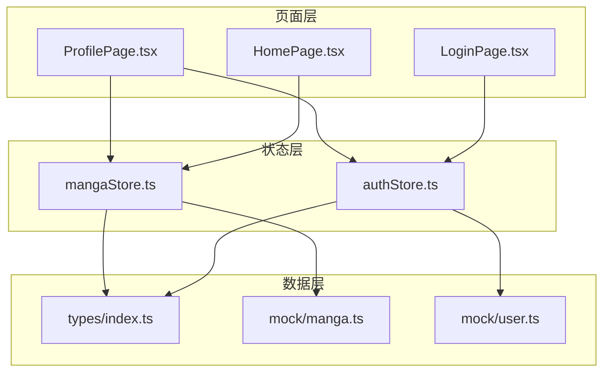
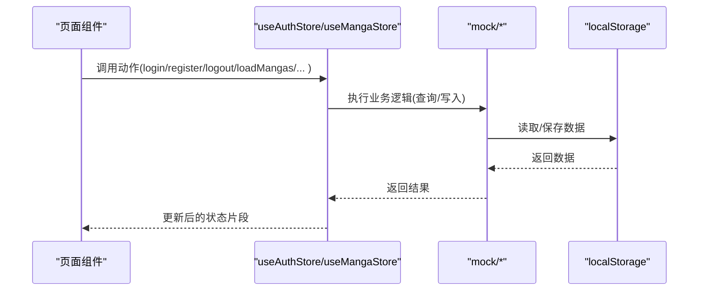
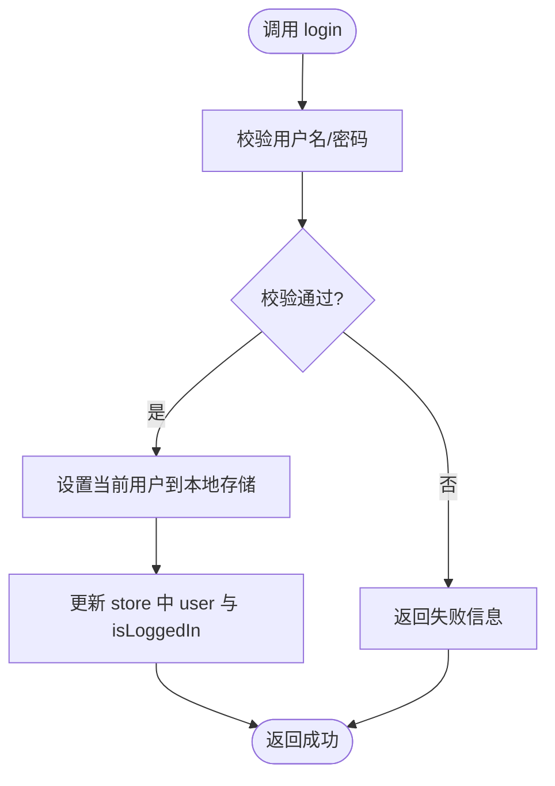
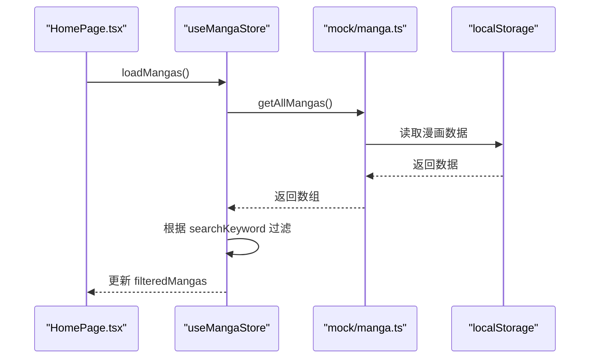
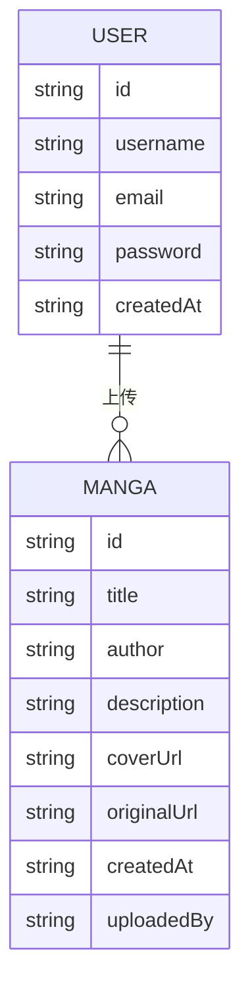
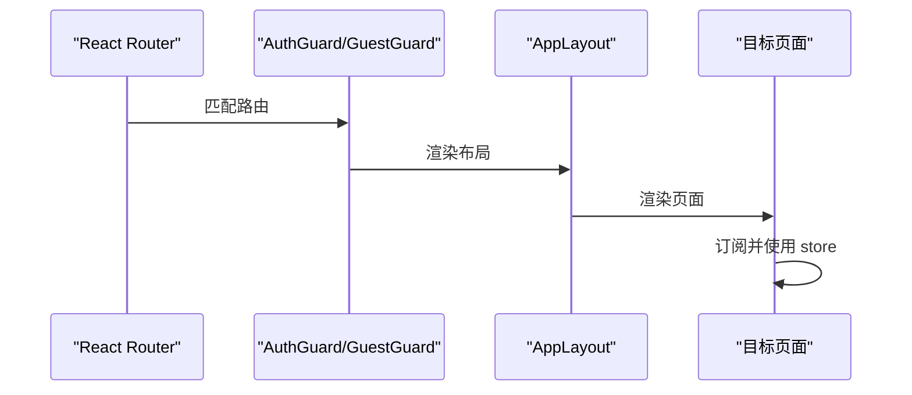
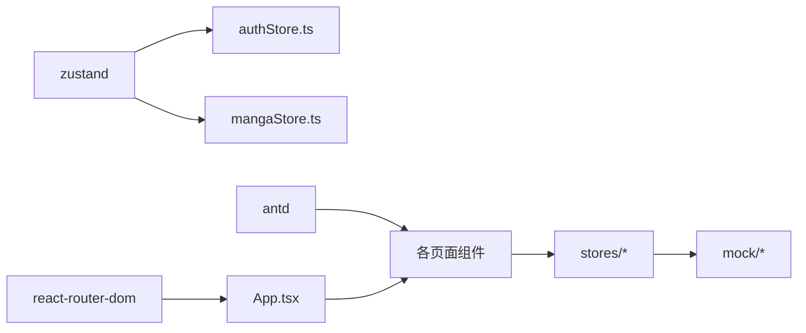

# 状态管理

<cite>
**本文引用的文件**
- [authStore.ts](file://manga-website/src/stores/authStore.ts)
- [mangaStore.ts](file://manga-website/src/stores/mangaStore.ts)
- [index.ts](file://manga-website/src/types/index.ts)
- [manga.ts](file://manga-website/src/mock/manga.ts)
- [user.ts](file://manga-website/src/mock/user.ts)
- [HomePage.tsx](file://manga-website/src/pages/HomePage.tsx)
- [LoginPage.tsx](file://manga-website/src/pages/LoginPage.tsx)
- [ProfilePage.tsx](file://manga-website/src/pages/ProfilePage.tsx)
- [App.tsx](file://manga-website/src/App.tsx)
- [package.json](file://manga-website/package.json)
</cite>

## 目录
1. [简介](#简介)
2. [项目结构](#项目结构)
3. [核心组件](#核心组件)
4. [架构总览](#架构总览)
5. [详细组件分析](#详细组件分析)
6. [依赖分析](#依赖分析)
7. [性能考虑](#性能考虑)
8. [故障排查指南](#故障排查指南)
9. [结论](#结论)
10. [附录](#附录)

## 简介
本项目采用 Zustand 实现前端状态管理，围绕“认证状态”和“漫画数据状态”两大模块构建。Zustand 提供轻量、直观且高性能的状态容器，通过函数式 store 定义状态与派发动作，避免样板代码与 Provider 层级污染。项目同时使用 Ant Design 组件库与 React Router 实现路由守卫与页面布局，mock 数据层负责本地持久化与模拟接口行为。

## 项目结构
- stores：存放 Zustand store（认证与漫画）
- mock：存放本地数据与持久化逻辑（localStorage）
- pages：页面组件，直接消费 store 并触发动作
- types：类型定义（漫画、用户、表单等）
- App.tsx：路由与布局装配

图表来源
- [App.tsx:24-59](file://manga-website/src/App.tsx#L24-L59)
- [authStore.ts:14-44](file://manga-website/src/stores/authStore.ts#L14-L44)
- [mangaStore.ts:16-61](file://manga-website/src/stores/mangaStore.ts#L16-L61)
- [manga.ts:138-167](file://manga-website/src/mock/manga.ts#L138-L167)
- [user.ts:26-89](file://manga-website/src/mock/user.ts#L26-L89)

章节来源
- [App.tsx:13-63](file://manga-website/src/App.tsx#L13-L63)
- [package.json:11-24](file://manga-website/package.json#L11-L24)

## 核心组件
- 认证状态（useAuthStore）：维护用户信息与登录态，提供登录、注册、登出、鉴权检查动作；基于本地存储实现会话持久化。
- 漫画数据状态（useMangaStore）：维护漫画列表、搜索关键字与筛选后的列表；提供加载、设置关键字、新增、删除、刷新动作；结合 mock 数据与本地存储实现数据持久化与筛选。

章节来源
- [authStore.ts:5-12](file://manga-website/src/stores/authStore.ts#L5-L12)
- [mangaStore.ts:5-14](file://manga-website/src/stores/mangaStore.ts#L5-L14)

## 架构总览
Zustand store 通过 create 工厂函数创建，内部以 set/get 访问器实现状态更新与读取。页面组件通过 hooks 方式订阅 store 的部分状态或动作，实现最小化重渲染。mock 层负责数据初始化、增删改查与本地持久化，保证开发阶段无需真实后端即可运行。

图表来源
- [authStore.ts:18-43](file://manga-website/src/stores/authStore.ts#L18-L43)
- [mangaStore.ts:21-60](file://manga-website/src/stores/mangaStore.ts#L21-L60)
- [manga.ts:138-167](file://manga-website/src/mock/manga.ts#L138-L167)
- [user.ts:26-89](file://manga-website/src/mock/user.ts#L26-L89)

## 详细组件分析

### 认证状态管理（useAuthStore）
- 状态定义
  - user：当前登录用户或空
  - isLoggedIn：布尔值表示登录态
- 动作设计
  - login：校验凭据，成功则设置用户与登录态
  - register：校验重复，成功则写入用户列表并设置当前用户
  - logout：移除当前用户
  - checkAuth：从本地存储读取当前用户并同步登录态
- 会话持久化
  - 使用本地存储保存当前用户信息，刷新页面后仍可恢复登录态
- 页面集成
  - 登录页通过动作返回值控制消息提示与路由跳转
  - 个人中心页根据用户信息渲染内容

图表来源
- [authStore.ts:18-24](file://manga-website/src/stores/authStore.ts#L18-L24)
- [user.ts:51-64](file://manga-website/src/mock/user.ts#L51-L64)

章节来源
- [authStore.ts:5-12](file://manga-website/src/stores/authStore.ts#L5-L12)
- [authStore.ts:14-44](file://manga-website/src/stores/authStore.ts#L14-L44)
- [user.ts:26-89](file://manga-website/src/mock/user.ts#L26-L89)
- [LoginPage.tsx:14-22](file://manga-website/src/pages/LoginPage.tsx#L14-L22)

### 漫画数据状态管理（useMangaStore）
- 状态定义
  - mangas：完整漫画列表
  - searchKeyword：搜索关键字
  - filteredMangas：基于关键字筛选后的列表
- 动作设计
  - loadMangas：从 mock 读取数据并按关键字筛选，更新 mangas 与 filteredMangas
  - setSearchKeyword：仅更新关键字与筛选结果
  - addManga：新增漫画后重新加载数据
  - deleteManga：删除漫画后条件性刷新
  - refreshMangas：重新加载数据
- 缓存与持久化
  - 通过 mock 层对 localStorage 进行读写，实现数据持久化
- 页面集成
  - 首页在挂载时自动加载并支持关键词搜索
  - 个人中心展示用户上传的漫画并支持删除

图表来源
- [mangaStore.ts:21-32](file://manga-website/src/stores/mangaStore.ts#L21-L32)
- [manga.ts:138-140](file://manga-website/src/mock/manga.ts#L138-L140)

章节来源
- [mangaStore.ts:5-14](file://manga-website/src/stores/mangaStore.ts#L5-L14)
- [mangaStore.ts:16-61](file://manga-website/src/stores/mangaStore.ts#L16-L61)
- [manga.ts:138-167](file://manga-website/src/mock/manga.ts#L138-L167)
- [HomePage.tsx:8-13](file://manga-website/src/pages/HomePage.tsx#L8-L13)

### 类型系统与数据模型
- 漫画模型（Manga）：包含标识、标题、作者、封面、源站链接、创建时间与可选上传者
- 用户模型（User）：包含标识、用户名、邮箱、密码、创建时间
- 表单模型：登录、注册、上传表单字段定义
- 作用：为 store、mock 与页面组件提供统一的数据契约，确保类型安全

图表来源
- [index.ts:2-20](file://manga-website/src/types/index.ts#L2-L20)

章节来源
- [index.ts:1-44](file://manga-website/src/types/index.ts#L1-L44)

### 页面与路由集成
- App.tsx：配置路由与布局，将页面包裹在 AuthGuard/GuestGuard 中实现访问控制
- LoginPage：绑定登录动作，根据返回结果进行提示与跳转
- HomePage：订阅漫画筛选结果，渲染卡片列表
- ProfilePage：读取当前用户，展示并管理用户上传的漫画

图表来源
- [App.tsx:24-59](file://manga-website/src/App.tsx#L24-L59)

章节来源
- [App.tsx:13-63](file://manga-website/src/App.tsx#L13-L63)
- [LoginPage.tsx:9-22](file://manga-website/src/pages/LoginPage.tsx#L9-L22)
- [HomePage.tsx:8-107](file://manga-website/src/pages/HomePage.tsx#L8-L107)
- [ProfilePage.tsx:11-33](file://manga-website/src/pages/ProfilePage.tsx#L11-L33)

## 依赖分析
- Zustand：提供轻量状态容器，减少样板代码与 Provider 嵌套
- Ant Design：提供 UI 组件与主题配置
- React Router：提供路由与守卫能力
- 本地存储：用于会话与数据持久化

图表来源
- [package.json:11-24](file://manga-website/package.json#L11-L24)
- [authStore.ts:1](file://manga-website/src/stores/authStore.ts#L1)
- [mangaStore.ts:1](file://manga-website/src/stores/mangaStore.ts#L1)

章节来源
- [package.json:11-24](file://manga-website/package.json#L11-L24)

## 性能考虑
- 最小化订阅：页面仅订阅所需状态片段，降低重渲染范围
- 合理的筛选策略：在 store 内部进行筛选，避免在组件内做昂贵计算
- 批量更新：通过 set 一次性更新多个字段，减少多次重渲染
- 本地存储读写：在必要时才进行读写，避免频繁 IO
- 异步流程：当前 mock 层为同步实现，如接入真实 API，建议在 store 内封装异步动作并加入加载状态与错误处理

## 故障排查指南
- 登录失败
  - 检查用户名是否存在与密码是否匹配
  - 查看本地存储中的当前用户是否正确设置
- 注册失败
  - 检查用户名与邮箱是否重复
  - 确认用户列表是否成功写入本地存储
- 漫画列表为空
  - 确认本地存储中是否已有预置数据
  - 检查筛选关键字是否导致结果为空
- 删除漫画无效
  - 确认返回值与本地存储更新是否一致
  - 检查刷新动作是否被调用

章节来源
- [user.ts:26-64](file://manga-website/src/mock/user.ts#L26-L64)
- [manga.ts:148-167](file://manga-website/src/mock/manga.ts#L148-L167)
- [authStore.ts:35-43](file://manga-website/src/stores/authStore.ts#L35-L43)
- [mangaStore.ts:52-60](file://manga-website/src/stores/mangaStore.ts#L52-L60)

## 结论
本项目以 Zustand 为核心，结合 mock 数据与本地存储，实现了简洁高效的前端状态管理方案。认证与漫画两大模块职责清晰，页面组件通过最小订阅实现高可维护性。后续可扩展真实 API、增加加载与错误状态、引入中间件与调试工具，进一步提升稳定性与可观测性。

## 附录
- 在组件中使用 store 的要点
  - 仅订阅需要的状态片段，避免过度订阅
  - 将动作作为回调传入事件处理器，保持组件逻辑清晰
  - 对于复杂异步流程，可在 store 内封装动作并集中处理副作用
- 最佳实践清单
  - 状态结构扁平化，避免深层嵌套
  - 动作命名采用动词短语，如 loadXxx、setXxx、addXxx、deleteXxx
  - 使用类型定义约束状态与动作参数，提升可读性与安全性
  - 对关键数据进行本地持久化，改善用户体验
  - 对耗时操作添加加载状态与错误提示