# 认证状态管理

<cite>
**本文档引用的文件**
- [authStore.ts](file://src/stores/authStore.ts)
- [AppLayout.tsx](file://src/components/AppLayout.tsx)
- [AuthGuard.tsx](file://src/components/AuthGuard.tsx)
- [GuestGuard.tsx](file://src/components/GuestGuard.tsx)
- [LoginPage.tsx](file://src/pages/LoginPage.tsx)
- [user.ts](file://src/mock/user.ts)
- [index.ts](file://src/types/index.ts)
</cite>

## 目录
1. [简介](#简介)
2. [项目结构](#项目结构)
3. [核心组件](#核心组件)
4. [架构概览](#架构概览)
5. [详细组件分析](#详细组件分析)
6. [依赖关系分析](#依赖关系分析)
7. [性能考虑](#性能考虑)
8. [故障排除指南](#故障排除指南)
9. [结论](#结论)

## 简介

本项目采用 Zustand 状态管理库实现前端认证状态管理，通过一个集中式的 authStore 模块统一管理用户认证相关的所有状态和操作。该模块提供了完整的认证生命周期管理，包括用户登录、注册、登出以及认证状态检查等功能。

系统采用 Mock 数据层设计，模拟真实的用户认证服务，便于开发和测试环境使用。认证状态通过 React 组件进行响应式更新，支持路由级别的权限控制。

## 项目结构

项目采用基于功能的模块组织方式，认证状态管理相关的文件分布如下：

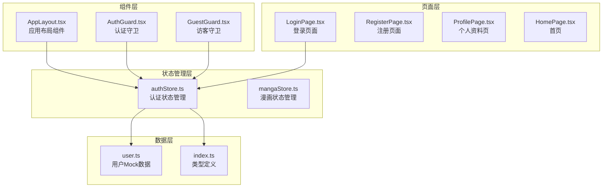

**图表来源**
- [authStore.ts:1-45](file://src/stores/authStore.ts#L1-L45)
- [AppLayout.tsx:1-156](file://src/components/AppLayout.tsx#L1-L156)
- [AuthGuard.tsx:1-17](file://src/components/AuthGuard.tsx#L1-L17)
- [GuestGuard.tsx:1-17](file://src/components/GuestGuard.tsx#L1-L17)
- [LoginPage.tsx:1-86](file://src/pages/LoginPage.tsx#L1-L86)

**章节来源**
- [authStore.ts:1-45](file://src/stores/authStore.ts#L1-L45)
- [AppLayout.tsx:1-156](file://src/components/AppLayout.tsx#L1-L156)

## 核心组件

### 认证状态接口定义

认证状态管理的核心是 `AuthState` 接口，它定义了完整的认证状态结构：

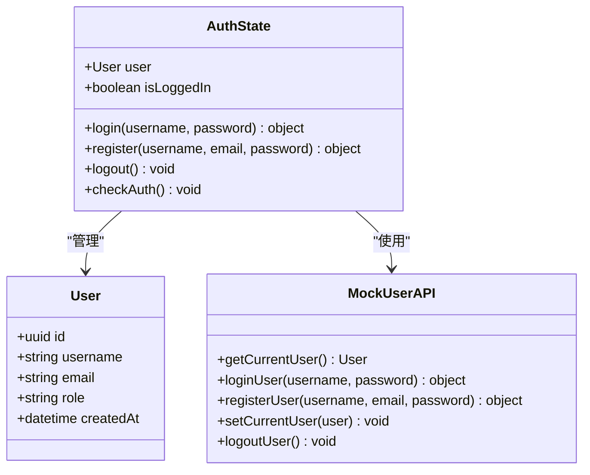

**图表来源**
- [authStore.ts:5-12](file://src/stores/authStore.ts#L5-L12)
- [user.ts](file://src/mock/user.ts)

认证状态包含以下关键属性：
- `user`: 当前登录用户信息，类型为 User 或 null
- `isLoggedIn`: 布尔值，表示用户是否已认证
- `login()`: 登录操作函数
- `register()`: 注册操作函数  
- `logout()`: 登出操作函数
- `checkAuth()`: 认证状态检查函数

**章节来源**
- [authStore.ts:5-12](file://src/stores/authStore.ts#L5-L12)

### Zustand Store 实现

系统使用 Zustand 的 `create` 函数创建状态管理器，实现了以下核心功能：

1. **状态初始化**: 从 Mock 数据层获取当前用户状态
2. **状态更新**: 通过 `set` 函数更新全局状态
3. **动作定义**: 提供认证相关的业务操作方法

**章节来源**
- [authStore.ts:14-44](file://src/stores/authStore.ts#L14-L44)

## 架构概览

系统采用分层架构设计，各层职责清晰分离：

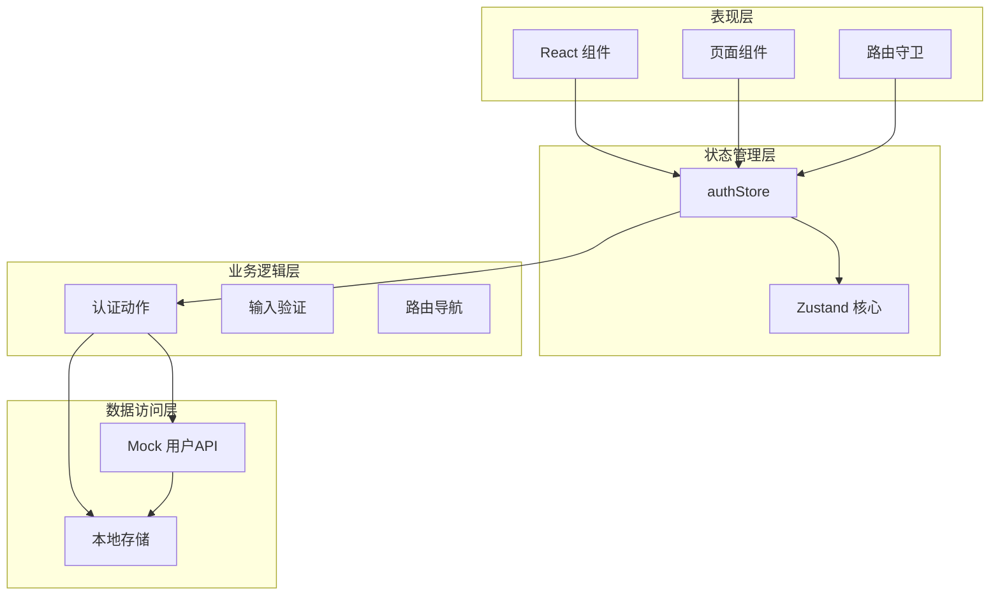

**图表来源**
- [authStore.ts:1-45](file://src/stores/authStore.ts#L1-L45)
- [AppLayout.tsx:13-21](file://src/components/AppLayout.tsx#L13-L21)
- [AuthGuard.tsx:8-16](file://src/components/AuthGuard.tsx#L8-L16)

## 详细组件分析

### 认证状态管理器 (authStore)

#### 状态结构设计

认证状态管理器采用简洁而高效的状态结构设计：

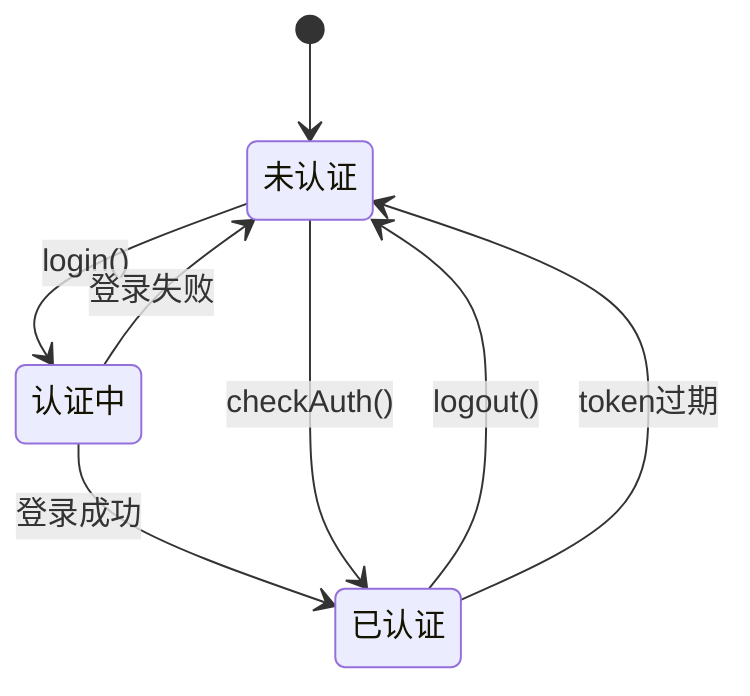

**图表来源**
- [authStore.ts:18-43](file://src/stores/authStore.ts#L18-L43)

#### 登录流程实现

登录操作通过以下步骤完成：

1. 调用 Mock 用户 API 验证凭据
2. 验证成功后更新全局状态
3. 返回操作结果给调用方

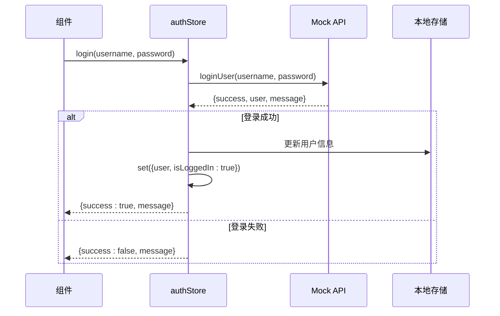

**图表来源**
- [authStore.ts:18-24](file://src/stores/authStore.ts#L18-L24)
- [user.ts](file://src/mock/user.ts)

#### 注册流程实现

注册流程与登录类似，但需要额外的用户信息处理：

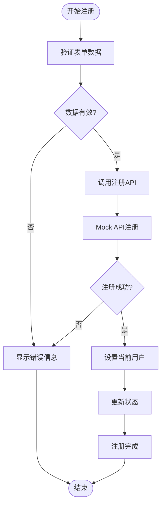

**图表来源**
- [authStore.ts:26-33](file://src/stores/authStore.ts#L26-L33)

#### 登出流程实现

登出操作负责清理所有认证相关数据：

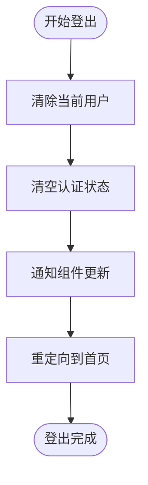

**图表来源**
- [authStore.ts:35-38](file://src/stores/authStore.ts#L35-L38)

**章节来源**
- [authStore.ts:18-43](file://src/stores/authStore.ts#L18-L43)

### 路由守卫组件

#### 认证守卫 (AuthGuard)

认证守卫用于保护需要登录才能访问的页面：

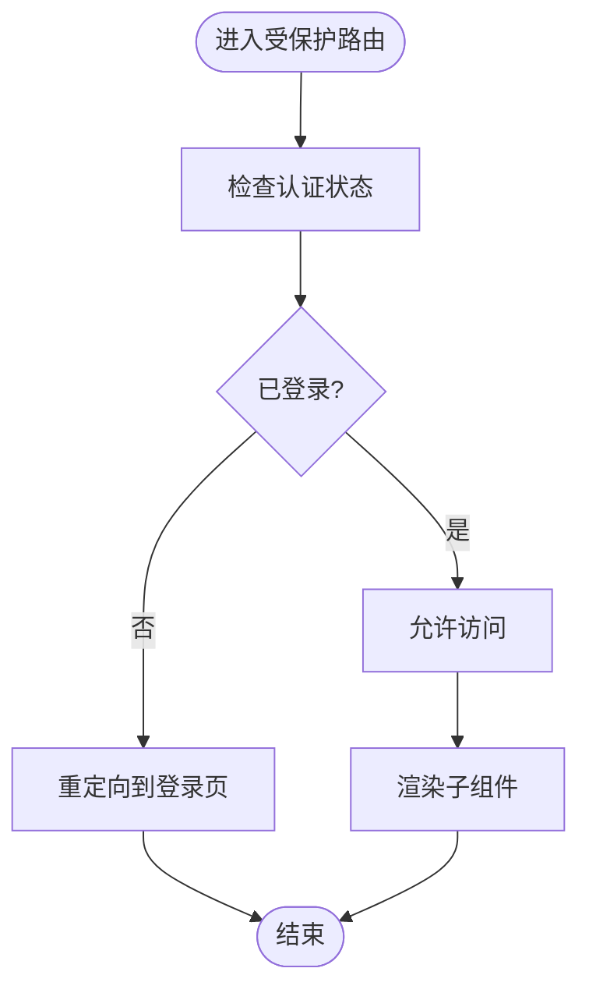

**图表来源**
- [AuthGuard.tsx:8-16](file://src/components/AuthGuard.tsx#L8-L16)

#### 访客守卫 (GuestGuard)

访客守卫用于保护登录页面，防止已登录用户访问：

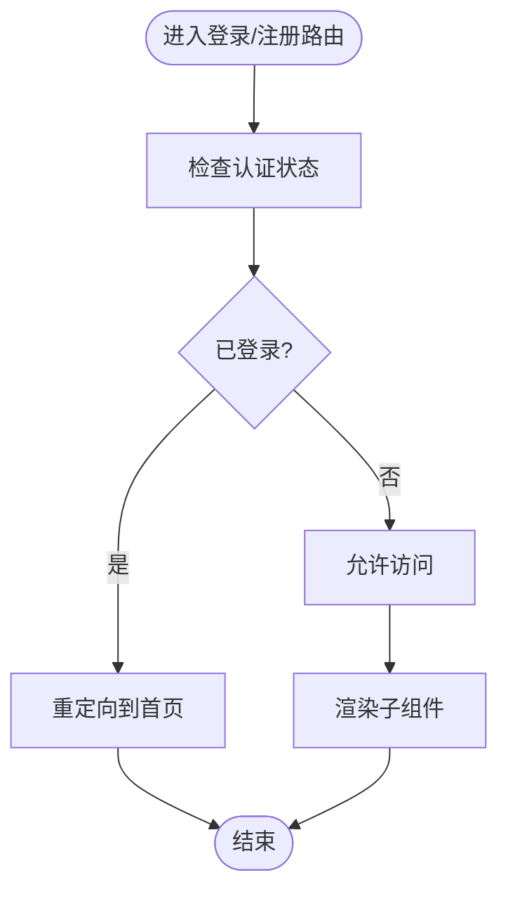

**图表来源**
- [GuestGuard.tsx:8-16](file://src/components/GuestGuard.tsx#L8-L16)

**章节来源**
- [AuthGuard.tsx:1-17](file://src/components/AuthGuard.tsx#L1-L17)
- [GuestGuard.tsx:1-17](file://src/components/GuestGuard.tsx#L1-L17)

### 页面组件集成

#### 登录页面组件

登录页面组件展示了如何在实际应用中使用认证状态管理：

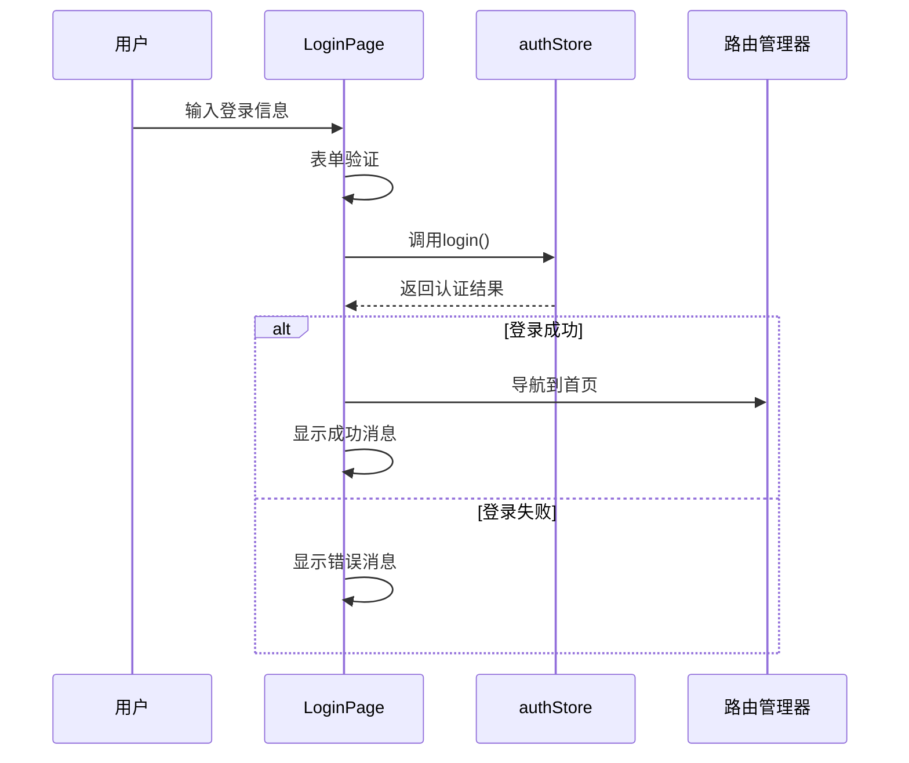

**图表来源**
- [LoginPage.tsx:14-22](file://src/pages/LoginPage.tsx#L14-L22)
- [authStore.ts:18-24](file://src/stores/authStore.ts#L18-L24)

**章节来源**
- [LoginPage.tsx:1-86](file://src/pages/LoginPage.tsx#L1-L86)

### 应用布局组件

应用布局组件展示了认证状态在导航菜单中的实际应用：

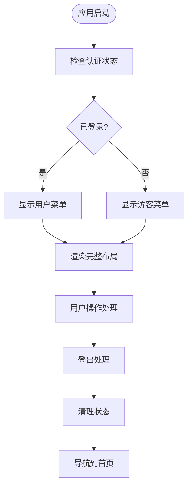

**图表来源**
- [AppLayout.tsx:21-34](file://src/components/AppLayout.tsx#L21-L34)

**章节来源**
- [AppLayout.tsx:19-156](file://src/components/AppLayout.tsx#L19-L156)

## 依赖关系分析

系统各组件之间的依赖关系清晰明确：

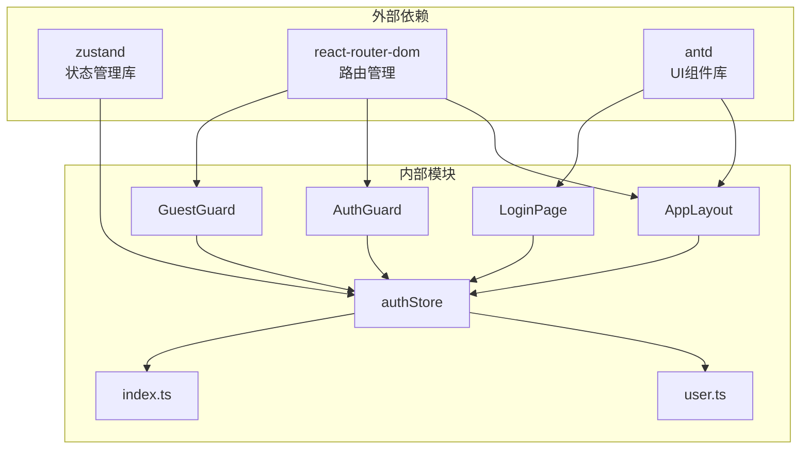

**图表来源**
- [authStore.ts:1-3](file://src/stores/authStore.ts#L1-L3)
- [AppLayout.tsx:1-14](file://src/components/AppLayout.tsx#L1-L14)

**章节来源**
- [authStore.ts:1-3](file://src/stores/authStore.ts#L1-L3)
- [AppLayout.tsx:1-14](file://src/components/AppLayout.tsx#L1-L14)

## 性能考虑

### 状态更新优化

1. **选择性订阅**: 使用 Zustand 的选择器模式只订阅必要的状态
2. **状态合并**: 将相关的认证状态合并到单一 store 中
3. **避免不必要的重渲染**: 通过精确的状态选择减少组件重渲染

### 认证状态检查

系统提供了 `checkAuth` 方法用于定期检查认证状态，建议在应用启动时调用以确保状态同步。

### 内存管理

- 及时清理认证相关的事件监听器
- 在组件卸载时取消任何正在进行的认证请求
- 合理使用 React 的 useEffect 清理函数

## 故障排除指南

### 常见问题及解决方案

#### 登录失败问题

**症状**: 用户登录后仍然显示未认证状态

**可能原因**:
1. Mock API 返回的用户数据格式不正确
2. 状态更新逻辑出现异常
3. 组件订阅状态的方式有问题

**解决步骤**:
1. 检查 Mock API 的返回格式
2. 验证状态更新逻辑
3. 确认组件正确订阅了认证状态

#### 认证状态不同步

**症状**: 页面刷新后认证状态丢失

**可能原因**:
1. 缺少初始化时的状态检查
2. 本地存储机制未正确实现

**解决步骤**:
1. 在应用启动时调用 `checkAuth` 方法
2. 实现本地存储的持久化机制

#### 路由守卫失效

**症状**: 已登录用户仍被重定向到登录页

**可能原因**:
1. 认证状态检查逻辑错误
2. 组件订阅方式不正确

**解决步骤**:
1. 检查 `useAuthStore` 的订阅方式
2. 验证 `isLoggedIn` 状态的计算逻辑

**章节来源**
- [authStore.ts:40-43](file://src/stores/authStore.ts#L40-L43)
- [AuthGuard.tsx:8-16](file://src/components/AuthGuard.tsx#L8-L16)

## 结论

本认证状态管理模块通过简洁而高效的架构设计，实现了完整的用户认证生命周期管理。系统采用 Zustand 状态管理库，提供了响应式的状态更新机制和良好的性能表现。

### 主要优势

1. **模块化设计**: 认证逻辑集中在单一的 store 中，便于维护和测试
2. **类型安全**: 完整的 TypeScript 类型定义确保代码质量
3. **易于扩展**: 清晰的接口设计便于添加新的认证功能
4. **组件集成**: 与 React 组件的无缝集成，提供良好的开发体验

### 改进建议

1. **真实 API 集成**: 将 Mock 数据层替换为真实的后端 API
2. **Token 管理**: 实现 JWT token 的存储和自动刷新机制
3. **错误处理**: 增强错误处理和用户反馈机制
4. **安全增强**: 添加 CSRF 保护和更严格的身份验证

该模块为漫画网站项目提供了坚实的认证基础，为后续的功能扩展和安全增强奠定了良好基础。