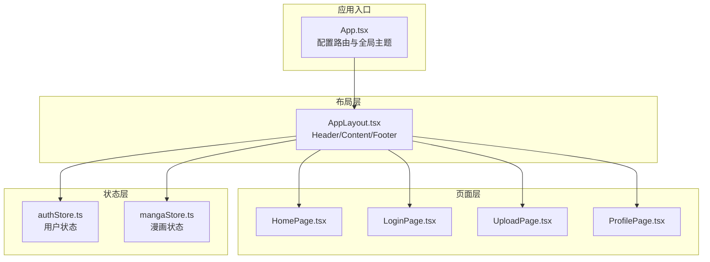
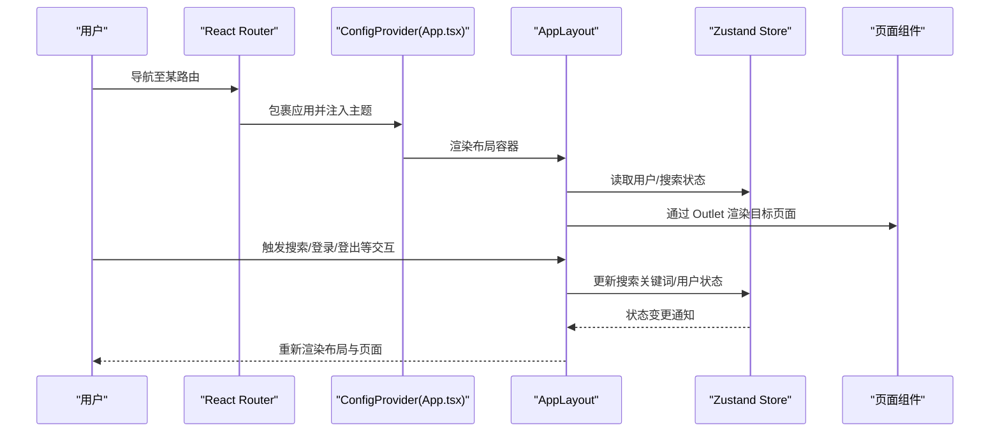
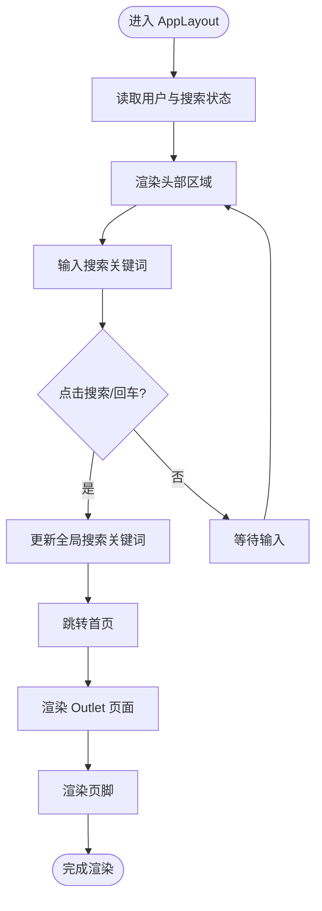
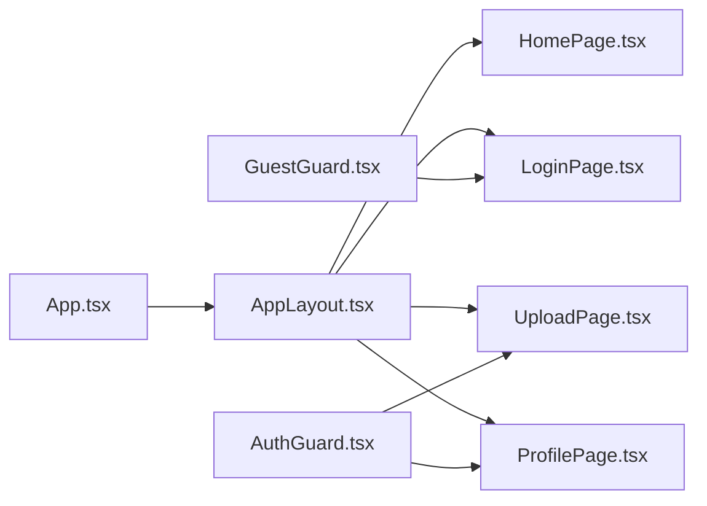
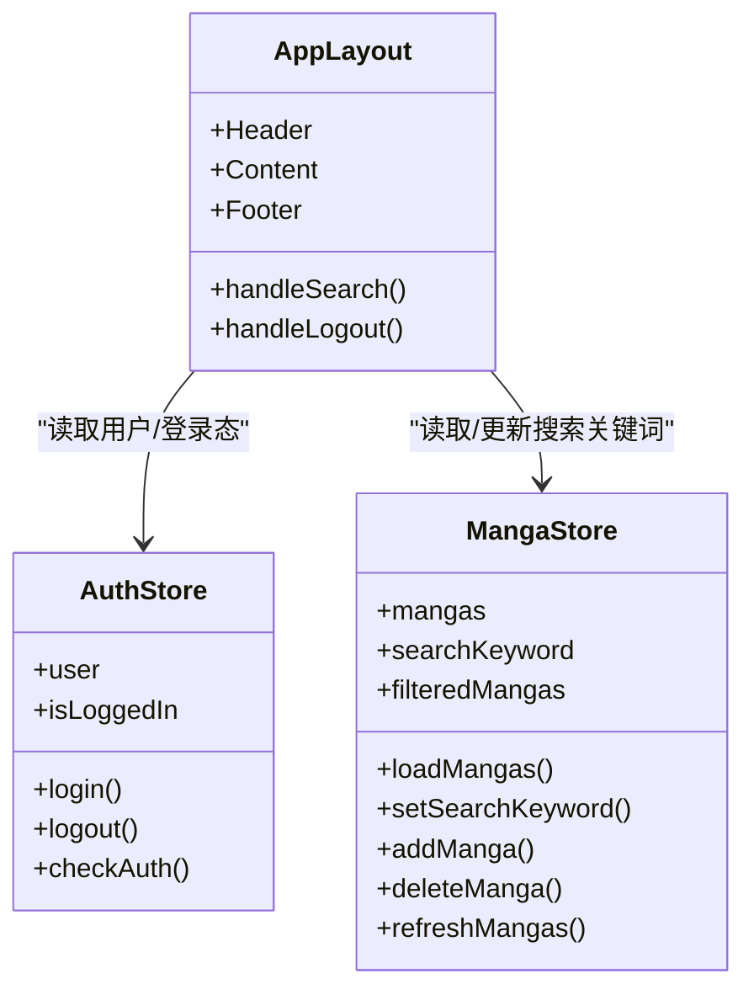
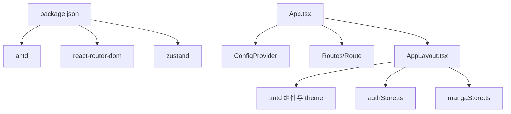

# 布局组件

<cite>
**本文引用的文件**
- [AppLayout.tsx](file://src/components/AppLayout.tsx)
- [App.tsx](file://src/App.tsx)
- [HomePage.tsx](file://src/pages/HomePage.tsx)
- [LoginPage.tsx](file://src/pages/LoginPage.tsx)
- [authStore.ts](file://src/stores/authStore.ts)
- [mangaStore.ts](file://src/stores/mangaStore.ts)
- [AuthGuard.tsx](file://src/components/AuthGuard.tsx)
- [GuestGuard.tsx](file://src/components/GuestGuard.tsx)
- [index.ts](file://src/types/index.ts)
- [package.json](file://package.json)
</cite>

## 目录
1. [简介](#简介)
2. [项目结构](#项目结构)
3. [核心组件](#核心组件)
4. [架构总览](#架构总览)
5. [详细组件分析](#详细组件分析)
6. [依赖分析](#依赖分析)
7. [性能考虑](#性能考虑)
8. [故障排查指南](#故障排查指南)
9. [结论](#结论)
10. [附录](#附录)

## 简介
本文件围绕漫画网站项目的主布局组件 AppLayout 进行系统化文档整理，重点阐述其设计理念、实现细节与最佳实践。内容涵盖头部导航、内容区域与页脚的布局结构；Props 接口与状态管理（基于 Zustand）；响应式设计与 Ant Design 主题定制；以及如何在不同页面中复用布局组件、处理动态变化与状态同步。

## 项目结构
该应用采用前端路由 + 组件化 + 状态管理的分层组织方式：
- 路由层：在根组件中集中配置路由与守卫，并以 AppLayout 作为所有页面的容器布局。
- 布局层：AppLayout 负责统一的头部、内容区与页脚结构，内部集成搜索、用户菜单等交互。
- 页面层：各业务页面（如首页、登录页、上传页、个人中心等）通过 Outlet 渲染。
- 状态层：使用 Zustand 管理用户认证与漫画数据的状态与派发逻辑。
- 类型层：集中定义漫画、用户、登录/注册/上传等表单的数据模型。

图表来源
- [App.tsx:13-63](file://src/App.tsx#L13-L63)
- [AppLayout.tsx:19-155](file://src/components/AppLayout.tsx#L19-L155)

章节来源
- [App.tsx:13-63](file://src/App.tsx#L13-L63)
- [package.json:11-24](file://package.json#L11-L24)

## 核心组件
- AppLayout：主布局组件，负责头部导航（Logo、搜索、用户操作）、内容区占位与页脚信息。内部使用 Ant Design 的 Layout/Header/Content/Footer 组合，并通过 ConfigProvider 提供的主题令牌进行样式定制。
- 状态管理：
  - 认证状态：useAuthStore 提供用户信息、登录/注册/登出与鉴权检查。
  - 漫画状态：useMangaStore 提供漫画列表加载、关键词搜索与过滤后的结果集。
- 路由守卫：
  - AuthGuard：仅已登录用户可访问受保护页面。
  - GuestGuard：未登录用户才可访问登录/注册页面。

章节来源
- [AppLayout.tsx:19-155](file://src/components/AppLayout.tsx#L19-L155)
- [authStore.ts:14-44](file://src/stores/authStore.ts#L14-L44)
- [mangaStore.ts:16-61](file://src/stores/mangaStore.ts#L16-L61)
- [AuthGuard.tsx:8-16](file://src/components/AuthGuard.tsx#L8-L16)
- [GuestGuard.tsx:8-16](file://src/components/GuestGuard.tsx#L8-L16)

## 架构总览
下图展示了从应用入口到页面渲染的整体流程，以及布局与状态之间的交互关系。

图表来源
- [App.tsx:15-23](file://src/App.tsx#L15-L23)
- [AppLayout.tsx:21-24](file://src/components/AppLayout.tsx#L21-L24)
- [authStore.ts:14-44](file://src/stores/authStore.ts#L14-L44)
- [mangaStore.ts:16-61](file://src/stores/mangaStore.ts#L16-L61)

## 详细组件分析

### AppLayout 组件
- 设计理念
  - 以 Ant Design 的 Layout 体系为基础，构建“头部导航 + 内容区 + 页脚”的标准三段式布局。
  - 头部集成 Logo、搜索框与用户操作（登录/注册或用户菜单），支持键盘回车触发搜索。
  - 内容区使用 Outlet 占位，承载具体页面内容；页脚提供版权与说明信息。
  - 使用 ConfigProvider 注入的主题令牌 token.colorBgContainer、token.colorBorderSecondary、token.colorPrimary 等，确保布局风格与全局主题一致。
- 关键实现点
  - 状态绑定：通过 useAuthStore 获取用户信息与登录态，通过 useMangaStore 获取搜索关键词并更新过滤结果。
  - 搜索流程：本地输入框与全局搜索状态解耦，提交时更新全局搜索关键词并跳转首页，由页面组件根据关键词自动筛选。
  - 用户菜单：根据登录态显示上传按钮与用户下拉菜单；下拉菜单项包含个人中心、上传漫画与退出登录。
  - 响应式与样式：头部与页脚使用边框与背景色区分层级；内容区设置最大宽度与居中对齐，保证在大屏下的良好阅读体验。
- Props 接口
  - AppLayout 为无 Props 的函数组件，不接收外部参数，所有行为通过内部状态与路由控制。
- 状态管理
  - 用户状态：useAuthStore 提供 user、isLoggedIn、login、logout、checkAuth 等。
  - 搜索状态：useMangaStore 提供 searchKeyword、filteredMangas、setSearchKeyword、loadMangas 等。
- 响应式设计
  - 头部右侧按钮组与搜索框在小屏下可能换行，建议结合媒体查询或 Ant Design 的响应式断点进行优化。
  - 内容区卡片网格使用列宽断点，适配不同屏幕尺寸。

图表来源
- [AppLayout.tsx:21-29](file://src/components/AppLayout.tsx#L21-L29)
- [AppLayout.tsx:139-141](file://src/components/AppLayout.tsx#L139-L141)

章节来源
- [AppLayout.tsx:19-155](file://src/components/AppLayout.tsx#L19-L155)
- [authStore.ts:14-44](file://src/stores/authStore.ts#L14-L44)
- [mangaStore.ts:16-61](file://src/stores/mangaStore.ts#L16-L61)

### 路由与布局复用
- 路由配置
  - 在 App.tsx 中，通过 Routes/Route 将 AppLayout 作为所有页面的父级容器，子路由直接渲染对应页面组件。
  - 对需要登录权限的页面（如上传、个人中心）使用 AuthGuard 包裹；对登录/注册页面使用 GuestGuard 包裹。
- 页面复用
  - 所有页面均通过 Outlet 在 AppLayout 的 Content 区域内渲染，实现统一布局与导航复用。
  - 首页根据全局搜索关键词自动筛选漫画列表，无需额外传参。

图表来源
- [App.tsx:24-59](file://src/App.tsx#L24-L59)
- [AppLayout.tsx:139-141](file://src/components/AppLayout.tsx#L139-L141)

章节来源
- [App.tsx:24-59](file://src/App.tsx#L24-L59)
- [AuthGuard.tsx:8-16](file://src/components/AuthGuard.tsx#L8-L16)
- [GuestGuard.tsx:8-16](file://src/components/GuestGuard.tsx#L8-L16)

### 状态管理与数据流
- 认证状态（useAuthStore）
  - 提供用户信息、登录/注册/登出与鉴权检查能力；登录成功后更新全局状态并提示消息。
- 漫画状态（useMangaStore）
  - 提供漫画列表加载、关键词搜索与过滤后的结果集；支持新增/删除漫画后刷新列表。
- 布局与状态联动
  - AppLayout 读取搜索关键词并触发跳转；页面组件根据关键词筛选列表；用户操作（登录/登出）影响头部菜单与路由守卫。

图表来源
- [authStore.ts:14-44](file://src/stores/authStore.ts#L14-L44)
- [mangaStore.ts:16-61](file://src/stores/mangaStore.ts#L16-L61)
- [AppLayout.tsx:21-24](file://src/components/AppLayout.tsx#L21-L24)

章节来源
- [authStore.ts:14-44](file://src/stores/authStore.ts#L14-L44)
- [mangaStore.ts:16-61](file://src/stores/mangaStore.ts#L16-L61)
- [AppLayout.tsx:21-24](file://src/components/AppLayout.tsx#L21-L24)

### 自定义配置与主题定制
- 全局主题
  - 在 App.tsx 的 ConfigProvider 中设置 locale 与 theme.token，例如主色调与圆角半径，从而影响布局组件的视觉风格。
- 布局样式
  - AppLayout 使用 token.colorBgContainer、token.colorBorderSecondary、token.colorPrimary 等令牌，确保头部、页脚与分割线的颜色与全局主题一致。
- 建议
  - 如需更细粒度的定制，可在 ConfigProvider 的 theme 字段中扩展 token 属性，或在组件内局部覆盖样式。

章节来源
- [App.tsx:15-23](file://src/App.tsx#L15-L23)
- [AppLayout.tsx:61-71](file://src/components/AppLayout.tsx#L61-L71)
- [AppLayout.tsx:144-148](file://src/components/AppLayout.tsx#L144-L148)

### 在不同页面中的复用与动态变化
- 复用方式
  - 通过路由嵌套将 AppLayout 作为根布局，所有页面共享同一头部、内容区与页脚。
- 动态变化
  - 搜索：输入关键词后更新全局状态并跳转首页，页面根据关键词实时筛选。
  - 登录/登出：改变用户登录态，头部菜单切换为登录/注册或用户菜单。
  - 状态同步：Zustand 的状态变更会触发布局与页面的重新渲染，保持 UI 与状态一致。

章节来源
- [App.tsx:24-59](file://src/App.tsx#L24-L59)
- [AppLayout.tsx:26-34](file://src/components/AppLayout.tsx#L26-L34)
- [AppLayout.tsx:111-136](file://src/components/AppLayout.tsx#L111-L136)

## 依赖分析
- 组件依赖
  - AppLayout 依赖 Ant Design 的 Layout、Input、Button、Space、Dropdown、Typography、theme 等组件与令牌。
  - AppLayout 依赖 Zustand 的 authStore 与 mangaStore。
  - App 依赖 react-router-dom 的 Routes/Route 与 ConfigProvider。
- 外部依赖
  - 项目使用 antd、react、react-router-dom、zustand 等库，版本在 package.json 中声明。

图表来源
- [package.json:11-24](file://package.json#L11-L24)
- [App.tsx:15-23](file://src/App.tsx#L15-L23)
- [AppLayout.tsx:3-14](file://src/components/AppLayout.tsx#L3-L14)

章节来源
- [package.json:11-24](file://package.json#L11-L24)
- [App.tsx:15-23](file://src/App.tsx#L15-L23)
- [AppLayout.tsx:3-14](file://src/components/AppLayout.tsx#L3-L14)

## 性能考虑
- 状态粒度
  - 将用户状态与漫画状态分离，避免不必要的重渲染。
- 渲染范围
  - AppLayout 仅负责布局与导航，页面组件负责具体业务渲染，降低顶层组件的复杂度。
- 搜索策略
  - 搜索关键词更新后立即触发筛选，建议在高频输入场景下增加防抖策略以减少渲染压力。
- 图片与交互
  - 页面中的图片悬停缩放属于轻量动画，注意在移动端的性能表现。

## 故障排查指南
- 登录后仍显示未登录
  - 检查登录流程是否正确调用 useAuthStore 的 login 并返回成功状态。
  - 确认 AppLayout 是否正确读取 isLoggedIn。
- 搜索无效
  - 确认输入框值是否更新到本地状态并提交到全局搜索状态。
  - 检查页面组件是否根据 searchKeyword 进行筛选。
- 路由守卫不生效
  - 确认 AuthGuard/GuestGuard 是否包裹在对应路由上，且守卫逻辑与 useAuthStore 的 isLoggedIn 一致。
- 主题不生效
  - 检查 ConfigProvider 的 theme.token 设置是否正确，以及组件是否使用 token.* 令牌。

章节来源
- [authStore.ts:18-24](file://src/stores/authStore.ts#L18-L24)
- [AppLayout.tsx:26-29](file://src/components/AppLayout.tsx#L26-L29)
- [AuthGuard.tsx:8-16](file://src/components/AuthGuard.tsx#L8-L16)
- [GuestGuard.tsx:8-16](file://src/components/GuestGuard.tsx#L8-L16)
- [App.tsx:15-23](file://src/App.tsx#L15-L23)

## 结论
AppLayout 通过 Ant Design 的布局体系与 Zustand 的状态管理，实现了统一、可复用且具备响应式能力的页面骨架。配合路由守卫与全局主题配置，能够快速搭建多页面应用的通用布局，并在搜索、用户状态等关键交互上提供良好的用户体验。后续可进一步引入防抖、主题扩展与响应式断点优化，以提升性能与可维护性。

## 附录
- 数据模型参考
  - 漫画、用户、登录/注册/上传表单的数据结构定义位于类型文件中，便于在布局与页面组件间共享。

章节来源
- [index.ts:1-44](file://src/types/index.ts#L1-L44)