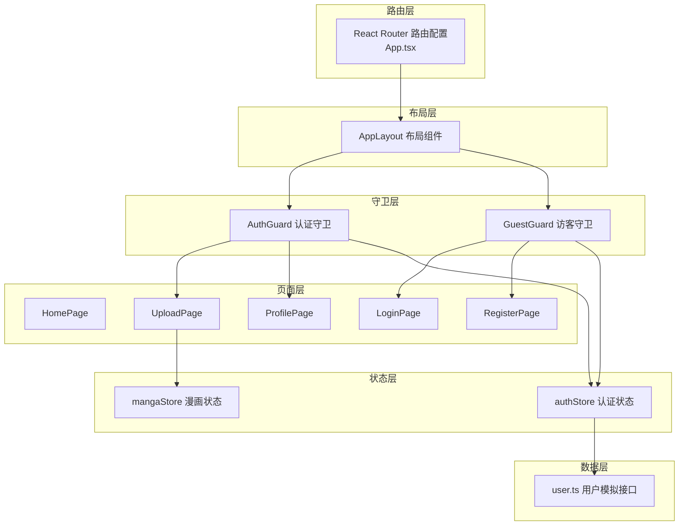
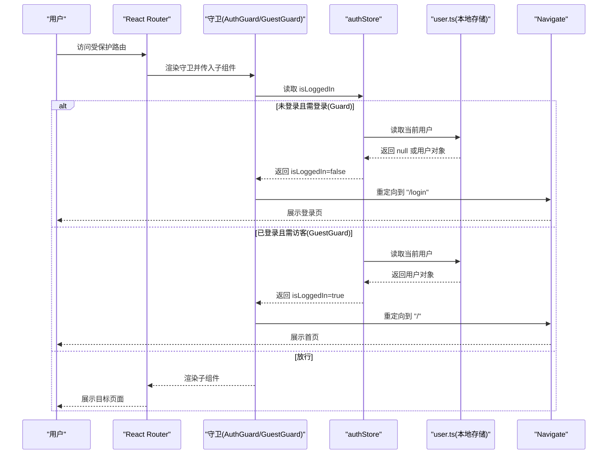
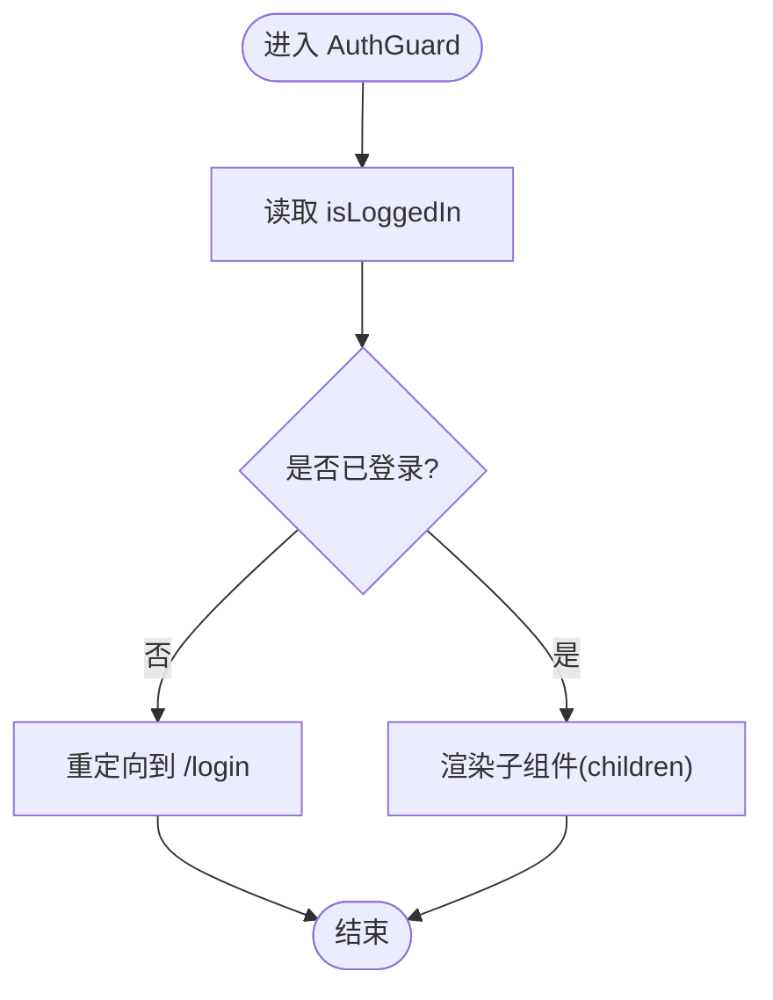
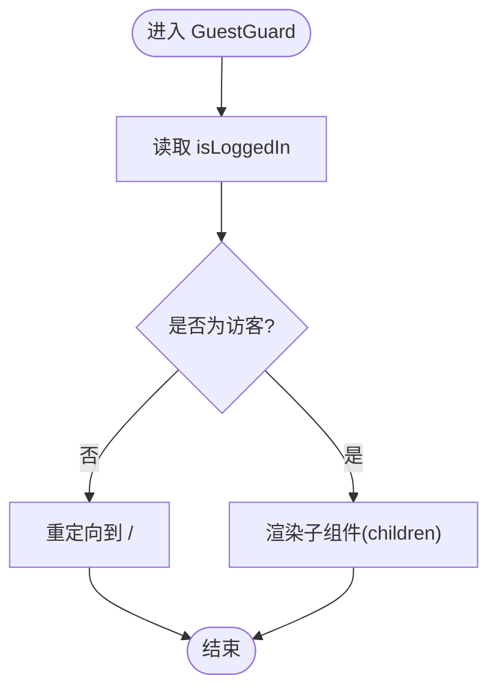
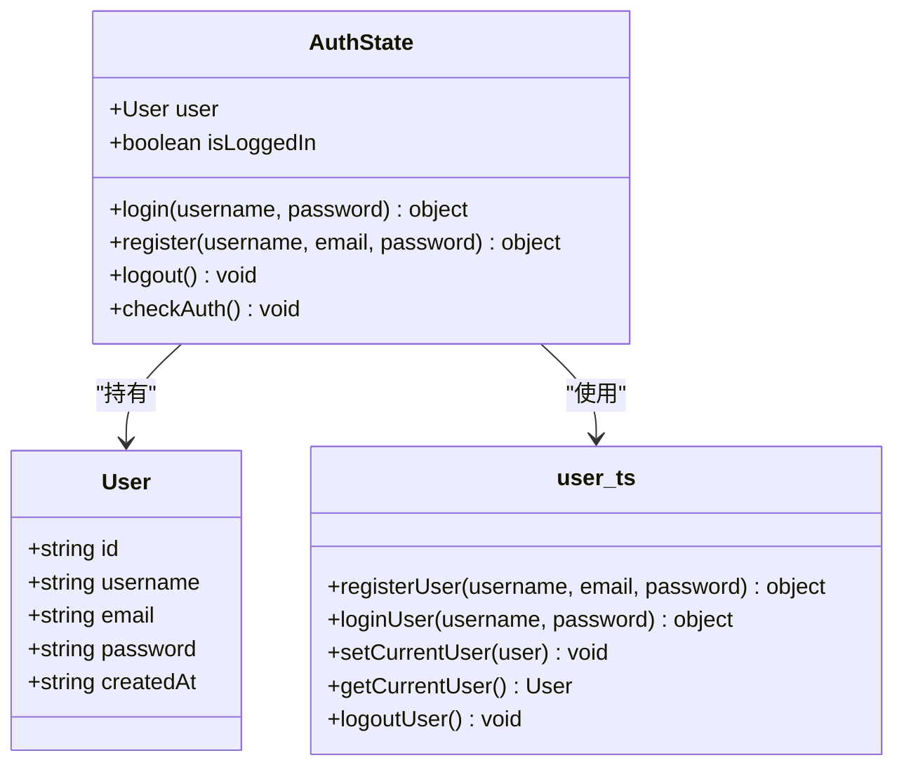
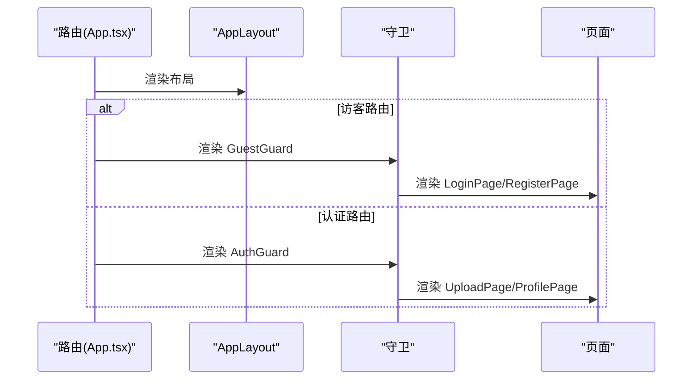
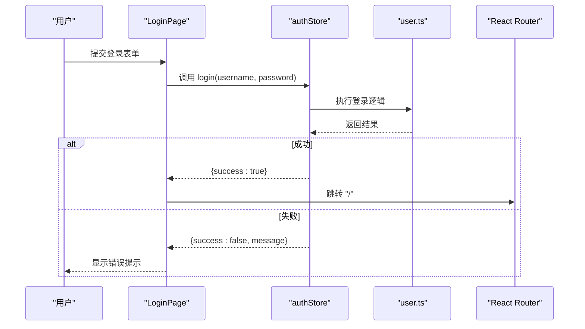
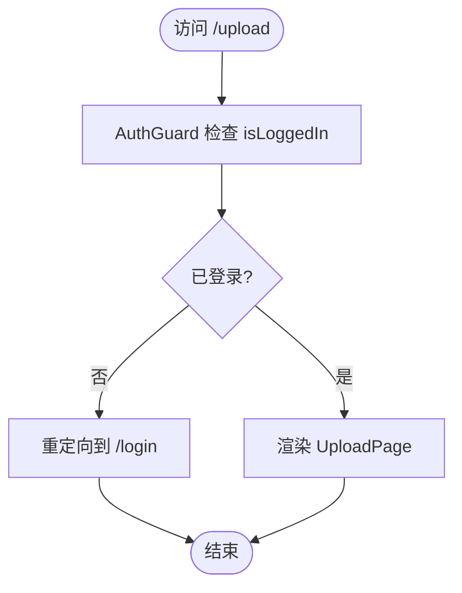
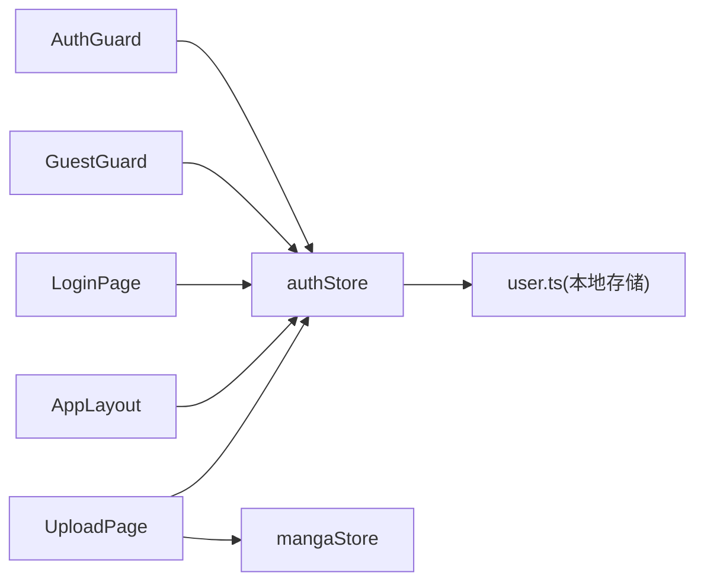

# 权限守卫组件

<cite>
**本文引用的文件**
- [AuthGuard.tsx](file://src/components/AuthGuard.tsx)
- [GuestGuard.tsx](file://src/components/GuestGuard.tsx)
- [authStore.ts](file://src/stores/authStore.ts)
- [App.tsx](file://src/App.tsx)
- [AppLayout.tsx](file://src/components/AppLayout.tsx)
- [user.ts](file://src/mock/user.ts)
- [types/index.ts](file://src/types/index.ts)
- [LoginPage.tsx](file://src/pages/LoginPage.tsx)
- [UploadPage.tsx](file://src/pages/UploadPage.tsx)
- [mangaStore.ts](file://src/stores/mangaStore.ts)
- [package.json](file://package.json)
</cite>

## 目录
1. [引言](#引言)
2. [项目结构](#项目结构)
3. [核心组件](#核心组件)
4. [架构总览](#架构总览)
5. [详细组件分析](#详细组件分析)
6. [依赖关系分析](#依赖关系分析)
7. [性能考量](#性能考量)
8. [故障排查指南](#故障排查指南)
9. [结论](#结论)
10. [附录](#附录)

## 引言
本文件围绕权限守卫组件进行系统化说明，重点覆盖 AuthGuard 认证守卫与 GuestGuard 访客守卫的设计原理、实现机制与集成方式。文档从架构视角解释权限控制的工作流程（登录状态检查、路由访问控制、页面渲染保护），并阐述 Props 传递、条件判断逻辑与重定向处理。同时给出可扩展的配置思路（如白名单路由与权限级别管理）、常见使用场景与最佳实践，帮助开发者在路由配置中正确应用守卫，并处理权限变更与状态同步问题。

## 项目结构
该漫画网站采用前端单页应用架构，权限守卫位于组件层，状态管理采用 Zustand，路由使用 React Router v6。权限控制通过守卫组件包裹目标页面，在渲染前根据登录状态决定是否放行或跳转。

图表来源
- [App.tsx:24-59](file://src/App.tsx#L24-L59)
- [AppLayout.tsx:19-155](file://src/components/AppLayout.tsx#L19-L155)
- [AuthGuard.tsx:8-16](file://src/components/AuthGuard.tsx#L8-L16)
- [GuestGuard.tsx:8-16](file://src/components/GuestGuard.tsx#L8-L16)
- [authStore.ts:14-44](file://src/stores/authStore.ts#L14-L44)
- [user.ts:67-89](file://src/mock/user.ts#L67-L89)
- [mangaStore.ts:16-61](file://src/stores/mangaStore.ts#L16-L61)

章节来源
- [App.tsx:13-66](file://src/App.tsx#L13-L66)
- [AuthGuard.tsx:1-17](file://src/components/AuthGuard.tsx#L1-L17)
- [GuestGuard.tsx:1-17](file://src/components/GuestGuard.tsx#L1-L17)
- [authStore.ts:1-45](file://src/stores/authStore.ts#L1-L45)
- [user.ts:1-90](file://src/mock/user.ts#L1-L90)
- [mangaStore.ts:1-62](file://src/stores/mangaStore.ts#L1-L62)

## 核心组件
- AuthGuard：仅允许已登录用户访问被其包裹的页面；未登录则重定向至登录页。
- GuestGuard：仅允许未登录用户访问被其包裹的页面；已登录则重定向至首页。
- authStore：集中管理用户登录态、登录/注册/登出、以及登录态校验方法。
- AppLayout：提供全局导航与用户菜单，触发登出后自动回到首页。
- LoginPage：执行登录动作，登录成功后返回首页。
- UploadPage：受 AuthGuard 保护，需要登录后才能访问并提交上传。

章节来源
- [AuthGuard.tsx:8-16](file://src/components/AuthGuard.tsx#L8-L16)
- [GuestGuard.tsx:8-16](file://src/components/GuestGuard.tsx#L8-L16)
- [authStore.ts:14-44](file://src/stores/authStore.ts#L14-L44)
- [AppLayout.tsx:31-34](file://src/components/AppLayout.tsx#L31-L34)
- [LoginPage.tsx:14-22](file://src/pages/LoginPage.tsx#L14-L22)
- [UploadPage.tsx:13-74](file://src/pages/UploadPage.tsx#L13-L74)

## 架构总览
权限守卫通过读取 authStore 中的 isLoggedIn 判断用户状态，结合 React Router 的 Navigate 组件实现无刷新重定向。守卫不直接发起网络请求，而是基于本地持久化存储中的当前用户信息进行判断。

图表来源
- [AuthGuard.tsx:8-16](file://src/components/AuthGuard.tsx#L8-L16)
- [GuestGuard.tsx:8-16](file://src/components/GuestGuard.tsx#L8-L16)
- [authStore.ts:14-44](file://src/stores/authStore.ts#L14-L44)
- [user.ts:76-84](file://src/mock/user.ts#L76-L84)

## 详细组件分析

### AuthGuard 认证守卫
- 设计要点
  - Props：接收 children 子节点，用于包裹需要登录才能访问的页面。
  - 逻辑：读取 authStore.isLoggedIn，若为 false，则通过 Navigate 重定向到登录页。
  - 渲染：若为 true，则渲染传入的子组件。
- 数据流
  - 状态来源：useAuthStore((s) => s.isLoggedIn)。
  - 状态更新：authStore.login/register/logout/checkAuth 会更新本地存储与状态。
- 性能与行为
  - 读取状态为常量时间，渲染开销极低。
  - 重定向为客户端路由跳转，避免额外网络请求。
- 可扩展性
  - 可增加角色/权限字段，配合 isLoggedIn 实现更细粒度的访问控制。
  - 可引入白名单路由（如无需登录即可访问的公开页面）。

图表来源
- [AuthGuard.tsx:8-16](file://src/components/AuthGuard.tsx#L8-L16)
- [authStore.ts:14-44](file://src/stores/authStore.ts#L14-L44)

章节来源
- [AuthGuard.tsx:4-16](file://src/components/AuthGuard.tsx#L4-L16)
- [authStore.ts:14-44](file://src/stores/authStore.ts#L14-L44)

### GuestGuard 访客守卫
- 设计要点
  - Props：接收 children 子节点，用于包裹仅访客可访问的页面（如登录/注册）。
  - 逻辑：读取 authStore.isLoggedIn，若为 true，则重定向到首页。
  - 渲染：若为 false，则渲染传入的子组件。
- 数据流
  - 状态来源：useAuthStore((s) => s.isLoggedIn)。
  - 状态更新：authStore.login/register/logout/checkAuth 会更新本地存储与状态。
- 性能与行为
  - 读取状态为常量时间，渲染开销极低。
  - 重定向为客户端路由跳转，避免额外网络请求。
- 可扩展性
  - 可增加白名单路由（如忘记密码等无需登录的页面）。
  - 可引入登录后跳转回来源页的策略。

图表来源
- [GuestGuard.tsx:8-16](file://src/components/GuestGuard.tsx#L8-L16)
- [authStore.ts:14-44](file://src/stores/authStore.ts#L14-L44)

章节来源
- [GuestGuard.tsx:4-16](file://src/components/GuestGuard.tsx#L4-L16)
- [authStore.ts:14-44](file://src/stores/authStore.ts#L14-L44)

### 认证状态管理（authStore）
- 角色定位
  - 管理用户对象与登录态，提供 login/register/logout/checkAuth 方法。
  - 通过 user.ts 的本地存储接口实现持久化。
- 关键方法
  - login(username, password)：调用 user.ts 的登录逻辑，成功后更新 user 与 isLoggedIn。
  - register(username, email, password)：调用 user.ts 的注册逻辑，成功后更新当前用户与状态。
  - logout()：清除当前用户，重置 user 与 isLoggedIn。
  - checkAuth()：重新从本地存储读取当前用户并同步状态。
- 类型与约束
  - User 接口定义于 types/index.ts，包含 id、username、email、password、createdAt 等字段。
- 使用建议
  - 在应用启动时调用 checkAuth，确保登录态与本地存储一致。
  - 在登出时调用 logout，保证状态与存储同步。

图表来源
- [authStore.ts:5-44](file://src/stores/authStore.ts#L5-L44)
- [types/index.ts:14-20](file://src/types/index.ts#L14-L20)
- [user.ts:26-89](file://src/mock/user.ts#L26-L89)

章节来源
- [authStore.ts:5-44](file://src/stores/authStore.ts#L5-L44)
- [types/index.ts:14-20](file://src/types/index.ts#L14-L20)
- [user.ts:26-89](file://src/mock/user.ts#L26-L89)

### 路由与守卫集成（App.tsx）
- 集成方式
  - AppLayout 作为根布局包裹所有路由。
  - /login 与 /register 使用 GuestGuard 包裹 LoginPage 与 RegisterPage。
  - /upload 与 /profile 使用 AuthGuard 包裹 UploadPage 与 ProfilePage。
- 行为说明
  - 未登录访问受保护路由时，自动跳转至相应页面。
  - 已登录访问访客路由时，自动跳转至首页。
- 扩展建议
  - 可新增白名单路由（如 /public/*）无需登录。
  - 可在 AuthGuard 中加入角色/权限校验，实现分级访问。

图表来源
- [App.tsx:24-59](file://src/App.tsx#L24-L59)
- [AppLayout.tsx:19-155](file://src/components/AppLayout.tsx#L19-L155)

章节来源
- [App.tsx:24-59](file://src/App.tsx#L24-L59)

### 登录流程与状态同步（LoginPage）
- 流程说明
  - 表单提交后调用 authStore.login，成功后提示并跳转首页。
  - 失败时提示错误信息，保持在当前页。
- 状态同步
  - login 成功后，authStore 内部更新 user 与 isLoggedIn，后续守卫读取即时生效。

图表来源
- [LoginPage.tsx:14-22](file://src/pages/LoginPage.tsx#L14-L22)
- [authStore.ts:18-24](file://src/stores/authStore.ts#L18-L24)
- [user.ts:51-64](file://src/mock/user.ts#L51-L64)

章节来源
- [LoginPage.tsx:9-22](file://src/pages/LoginPage.tsx#L9-L22)
- [authStore.ts:18-24](file://src/stores/authStore.ts#L18-L24)
- [user.ts:51-64](file://src/mock/user.ts#L51-L64)

### 页面渲染保护（UploadPage）
- 保护机制
  - UploadPage 由 AuthGuard 保护，仅在已登录状态下渲染。
  - 登录前访问会被重定向至登录页。
- 功能要点
  - 读取当前用户信息，用于标记上传记录。
  - 提交成功后提示并返回首页。

图表来源
- [AuthGuard.tsx:8-16](file://src/components/AuthGuard.tsx#L8-L16)
- [UploadPage.tsx:13-74](file://src/pages/UploadPage.tsx#L13-L74)

章节来源
- [UploadPage.tsx:13-74](file://src/pages/UploadPage.tsx#L13-L74)

## 依赖关系分析
- 组件耦合
  - AuthGuard/GuestGuard 仅依赖 authStore 的 isLoggedIn，耦合度低，便于复用。
  - AppLayout 依赖 authStore 的 user/isLoggedIn 与 logout，用于顶部导航与菜单。
- 外部依赖
  - react-router-dom：提供路由与重定向能力。
  - zustand：提供轻量级状态管理。
  - antd：提供 UI 组件与交互。
- 数据依赖
  - user.ts 通过 localStorage 实现用户信息持久化，authStore 与之协作完成登录态同步。

图表来源
- [AuthGuard.tsx:2-9](file://src/components/AuthGuard.tsx#L2-L9)
- [GuestGuard.tsx:2-9](file://src/components/GuestGuard.tsx#L2-L9)
- [authStore.ts:14-44](file://src/stores/authStore.ts#L14-L44)
- [user.ts:67-89](file://src/mock/user.ts#L67-L89)
- [AppLayout.tsx:21-34](file://src/components/AppLayout.tsx#L21-L34)
- [LoginPage.tsx:11-22](file://src/pages/LoginPage.tsx#L11-L22)
- [UploadPage.tsx:15-17](file://src/pages/UploadPage.tsx#L15-L17)
- [mangaStore.ts:16-61](file://src/stores/mangaStore.ts#L16-L61)

章节来源
- [package.json:11-24](file://package.json#L11-L24)
- [AuthGuard.tsx:2-9](file://src/components/AuthGuard.tsx#L2-L9)
- [GuestGuard.tsx:2-9](file://src/components/GuestGuard.tsx#L2-L9)
- [authStore.ts:14-44](file://src/stores/authStore.ts#L14-L44)
- [user.ts:67-89](file://src/mock/user.ts#L67-L89)
- [AppLayout.tsx:21-34](file://src/components/AppLayout.tsx#L21-L34)
- [LoginPage.tsx:11-22](file://src/pages/LoginPage.tsx#L11-L22)
- [UploadPage.tsx:15-17](file://src/pages/UploadPage.tsx#L15-L17)
- [mangaStore.ts:16-61](file://src/stores/mangaStore.ts#L16-L61)

## 性能考量
- 客户端重定向：守卫使用 Navigate 实现无刷新跳转，避免额外网络请求，性能优异。
- 状态读取：isLoggedIn 为简单布尔值，读取成本极低。
- 本地存储：user.ts 使用 localStorage，读写开销小，适合轻量应用。
- 建议
  - 对频繁切换的页面，可考虑在守卫外层缓存判断结果，减少重复计算。
  - 若未来引入服务端校验，应将 checkAuth 改为异步并增加加载态。

## 故障排查指南
- 症状：已登录仍被重定向到登录页
  - 可能原因：localStorage 中当前用户信息缺失或损坏。
  - 处理：在应用启动处调用 authStore.checkAuth，确保状态与存储一致。
- 症状：未登录却能访问受保护页面
  - 可能原因：未正确包裹 AuthGuard 或路由配置错误。
  - 处理：确认 App.tsx 中对应路由已使用 AuthGuard 包裹。
- 症状：登录后未立即生效
  - 可能原因：页面未重新渲染或状态未更新。
  - 处理：确认 LoginPage 登录成功后跳转首页，守卫读取的是最新状态。
- 症状：登出后仍显示受保护内容
  - 可能原因：未调用 logout 或未触发路由跳转。
  - 处理：在 AppLayout 的登出按钮中调用 authStore.logout 并跳转首页。

章节来源
- [authStore.ts:40-43](file://src/stores/authStore.ts#L40-L43)
- [App.tsx:24-59](file://src/App.tsx#L24-L59)
- [AppLayout.tsx:31-34](file://src/components/AppLayout.tsx#L31-L34)
- [LoginPage.tsx:14-22](file://src/pages/LoginPage.tsx#L14-L22)

## 结论
AuthGuard 与 GuestGuard 以最小实现提供了清晰的路由级权限控制：前者保障“已登录可见”，后者保障“未登录可见”。它们通过 authStore 的 isLoggedIn 快速判断，结合 React Router 的 Navigate 实现即时重定向。配合 user.ts 的本地存储与 LoginPage 的登录流程，形成完整的认证闭环。对于更复杂的权限需求（如角色/资源级权限、白名单路由），可在现有基础上扩展，保持较低的耦合与良好的可维护性。

## 附录

### 配置选项与自定义策略
- 白名单路由设置
  - 在 App.tsx 中为无需登录的公开页面（如首页、公告页）不包裹任何守卫。
  - 或在 AuthGuard 中增加例外列表，对匹配的路径直接放行。
- 权限级别管理
  - 在 authStore 中扩展状态字段（如 role/permissions），在 AuthGuard 中增加角色校验逻辑。
  - 对不同页面设置不同的权限阈值，统一在守卫中校验。
- 登录后来源页回跳
  - 在 GuestGuard 中记录来源路径，登录成功后跳转回该路径，提升用户体验。

### 使用场景与最佳实践
- 场景一：登录页仅访客可见
  - 将 LoginPage 包裹在 GuestGuard 中，防止已登录用户再次看到登录页。
- 场景二：上传页仅登录可见
  - 将 UploadPage 包裹在 AuthGuard 中，未登录用户自动跳转登录页。
- 场景三：登出后回到首页
  - 在 AppLayout 的登出按钮中调用 authStore.logout 并跳转首页，确保状态与界面一致。
- 最佳实践
  - 在应用入口调用 authStore.checkAuth，保证启动时登录态正确。
  - 将守卫与路由配置分离，集中管理，便于维护。
  - 对关键页面（如上传、个人资料）始终使用 AuthGuard 包裹。