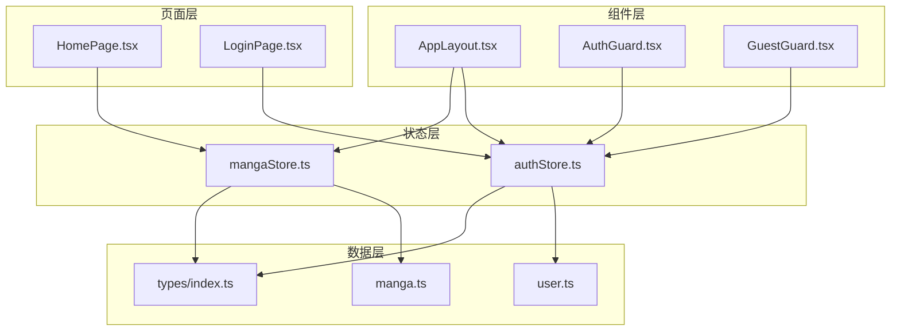
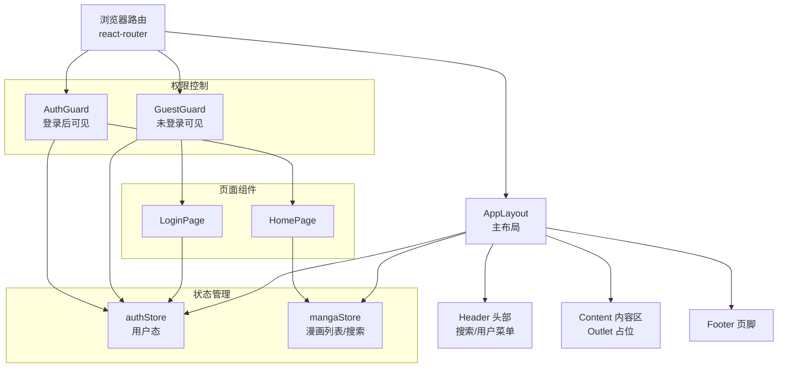
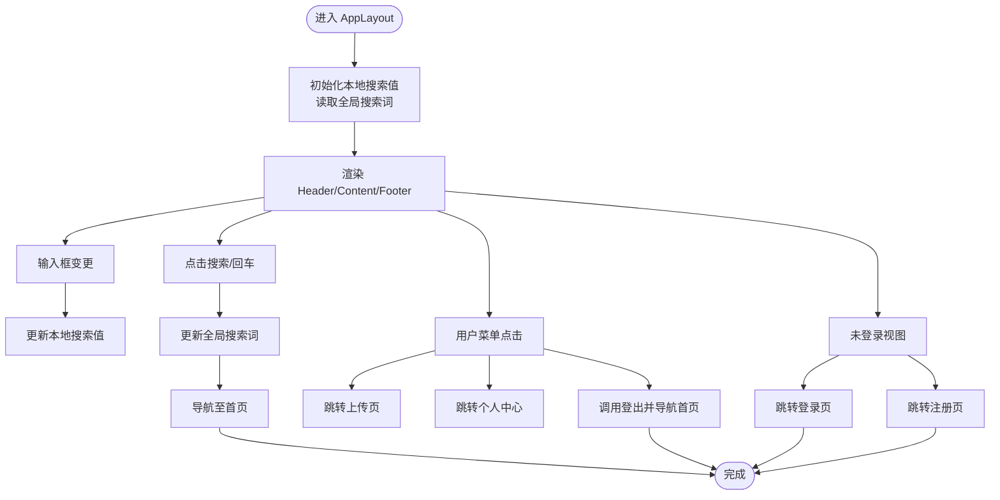
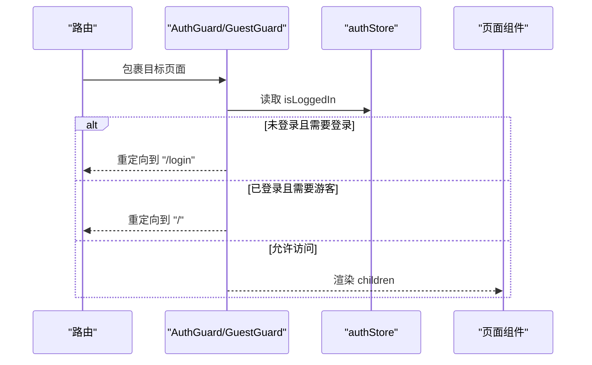
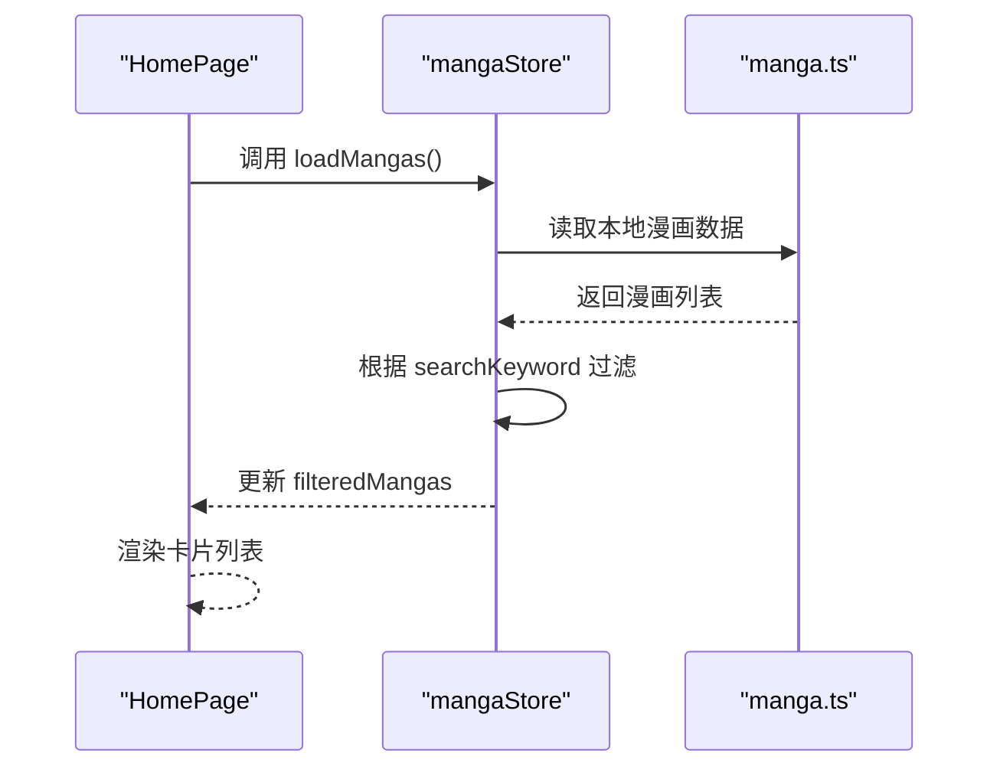
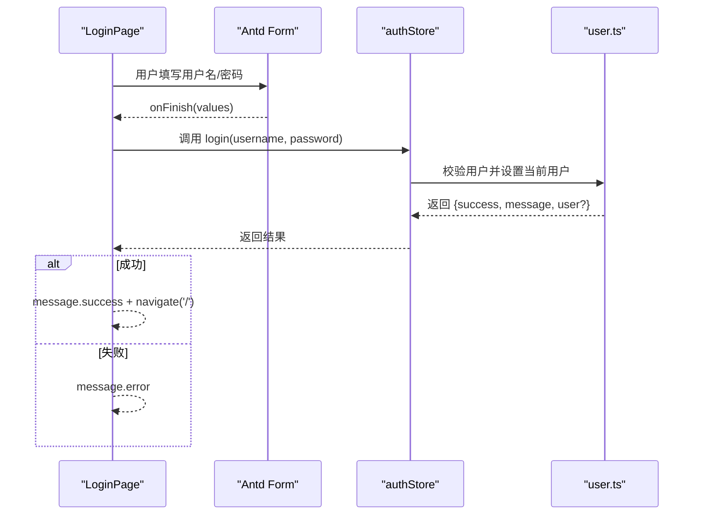
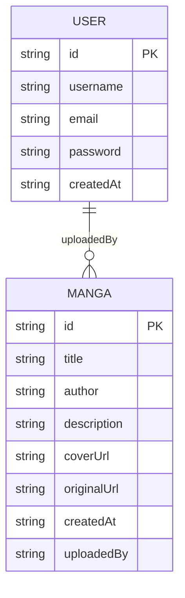

# 组件系统

<cite>
**本文引用的文件**
- [AppLayout.tsx](file://manga-website/src/components/AppLayout.tsx)
- [AuthGuard.tsx](file://manga-website/src/components/AuthGuard.tsx)
- [GuestGuard.tsx](file://manga-website/src/components/GuestGuard.tsx)
- [authStore.ts](file://manga-website/src/stores/authStore.ts)
- [mangaStore.ts](file://manga-website/src/stores/mangaStore.ts)
- [index.ts](file://manga-website/src/types/index.ts)
- [user.ts](file://manga-website/src/mock/user.ts)
- [manga.ts](file://manga-website/src/mock/manga.ts)
- [HomePage.tsx](file://manga-website/src/pages/HomePage.tsx)
- [LoginPage.tsx](file://manga-website/src/pages/LoginPage.tsx)
</cite>

## 目录
1. [简介](#简介)
2. [项目结构](#项目结构)
3. [核心组件](#核心组件)
4. [架构总览](#架构总览)
5. [详细组件分析](#详细组件分析)
6. [依赖关系分析](#依赖关系分析)
7. [性能考量](#性能考量)
8. [故障排查指南](#故障排查指南)
9. [结论](#结论)
10. [附录](#附录)

## 简介
本项目是一个基于 React 的漫画网站前端组件系统，采用函数组件与 Hooks 的现代开发范式，结合 Zustand 状态管理与 Ant Design UI 组件库，构建了可复用、可维护的组件体系。系统围绕“主布局 + 权限守卫 + 页面组件”的分层设计展开，通过全局状态管理实现跨页面的数据共享与状态同步，同时提供搜索、登录注册、上传等核心功能。

## 项目结构
项目采用按功能域划分的目录组织方式，核心模块包括：
- components：通用业务组件（主布局、权限守卫）
- pages：页面级组件（首页、登录页、注册页、上传页、个人中心等）
- stores：Zustand 状态仓库（认证状态、漫画列表与筛选）
- mock：本地模拟数据与持久化（用户、漫画）
- types：TypeScript 类型定义（漫画、用户、表单）

图表来源
- [AppLayout.tsx:1-156](file://manga-website/src/components/AppLayout.tsx#L1-L156)
- [AuthGuard.tsx:1-17](file://manga-website/src/components/AuthGuard.tsx#L1-L17)
- [GuestGuard.tsx:1-17](file://manga-website/src/components/GuestGuard.tsx#L1-L17)
- [authStore.ts:1-45](file://manga-website/src/stores/authStore.ts#L1-L45)
- [mangaStore.ts:1-62](file://manga-website/src/stores/mangaStore.ts#L1-L62)
- [user.ts:1-90](file://manga-website/src/mock/user.ts#L1-L90)
- [manga.ts:1-173](file://manga-website/src/mock/manga.ts#L1-L173)
- [index.ts:1-44](file://manga-website/src/types/index.ts#L1-L44)

章节来源
- [AppLayout.tsx:1-156](file://manga-website/src/components/AppLayout.tsx#L1-L156)
- [authStore.ts:1-45](file://manga-website/src/stores/authStore.ts#L1-L45)
- [mangaStore.ts:1-62](file://manga-website/src/stores/mangaStore.ts#L1-L62)
- [index.ts:1-44](file://manga-website/src/types/index.ts#L1-L44)

## 核心组件
本节聚焦于三大核心组件：AppLayout 主布局、AuthGuard 权限守卫、GuestGuard 游客守卫。它们共同构成应用的骨架与安全边界。

- AppLayout 主布局
  - 职责：提供统一的头部导航、内容区占位与页脚；集成搜索、用户菜单、登录/注册入口；通过 Outlet 渲染子路由内容。
  - 关键点：使用 useNavigate 导航；useAuthStore 提供用户态；useMangaStore 提供搜索关键词；Ant Design 布局组件与主题 Token 控制样式。
  - 交互：搜索输入变更与回车触发；登出后重定向首页；用户菜单项跳转至个人中心/上传页/退出登录。
  - 章节来源
    - [AppLayout.tsx:19-156](file://manga-website/src/components/AppLayout.tsx#L19-L156)

- AuthGuard 权限守卫
  - 职责：在渲染子组件前检查登录状态，未登录则重定向到登录页。
  - 关键点：从 authStore 选择性订阅 isLoggedIn；返回 children 或重定向。
  - 章节来源
    - [AuthGuard.tsx:8-16](file://manga-website/src/components/AuthGuard.tsx#L8-L16)

- GuestGuard 游客守卫
  - 职责：在渲染子组件前检查登录状态，已登录则重定向到首页。
  - 关键点：从 authStore 选择性订阅 isLoggedIn；返回 children 或重定向。
  - 章节来源
    - [GuestGuard.tsx:8-16](file://manga-website/src/components/GuestGuard.tsx#L8-L16)

## 架构总览
系统采用“布局组件 + 守卫组件 + 页面组件 + 状态仓库 + 模拟数据”的分层架构。路由层负责页面切换，守卫层控制访问权限，布局层承载通用 UI 与交互，状态层集中管理用户与漫画数据，数据层提供本地持久化的模拟接口。

图表来源
- [AppLayout.tsx:19-156](file://manga-website/src/components/AppLayout.tsx#L19-L156)
- [AuthGuard.tsx:8-16](file://manga-website/src/components/AuthGuard.tsx#L8-L16)
- [GuestGuard.tsx:8-16](file://manga-website/src/components/GuestGuard.tsx#L8-L16)
- [authStore.ts:14-44](file://manga-website/src/stores/authStore.ts#L14-L44)
- [mangaStore.ts:16-61](file://manga-website/src/stores/mangaStore.ts#L16-L61)
- [HomePage.tsx:8-107](file://manga-website/src/pages/HomePage.tsx#L8-L107)
- [LoginPage.tsx:9-85](file://manga-website/src/pages/LoginPage.tsx#L9-L85)

## 详细组件分析

### AppLayout 主布局组件
- 设计原则
  - 函数组件 + Hooks：使用 useState 管理本地搜索输入；useNavigate 实现程序化导航；useAuthStore/useMangaStore 访问全局状态；theme.useToken 应用主题变量。
  - 组合策略：通过 children/Outlet 将页面内容注入布局；用户菜单通过配置数组动态生成条目。
- Props 与状态
  - Props：无外部 props，内部通过 Outlet 接收子路由内容。
  - 状态：searchValue（本地输入）、searchKeyword（全局状态）、user/isLoggedIn（全局状态）、主题 token。
- 事件处理
  - 输入框变更：更新本地搜索值；清空按钮清除本地与全局搜索词。
  - 搜索提交：更新全局搜索词并导航至首页。
  - 登出：调用全局 logout 并导航至首页。
  - 用户菜单：根据 isLoggedIn 显示上传/个人中心/登出等入口。
- 性能与可维护性
  - 本地状态与全局状态分离，避免不必要的重渲染。
  - 使用 Ant Design 布局组件，保证一致的视觉与交互体验。
- 章节来源
  - [AppLayout.tsx:19-156](file://manga-website/src/components/AppLayout.tsx#L19-L156)

图表来源
- [AppLayout.tsx:24-136](file://manga-website/src/components/AppLayout.tsx#L24-L136)

### 权限守卫组件（AuthGuard、GuestGuard）
- 设计原则
  - 高内聚：仅关注鉴权逻辑，不关心具体页面内容。
  - 可复用：通过 children 透传，支持包裹任意页面组件。
  - 轻量：基于 Zustand 选择性订阅，避免全局广播导致的重渲染。
- 工作机制
  - AuthGuard：当未登录时重定向到登录页；已登录时渲染 children。
  - GuestGuard：当已登录时重定向到首页；未登录时渲染 children。
- 章节来源
  - [AuthGuard.tsx:8-16](file://manga-website/src/components/AuthGuard.tsx#L8-L16)
  - [GuestGuard.tsx:8-16](file://manga-website/src/components/GuestGuard.tsx#L8-L16)

图表来源
- [AuthGuard.tsx:8-16](file://manga-website/src/components/AuthGuard.tsx#L8-L16)
- [GuestGuard.tsx:8-16](file://manga-website/src/components/GuestGuard.tsx#L8-L16)
- [authStore.ts:14-16](file://manga-website/src/stores/authStore.ts#L14-L16)

### 页面组件与状态管理

#### HomePage 首页
- 功能：加载并展示漫画列表，支持按标题/作者关键词过滤；空结果提示；卡片悬停缩放效果；外部链接打开。
- 状态与数据流：useMangaStore 提供 filteredMangas/searchKeyword/loadMangas；首次挂载时触发 loadMangas。
- 章节来源
  - [HomePage.tsx:8-107](file://manga-website/src/pages/HomePage.tsx#L8-L107)
  - [mangaStore.ts:21-32](file://manga-website/src/stores/mangaStore.ts#L21-L32)

图表来源
- [HomePage.tsx:8-107](file://manga-website/src/pages/HomePage.tsx#L8-L107)
- [mangaStore.ts:21-32](file://manga-website/src/stores/mangaStore.ts#L21-L32)
- [manga.ts:138-140](file://manga-website/src/mock/manga.ts#L138-L140)

#### LoginPage 登录页
- 功能：表单校验、登录请求、消息提示、登录成功后跳转首页。
- 状态与数据流：useAuthStore((s) => s.login) 获取登录方法；Form 表单收集数据；登录成功后 navigate('/')。
- 章节来源
  - [LoginPage.tsx:9-85](file://manga-website/src/pages/LoginPage.tsx#L9-L85)
  - [authStore.ts:18-24](file://manga-website/src/stores/authStore.ts#L18-L24)

图表来源
- [LoginPage.tsx:14-22](file://manga-website/src/pages/LoginPage.tsx#L14-L22)
- [authStore.ts:18-24](file://manga-website/src/stores/authStore.ts#L18-L24)
- [user.ts:51-64](file://manga-website/src/mock/user.ts#L51-L64)

### 数据模型与类型
- 类型定义：Manga、User、LoginForm、RegisterForm、UploadForm。
- 章节来源
  - [index.ts:1-44](file://manga-website/src/types/index.ts#L1-L44)

图表来源
- [index.ts:2-20](file://manga-website/src/types/index.ts#L2-L20)
- [index.ts:36-43](file://manga-website/src/types/index.ts#L36-L43)

## 依赖关系分析
- 组件耦合
  - AppLayout 依赖 authStore 与 mangaStore，承担全局状态消费与导航职责。
  - AuthGuard/GuestGuard 仅依赖 authStore，保持低耦合与高复用。
  - 页面组件通过 hooks 访问对应 store，遵循单一数据源。
- 外部依赖
  - Ant Design：布局、表单、按钮、图标、主题 Token。
  - react-router-dom：导航与重定向。
  - Zustand：轻量状态管理。
- 章节来源
  - [AppLayout.tsx:1-156](file://manga-website/src/components/AppLayout.tsx#L1-L156)
  - [AuthGuard.tsx:1-17](file://manga-website/src/components/AuthGuard.tsx#L1-L17)
  - [GuestGuard.tsx:1-17](file://manga-website/src/components/GuestGuard.tsx#L1-L17)
  - [authStore.ts:1-45](file://manga-website/src/stores/authStore.ts#L1-L45)
  - [mangaStore.ts:1-62](file://manga-website/src/stores/mangaStore.ts#L1-L62)

## 性能考量
- 状态选择性订阅
  - authStore 与 mangaStore 使用 Zustand 的选择器订阅，仅在相关字段变化时触发重渲染，降低无关更新成本。
- 本地状态与全局状态分离
  - AppLayout 中的搜索输入使用本地状态，避免每次输入都写入全局状态，减少渲染次数。
- 列表渲染优化
  - HomePage 使用卡片网格布局，图片悬停缩放通过内联样式过渡，注意在大数据集时可考虑虚拟滚动与懒加载。
- 路由守卫短路
  - 守卫组件在鉴权失败时直接返回重定向，避免无效渲染。
- 建议
  - 对高频交互（如搜索）可引入防抖策略。
  - 图片资源建议使用 CDN 与合适的尺寸，提升首屏性能。

## 故障排查指南
- 登录失败
  - 现象：登录页提示错误信息。
  - 排查：确认用户名/密码是否匹配；检查本地存储中的用户数据；查看登录流程返回的消息。
  - 章节来源
    - [LoginPage.tsx:14-22](file://manga-website/src/pages/LoginPage.tsx#L14-L22)
    - [user.ts:51-64](file://manga-website/src/mock/user.ts#L51-L64)

- 无法访问受保护页面
  - 现象：访问需要登录的页面被重定向到登录页。
  - 排查：确认当前登录状态；检查守卫组件逻辑；核对路由包裹关系。
  - 章节来源
    - [AuthGuard.tsx:8-16](file://manga-website/src/components/AuthGuard.tsx#L8-L16)

- 搜索无结果
  - 现象：搜索关键词后显示空结果。
  - 排查：确认全局搜索词是否正确更新；检查过滤逻辑是否区分大小写；验证 mock 数据中是否存在匹配项。
  - 章节来源
    - [AppLayout.tsx:26-29](file://manga-website/src/components/AppLayout.tsx#L26-L29)
    - [mangaStore.ts:34-44](file://manga-website/src/stores/mangaStore.ts#L34-L44)

- 上传漫画后列表未刷新
  - 现象：添加漫画后页面未显示新增项。
  - 排查：确认 addManga 是否调用 loadMangas；检查本地存储是否更新；验证 filteredMangas 是否重新计算。
  - 章节来源
    - [mangaStore.ts:46-50](file://manga-website/src/stores/mangaStore.ts#L46-L50)
    - [mangaStore.ts:21-32](file://manga-website/src/stores/mangaStore.ts#L21-L32)

## 结论
该组件系统通过清晰的分层与职责划分，实现了布局、权限、页面与状态的解耦。函数组件与 Hooks 的使用提升了可读性与可测试性；Zustand 的选择性订阅降低了渲染开销；Ant Design 的组件库保证了良好的用户体验。后续可在性能优化（防抖、虚拟列表）、错误边界与国际化等方面进一步完善。

## 附录
- 组件复用最佳实践
  - 高阶组件（HOC）：适用于横切关注点（如日志、埋点），但更推荐以 Hooks 抽象替代，便于组合与测试。
  - 自定义 Hooks：将状态逻辑与副作用抽离为可复用的 Hook，如 useAuth、useSearch 等。
- 生命周期管理
  - 函数组件通过 useEffect 管理副作用；在组件卸载时清理定时器与订阅（如有）。
- 错误边界处理
  - 建议在路由层级或页面组件中增加错误边界，捕获并降级渲染，避免整页崩溃。
- 使用场景示例
  - 在需要登录才能访问的页面上包裹 AuthGuard。
  - 在登录/注册页上包裹 GuestGuard。
  - 在 AppLayout 中统一处理搜索与用户菜单。