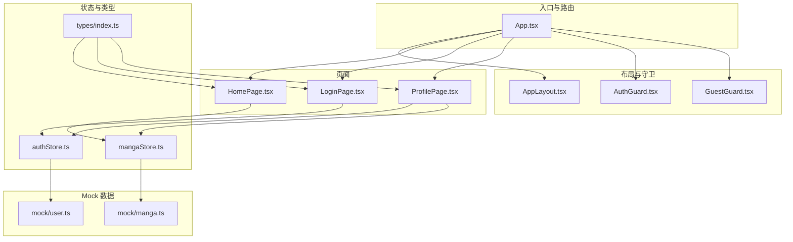
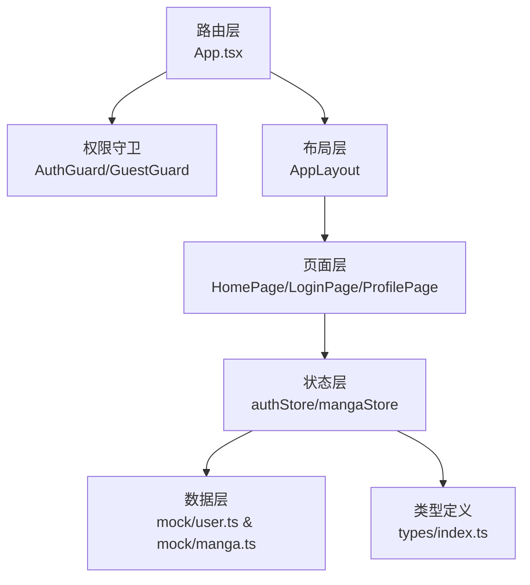
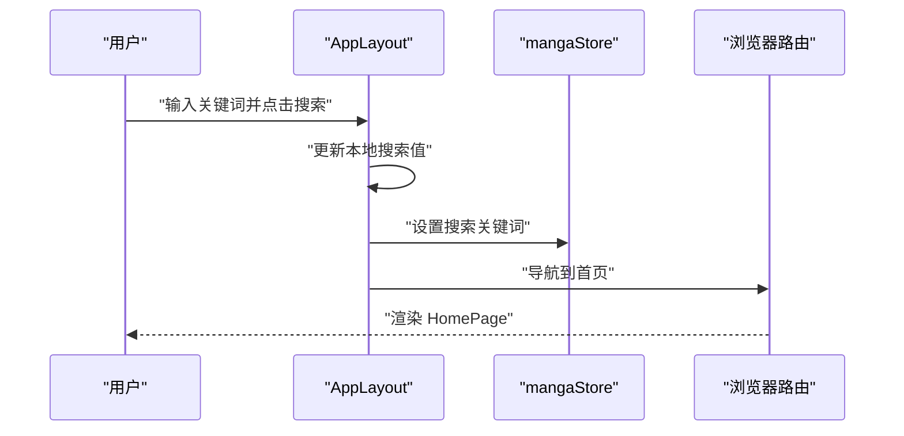
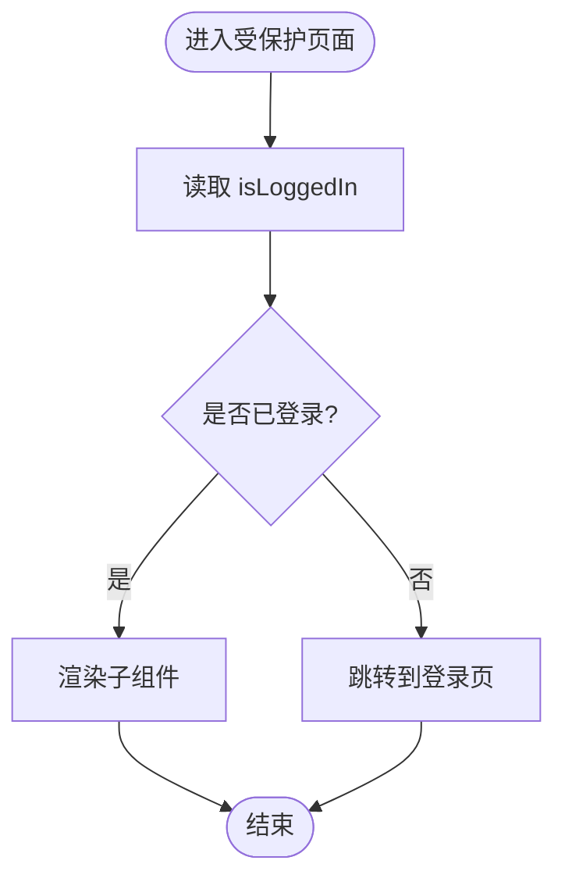
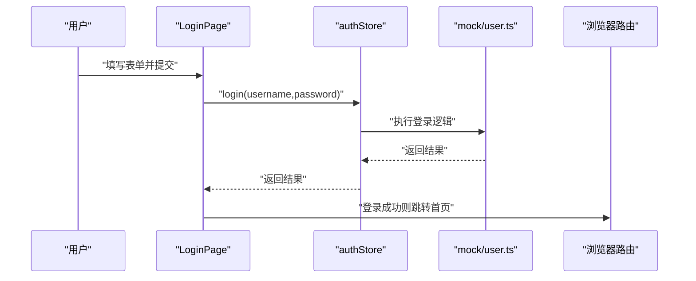
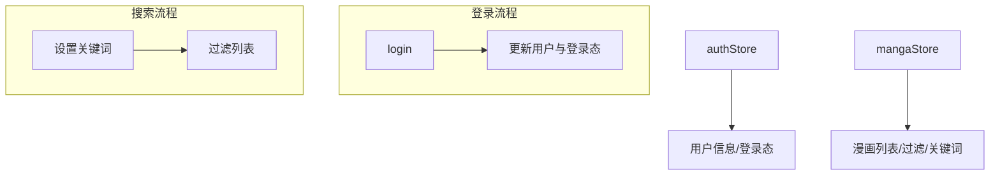
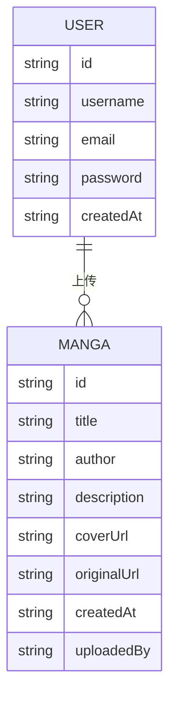
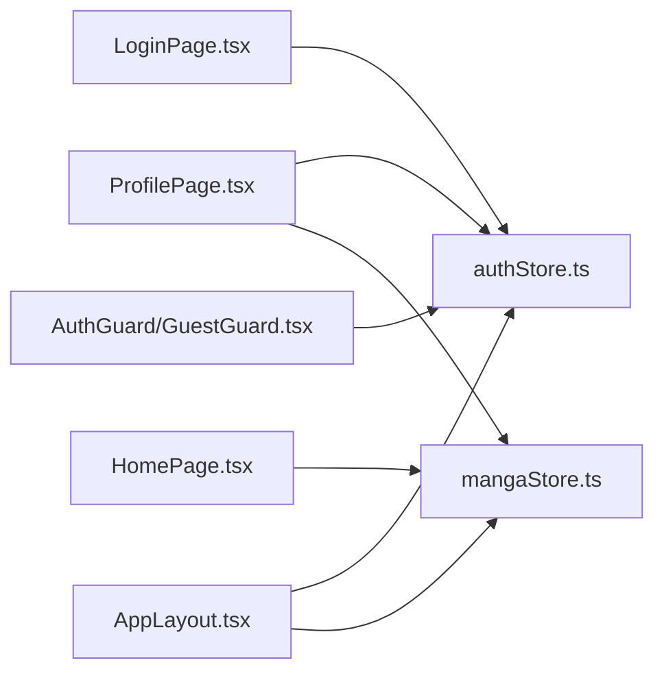

# 组件设计模式

<cite>
**本文引用的文件**
- [App.tsx](file://manga-website/src/App.tsx)
- [AppLayout.tsx](file://manga-website/src/components/AppLayout.tsx)
- [AuthGuard.tsx](file://manga-website/src/components/AuthGuard.tsx)
- [GuestGuard.tsx](file://manga-website/src/components/GuestGuard.tsx)
- [authStore.ts](file://manga-website/src/stores/authStore.ts)
- [mangaStore.ts](file://manga-website/src/stores/mangaStore.ts)
- [HomePage.tsx](file://manga-website/src/pages/HomePage.tsx)
- [LoginPage.tsx](file://manga-website/src/pages/LoginPage.tsx)
- [ProfilePage.tsx](file://manga-website/src/pages/ProfilePage.tsx)
- [index.ts](file://manga-website/src/types/index.ts)
- [user.ts](file://manga-website/src/mock/user.ts)
- [manga.ts](file://manga-website/src/mock/manga.ts)
</cite>

## 目录
1. [引言](#引言)
2. [项目结构](#项目结构)
3. [核心组件](#核心组件)
4. [架构总览](#架构总览)
5. [详细组件分析](#详细组件分析)
6. [依赖分析](#依赖分析)
7. [性能考虑](#性能考虑)
8. [故障排查指南](#故障排查指南)
9. [结论](#结论)
10. [附录](#附录)

## 引言
本文件系统化梳理该 React 项目的组件设计模式与最佳实践，围绕函数组件模式、Hooks 使用方式、组件组合策略展开；深入讲解 Props 设计原则、状态管理模式与事件处理机制；结合高阶组件（HOC）与自定义 Hooks 的设计思路，覆盖权限控制、数据获取与状态管理的抽象封装；总结组件复用策略（继承、组合、装饰器式封装），并通过具体文件路径与流程图展示如何在实际项目中提升代码质量与可维护性。

## 项目结构
该项目采用“按功能域分层”的组织方式：页面组件、通用布局与守卫、状态存储、类型定义与 Mock 数据相互解耦，路由集中配置于入口文件，便于统一控制访问权限与页面布局。

图表来源
- [App.tsx:13-63](file://manga-website/src/App.tsx#L13-L63)
- [AppLayout.tsx:19-155](file://manga-website/src/components/AppLayout.tsx#L19-L155)
- [AuthGuard.tsx:8-16](file://manga-website/src/components/AuthGuard.tsx#L8-L16)
- [GuestGuard.tsx:8-16](file://manga-website/src/components/GuestGuard.tsx#L8-L16)
- [HomePage.tsx:8-107](file://manga-website/src/pages/HomePage.tsx#L8-L107)
- [LoginPage.tsx:9-85](file://manga-website/src/pages/LoginPage.tsx#L9-L85)
- [ProfilePage.tsx:11-151](file://manga-website/src/pages/ProfilePage.tsx#L11-L151)
- [authStore.ts:14-44](file://manga-website/src/stores/authStore.ts#L14-L44)
- [mangaStore.ts](file://manga-website/src/stores/mangaStore.ts)
- [index.ts:1-44](file://manga-website/src/types/index.ts#L1-L44)
- [user.ts:1-90](file://manga-website/src/mock/user.ts#L1-L90)
- [manga.ts](file://manga-website/src/mock/manga.ts)

章节来源
- [App.tsx:13-63](file://manga-website/src/App.tsx#L13-L63)
- [AppLayout.tsx:19-155](file://manga-website/src/components/AppLayout.tsx#L19-L155)

## 核心组件
- 函数组件模式：所有页面与布局均采用函数组件，配合 React Hooks 实现状态与副作用管理，保持组件职责单一、易于测试与复用。
- 组合优先：通过 AppLayout 包裹页面内容，配合 react-router 的 Outlet 渲染子路由；通过 AuthGuard/GuestGuard 对页面进行权限控制，体现“组合优于继承”的设计思想。
- 自定义 Hooks 抽象：authStore 与 mangaStore 将状态与行为封装为可复用的 Hook，页面仅关注渲染与交互，降低耦合度。
- Props 设计原则：守卫组件以 children 作为插槽，页面组件以最小必要 Props 接口暴露行为（如登录回调），避免过度透传。
- 事件处理机制：统一使用 Ant Design 组件的事件回调（如按钮点击、输入变更、回车触发），并在组件内部进行状态更新与导航跳转。

章节来源
- [App.tsx:13-63](file://manga-website/src/App.tsx#L13-L63)
- [AppLayout.tsx:19-155](file://manga-website/src/components/AppLayout.tsx#L19-L155)
- [AuthGuard.tsx:8-16](file://manga-website/src/components/AuthGuard.tsx#L8-L16)
- [GuestGuard.tsx:8-16](file://manga-website/src/components/GuestGuard.tsx#L8-L16)
- [authStore.ts:14-44](file://manga-website/src/stores/authStore.ts#L14-L44)

## 架构总览
整体采用“路由层-布局层-页面层-状态层-数据层”的分层架构。路由层负责路径与守卫；布局层负责全局样式与导航；页面层负责业务视图；状态层通过 Zustand 抽象共享状态；数据层通过 Mock 提供本地演示数据。

图表来源
- [App.tsx:13-63](file://manga-website/src/App.tsx#L13-L63)
- [AuthGuard.tsx:8-16](file://manga-website/src/components/AuthGuard.tsx#L8-L16)
- [GuestGuard.tsx:8-16](file://manga-website/src/components/GuestGuard.tsx#L8-L16)
- [AppLayout.tsx:19-155](file://manga-website/src/components/AppLayout.tsx#L19-L155)
- [HomePage.tsx:8-107](file://manga-website/src/pages/HomePage.tsx#L8-L107)
- [LoginPage.tsx:9-85](file://manga-website/src/pages/LoginPage.tsx#L9-L85)
- [ProfilePage.tsx:11-151](file://manga-website/src/pages/ProfilePage.tsx#L11-L151)
- [authStore.ts:14-44](file://manga-website/src/stores/authStore.ts#L14-L44)
- [mangaStore.ts](file://manga-website/src/stores/mangaStore.ts)
- [index.ts:1-44](file://manga-website/src/types/index.ts#L1-L44)
- [user.ts:1-90](file://manga-website/src/mock/user.ts#L1-L90)
- [manga.ts](file://manga-website/src/mock/manga.ts)

## 详细组件分析

### 路由与布局：App 与 AppLayout
- 设计要点
  - 在路由层集中配置主题与国际化，确保全局一致。
  - AppLayout 作为容器组件，统一处理头部导航、搜索、用户菜单与页脚，页面通过 Outlet 渲染。
  - 搜索逻辑在布局层完成，通过状态存储同步关键词并导航至首页，实现跨页面联动。
- Props 设计
  - AppLayout 不接收外部 Props，通过 hooks 访问全局状态与导航能力，保持纯净与可测试。
- 事件处理
  - 输入框支持回车与清空，按钮点击触发搜索与登出，均在组件内完成状态更新与导航。
- 复用策略
  - 通过 Outlet 与嵌套路由，AppLayout 可被任意页面复用，无需重复布局代码。

图表来源
- [AppLayout.tsx:24-29](file://manga-website/src/components/AppLayout.tsx#L24-L29)
- [AppLayout.tsx:139-141](file://manga-website/src/components/AppLayout.tsx#L139-L141)
- [mangaStore.ts](file://manga-website/src/stores/mangaStore.ts)

章节来源
- [App.tsx:13-63](file://manga-website/src/App.tsx#L13-L63)
- [AppLayout.tsx:19-155](file://manga-website/src/components/AppLayout.tsx#L19-L155)

### 权限守卫：AuthGuard 与 GuestGuard
- 设计要点
  - 两个守卫均以 children 作为插槽，遵循 React 组合模式；通过选择性订阅 authStore 的 isLoggedIn 字段，减少重渲染。
  - AuthGuard：未登录则跳转登录页；GuestGuard：已登录则跳转首页。
- Props 设计
  - 仅接收 children，接口简洁，符合高阶组件的“透明包裹”原则。
- 错误处理
  - 通过 Navigate 组件进行无刷新跳转，保证用户体验与路由一致性。

图表来源
- [AuthGuard.tsx:8-16](file://manga-website/src/components/AuthGuard.tsx#L8-L16)
- [GuestGuard.tsx:8-16](file://manga-website/src/components/GuestGuard.tsx#L8-L16)
- [authStore.ts:14-44](file://manga-website/src/stores/authStore.ts#L14-L44)

章节来源
- [AuthGuard.tsx:8-16](file://manga-website/src/components/AuthGuard.tsx#L8-L16)
- [GuestGuard.tsx:8-16](file://manga-website/src/components/GuestGuard.tsx#L8-L16)
- [authStore.ts:14-44](file://manga-website/src/stores/authStore.ts#L14-L44)

### 页面组件：HomePage、LoginPage、ProfilePage
- HomePage
  - 通过 useEffect 在挂载时加载漫画列表；根据搜索关键词显示空态或网格卡片。
  - 卡片悬停缩放、标签展示、外链打开等交互均在组件内完成，避免向子组件传递过多 Props。
- LoginPage
  - 使用 Ant Design 表单与校验规则，提交后调用 authStore.login 并根据返回结果提示与跳转。
  - 通过 Form.useForm 与受控表单，简化状态管理与校验。
- ProfilePage
  - 读取当前用户信息，拉取该用户的上传记录，支持删除与刷新；删除后同步更新列表与全局状态。
  - 使用描述列表与列表组件，清晰呈现用户信息与作品清单。

图表来源
- [LoginPage.tsx:14-22](file://manga-website/src/pages/LoginPage.tsx#L14-L22)
- [authStore.ts:18-24](file://manga-website/src/stores/authStore.ts#L18-L24)
- [user.ts:51-64](file://manga-website/src/mock/user.ts#L51-L64)

章节来源
- [HomePage.tsx:8-107](file://manga-website/src/pages/HomePage.tsx#L8-L107)
- [LoginPage.tsx:9-85](file://manga-website/src/pages/LoginPage.tsx#L9-L85)
- [ProfilePage.tsx:11-151](file://manga-website/src/pages/ProfilePage.tsx#L11-L151)

### 状态管理：authStore 与 mangaStore
- 设计要点
  - 使用 Zustand 将状态与动作聚合在一个 store 中，通过选择器订阅减少重渲染。
  - authStore 提供用户信息、登录/注册/登出与认证检查；mangaStore 提供漫画列表、过滤与搜索关键词。
- Props 设计
  - 页面通过选择器直接消费 store，避免将 store 作为 Props 向下传递，降低耦合。
- 数据流
  - 登录成功后更新当前用户并切换登录态；搜索关键词变更后影响列表过滤；删除作品后刷新列表。

图表来源
- [authStore.ts:14-44](file://manga-website/src/stores/authStore.ts#L14-L44)
- [mangaStore.ts](file://manga-website/src/stores/mangaStore.ts)

章节来源
- [authStore.ts:14-44](file://manga-website/src/stores/authStore.ts#L14-L44)
- [mangaStore.ts](file://manga-website/src/stores/mangaStore.ts)

### 类型与数据模型
- 类型定义
  - 统一定义漫画、用户、登录/注册/上传表单的数据结构，确保页面与 store 的契约清晰。
- 数据模型
  - Mock 层提供用户注册、登录、登出与当前用户持久化；漫画层提供用户作品查询与删除。

图表来源
- [index.ts:14-20](file://manga-website/src/types/index.ts#L14-L20)
- [index.ts:2-11](file://manga-website/src/types/index.ts#L2-L11)
- [user.ts:67-83](file://manga-website/src/mock/user.ts#L67-L83)
- [manga.ts](file://manga-website/src/mock/manga.ts)

章节来源
- [index.ts:1-44](file://manga-website/src/types/index.ts#L1-L44)
- [user.ts:1-90](file://manga-website/src/mock/user.ts#L1-L90)

## 依赖分析
- 组件耦合
  - 页面组件仅依赖 store 与类型，不直接依赖路由或 UI 库，降低耦合度。
  - 守卫组件仅依赖 store 的登录态，不关心具体页面内容，具备高复用性。
- 外部依赖
  - Ant Design 提供 UI 与交互组件；Zustand 提供轻量状态管理；react-router-dom 提供路由与导航。
- 循环依赖
  - 当前结构未见循环依赖，store 与页面之间为单向依赖。

图表来源
- [LoginPage.tsx:9-85](file://manga-website/src/pages/LoginPage.tsx#L9-L85)
- [HomePage.tsx:8-107](file://manga-website/src/pages/HomePage.tsx#L8-L107)
- [ProfilePage.tsx:11-151](file://manga-website/src/pages/ProfilePage.tsx#L11-L151)
- [AppLayout.tsx:19-155](file://manga-website/src/components/AppLayout.tsx#L19-L155)
- [AuthGuard.tsx:8-16](file://manga-website/src/components/AuthGuard.tsx#L8-L16)
- [GuestGuard.tsx:8-16](file://manga-website/src/components/GuestGuard.tsx#L8-L16)
- [authStore.ts:14-44](file://manga-website/src/stores/authStore.ts#L14-L44)
- [mangaStore.ts](file://manga-website/src/stores/mangaStore.ts)

章节来源
- [App.tsx:13-63](file://manga-website/src/App.tsx#L13-L63)
- [AppLayout.tsx:19-155](file://manga-website/src/components/AppLayout.tsx#L19-L155)

## 性能考虑
- 选择器订阅
  - 守卫与页面通过选择器订阅 store 的特定字段，避免无关状态变化导致的重渲染。
- 事件处理
  - 将事件处理器绑定在组件内部，减少闭包创建与不必要的 props 传递。
- 列表渲染
  - 使用键值稳定的 id 渲染卡片与列表项，提升虚拟 DOM 比较效率。
- 导航与跳转
  - 使用 Navigate 与 useNavigate，避免整页刷新，提升交互流畅度。

## 故障排查指南
- 登录失败
  - 检查用户名/密码是否正确；确认 mock 层用户数据是否存在；查看 store 返回的错误消息。
- 无法访问受保护页面
  - 确认守卫组件是否正确包裹页面；检查 store 的登录态是否同步。
- 搜索无结果
  - 确认搜索关键词是否设置到 store；检查列表过滤逻辑是否生效。
- 删除作品后未刷新
  - 确认删除成功后的刷新逻辑是否调用；检查全局列表刷新方法是否执行。

章节来源
- [LoginPage.tsx:14-22](file://manga-website/src/pages/LoginPage.tsx#L14-L22)
- [AuthGuard.tsx:8-16](file://manga-website/src/components/AuthGuard.tsx#L8-L16)
- [GuestGuard.tsx:8-16](file://manga-website/src/components/GuestGuard.tsx#L8-L16)
- [ProfilePage.tsx:24-33](file://manga-website/src/pages/ProfilePage.tsx#L24-L33)

## 结论
本项目通过函数组件与 Hooks 的组合，实现了清晰的职责分离与良好的可复用性。权限守卫与布局容器体现了“组合优于继承”的设计思想；Zustand 状态管理降低了样板代码；Ant Design 组件提升了交互一致性。建议在后续迭代中引入更细粒度的自定义 Hooks（如 useApi、useAuth）、增加错误边界与加载状态管理，进一步提升健壮性与可维护性。

## 附录
- 组件复用策略
  - 组合：通过 AppLayout 与守卫组件包裹页面，实现横切关注点的统一处理。
  - 装饰器式封装：将权限判断与导航逻辑封装在守卫组件中，页面只需专注业务渲染。
  - 选择器订阅：store 选择器减少重渲染，提升性能。
- 最佳实践清单
  - 页面组件只消费 store 的必要字段，避免过度透传。
  - 事件处理集中在组件内部，保持 Props 简洁。
  - 使用类型定义约束数据结构，确保跨模块契约稳定。
  - 将 UI 与业务逻辑分离，便于测试与替换。