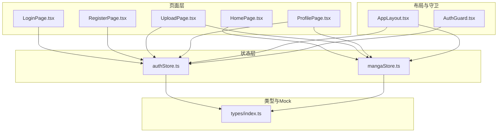
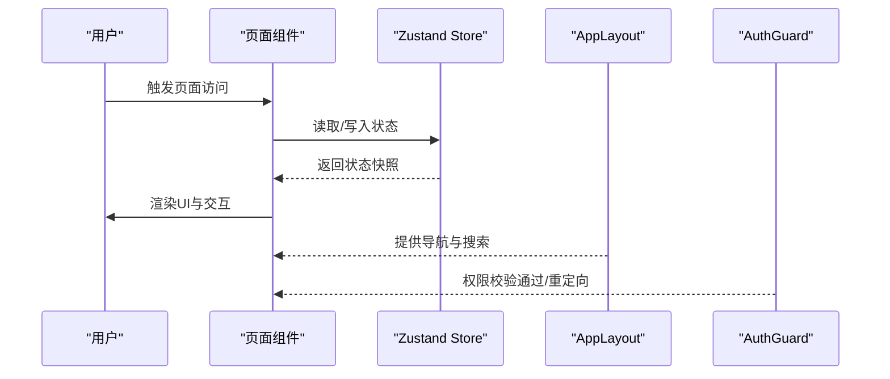
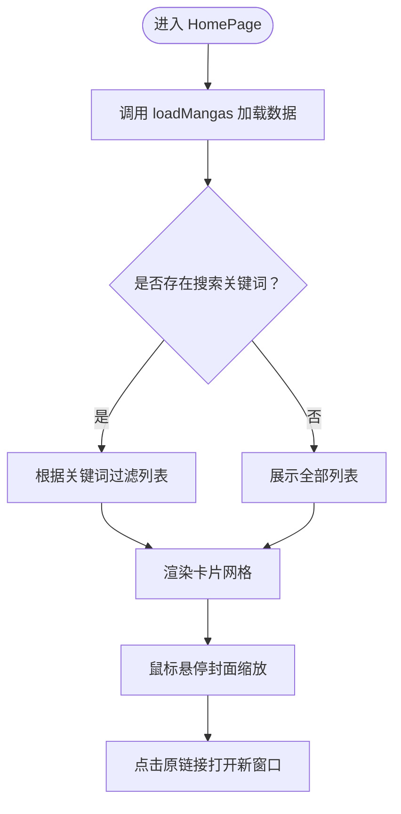
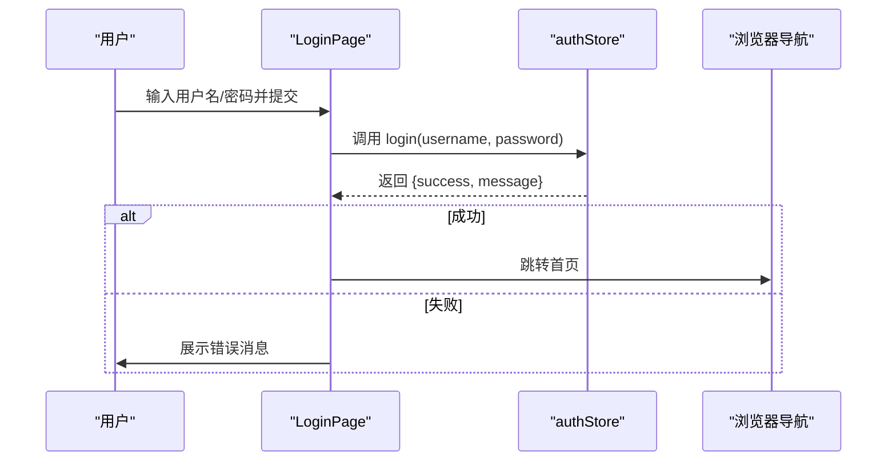
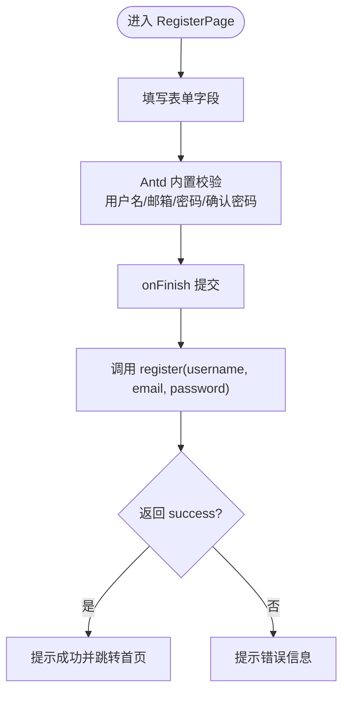
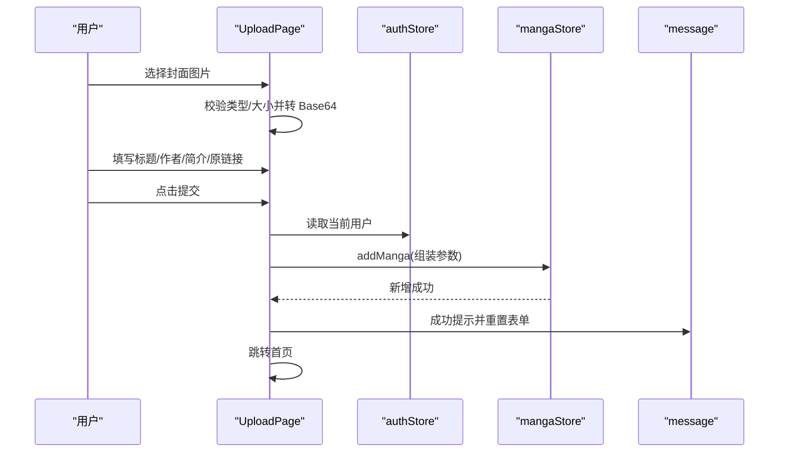
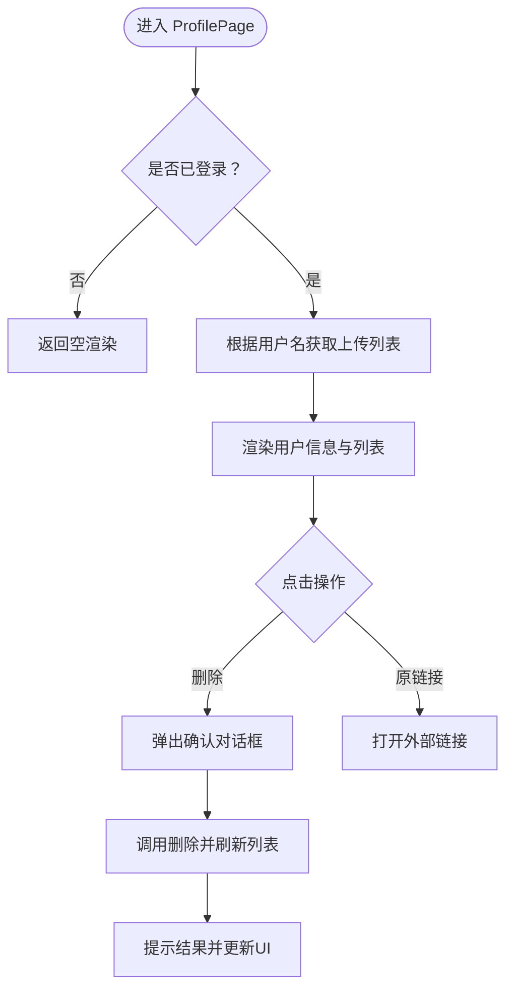
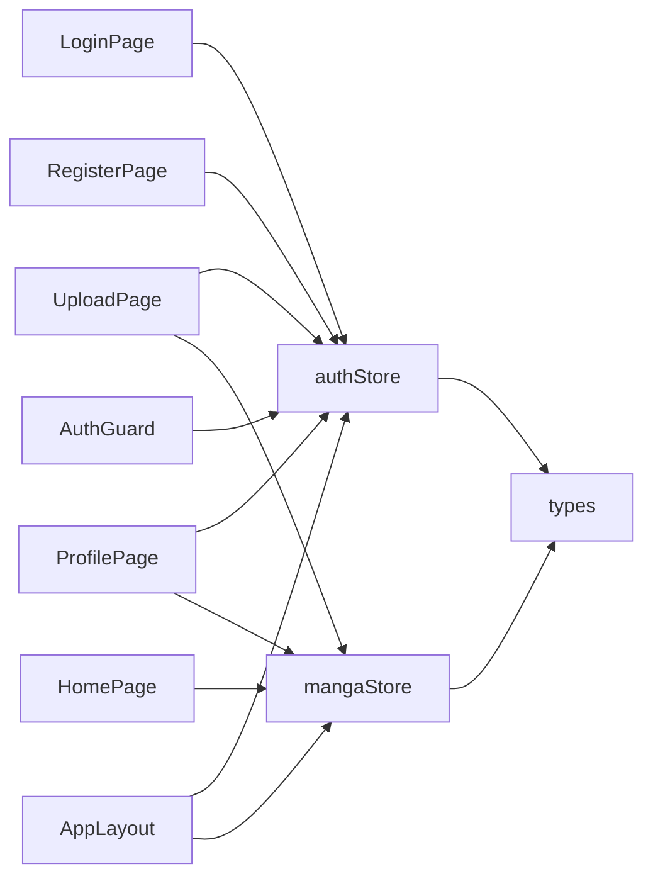

# 页面组件

<cite>
**本文引用的文件**
- [HomePage.tsx](file://src/pages/HomePage.tsx)
- [LoginPage.tsx](file://src/pages/LoginPage.tsx)
- [RegisterPage.tsx](file://src/pages/RegisterPage.tsx)
- [UploadPage.tsx](file://src/pages/UploadPage.tsx)
- [ProfilePage.tsx](file://src/pages/ProfilePage.tsx)
- [AppLayout.tsx](file://src/components/AppLayout.tsx)
- [AuthGuard.tsx](file://src/components/AuthGuard.tsx)
- [authStore.ts](file://src/stores/authStore.ts)
- [mangaStore.ts](file://src/stores/mangaStore.ts)
- [index.ts（类型定义）](file://src/types/index.ts)
</cite>

## 目录
1. [引言](#引言)
2. [项目结构](#项目结构)
3. [核心组件](#核心组件)
4. [架构总览](#架构总览)
5. [详细组件分析](#详细组件分析)
6. [依赖关系分析](#依赖关系分析)
7. [性能考量](#性能考量)
8. [故障排查指南](#故障排查指南)
9. [结论](#结论)
10. [附录](#附录)

## 引言
本文件系统性梳理漫画网站的页面组件，覆盖主页、登录页、注册页、上传页与个人中心五大页面。文档从架构视角出发，结合状态管理、表单处理与数据交互模式，阐述各页面的职责边界、Props 设计、事件处理与用户交互流程；同时给出复用策略、与布局组件的集成方式以及权限控制实现思路，并提供可落地的最佳实践与排错建议。

## 项目结构
页面组件位于 src/pages 目录，采用按功能分层组织：页面逻辑（Pages）、状态管理（Stores）、类型定义（Types）、布局与守卫（Components）。页面通过自定义 Hook 访问 Zustand Store，完成数据拉取、过滤与更新；全局布局 AppLayout 负责导航、搜索与用户菜单；AuthGuard 用于受保护路由的鉴权拦截。

图表来源
- [HomePage.tsx:1-108](file://src/pages/HomePage.tsx#L1-L108)
- [LoginPage.tsx:1-86](file://src/pages/LoginPage.tsx#L1-L86)
- [RegisterPage.tsx:1-121](file://src/pages/RegisterPage.tsx#L1-L121)
- [UploadPage.tsx:1-187](file://src/pages/UploadPage.tsx#L1-L187)
- [ProfilePage.tsx:1-152](file://src/pages/ProfilePage.tsx#L1-L152)
- [AppLayout.tsx:1-156](file://src/components/AppLayout.tsx#L1-L156)
- [AuthGuard.tsx:1-17](file://src/components/AuthGuard.tsx#L1-L17)
- [authStore.ts:1-45](file://src/stores/authStore.ts#L1-L45)
- [mangaStore.ts:1-62](file://src/stores/mangaStore.ts#L1-L62)
- [index.ts（类型定义）:1-44](file://src/types/index.ts#L1-L44)

章节来源
- [HomePage.tsx:1-108](file://src/pages/HomePage.tsx#L1-L108)
- [LoginPage.tsx:1-86](file://src/pages/LoginPage.tsx#L1-L86)
- [RegisterPage.tsx:1-121](file://src/pages/RegisterPage.tsx#L1-L121)
- [UploadPage.tsx:1-187](file://src/pages/UploadPage.tsx#L1-L187)
- [ProfilePage.tsx:1-152](file://src/pages/ProfilePage.tsx#L1-L152)
- [AppLayout.tsx:1-156](file://src/components/AppLayout.tsx#L1-L156)
- [AuthGuard.tsx:1-17](file://src/components/AuthGuard.tsx#L1-L17)
- [authStore.ts:1-45](file://src/stores/authStore.ts#L1-L45)
- [mangaStore.ts:1-62](file://src/stores/mangaStore.ts#L1-L62)
- [index.ts（类型定义）:1-44](file://src/types/index.ts#L1-L44)

## 核心组件
- HomePage 主页：负责渲染漫画列表，支持搜索关键词驱动的过滤展示，使用 Ant Design 卡片布局与悬停缩放效果。
- LoginPage 登录页：基于 Ant Design 表单进行用户名/密码校验，调用认证 Store 执行登录并跳转首页。
- RegisterPage 注册页：表单包含用户名、邮箱、密码与确认密码，使用依赖规则校验一致性，调用注册流程并跳转首页。
- UploadPage 上传页：支持封面图片本地预览与 Base64 转换，提交漫画元数据到 Store 并刷新列表。
- ProfilePage 个人中心：展示当前用户信息与“我的上传”列表，支持删除与原链接跳转。

章节来源
- [HomePage.tsx:8-107](file://src/pages/HomePage.tsx#L8-L107)
- [LoginPage.tsx:9-85](file://src/pages/LoginPage.tsx#L9-L85)
- [RegisterPage.tsx:9-120](file://src/pages/RegisterPage.tsx#L9-L120)
- [UploadPage.tsx:13-186](file://src/pages/UploadPage.tsx#L13-L186)
- [ProfilePage.tsx:11-151](file://src/pages/ProfilePage.tsx#L11-L151)

## 架构总览
页面组件通过自定义 Hook 访问 Zustand Store，实现页面级状态与全局状态的解耦。AppLayout 作为容器组件，承载导航、搜索与用户菜单；AuthGuard 对需要登录的页面进行前置拦截。类型定义统一约束表单与实体字段。

图表来源
- [AppLayout.tsx:19-155](file://src/components/AppLayout.tsx#L19-L155)
- [AuthGuard.tsx:8-16](file://src/components/AuthGuard.tsx#L8-L16)
- [authStore.ts:14-44](file://src/stores/authStore.ts#L14-L44)
- [mangaStore.ts:16-61](file://src/stores/mangaStore.ts#L16-L61)

## 详细组件分析

### HomePage 主页
- 功能要点
  - 首次挂载触发漫画数据加载。
  - 根据搜索关键词动态过滤列表，空匹配时显示“无结果”占位。
  - 使用卡片网格展示封面、标题、作者与简介，悬停放大封面。
  - 为“用户上传”的条目添加标签提示。
- 状态管理
  - 读取 filteredMangas 与 searchKeyword，触发 loadMangas 初始化。
- 表单与交互
  - 与 AppLayout 的搜索框联动，通过 setSearchKeyword 更新过滤条件。
- Props 接口
  - 无显式 Props，通过 useMangaStore 获取状态。
- 最佳实践
  - 列表项 hover 效果使用内联样式过渡，避免额外 CSS。
  - 图片缩放通过事件绑定，注意在离开时恢复 transform。
- 复杂度
  - 渲染复杂度 O(n)，n 为 filteredMangas 长度；过滤复杂度 O(n)。

图表来源
- [HomePage.tsx:8-107](file://src/pages/HomePage.tsx#L8-L107)
- [mangaStore.ts:21-32](file://src/stores/mangaStore.ts#L21-L32)

章节来源
- [HomePage.tsx:8-107](file://src/pages/HomePage.tsx#L8-L107)
- [mangaStore.ts:16-44](file://src/stores/mangaStore.ts#L16-L44)

### LoginPage 登录页
- 功能要点
  - Ant Design 表单收集用户名与密码，必填校验。
  - 调用 useAuthStore 的 login 方法执行登录，成功则提示并跳转首页。
- 状态管理
  - 通过选择器读取 login 方法与内部状态。
- 表单处理
  - onFinish 统一入口，错误/成功分别提示并导航。
- Props 接口
  - 无显式 Props，使用 Ant Design Form 组件。
- 事件处理
  - 表单提交触发 onFinish，内部调用 Store 方法。
- 最佳实践
  - 使用 message 组件反馈结果，保持 UI 一致性。
  - 密码输入使用安全输入框，关闭自动填充建议。

图表来源
- [LoginPage.tsx:9-22](file://src/pages/LoginPage.tsx#L9-L22)
- [authStore.ts:18-24](file://src/stores/authStore.ts#L18-L24)

章节来源
- [LoginPage.tsx:9-85](file://src/pages/LoginPage.tsx#L9-L85)
- [authStore.ts:14-24](file://src/stores/authStore.ts#L14-L24)

### RegisterPage 注册页
- 功能要点
  - 表单包含用户名、邮箱、密码与确认密码。
  - 使用依赖规则确保两次密码一致。
  - 调用 useAuthStore 的 register 方法，成功后提示并跳转首页。
- 状态管理
  - 通过选择器读取 register 方法。
- 表单处理
  - onFinish 统一入口，错误/成功分别提示并导航。
- Props 接口
  - 无显式 Props，使用 Ant Design Form 组件。
- 最佳实践
  - 密码最小长度与邮箱格式校验，提升用户体验。
  - 确认密码依赖于密码字段，减少重复逻辑。

图表来源
- [RegisterPage.tsx:9-22](file://src/pages/RegisterPage.tsx#L9-L22)
- [authStore.ts:26-33](file://src/stores/authStore.ts#L26-L33)

章节来源
- [RegisterPage.tsx:9-120](file://src/pages/RegisterPage.tsx#L9-L120)
- [authStore.ts:14-33](file://src/stores/authStore.ts#L14-L33)

### UploadPage 上传页
- 功能要点
  - 封面上传限制图片类型与大小，转换为 Base64 以本地预览。
  - 表单字段包括标题、作者、简介、原链接，均进行必填与格式校验。
  - 提交后调用 useMangaStore 的 addManga，清空表单并跳转首页。
- 状态管理
  - 读取当前用户与 addManga 方法；本地维护封面 Base64 与文件列表。
- 表单处理
  - beforeUpload 自定义校验与 Base64 转换；onFinish 组装参数并提交。
- Props 接口
  - 无显式 Props，使用 Ant Design Upload/Form 组件。
- 最佳实践
  - 上传前本地校验，避免无效请求；finally 中统一收尾 loading。
  - 文件移除时同步清理本地状态，防止脏数据残留。

图表来源
- [UploadPage.tsx:13-74](file://src/pages/UploadPage.tsx#L13-L74)
- [authStore.ts:14-16](file://src/stores/authStore.ts#L14-L16)
- [mangaStore.ts:46-50](file://src/stores/mangaStore.ts#L46-L50)

章节来源
- [UploadPage.tsx:13-186](file://src/pages/UploadPage.tsx#L13-L186)
- [authStore.ts:14-16](file://src/stores/authStore.ts#L14-L16)
- [mangaStore.ts:46-50](file://src/stores/mangaStore.ts#L46-L50)

### ProfilePage 个人中心
- 功能要点
  - 展示用户基本信息（用户名、邮箱、注册时间）。
  - 读取当前用户上传的漫画列表，支持删除与原链接跳转。
  - 删除后刷新漫画列表并提示结果。
- 状态管理
  - 读取当前用户与 refreshMangas；本地维护用户漫画列表与加载状态。
- 表单处理
  - 该页面不涉及表单提交，主要为只读展示与交互按钮。
- Props 接口
  - 无显式 Props。
- 最佳实践
  - 使用 Descriptions 展示用户信息，结构清晰。
  - 删除操作使用 Popconfirm 确认，避免误删。

图表来源
- [ProfilePage.tsx:11-33](file://src/pages/ProfilePage.tsx#L11-L33)
- [mangaStore.ts:58-60](file://src/stores/mangaStore.ts#L58-L60)

章节来源
- [ProfilePage.tsx:11-151](file://src/pages/ProfilePage.tsx#L11-L151)
- [mangaStore.ts:58-60](file://src/stores/mangaStore.ts#L58-L60)

## 依赖关系分析
- 组件耦合
  - 页面组件对 Store 的依赖通过选择器实现细粒度订阅，降低重渲染风险。
  - AppLayout 与页面组件松耦合，通过 Outlet 插槽注入页面内容。
- 外部依赖
  - Ant Design 组件库提供 UI 与表单能力；React Router 用于导航与守卫。
- 类型约束
  - 所有表单与实体均通过 types/index.ts 定义，保证跨模块一致性。

图表来源
- [HomePage.tsx:4-9](file://src/pages/HomePage.tsx#L4-L9)
- [LoginPage.tsx:4-11](file://src/pages/LoginPage.tsx#L4-L11)
- [RegisterPage.tsx:4-11](file://src/pages/RegisterPage.tsx#L4-L11)
- [UploadPage.tsx:6-16](file://src/pages/UploadPage.tsx#L6-L16)
- [ProfilePage.tsx:4-6](file://src/pages/ProfilePage.tsx#L4-L6)
- [AppLayout.tsx:13-22](file://src/components/AppLayout.tsx#L13-L22)
- [AuthGuard.tsx:8-9](file://src/components/AuthGuard.tsx#L8-L9)
- [authStore.ts:1-12](file://src/stores/authStore.ts#L1-L12)
- [mangaStore.ts:1-14](file://src/stores/mangaStore.ts#L1-L14)
- [index.ts（类型定义）:1-44](file://src/types/index.ts#L1-L44)

章节来源
- [HomePage.tsx:4-9](file://src/pages/HomePage.tsx#L4-L9)
- [LoginPage.tsx:4-11](file://src/pages/LoginPage.tsx#L4-L11)
- [RegisterPage.tsx:4-11](file://src/pages/RegisterPage.tsx#L4-L11)
- [UploadPage.tsx:6-16](file://src/pages/UploadPage.tsx#L6-L16)
- [ProfilePage.tsx:4-6](file://src/pages/ProfilePage.tsx#L4-L6)
- [AppLayout.tsx:13-22](file://src/components/AppLayout.tsx#L13-L22)
- [AuthGuard.tsx:8-9](file://src/components/AuthGuard.tsx#L8-L9)
- [authStore.ts:1-12](file://src/stores/authStore.ts#L1-L12)
- [mangaStore.ts:1-14](file://src/stores/mangaStore.ts#L1-L14)
- [index.ts（类型定义）:1-44](file://src/types/index.ts#L1-L44)

## 性能考量
- 渲染优化
  - 使用卡片网格时，建议对长列表启用虚拟化（如使用可选的虚拟列表组件）以降低 DOM 节点数量。
  - 图片缩放使用事件绑定，避免在渲染中频繁计算样式。
- 状态订阅
  - Store 选择器仅订阅所需字段，避免无关状态变更导致的重渲染。
- 数据加载
  - 首屏加载使用一次性初始化，后续搜索通过本地过滤，减少网络请求。
- 上传性能
  - 本地 Base64 转换会占用内存，建议对大图进行压缩或服务端直传以减轻前端压力。

## 故障排查指南
- 登录/注册失败
  - 检查返回的错误消息，确认用户名/密码/邮箱格式是否符合要求。
  - 若提示网络异常，检查 Store 的 login/register 实现与 Mock 数据。
- 上传失败
  - 确认封面类型与大小限制；检查 Base64 转换是否成功。
  - 提交后未刷新列表，检查 addManga 是否调用了 loadMangas 或 refreshMangas。
- 个人中心空白
  - 未登录状态下不会渲染；确认 AuthGuard 是否正确拦截。
  - 用户未上传作品时为空列表，属正常行为。
- 搜索无结果
  - 确认搜索关键词是否与标题/作者匹配；检查 setSearchKeyword 是否被调用。

章节来源
- [LoginPage.tsx:14-22](file://src/pages/LoginPage.tsx#L14-L22)
- [RegisterPage.tsx:14-22](file://src/pages/RegisterPage.tsx#L14-L22)
- [UploadPage.tsx:46-74](file://src/pages/UploadPage.tsx#L46-L74)
- [ProfilePage.tsx:17-33](file://src/pages/ProfilePage.tsx#L17-L33)
- [mangaStore.ts:34-44](file://src/stores/mangaStore.ts#L34-L44)

## 结论
页面组件围绕状态管理与布局守卫构建，形成清晰的职责划分：页面专注 UI 与交互，Store 负责数据与业务逻辑，布局与守卫提供通用体验与安全控制。通过类型约束与选择器订阅，系统在可维护性与性能之间取得平衡。建议在后续迭代中引入虚拟列表、服务端直传与更完善的错误边界，持续优化用户体验。

## 附录
- 复用策略
  - 表单组件可抽象为可复用的 FormItem 组件，统一校验与图标。
  - 卡片列表可抽取为通用组件，支持不同数据源与操作按钮。
- 组合模式
  - AppLayout 作为容器，通过 Outlet 注入页面；AuthGuard 包裹需要登录的路由。
- 权限控制
  - AuthGuard 基于 isLoggedIn 判断，未登录自动跳转登录页。
- 最佳实践清单
  - 使用 Ant Design 表单内置校验，必要时配合依赖规则。
  - Store 选择器最小化订阅范围，避免全量重渲染。
  - 上传前本地校验与 finally 统一收尾，提升稳定性。
  - 使用 message 统一提示风格，增强一致性。