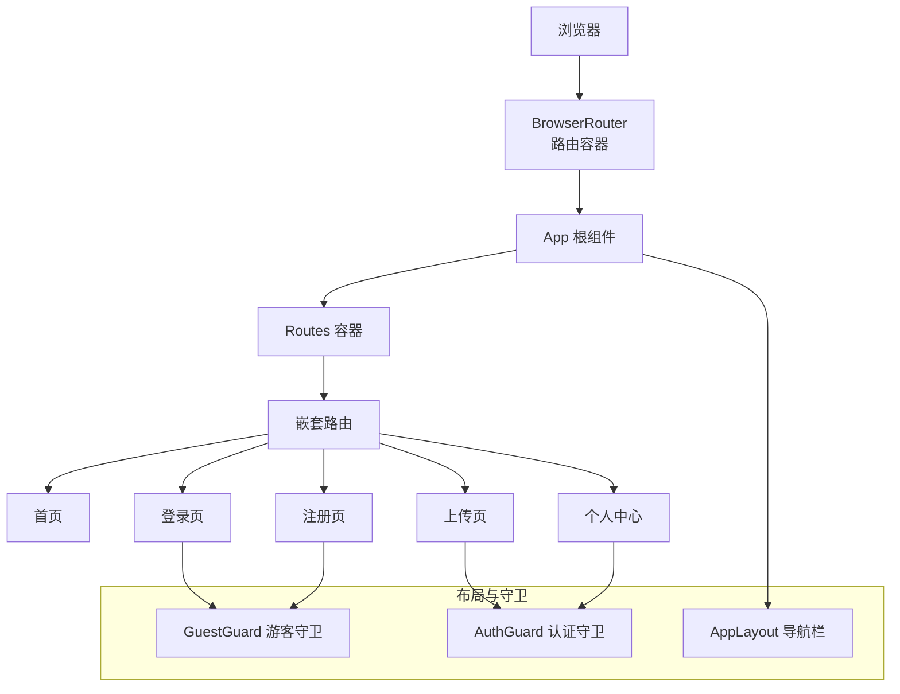
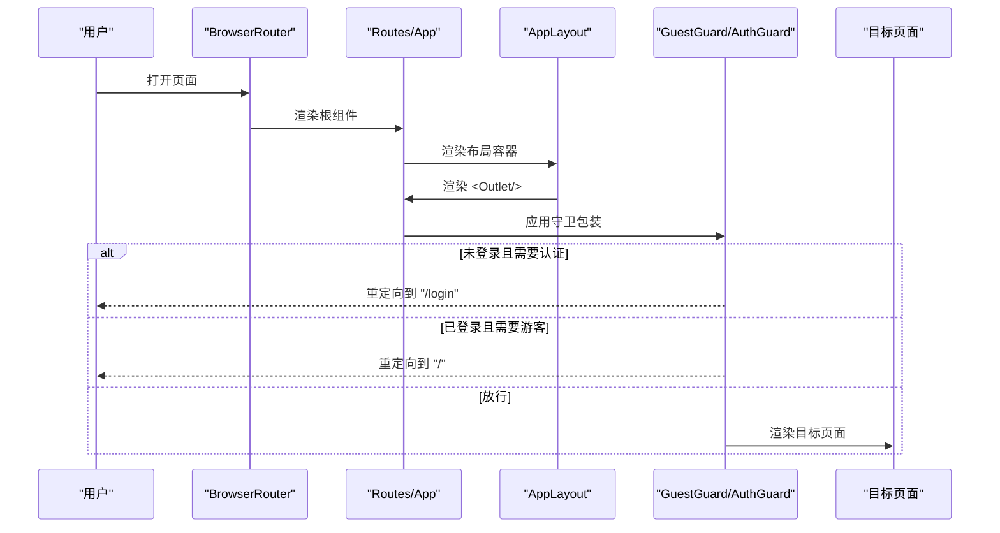
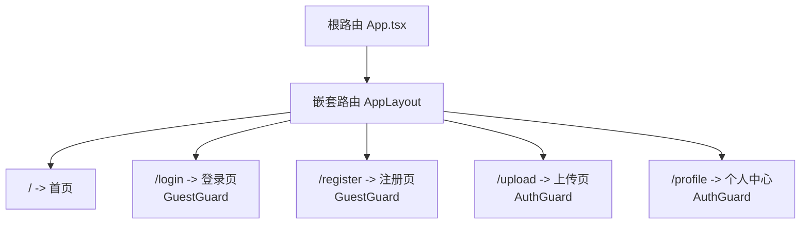
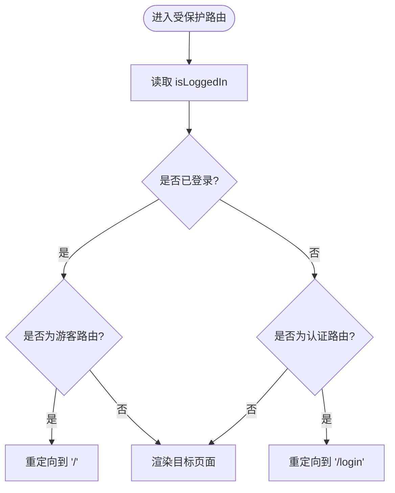
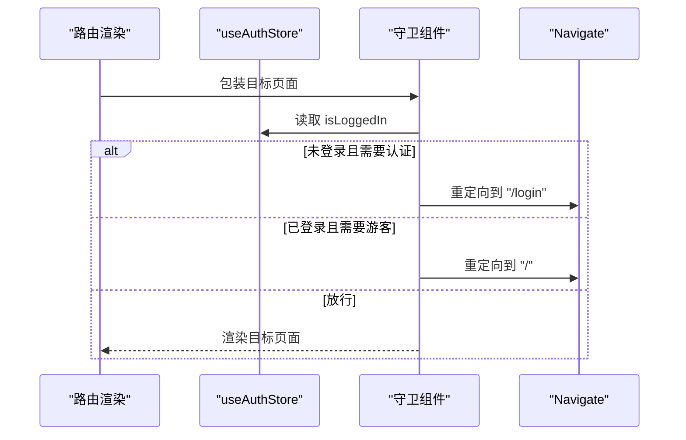
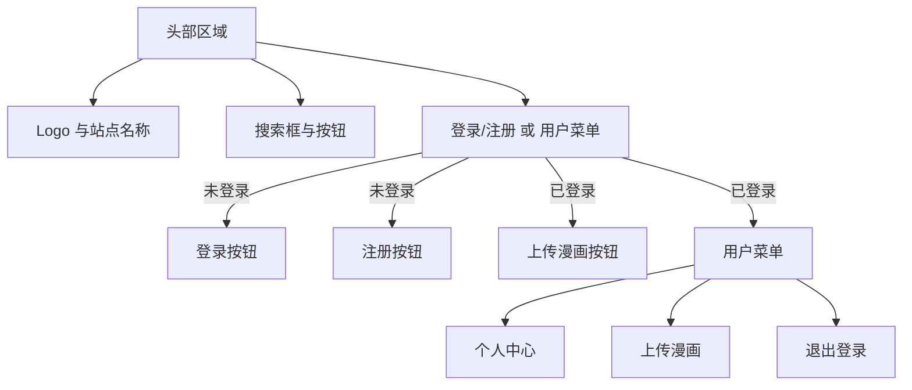
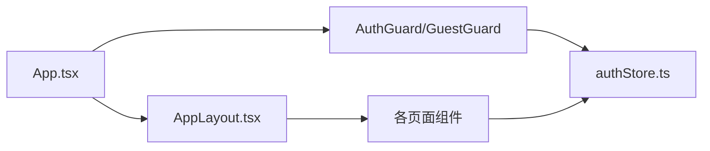

# 路由导航

<cite>
**本文引用的文件**
- [App.tsx](file://manga-website/src/App.tsx)
- [main.tsx](file://manga-website/src/main.tsx)
- [AuthGuard.tsx](file://manga-website/src/components/AuthGuard.tsx)
- [GuestGuard.tsx](file://manga-website/src/components/GuestGuard.tsx)
- [AppLayout.tsx](file://manga-website/src/components/AppLayout.tsx)
- [authStore.ts](file://manga-website/src/stores/authStore.ts)
- [HomePage.tsx](file://manga-website/src/pages/HomePage.tsx)
- [LoginPage.tsx](file://manga-website/src/pages/LoginPage.tsx)
- [RegisterPage.tsx](file://manga-website/src/pages/RegisterPage.tsx)
- [ProfilePage.tsx](file://manga-website/src/pages/ProfilePage.tsx)
</cite>

## 目录
1. [简介](#简介)
2. [项目结构](#项目结构)
3. [核心组件](#核心组件)
4. [架构总览](#架构总览)
5. [详细组件分析](#详细组件分析)
6. [依赖关系分析](#依赖关系分析)
7. [性能考虑](#性能考虑)
8. [故障排查指南](#故障排查指南)
9. [结论](#结论)
10. [附录](#附录)

## 简介
本文件围绕漫画网站的路由导航系统进行系统化梳理，重点覆盖以下方面：
- React Router 的配置与使用：路由定义、嵌套路由与页面级布局、导航守卫（AuthGuard/GuestGuard）的职责与实现。
- 权限控制机制：基于 Zustand 状态管理的用户状态检查、登录态判断与自动重定向逻辑。
- 导航守卫策略：路由拦截、权限验证与访问控制的实现方式。
- 性能优化：懒加载与代码分割的建议、路由切换性能与资源加载策略。
- 导航菜单设计：响应式布局、活动状态管理与用户体验优化。
- 路由配置最佳实践：命名规范、参数传递、错误处理与可维护性。

## 项目结构
该漫画网站采用前端单页应用结构，以 React Router v6 为核心路由框架，Ant Design 提供 UI 组件库，Zustand 管理全局状态（用户与漫画数据）。入口在 main.tsx 中包裹 BrowserRouter，根组件 App.tsx 定义顶层路由与布局，AppLayout.tsx 作为公共布局容器承载导航栏、侧边内容区与页脚；各页面组件按需渲染。

图表来源
- [main.tsx:1-14](file://manga-website/src/main.tsx#L1-L14)
- [App.tsx:13-66](file://manga-website/src/App.tsx#L13-L66)
- [AppLayout.tsx:19-156](file://manga-website/src/components/AppLayout.tsx#L19-L156)
- [AuthGuard.tsx:8-16](file://manga-website/src/components/AuthGuard.tsx#L8-L16)
- [GuestGuard.tsx:8-16](file://manga-website/src/components/GuestGuard.tsx#L8-L16)

章节来源
- [main.tsx:1-14](file://manga-website/src/main.tsx#L1-L14)
- [App.tsx:13-66](file://manga-website/src/App.tsx#L13-L66)

## 核心组件
- 路由容器与入口
  - main.tsx 使用 BrowserRouter 包裹应用，确保路由能力可用。
  - App.tsx 定义顶层 Routes，设置 AppLayout 为嵌套路由的父级，所有受保护页面均在此布局下渲染。
- 布局与导航
  - AppLayout.tsx 提供统一头部、内容区与页脚，内置搜索、用户菜单与登录/注册入口；通过 Outlet 渲染子路由内容。
- 权限守卫
  - AuthGuard.tsx：当用户未登录时，自动跳转至登录页；已登录则放行子组件。
  - GuestGuard.tsx：当用户已登录时，自动跳转至首页；未登录则放行子组件。
- 状态管理
  - authStore.ts：封装用户登录、注册、登出与认证检查，提供 isLoggedIn 与 user 状态，供守卫与页面组件消费。

章节来源
- [main.tsx:1-14](file://manga-website/src/main.tsx#L1-L14)
- [App.tsx:13-66](file://manga-website/src/App.tsx#L13-L66)
- [AppLayout.tsx:19-156](file://manga-website/src/components/AppLayout.tsx#L19-L156)
- [AuthGuard.tsx:8-16](file://manga-website/src/components/AuthGuard.tsx#L8-L16)
- [GuestGuard.tsx:8-16](file://manga-website/src/components/GuestGuard.tsx#L8-L16)
- [authStore.ts:14-44](file://manga-website/src/stores/authStore.ts#L14-L44)

## 架构总览
下图展示了从浏览器到页面渲染的关键调用链路，以及守卫如何介入路由决策：

图表来源
- [main.tsx:7-13](file://manga-website/src/main.tsx#L7-L13)
- [App.tsx:24-60](file://manga-website/src/App.tsx#L24-L60)
- [AppLayout.tsx:139-141](file://manga-website/src/components/AppLayout.tsx#L139-L141)
- [AuthGuard.tsx:8-16](file://manga-website/src/components/AuthGuard.tsx#L8-L16)
- [GuestGuard.tsx:8-16](file://manga-website/src/components/GuestGuard.tsx#L8-L16)

## 详细组件分析

### 路由定义与嵌套路由
- 顶层路由在 App.tsx 中集中声明，使用 Routes 容器组织多个 Route。
- 通过 AppLayout 作为父级路由元素，形成“布局嵌套”模式，使所有页面共享头部、内容区与页脚。
- 各页面路由如下：
  - 首页：无守卫，直接渲染。
  - 登录/注册：使用 GuestGuard，防止已登录用户访问。
  - 上传/个人中心：使用 AuthGuard，仅允许已登录用户访问。

图表来源
- [App.tsx:24-60](file://manga-website/src/App.tsx#L24-L60)
- [AppLayout.tsx:139-141](file://manga-website/src/components/AppLayout.tsx#L139-L141)

章节来源
- [App.tsx:24-60](file://manga-website/src/App.tsx#L24-L60)

### 权限控制机制：AuthGuard 与 GuestGuard
- AuthGuard
  - 作用：保护需要登录的页面。
  - 实现：读取 authStore 的 isLoggedIn 状态，若为 false 则使用 Navigate 重定向到 “/login”，并设置 replace=true 以避免历史栈污染。
- GuestGuard
  - 作用：保护游客专属页面（登录/注册）。
  - 实现：读取 isLoggedIn，若为 true 则重定向到 “/”，否则放行子组件。

图表来源
- [AuthGuard.tsx:8-16](file://manga-website/src/components/AuthGuard.tsx#L8-L16)
- [GuestGuard.tsx:8-16](file://manga-website/src/components/GuestGuard.tsx#L8-L16)
- [authStore.ts:14-16](file://manga-website/src/stores/authStore.ts#L14-L16)

章节来源
- [AuthGuard.tsx:8-16](file://manga-website/src/components/AuthGuard.tsx#L8-L16)
- [GuestGuard.tsx:8-16](file://manga-website/src/components/GuestGuard.tsx#L8-L16)
- [authStore.ts:14-16](file://manga-website/src/stores/authStore.ts#L14-L16)

### 导航守卫的实现策略
- 路由拦截
  - 在 App.tsx 中，通过在目标 Route 外层包裹 AuthGuard 或 GuestGuard 实现“编译期”拦截。
- 权限验证
  - 通过 useAuthStore 读取 isLoggedIn 与 user，决定是否放行或重定向。
- 访问控制
  - 对于上传与个人中心等敏感功能，必须处于登录态；对于登录/注册页，必须处于未登录态。

图表来源
- [App.tsx:27-58](file://manga-website/src/App.tsx#L27-L58)
- [AuthGuard.tsx:8-16](file://manga-website/src/components/AuthGuard.tsx#L8-L16)
- [GuestGuard.tsx:8-16](file://manga-website/src/components/GuestGuard.tsx#L8-L16)

章节来源
- [App.tsx:27-58](file://manga-website/src/App.tsx#L27-L58)

### 导航菜单设计与实现
- 响应式布局
  - 使用 Ant Design Layout、Space、Button、Input 等组件构建头部区域，支持不同屏幕尺寸下的自适应。
- 活动状态管理
  - 当前实现未使用专门的活动状态样式绑定，可通过在 AppLayout 中结合 useLocation/useMatch 或自定义 Hook 实现高亮。
- 用户体验优化
  - 登录/注册按钮在未登录时显示，已登录时显示用户菜单与上传入口。
  - 搜索框支持回车与清空，触发后跳转首页并更新搜索关键词。

图表来源
- [AppLayout.tsx:58-137](file://manga-website/src/components/AppLayout.tsx#L58-L137)

章节来源
- [AppLayout.tsx:19-156](file://manga-website/src/components/AppLayout.tsx#L19-L156)

### 页面组件与状态联动
- 首页
  - 通过 useMangaStore 获取过滤后的漫画列表，首次挂载时加载数据。
- 登录/注册
  - 表单提交后调用 authStore 的 login/register 方法，根据返回结果提示消息并跳转首页。
- 个人中心
  - 读取当前用户信息，拉取其上传的漫画列表，支持删除与跳转原链接。

章节来源
- [HomePage.tsx:8-108](file://manga-website/src/pages/HomePage.tsx#L8-L108)
- [LoginPage.tsx:9-86](file://manga-website/src/pages/LoginPage.tsx#L9-L86)
- [RegisterPage.tsx:9-121](file://manga-website/src/pages/RegisterPage.tsx#L9-L121)
- [ProfilePage.tsx:11-152](file://manga-website/src/pages/ProfilePage.tsx#L11-L152)

## 依赖关系分析
- 组件耦合
  - App.tsx 与 AppLayout 强耦合，后者承载导航与内容区。
  - 守卫组件与 authStore 弱耦合，仅依赖 isLoggedIn 状态。
  - 页面组件与 stores 解耦，通过 hooks 读取状态与动作。
- 外部依赖
  - React Router v6：提供 Routes、Route、Outlet、Navigate、useNavigate、useLocation 等能力。
  - Ant Design：提供布局、表单、按钮、图标与主题定制。
  - Zustand：提供轻量级状态管理，简化用户态与业务态存储。

图表来源
- [App.tsx:13-66](file://manga-website/src/App.tsx#L13-L66)
- [AppLayout.tsx:19-156](file://manga-website/src/components/AppLayout.tsx#L19-L156)
- [authStore.ts:14-44](file://manga-website/src/stores/authStore.ts#L14-L44)

章节来源
- [App.tsx:13-66](file://manga-website/src/App.tsx#L13-L66)
- [authStore.ts:14-44](file://manga-website/src/stores/authStore.ts#L14-L44)

## 性能考虑
- 懒加载与代码分割
  - 建议将大型页面组件使用 React.lazy 与 Suspense 实现按需加载，减少首屏体积。
  - 可将首页、上传页、个人中心等页面拆分为独立 chunk，配合 React Router 的 lazy 加载语法。
- 路由切换性能
  - 避免在路由切换时进行重型计算；将数据请求放在页面内部生命周期中。
  - 使用缓存策略（如本地存储或 Zustand 内部缓存）减少重复请求。
- 图片与资源
  - 首页卡片中的图片使用缩略图与懒加载策略，提升滚动性能。
- 主题与国际化
  - Ant Design ConfigProvider 已配置主题与语言，保持全局一致性。

[本节为通用性能建议，不直接分析具体文件，故无章节来源]

## 故障排查指南
- 登录后仍被重定向到登录页
  - 检查 authStore 的 login 动作是否正确设置 user 与 isLoggedIn。
  - 确认守卫组件读取的状态是否与 store 同步。
- 已登录却无法访问上传/个人中心
  - 检查 AuthGuard 的 isLoggedIn 逻辑与路由包裹位置。
- 访问登录/注册页时被重定向到首页
  - 检查 GuestGuard 的 isLoggedIn 判断与路由包裹位置。
- 导航菜单不显示用户信息
  - 确认 AppLayout 中读取的 user 是否存在，以及菜单项的点击事件是否正确跳转。

章节来源
- [authStore.ts:18-38](file://manga-website/src/stores/authStore.ts#L18-L38)
- [AuthGuard.tsx:8-16](file://manga-website/src/components/AuthGuard.tsx#L8-L16)
- [GuestGuard.tsx:8-16](file://manga-website/src/components/GuestGuard.tsx#L8-L16)
- [AppLayout.tsx:21-34](file://manga-website/src/components/AppLayout.tsx#L21-L34)

## 结论
该漫画网站的路由导航系统以 React Router v6 为基础，结合 AppLayout 实现统一布局，通过 AuthGuard 与 GuestGuard 实现清晰的访问控制。状态管理由 Zustand 提供，登录态与用户信息贯穿守卫与页面组件。整体结构清晰、职责明确，具备良好的可扩展性。后续可在懒加载、活动状态高亮与错误边界等方面进一步增强用户体验与可维护性。

[本节为总结性内容，不直接分析具体文件，故无章节来源]

## 附录

### 路由配置最佳实践
- 命名规范
  - 路由路径使用语义化小写短横线分隔，如 “/upload”、“/profile”。
  - 页面组件命名与路由路径一一对应，便于维护。
- 参数传递
  - 使用动态段（如 “/user/:id”）时，配合 useNavigate 与 useSearchParams 获取与构造参数。
- 错误处理
  - 在页面内增加错误边界与空状态提示，如首页搜索无结果时显示 Empty。
  - 登录/注册失败时使用消息提示与表单校验反馈。

[本节为通用实践建议，不直接分析具体文件，故无章节来源]