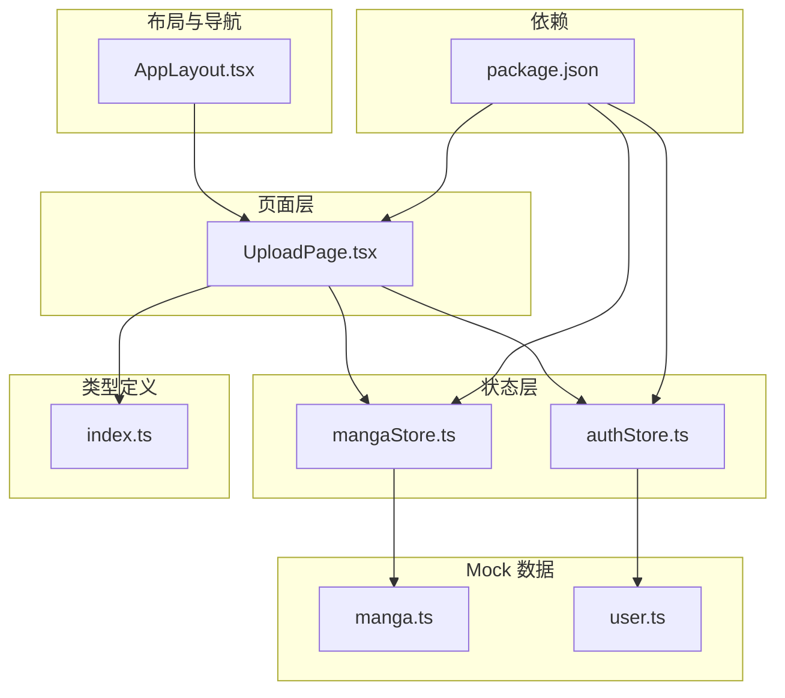
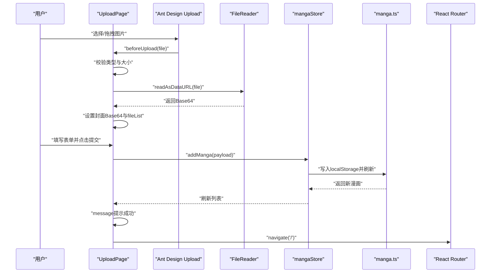
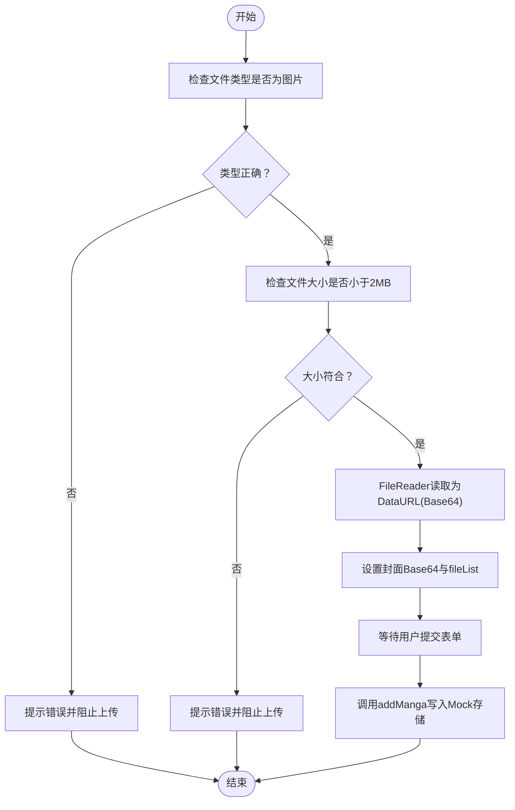
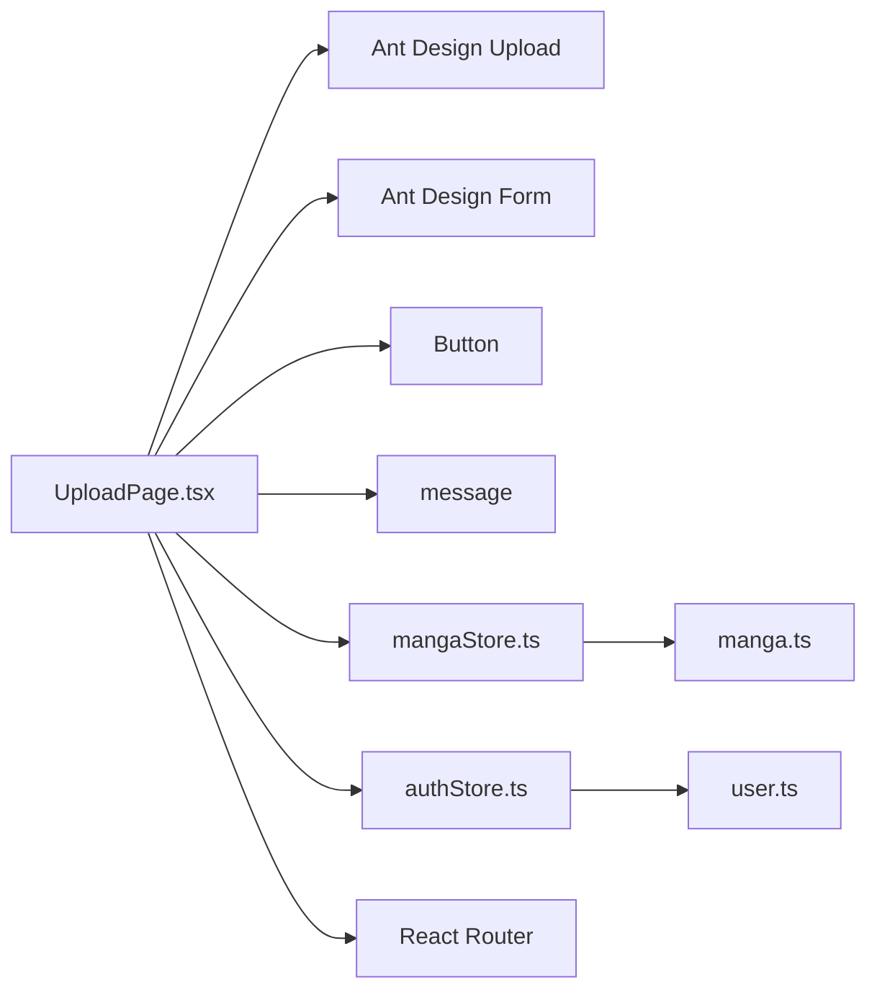

# 上传页面

<cite>
**本文引用的文件**
- [UploadPage.tsx](file://manga-website/src/pages/UploadPage.tsx)
- [mangaStore.ts](file://manga-website/src/stores/mangaStore.ts)
- [authStore.ts](file://manga-website/src/stores/authStore.ts)
- [index.ts](file://manga-website/src/types/index.ts)
- [manga.ts](file://manga-website/src/mock/manga.ts)
- [user.ts](file://manga-website/src/mock/user.ts)
- [AppLayout.tsx](file://manga-website/src/components/AppLayout.tsx)
- [package.json](file://manga-website/package.json)
</cite>

## 目录
1. [引言](#引言)
2. [项目结构](#项目结构)
3. [核心组件](#核心组件)
4. [架构总览](#架构总览)
5. [详细组件分析](#详细组件分析)
6. [依赖关系分析](#依赖关系分析)
7. [性能考量](#性能考量)
8. [故障排查指南](#故障排查指南)
9. [结论](#结论)
10. [附录](#附录)

## 引言
本文件面向漫画网站“上传页面”组件，系统性阐述文件上传功能的实现细节，包括文件选择、拖拽上传、图片预览、格式与大小校验、Base64 编码处理、上传表单设计（标题、作者、描述、链接）、上传进度与错误处理、成功反馈、安全注意事项（恶意文件检测、文件名清理、存储安全），以及上传后的数据更新与页面跳转逻辑。文档同时提供代码级架构图与流程图，帮助开发者快速理解与扩展该组件。

## 项目结构
上传页面位于前端工程的页面层，采用 React + Ant Design + Zustand 状态管理，配合本地 Mock 数据进行演示。关键目录与文件如下：
- 页面层：src/pages/UploadPage.tsx
- 状态层：src/stores/mangaStore.ts、src/stores/authStore.ts
- 类型定义：src/types/index.ts
- Mock 数据：src/mock/manga.ts、src/mock/user.ts
- 布局与导航：src/components/AppLayout.tsx
- 依赖配置：package.json

图表来源
- [UploadPage.tsx:1-187](file://manga-website/src/pages/UploadPage.tsx#L1-L187)
- [mangaStore.ts:1-62](file://manga-website/src/stores/mangaStore.ts#L1-L62)
- [authStore.ts:1-45](file://manga-website/src/stores/authStore.ts#L1-L45)
- [index.ts:1-44](file://manga-website/src/types/index.ts#L1-L44)
- [manga.ts:1-173](file://manga-website/src/mock/manga.ts#L1-L173)
- [user.ts:1-90](file://manga-website/src/mock/user.ts#L1-L90)
- [AppLayout.tsx:1-156](file://manga-website/src/components/AppLayout.tsx#L1-L156)
- [package.json:1-26](file://manga-website/package.json#L1-L26)

章节来源
- [UploadPage.tsx:1-187](file://manga-website/src/pages/UploadPage.tsx#L1-L187)
- [package.json:1-26](file://manga-website/package.json#L1-L26)

## 核心组件
- 上传页面组件 UploadPage：负责渲染上传表单、处理文件选择与预览、执行表单校验与提交、调用状态管理器添加漫画记录，并在成功后进行页面跳转与提示。
- 状态管理：
  - mangaStore：提供加载、搜索过滤、新增漫画、删除漫画等方法；新增漫画后刷新列表。
  - authStore：提供用户登录、注册、登出、当前用户查询等方法。
- 类型定义：Manga、User、UploadForm 等接口，确保表单字段与后端数据模型一致。
- Mock 数据：manga.ts 提供本地持久化存储与 CRUD 操作；user.ts 提供用户注册、登录与当前用户状态维护。

章节来源
- [UploadPage.tsx:13-187](file://manga-website/src/pages/UploadPage.tsx#L13-L187)
- [mangaStore.ts:16-61](file://manga-website/src/stores/mangaStore.ts#L16-L61)
- [authStore.ts:14-44](file://manga-website/src/stores/authStore.ts#L14-L44)
- [index.ts:1-44](file://manga-website/src/types/index.ts#L1-L44)
- [manga.ts:137-173](file://manga-website/src/mock/manga.ts#L137-L173)
- [user.ts:25-89](file://manga-website/src/mock/user.ts#L25-L89)

## 架构总览
上传页面采用“页面组件 + 状态管理 + 类型约束 + Mock 数据”的分层架构。Ant Design 的 Upload 组件用于文件选择与预览，beforeUpload 钩子完成格式与大小校验，并将封面图转换为 Base64；表单使用 Ant Design Form 完成字段校验；提交时通过 mangaStore.addManga 写入本地存储并刷新列表；成功后通过 message 提示与路由跳转返回首页。

图表来源
- [UploadPage.tsx:22-74](file://manga-website/src/pages/UploadPage.tsx#L22-L74)
- [mangaStore.ts:46-50](file://manga-website/src/stores/mangaStore.ts#L46-L50)
- [manga.ts:147-158](file://manga-website/src/mock/manga.ts#L147-L158)

## 详细组件分析

### 文件上传与预览机制
- 文件选择与拖拽上传
  - 使用 Ant Design Upload 组件，listType 设为“picture-card”，支持点击选择与拖拽上传。
  - beforeUpload 钩子在文件进入上传队列前触发，用于执行格式与大小校验。
- 图片预览
  - 校验通过后，使用 FileReader 将文件读取为 Base64，设置到组件状态 coverBase64，并将文件加入 fileList，从而在 Upload 组件中显示缩略图。
- 上传控制
  - 返回 Upload.LIST_IGNORE 阻止自动上传，避免直接发送二进制文件；最终通过自定义提交按钮统一发起请求。

章节来源
- [UploadPage.tsx:104-125](file://manga-website/src/pages/UploadPage.tsx#L104-L125)
- [UploadPage.tsx:22-44](file://manga-website/src/pages/UploadPage.tsx#L22-L44)

### 文件格式验证、大小限制与类型检查
- 类型检查：仅允许 image/* 类型文件，非图片类型直接提示并阻止进入上传队列。
- 大小限制：单张图片不超过 2MB，超出则提示并阻止进入上传队列。
- 交互反馈：使用 message 组件给出明确的错误提示。

章节来源
- [UploadPage.tsx:22-34](file://manga-website/src/pages/UploadPage.tsx#L22-L34)

### Base64 编码的图片处理流程
- 文件读取：在 beforeUpload 中创建 FileReader，读取文件为 dataURL（Base64）。
- 编码转换：reader.onload 回调中将结果保存到 coverBase64 状态。
- 数据存储：onFinish 中将 coverBase64 作为 coverUrl 字段传入 addManga，最终写入 localStorage。

图表来源
- [UploadPage.tsx:22-44](file://manga-website/src/pages/UploadPage.tsx#L22-L44)
- [mangaStore.ts:46-50](file://manga-website/src/stores/mangaStore.ts#L46-L50)
- [manga.ts:147-158](file://manga-website/src/mock/manga.ts#L147-L158)

### 上传表单设计
- 字段与规则
  - 封面图片：必填，使用 Upload 组件，支持移除。
  - 漫画标题：必填，最大长度 50。
  - 作者：必填，最大长度 30。
  - 简介：必填，多行文本，最大长度 300。
  - 原漫画链接：必填且为有效 URL。
- 表单布局：垂直布局，大尺寸输入框，提供字数统计与前缀图标增强可用性。

章节来源
- [UploadPage.tsx:104-168](file://manga-website/src/pages/UploadPage.tsx#L104-L168)
- [index.ts:36-43](file://manga-website/src/types/index.ts#L36-L43)

### 上传进度显示、错误处理与成功反馈
- 进度与加载：提交按钮使用 loading 状态，防止重复提交。
- 成功反馈：提交成功后弹出成功消息，清空表单与封面状态，并延迟跳转首页。
- 错误处理：try/catch 包裹提交逻辑，异常时弹出失败提示；finally 清理 loading 状态。

章节来源
- [UploadPage.tsx:46-74](file://manga-website/src/pages/UploadPage.tsx#L46-L74)

### 上传后的数据更新与页面跳转逻辑
- 数据更新：mangaStore.addManga 调用后，内部通过 loadMangas 刷新列表，确保新增漫画出现在首页列表中。
- 页面跳转：成功后延时 1500ms 导航至首页，给用户留出查看提示的时间。

章节来源
- [mangaStore.ts:46-60](file://manga-website/src/stores/mangaStore.ts#L46-L60)
- [UploadPage.tsx:64-68](file://manga-website/src/pages/UploadPage.tsx#L64-L68)

### 安全考虑与最佳实践
- 恶意文件检测
  - 前端仅允许 image/* 类型，结合大小限制减少资源消耗与潜在风险。
  - 建议后端进一步校验 MIME 类型与文件头，避免伪装文件。
- 文件名清理
  - 当前未对文件名进行清理；建议在后端生成安全的存储文件名，避免路径遍历与特殊字符。
- 存储安全
  - 当前使用 localStorage 存储漫画与用户数据，适合演示；生产环境应迁移到后端数据库与安全的文件存储服务。
  - Base64 图片存储会增加前端内存占用与传输体积，建议后端接收二进制流并返回短链或 CDN 地址。

章节来源
- [UploadPage.tsx:22-34](file://manga-website/src/pages/UploadPage.tsx#L22-L34)
- [manga.ts:133-135](file://manga-website/src/mock/manga.ts#L133-L135)
- [user.ts:67-73](file://manga-website/src/mock/user.ts#L67-L73)

### 代码示例与实现要点
- 文件读取与状态管理
  - 参考路径：[UploadPage.tsx:35-40](file://manga-website/src/pages/UploadPage.tsx#L35-L40)
- 表单提交与状态清理
  - 参考路径：[UploadPage.tsx:46-74](file://manga-website/src/pages/UploadPage.tsx#L46-L74)
- 新增漫画与列表刷新
  - 参考路径：[mangaStore.ts:46-50](file://manga-website/src/stores/mangaStore.ts#L46-L50)
- Mock 存储写入
  - 参考路径：[manga.ts:147-158](file://manga-website/src/mock/manga.ts#L147-L158)

## 依赖关系分析
- 组件耦合
  - UploadPage 依赖 Ant Design Upload、Form、Button、Typography、Upload、message 等组件与图标。
  - 依赖 Zustand 状态管理器访问用户与漫画状态。
- 外部依赖
  - Ant Design 提供 UI 与表单校验能力；React Router 提供路由跳转；Zustand 提供轻量状态管理。
- 潜在问题
  - 当前为 Mock 实现，未接入真实后端 API；若迁移至后端，需替换 beforeUpload 的 Base64 流程为标准上传请求，并在 onFinish 中发送 multipart/form-data 或二进制流。

图表来源
- [UploadPage.tsx:1-11](file://manga-website/src/pages/UploadPage.tsx#L1-L11)
- [mangaStore.ts:1-3](file://manga-website/src/stores/mangaStore.ts#L1-L3)
- [authStore.ts:1-3](file://manga-website/src/stores/authStore.ts#L1-L3)
- [manga.ts:1-5](file://manga-website/src/mock/manga.ts#L1-L5)
- [user.ts:1-5](file://manga-website/src/mock/user.ts#L1-L5)

章节来源
- [UploadPage.tsx:1-11](file://manga-website/src/pages/UploadPage.tsx#L1-L11)
- [package.json:11-16](file://manga-website/package.json#L11-L16)

## 性能考量
- Base64 图片体积膨胀：Base64 比原图体积约大 33%，建议后端接收二进制流并返回短链或 CDN 地址，减少前端内存与网络压力。
- 大文件处理：当前限制为 2MB，建议根据业务场景调整阈值，并在后端进行二次校验。
- 渲染优化：Upload 组件仅显示一张图片，无需额外虚拟滚动；可在列表页按需懒加载缩略图。
- 状态管理：Zustand 为轻量方案，适合小型应用；如数据规模增长，可考虑引入更完善的缓存策略或服务端同步。

## 故障排查指南
- 无法上传图片
  - 检查文件类型是否为图片；确认 beforeUpload 是否返回 Upload.LIST_IGNORE。
  - 参考路径：[UploadPage.tsx:22-34](file://manga-website/src/pages/UploadPage.tsx#L22-L34)
- 上传按钮无响应
  - 确认表单字段校验是否通过；检查 loading 状态是否被正确设置与清除。
  - 参考路径：[UploadPage.tsx:46-74](file://manga-website/src/pages/UploadPage.tsx#L46-L74)
- 提交后未跳转
  - 检查 navigate 调用与延时逻辑；确认 message 是否正常触发。
  - 参考路径：[UploadPage.tsx:64-68](file://manga-website/src/pages/UploadPage.tsx#L64-L68)
- 数据未更新
  - 确认 addManga 是否调用 loadMangas 刷新列表；检查 localStorage 是否写入成功。
  - 参考路径：[mangaStore.ts:46-60](file://manga-website/src/stores/mangaStore.ts#L46-L60)
  - 参考路径：[manga.ts:133-135](file://manga-website/src/mock/manga.ts#L133-L135)

章节来源
- [UploadPage.tsx:22-74](file://manga-website/src/pages/UploadPage.tsx#L22-L74)
- [mangaStore.ts:46-60](file://manga-website/src/stores/mangaStore.ts#L46-L60)
- [manga.ts:133-135](file://manga-website/src/mock/manga.ts#L133-L135)

## 结论
上传页面组件通过 Ant Design Upload 与 FileReader 实现了图片选择、预览与 Base64 编码，结合表单校验与状态管理，提供了完整的上传体验。当前为 Mock 实现，建议后续对接后端 API，采用二进制流上传与 CDN 管理，提升安全性与性能。同时完善安全策略（类型校验、文件名清理、存储加密）与错误处理，确保用户体验与系统稳定。

## 附录
- 关键实现路径参考
  - 文件读取与 Base64 设置：[UploadPage.tsx:35-40](file://manga-website/src/pages/UploadPage.tsx#L35-L40)
  - 表单提交与状态清理：[UploadPage.tsx:46-74](file://manga-website/src/pages/UploadPage.tsx#L46-L74)
  - 新增漫画与列表刷新：[mangaStore.ts:46-50](file://manga-website/src/stores/mangaStore.ts#L46-L50)
  - Mock 存储写入：[manga.ts:147-158](file://manga-website/src/mock/manga.ts#L147-L158)
  - 用户状态与导航入口：[authStore.ts:14-44](file://manga-website/src/stores/authStore.ts#L14-L44)
  - 布局与上传入口：[AppLayout.tsx:36-56](file://manga-website/src/components/AppLayout.tsx#L36-L56)