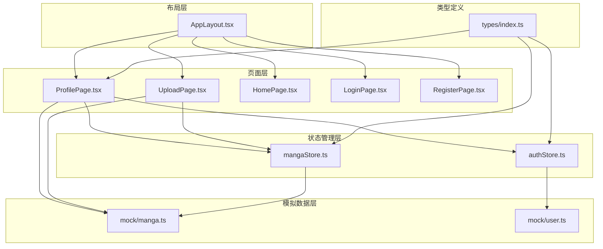
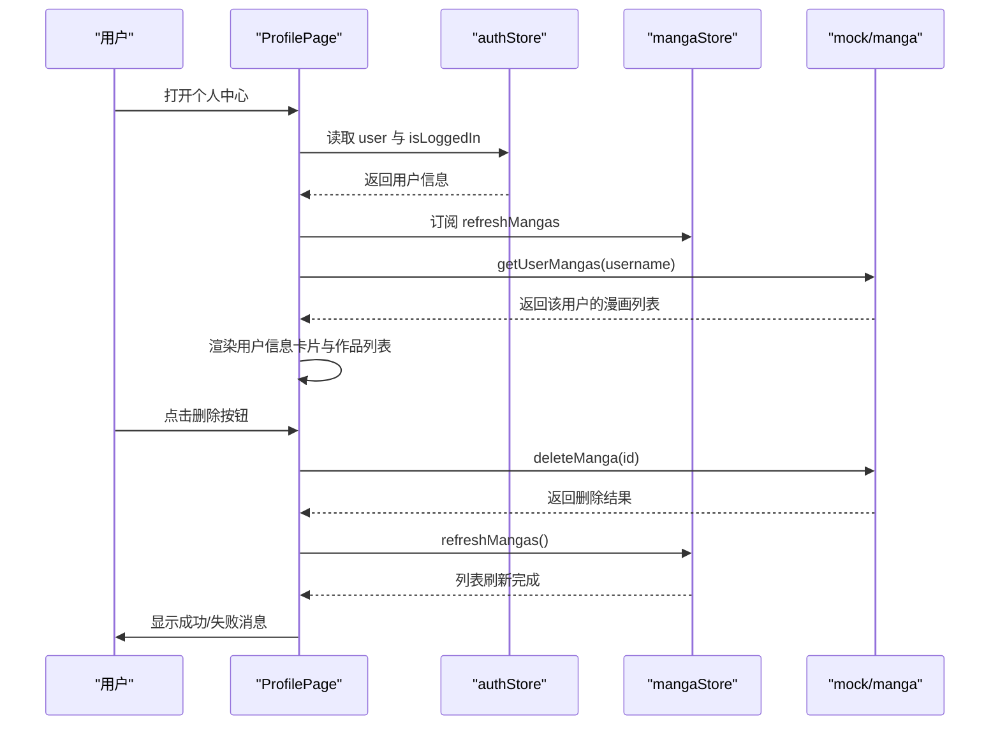
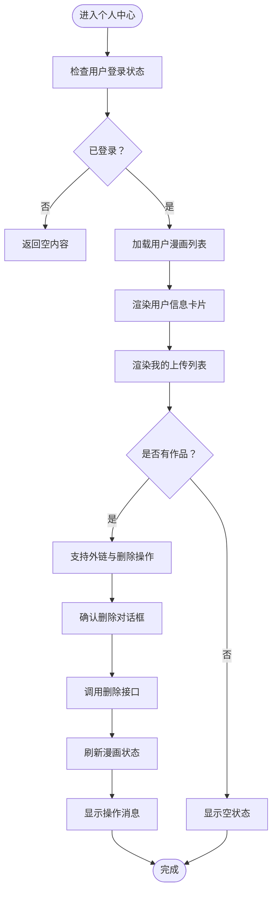
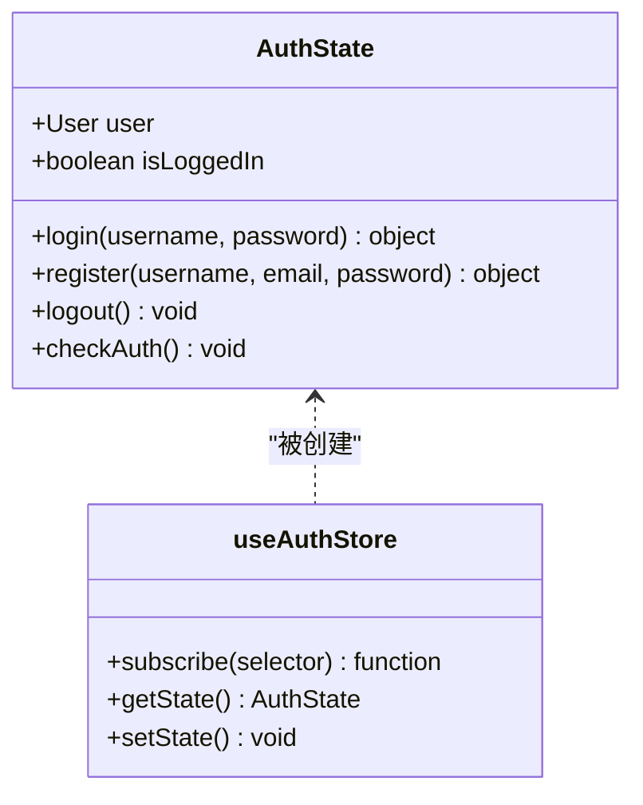
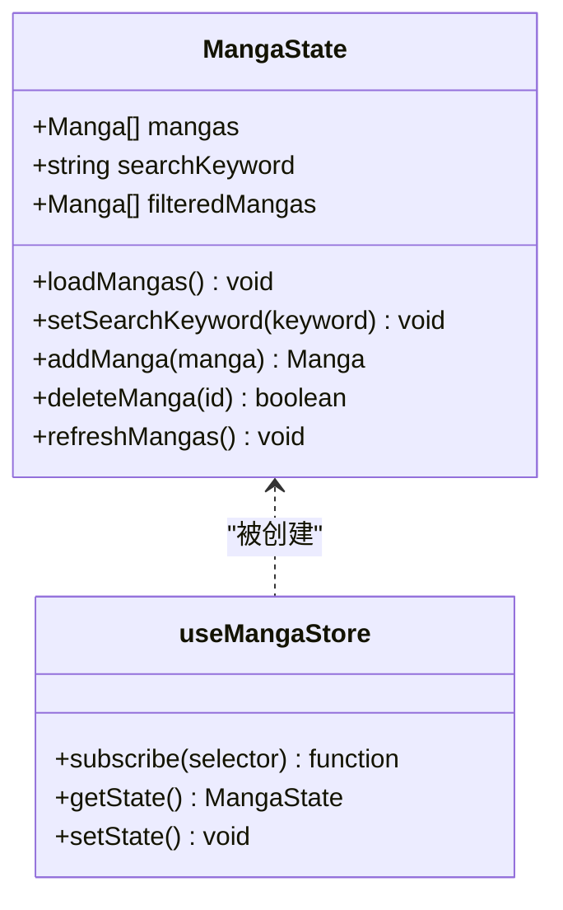
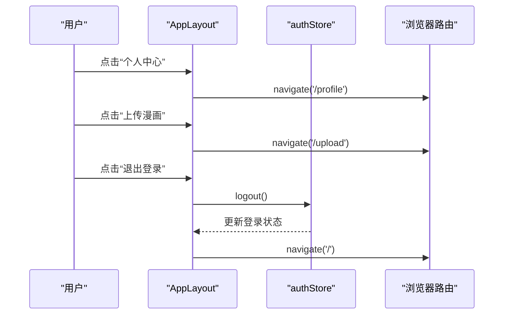
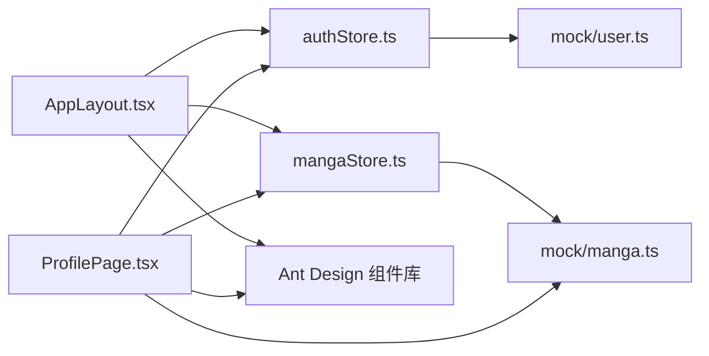

# 个人中心页面

<cite>
**本文档引用的文件**
- [ProfilePage.tsx](file://manga-website/src/pages/ProfilePage.tsx)
- [authStore.ts](file://manga-website/src/stores/authStore.ts)
- [mangaStore.ts](file://manga-website/src/stores/mangaStore.ts)
- [AppLayout.tsx](file://manga-website/src/components/AppLayout.tsx)
- [index.ts](file://manga-website/src/types/index.ts)
- [manga.ts](file://manga-website/src/mock/manga.ts)
- [user.ts](file://manga-website/src/mock/user.ts)
</cite>

## 目录
1. [简介](#简介)
2. [项目结构](#项目结构)
3. [核心组件](#核心组件)
4. [架构概览](#架构概览)
5. [详细组件分析](#详细组件分析)
6. [依赖分析](#依赖分析)
7. [性能考虑](#性能考虑)
8. [故障排除指南](#故障排除指南)
9. [结论](#结论)

## 简介
本文件为漫画网站个人中心页面组件的实现文档，围绕以下目标展开：  
- 个人资料展示：用户基本信息、头像显示与账户状态  
- 用户信息编辑：资料修改、密码更改与头像上传（当前实现以模拟数据为主）  
- 上传漫画管理：作品列表展示、状态查看与删除操作  
- 个人数据获取、更新与同步机制  
- 权限控制与隐私设置：公开信息与私有数据管理  
- 用户操作反馈：成功提示、错误处理与操作确认  
- 导航关系与数据流转：个人中心与其他页面的集成  

## 项目结构
个人中心页面位于 pages 目录，使用 Ant Design 组件库进行界面构建；状态管理通过 zustand 的 authStore 与 mangaStore 实现；类型定义集中在 types 目录；UI 布局由 AppLayout 提供全局导航与用户菜单。

**图表来源**
- [ProfilePage.tsx:1-152](file://manga-website/src/pages/ProfilePage.tsx#L1-L152)
- [AppLayout.tsx:1-156](file://manga-website/src/components/AppLayout.tsx#L1-L156)
- [authStore.ts:1-45](file://manga-website/src/stores/authStore.ts#L1-L45)
- [mangaStore.ts:1-62](file://manga-website/src/stores/mangaStore.ts#L1-L62)
- [index.ts:1-44](file://manga-website/src/types/index.ts#L1-L44)

**章节来源**
- [ProfilePage.tsx:1-152](file://manga-website/src/pages/ProfilePage.tsx#L1-L152)
- [AppLayout.tsx:1-156](file://manga-website/src/components/AppLayout.tsx#L1-L156)
- [authStore.ts:1-45](file://manga-website/src/stores/authStore.ts#L1-L45)
- [mangaStore.ts:1-62](file://manga-website/src/stores/mangaStore.ts#L1-L62)
- [index.ts:1-44](file://manga-website/src/types/index.ts#L1-L44)

## 核心组件
- 个人中心页面（ProfilePage）：负责渲染用户信息卡片与“我的上传”列表，支持删除操作与外部链接跳转。  
- 认证状态存储（authStore）：维护用户登录态与用户对象，提供登录、注册、登出与检查登录状态的方法。  
- 漫画状态存储（mangaStore）：维护漫画列表、搜索关键词与过滤结果，提供加载、搜索、新增与删除等方法。  
- 应用布局（AppLayout）：提供全局导航栏、搜索框、用户菜单与路由出口，连接各页面。  
- 类型定义（types/index.ts）：统一定义漫画与用户的数据结构及表单类型。  

**章节来源**
- [ProfilePage.tsx:11-152](file://manga-website/src/pages/ProfilePage.tsx#L11-L152)
- [authStore.ts:5-45](file://manga-website/src/stores/authStore.ts#L5-L45)
- [mangaStore.ts:5-62](file://manga-website/src/stores/mangaStore.ts#L5-L62)
- [AppLayout.tsx:19-156](file://manga-website/src/components/AppLayout.tsx#L19-L156)
- [index.ts:1-44](file://manga-website/src/types/index.ts#L1-L44)

## 架构概览
个人中心页面采用“页面 + 状态管理 + 模拟数据 + 类型约束”的分层架构。页面通过 hooks 订阅状态，调用模拟接口完成数据获取与更新，Ant Design 提供 UI 能力，路由与布局确保导航一致性。

**图表来源**
- [ProfilePage.tsx:17-33](file://manga-website/src/pages/ProfilePage.tsx#L17-L33)
- [authStore.ts:14-43](file://manga-website/src/stores/authStore.ts#L14-L43)
- [mangaStore.ts:58-61](file://manga-website/src/stores/mangaStore.ts#L58-L61)
- [manga.ts](file://manga-website/src/mock/manga.ts)

## 详细组件分析

### 个人中心页面（ProfilePage）
- 数据获取与渲染
  - 通过 authStore 获取当前用户信息，若未登录则不渲染内容。  
  - 使用 mock 接口根据用户名获取该用户上传的漫画列表，并在加载完成后渲染到“我的上传”区域。  
  - 用户信息卡片展示用户名、邮箱与注册时间等基础字段。  
- 操作与交互
  - 外链跳转：点击“原链接”按钮打开漫画原始地址。  
  - 删除确认：使用 Popconfirm 进行二次确认，调用 mock 删除接口并更新本地状态与全局漫画列表。  
  - 成功/失败反馈：通过消息组件提示操作结果。  
- 展示逻辑
  - 当无作品时显示空状态占位图；有作品时以列表形式展示封面、标题、作者与描述，并标注“用户上传”标签。  

**图表来源**
- [ProfilePage.tsx:17-33](file://manga-website/src/pages/ProfilePage.tsx#L17-L33)
- [ProfilePage.tsx:84-147](file://manga-website/src/pages/ProfilePage.tsx#L84-L147)

**章节来源**
- [ProfilePage.tsx:11-152](file://manga-website/src/pages/ProfilePage.tsx#L11-L152)

### 认证状态存储（authStore）
- 状态结构
  - user：当前用户对象或空  
  - isLoggedIn：布尔值表示登录状态  
- 核心方法
  - login：调用模拟登录接口，成功后更新用户与登录状态  
  - register：调用模拟注册接口，成功后设置当前用户并更新状态  
  - logout：调用模拟登出接口并清空用户状态  
  - checkAuth：从模拟存储中读取当前用户并同步登录状态  
- 与页面集成
  - ProfilePage 通过订阅 user 字段获取用户信息  
  - AppLayout 通过 isLoggedIn 控制顶部导航显示登录/注册或用户菜单  

**图表来源**
- [authStore.ts:5-45](file://manga-website/src/stores/authStore.ts#L5-L45)

**章节来源**
- [authStore.ts:1-45](file://manga-website/src/stores/authStore.ts#L1-L45)

### 漫画状态存储（mangaStore）
- 状态结构
  - mangas：全部漫画列表  
  - searchKeyword：搜索关键词  
  - filteredMangas：按关键词过滤后的列表  
- 核心方法
  - loadMangas：从模拟数据加载并按关键词过滤  
  - setSearchKeyword：更新关键词并重新过滤  
  - addManga：新增漫画并刷新列表  
  - deleteManga：删除漫画并刷新列表  
  - refreshMangas：触发重新加载  
- 与页面集成
  - ProfilePage 订阅 refreshMangas 以响应删除后的列表更新  
  - UploadPage 使用 addManga 新增漫画  

**图表来源**
- [mangaStore.ts:5-62](file://manga-website/src/stores/mangaStore.ts#L5-L62)

**章节来源**
- [mangaStore.ts:1-62](file://manga-website/src/stores/mangaStore.ts#L1-L62)

### 应用布局（AppLayout）
- 功能要点
  - 全局头部包含站点标识、搜索框与用户操作区  
  - 根据登录状态显示登录/注册按钮或用户菜单（含“个人中心”“上传漫画”“退出登录”）  
  - 搜索框支持回车与按钮触发，切换到首页并应用关键词  
  - 通过 Outlet 渲染子路由内容  
- 导航关系
  - “个人中心”按钮导航至 /profile  
  - “上传漫画”按钮导航至 /upload  
  - “退出登录”调用认证存储的 logout 并重定向首页  

**图表来源**
- [AppLayout.tsx:36-56](file://manga-website/src/components/AppLayout.tsx#L36-L56)
- [AppLayout.tsx:31-34](file://manga-website/src/components/AppLayout.tsx#L31-L34)

**章节来源**
- [AppLayout.tsx:1-156](file://manga-website/src/components/AppLayout.tsx#L1-L156)

### 类型定义（types/index.ts）
- 数据模型
  - Manga：漫画实体，包含标题、作者、描述、封面图、原始链接、创建时间与可选上传者字段  
  - User：用户实体，包含用户名、邮箱、密码与创建时间  
  - 表单类型：LoginForm、RegisterForm、UploadForm  
- 作用
  - 为页面、状态与模拟数据提供统一的类型约束，保证数据结构一致  

**章节来源**
- [index.ts:1-44](file://manga-website/src/types/index.ts#L1-L44)

## 依赖分析
- 页面对状态的依赖
  - ProfilePage 依赖 authStore 的 user 与 mangaStore 的 refreshMangas  
  - AppLayout 依赖 authStore 的 isLoggedIn 与 mangaStore 的 searchKeyword  
- 状态对模拟数据的依赖
  - authStore 依赖 mock/user.ts  
  - mangaStore 依赖 mock/manga.ts  
- UI 组件依赖
  - Ant Design 的 Card、Descriptions、List、Button、Popconfirm、message、Empty、Tag 等组件用于界面与交互  

**图表来源**
- [ProfilePage.tsx:4-7](file://manga-website/src/pages/ProfilePage.tsx#L4-L7)
- [authStore.ts:3](file://manga-website/src/stores/authStore.ts#L3)
- [mangaStore.ts:3](file://manga-website/src/stores/mangaStore.ts#L3)

**章节来源**
- [ProfilePage.tsx:1-10](file://manga-website/src/pages/ProfilePage.tsx#L1-L10)
- [authStore.ts:1-4](file://manga-website/src/stores/authStore.ts#L1-L4)
- [mangaStore.ts:1-4](file://manga-website/src/stores/mangaStore.ts#L1-L4)

## 性能考虑
- 列表渲染优化
  - 使用虚拟化或分页策略可降低大列表渲染成本（建议在真实数据量增长时引入）  
- 状态更新粒度
  - 将用户信息与漫画列表拆分为独立状态，避免不必要的重渲染  
- 搜索过滤
  - 在搜索关键词变更时才触发过滤计算，避免每次渲染都执行过滤逻辑  
- 图片加载
  - 对封面图添加懒加载与尺寸限制，减少首屏压力  

## 故障排除指南
- 未显示用户信息
  - 检查 authStore 的 checkAuth 是否正确读取当前用户  
  - 确认用户是否已登录  
- 删除漫画无效
  - 确认 mock/deleteManga 返回值逻辑  
  - 检查 handleDelete 中是否调用了 refreshMangas 以刷新全局列表  
- 搜索无结果
  - 确认 AppLayout 的搜索值与 mangaStore 的 searchKeyword 同步  
  - 检查 loadMangas 的过滤条件是否符合预期  
- 导航异常
  - 确认 AppLayout 的路由配置与实际路由一致  

**章节来源**
- [ProfilePage.tsx:24-33](file://manga-website/src/pages/ProfilePage.tsx#L24-L33)
- [authStore.ts:40-43](file://manga-website/src/stores/authStore.ts#L40-L43)
- [mangaStore.ts:21-32](file://manga-website/src/stores/mangaStore.ts#L21-L32)
- [AppLayout.tsx:26-29](file://manga-website/src/components/AppLayout.tsx#L26-L29)

## 结论
个人中心页面通过清晰的分层设计实现了用户信息展示、上传作品管理与操作反馈。认证与状态管理模块提供了稳定的上下文能力，布局模块保障了导航一致性。后续可在真实后端对接、权限细化与性能优化方面进一步完善。