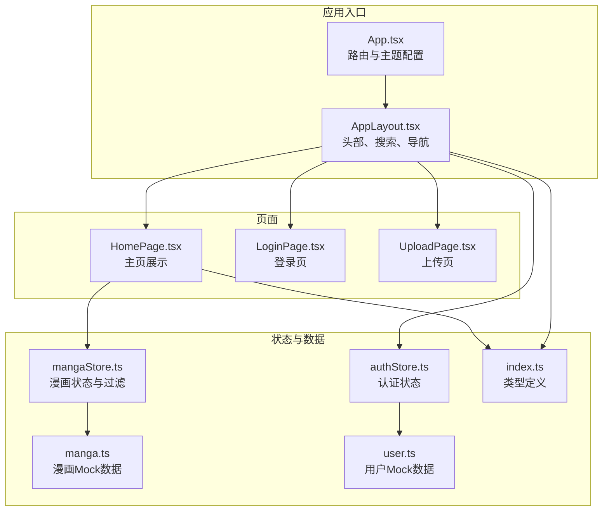
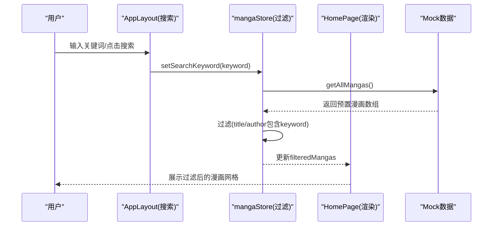
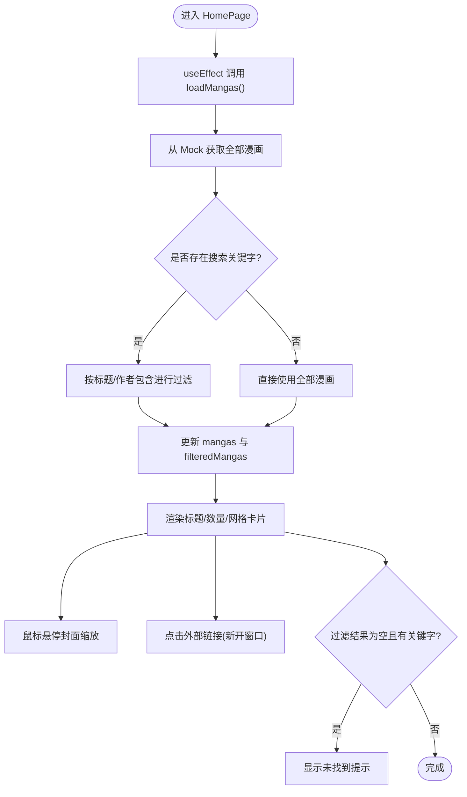
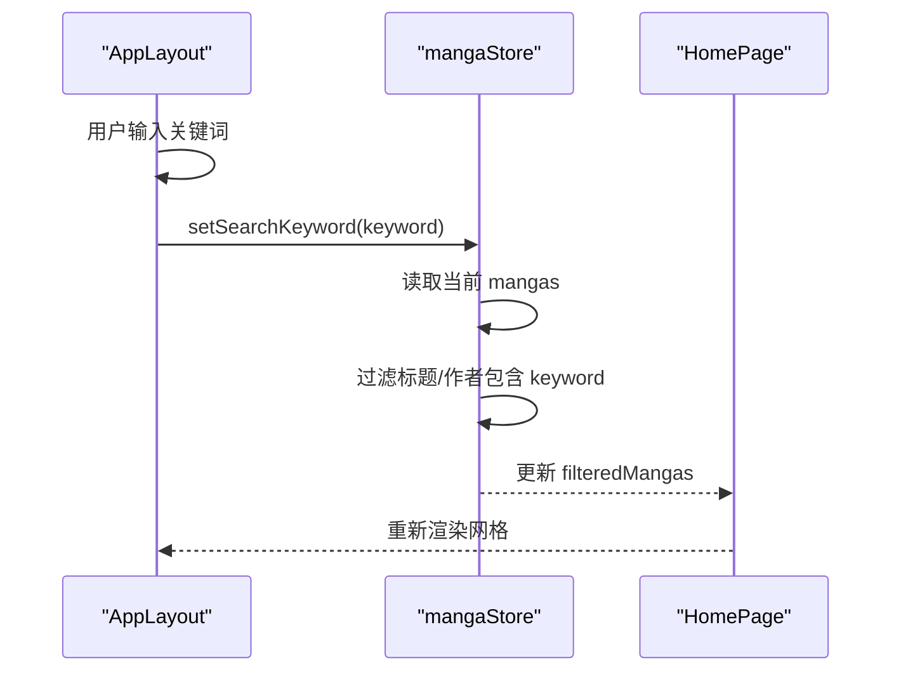
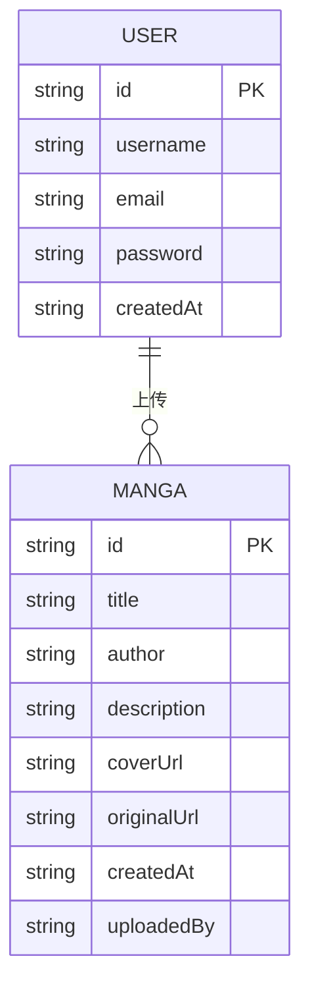
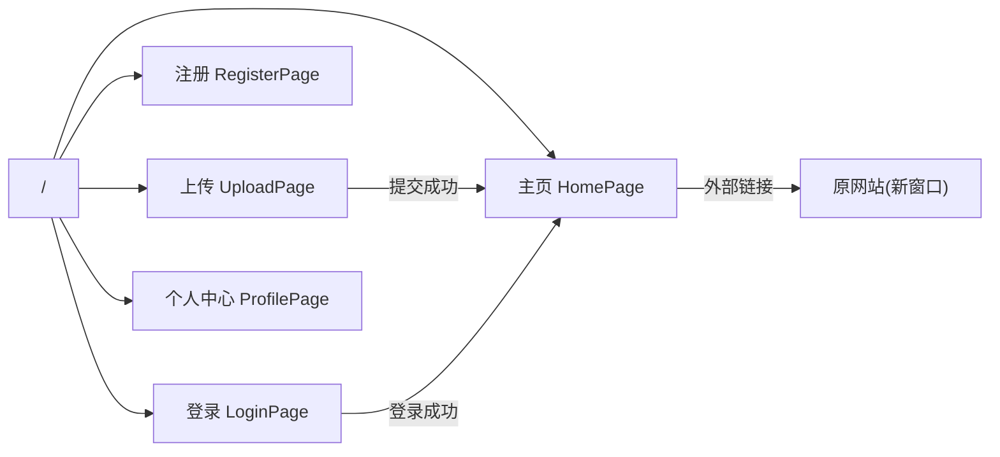
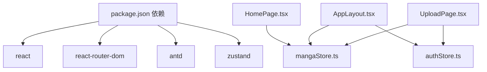

# 主页实现

<cite>
**本文引用的文件**
- [HomePage.tsx](file://manga-website/src/pages/HomePage.tsx)
- [mangaStore.ts](file://manga-website/src/stores/mangaStore.ts)
- [manga.ts](file://manga-website/src/mock/manga.ts)
- [index.ts](file://manga-website/src/types/index.ts)
- [AppLayout.tsx](file://manga-website/src/components/AppLayout.tsx)
- [App.tsx](file://manga-website/src/App.tsx)
- [authStore.ts](file://manga-website/src/stores/authStore.ts)
- [user.ts](file://manga-website/src/mock/user.ts)
- [LoginPage.tsx](file://manga-website/src/pages/LoginPage.tsx)
- [UploadPage.tsx](file://manga-website/src/pages/UploadPage.tsx)
- [vite.config.ts](file://manga-website/vite.config.ts)
- [package.json](file://manga-website/package.json)
</cite>

## 目录
1. [引言](#引言)
2. [项目结构](#项目结构)
3. [核心组件](#核心组件)
4. [架构总览](#架构总览)
5. [详细组件分析](#详细组件分析)
6. [依赖分析](#依赖分析)
7. [性能考虑](#性能考虑)
8. [故障排查指南](#故障排查指南)
9. [结论](#结论)
10. [附录](#附录)

## 引言
本文件围绕漫画网站的主页组件进行系统化实现文档编写，重点覆盖以下方面：
- 主页漫画展示逻辑与响应式网格布局
- 数据获取、过滤与排序机制
- 搜索功能（关键词匹配与实时搜索）
- 漫画卡片渲染、点击跳转与详情展示
- 分页/无限滚动/懒加载的实现建议
- 性能优化策略（图片懒加载、虚拟滚动等）
- 数据状态、错误处理与加载状态的处理方式
- 主页与其他页面的导航关系与路由配置

## 项目结构
该站点采用 React + TypeScript + Vite 构建，使用 Ant Design 作为 UI 组件库，Zustand 管理全局状态，本地 Mock 数据提供漫画与用户信息。

**图表来源**
- [App.tsx:13-63](file://manga-website/src/App.tsx#L13-L63)
- [AppLayout.tsx:19-155](file://manga-website/src/components/AppLayout.tsx#L19-L155)
- [HomePage.tsx:8-107](file://manga-website/src/pages/HomePage.tsx#L8-L107)
- [mangaStore.ts:16-61](file://manga-website/src/stores/mangaStore.ts#L16-L61)
- [manga.ts:138-173](file://manga-website/src/mock/manga.ts#L138-L173)
- [authStore.ts:14-44](file://manga-website/src/stores/authStore.ts#L14-L44)
- [user.ts:76-89](file://manga-website/src/mock/user.ts#L76-L89)
- [index.ts:1-44](file://manga-website/src/types/index.ts#L1-L44)

**章节来源**
- [App.tsx:13-63](file://manga-website/src/App.tsx#L13-L63)
- [AppLayout.tsx:19-155](file://manga-website/src/components/AppLayout.tsx#L19-L155)
- [HomePage.tsx:8-107](file://manga-website/src/pages/HomePage.tsx#L8-L107)
- [mangaStore.ts:16-61](file://manga-website/src/stores/mangaStore.ts#L16-L61)
- [manga.ts:138-173](file://manga-website/src/mock/manga.ts#L138-L173)
- [authStore.ts:14-44](file://manga-website/src/stores/authStore.ts#L14-L44)
- [user.ts:76-89](file://manga-website/src/mock/user.ts#L76-L89)
- [index.ts:1-44](file://manga-website/src/types/index.ts#L1-L44)

## 核心组件
- 主页组件：负责渲染漫画列表、响应式网格布局、悬停缩放效果、用户上传标签、外部链接按钮与元数据展示。
- 应用布局：提供顶部导航栏、搜索框、用户菜单、面包屑与内容区出口。
- 状态管理：使用 Zustand 的漫画 Store 管理原始数据、搜索关键字与过滤后的列表；认证 Store 管理登录状态。
- Mock 数据：提供预置漫画数据、用户数据与持久化存储接口。

**章节来源**
- [HomePage.tsx:8-107](file://manga-website/src/pages/HomePage.tsx#L8-L107)
- [AppLayout.tsx:19-155](file://manga-website/src/components/AppLayout.tsx#L19-L155)
- [mangaStore.ts:16-61](file://manga-website/src/stores/mangaStore.ts#L16-L61)
- [authStore.ts:14-44](file://manga-website/src/stores/authStore.ts#L14-L44)
- [manga.ts:138-173](file://manga-website/src/mock/manga.ts#L138-L173)
- [user.ts:76-89](file://manga-website/src/mock/user.ts#L76-L89)

## 架构总览
主页通过全局状态驱动渲染，搜索在布局层输入并在主页生效，卡片点击跳转到外部链接，不触发页面路由切换。

**图表来源**
- [AppLayout.tsx:26-29](file://manga-website/src/components/AppLayout.tsx#L26-L29)
- [mangaStore.ts:34-44](file://manga-website/src/stores/mangaStore.ts#L34-L44)
- [manga.ts:138-140](file://manga-website/src/mock/manga.ts#L138-L140)
- [HomePage.tsx:15-21](file://manga-website/src/pages/HomePage.tsx#L15-L21)

## 详细组件分析

### 主页组件（HomePage）
- 渲染逻辑
  - 首次挂载时调用加载函数拉取数据并初始化过滤列表。
  - 当存在搜索关键字且过滤结果为空时，显示“未找到”的占位提示。
  - 否则渲染标题、数量统计与响应式网格卡片。
- 响应式网格
  - 使用栅格系统按屏幕尺寸设置列跨度，确保在移动端到桌面端的良好适配。
- 卡片交互
  - 图片悬停放大，增加视觉反馈。
  - 右上角显示“用户上传”标签（当存在上传者字段）。
  - 底部动作区提供外部链接按钮，点击不阻止冒泡以避免误触卡片跳转。
- 数据绑定
  - 标题、作者、描述、封面图、外部链接均来自状态中的漫画对象。

**图表来源**
- [HomePage.tsx:11-13](file://manga-website/src/pages/HomePage.tsx#L11-L13)
- [HomePage.tsx:23-104](file://manga-website/src/pages/HomePage.tsx#L23-L104)
- [mangaStore.ts:21-32](file://manga-website/src/stores/mangaStore.ts#L21-L32)
- [manga.ts:138-140](file://manga-website/src/mock/manga.ts#L138-L140)

**章节来源**
- [HomePage.tsx:8-107](file://manga-website/src/pages/HomePage.tsx#L8-L107)

### 搜索与过滤（AppLayout + mangaStore）
- 搜索输入
  - 在布局组件中维护本地搜索值，支持清空与回车提交。
  - 提交后调用状态方法设置搜索关键字，并导航至首页以触发渲染。
- 过滤策略
  - 关键字为空时返回全部漫画。
  - 关键字非空时对标题与作者进行不区分大小写的包含匹配。
- 实时性
  - 当前实现为“输入后提交触发”，若需“实时搜索”，可在输入回调中调用 setSearchKeyword 并配合节流。

**图表来源**
- [AppLayout.tsx:24-29](file://manga-website/src/components/AppLayout.tsx#L24-L29)
- [mangaStore.ts:34-44](file://manga-website/src/stores/mangaStore.ts#L34-L44)
- [HomePage.tsx:15-21](file://manga-website/src/pages/HomePage.tsx#L15-L21)

**章节来源**
- [AppLayout.tsx:24-29](file://manga-website/src/components/AppLayout.tsx#L24-L29)
- [mangaStore.ts:34-44](file://manga-website/src/stores/mangaStore.ts#L34-L44)

### 数据模型与 Mock 数据
- 类型定义
  - 漫画对象包含标识、标题、作者、简介、封面图、原网站链接、创建时间与可选上传者。
- Mock 数据
  - 预置多条示例漫画，首次访问时写入本地存储。
  - 支持添加、删除、按 ID 查询与按上传者筛选。
- 认证 Mock
  - 提供注册、登录、登出与当前用户读取/清除。

**图表来源**
- [index.ts:2-11](file://manga-website/src/types/index.ts#L2-L11)
- [manga.ts:138-173](file://manga-website/src/mock/manga.ts#L138-L173)
- [user.ts:76-89](file://manga-website/src/mock/user.ts#L76-L89)

**章节来源**
- [index.ts:1-44](file://manga-website/src/types/index.ts#L1-L44)
- [manga.ts:138-173](file://manga-website/src/mock/manga.ts#L138-L173)
- [user.ts:76-89](file://manga-website/src/mock/user.ts#L76-L89)

### 导航与路由配置
- 路由结构
  - 根路由指向主页。
  - 登录/注册页使用访客守卫，上传/个人中心页使用认证守卫。
  - 所有页面包裹统一布局组件，提供一致的头部与内容区域。
- 页面跳转
  - 搜索提交后导航至首页。
  - 上传页成功后延迟返回首页。

**图表来源**
- [App.tsx:24-59](file://manga-website/src/App.tsx#L24-L59)
- [AppLayout.tsx:31-34](file://manga-website/src/components/AppLayout.tsx#L31-L34)
- [UploadPage.tsx:68-68](file://manga-website/src/pages/UploadPage.tsx#L68-L68)
- [LoginPage.tsx:18-22](file://manga-website/src/pages/LoginPage.tsx#L18-L22)

**章节来源**
- [App.tsx:13-63](file://manga-website/src/App.tsx#L13-L63)
- [AppLayout.tsx:19-155](file://manga-website/src/components/AppLayout.tsx#L19-L155)
- [UploadPage.tsx:68-68](file://manga-website/src/pages/UploadPage.tsx#L68-L68)
- [LoginPage.tsx:18-22](file://manga-website/src/pages/LoginPage.tsx#L18-L22)

## 依赖分析
- 外部依赖
  - React、React Router DOM、Ant Design、Zustand。
- 内部依赖
  - 主页依赖漫画 Store；布局依赖认证 Store 与漫画 Store；上传页依赖认证 Store 与漫画 Store。
- 数据流向
  - Mock 数据为只读源，Store 负责缓存与过滤；UI 仅消费状态。

**图表来源**
- [package.json:11-24](file://manga-website/package.json#L11-L24)
- [HomePage.tsx:4-4](file://manga-website/src/pages/HomePage.tsx#L4-L4)
- [AppLayout.tsx:13-14](file://manga-website/src/components/AppLayout.tsx#L13-L14)
- [UploadPage.tsx:6-7](file://manga-website/src/pages/UploadPage.tsx#L6-L7)

**章节来源**
- [package.json:11-24](file://manga-website/package.json#L11-L24)
- [HomePage.tsx:4-4](file://manga-website/src/pages/HomePage.tsx#L4-L4)
- [AppLayout.tsx:13-14](file://manga-website/src/components/AppLayout.tsx#L13-L14)
- [UploadPage.tsx:6-7](file://manga-website/src/pages/UploadPage.tsx#L6-L7)

## 性能考虑
- 图片懒加载
  - 建议将封面图替换为支持懒加载的组件或使用原生属性，减少首屏资源压力。
- 虚拟滚动
  - 若漫画数量增长，可引入虚拟滚动组件以降低 DOM 节点数量，提升滚动性能。
- 过滤优化
  - 当前过滤在内存中进行，建议对关键字做防抖处理，避免频繁重算。
- 缓存策略
  - 利用浏览器本地存储缓存预置数据，减少重复解析成本。
- 服务端迁移准备
  - 将 Mock 接口替换为真实 API，结合分页/无限滚动与请求去重策略，进一步优化网络与渲染开销。

[本节为通用性能建议，无需特定文件引用]

## 故障排查指南
- 搜索无结果
  - 检查搜索关键字是否为空；确认过滤逻辑是否正确匹配标题/作者。
  - 确认 Store 是否已调用加载函数初始化数据。
- 卡片点击无效
  - 确认外部链接按钮阻止了事件冒泡，避免误触卡片跳转。
- 上传后未刷新
  - 确认上传成功后调用了刷新函数并重新加载数据。
- 登录状态异常
  - 检查认证 Store 的当前用户状态与本地存储一致性。

**章节来源**
- [mangaStore.ts:21-32](file://manga-website/src/stores/mangaStore.ts#L21-L32)
- [HomePage.tsx:74-74](file://manga-website/src/pages/HomePage.tsx#L74-L74)
- [UploadPage.tsx:64-68](file://manga-website/src/pages/UploadPage.tsx#L64-L68)
- [authStore.ts:35-38](file://manga-website/src/stores/authStore.ts#L35-L38)

## 结论
主页实现了清晰的数据驱动渲染、响应式网格布局与基础搜索过滤。通过 Store 解耦数据与视图，配合 Mock 数据与路由守卫，构建了可扩展的基础框架。后续可在搜索实时性、图片懒加载、虚拟滚动与服务端迁移等方面持续优化。

[本节为总结性内容，无需特定文件引用]

## 附录
- 开发服务器配置
  - Vite 默认端口 3000，启动后自动打开浏览器。
- 项目脚本
  - dev：开发模式
  - build：编译与打包
  - preview：预览构建产物

**章节来源**
- [vite.config.ts:4-10](file://manga-website/vite.config.ts#L4-L10)
- [package.json:6-10](file://manga-website/package.json#L6-L10)