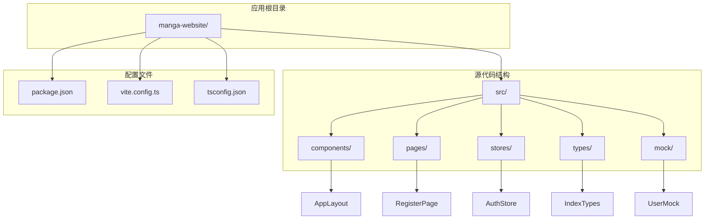
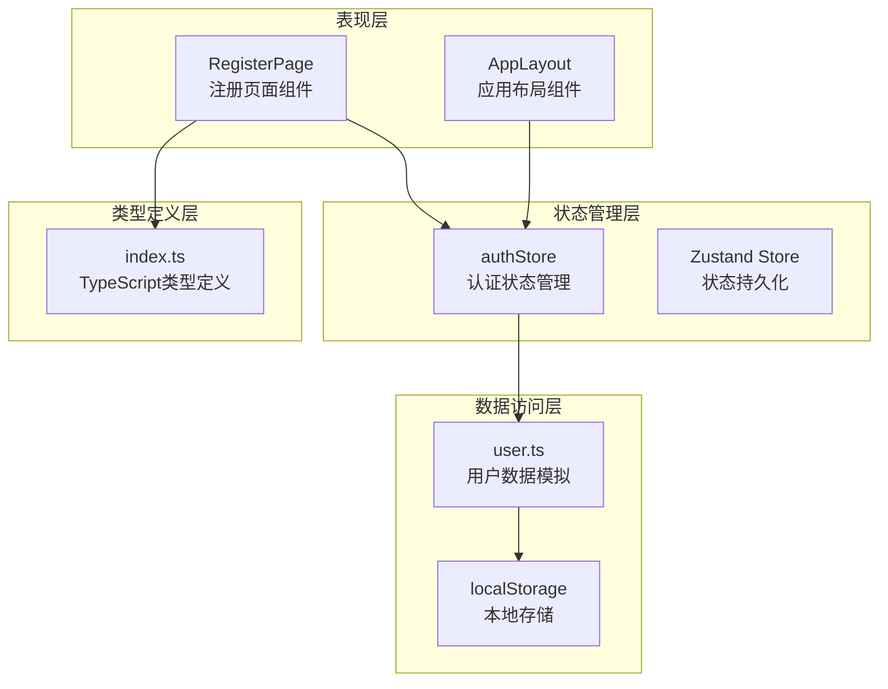
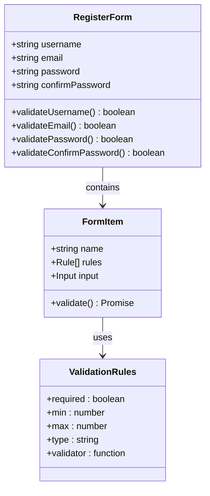
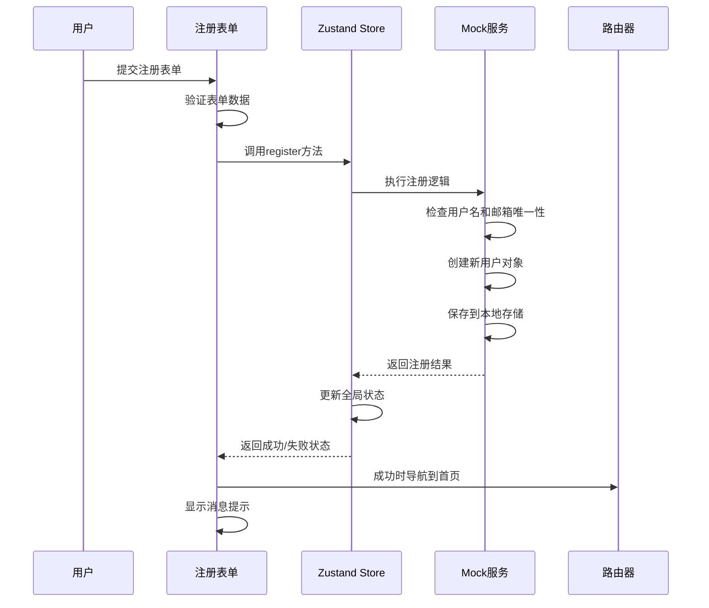
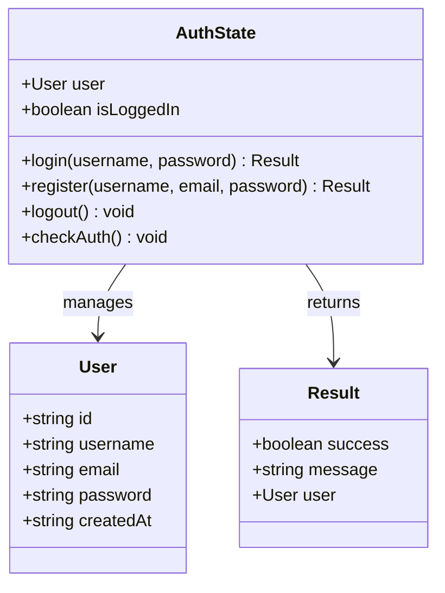
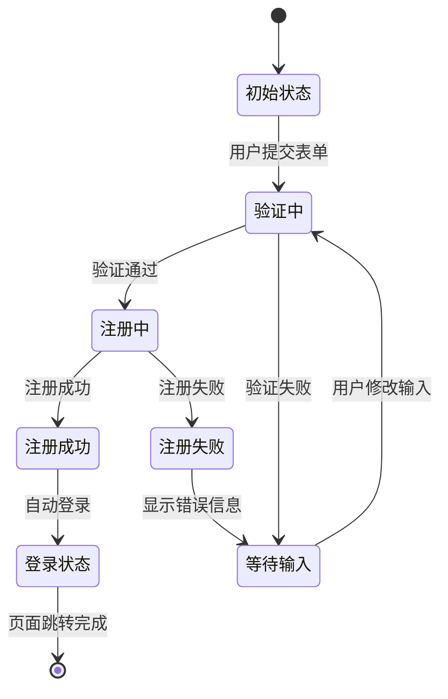
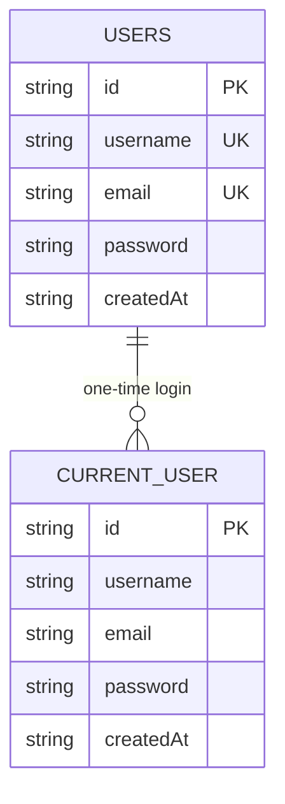
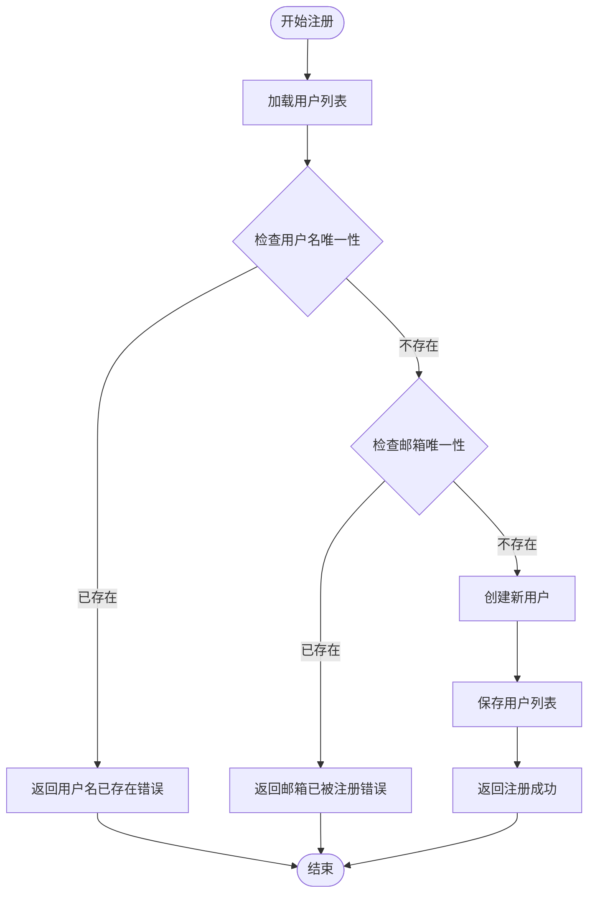
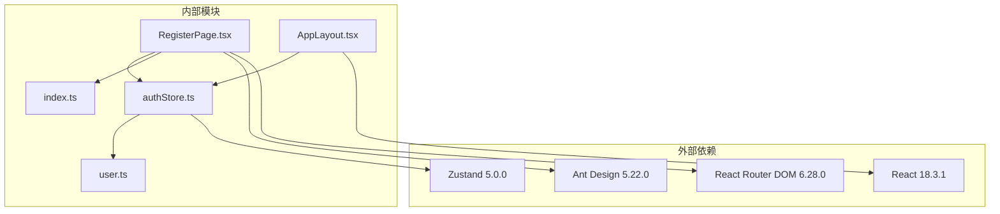

# 注册页面

<cite>
**本文档引用的文件**
- [RegisterPage.tsx](file://manga-website/src/pages/RegisterPage.tsx)
- [authStore.ts](file://manga-website/src/stores/authStore.ts)
- [user.ts](file://manga-website/src/mock/user.ts)
- [index.ts](file://manga-website/src/types/index.ts)
- [AppLayout.tsx](file://manga-website/src/components/AppLayout.tsx)
- [App.tsx](file://manga-website/src/App.tsx)
- [package.json](file://manga-website/package.json)
</cite>

## 目录
1. [简介](#简介)
2. [项目结构](#项目结构)
3. [核心组件](#核心组件)
4. [架构概览](#架构概览)
5. [详细组件分析](#详细组件分析)
6. [依赖关系分析](#依赖关系分析)
7. [性能考虑](#性能考虑)
8. [故障排除指南](#故障排除指南)
9. [结论](#结论)

## 简介

本文档详细分析了漫画网站的注册页面组件实现。该组件采用现代化的React + TypeScript + Ant Design + Zustand架构，提供了完整的用户注册功能，包括表单验证、状态管理和错误处理机制。注册页面集成了本地存储模拟后端服务，实现了从表单提交到状态更新的完整流程。

## 项目结构

漫画网站采用模块化架构设计，主要目录结构如下：

**图表来源**
- [package.json:1-26](file://manga-website/package.json#L1-L26)
- [App.tsx:1-66](file://manga-website/src/App.tsx#L1-L66)

**章节来源**
- [package.json:1-26](file://manga-website/package.json#L1-L26)
- [App.tsx:13-63](file://manga-website/src/App.tsx#L13-L63)

## 核心组件

注册页面组件是整个认证系统的核心入口，负责用户交互和状态管理。该组件采用了函数式组件模式，结合React Hooks实现了完整的表单处理逻辑。

### 组件架构特点

1. **响应式设计**: 使用Ant Design的Card组件提供美观的注册界面
2. **表单验证**: 集成Ant Design Form组件的内置验证机制
3. **状态管理**: 通过Zustand状态管理库实现全局状态共享
4. **路由集成**: 与React Router无缝集成，支持页面跳转

### 主要功能特性

- 用户名唯一性检查
- 邮箱格式验证
- 密码强度验证
- 密码确认机制
- 自动登录功能
- 错误处理和用户反馈

**章节来源**
- [RegisterPage.tsx:9-121](file://manga-website/src/pages/RegisterPage.tsx#L9-L121)

## 架构概览

注册页面的实现采用了分层架构模式，各层职责明确，耦合度低：

**图表来源**
- [RegisterPage.tsx:1-121](file://manga-website/src/pages/RegisterPage.tsx#L1-L121)
- [authStore.ts:1-45](file://manga-website/src/stores/authStore.ts#L1-L45)
- [user.ts:1-90](file://manga-website/src/mock/user.ts#L1-L90)

## 详细组件分析

### 注册页面组件分析

注册页面组件是基于Ant Design Form构建的完整表单解决方案，实现了以下核心功能：

#### 表单字段设计

**图表来源**
- [RegisterPage.tsx:52-99](file://manga-website/src/pages/RegisterPage.tsx#L52-L99)
- [index.ts:28-34](file://manga-website/src/types/index.ts#L28-L34)

#### 表单验证规则详解

注册页面实现了多层次的表单验证机制：

1. **用户名验证**
   - 必填验证：确保用户输入用户名
   - 长度验证：3-20个字符限制
   - 唯一性验证：通过后端检查确保用户名未被使用

2. **邮箱验证**
   - 必填验证：确保提供邮箱地址
   - 格式验证：标准邮箱格式检查

3. **密码验证**
   - 必填验证：确保设置密码
   - 强度验证：至少6个字符

4. **密码确认验证**
   - 必填验证：确保确认密码
   - 一致性验证：与密码字段完全匹配

#### 状态管理流程

**图表来源**
- [RegisterPage.tsx:14-22](file://manga-website/src/pages/RegisterPage.tsx#L14-L22)
- [authStore.ts:26-33](file://manga-website/src/stores/authStore.ts#L26-L33)
- [user.ts:26-48](file://manga-website/src/mock/user.ts#L26-L48)

**章节来源**
- [RegisterPage.tsx:14-22](file://manga-website/src/pages/RegisterPage.tsx#L14-L22)
- [authStore.ts:26-33](file://manga-website/src/stores/authStore.ts#L26-L33)

### 认证状态管理分析

认证状态管理是整个注册流程的核心，使用Zustand实现了轻量级的状态管理：

#### 状态结构设计

**图表来源**
- [authStore.ts:5-12](file://manga-website/src/stores/authStore.ts#L5-L12)
- [index.ts:14-20](file://manga-website/src/types/index.ts#L14-L20)

#### 注册流程状态转换

**图表来源**
- [authStore.ts:26-33](file://manga-website/src/stores/authStore.ts#L26-L33)
- [RegisterPage.tsx:16-21](file://manga-website/src/pages/RegisterPage.tsx#L16-L21)

**章节来源**
- [authStore.ts:14-44](file://manga-website/src/stores/authStore.ts#L14-L44)

### 数据存储和验证机制

用户数据存储采用了本地存储模拟后端服务的方式：

#### 数据存储结构

**图表来源**
- [user.ts:3-4](file://manga-website/src/mock/user.ts#L3-L4)
- [index.ts:14-20](file://manga-website/src/types/index.ts#L14-L20)

#### 唯一性验证流程

**图表来源**
- [user.ts:26-48](file://manga-website/src/mock/user.ts#L26-L48)

**章节来源**
- [user.ts:26-48](file://manga-website/src/mock/user.ts#L26-L48)

## 依赖关系分析

注册页面组件的依赖关系清晰明确，遵循了单一职责原则：

**图表来源**
- [package.json:11-24](file://manga-website/package.json#L11-L24)
- [RegisterPage.tsx:1-6](file://manga-website/src/pages/RegisterPage.tsx#L1-L6)

### 核心依赖分析

1. **React生态系统**: 使用React 18.3.1作为基础框架
2. **UI组件库**: Ant Design提供完整的UI组件解决方案
3. **路由管理**: React Router实现页面导航和守卫
4. **状态管理**: Zustand提供轻量级状态管理方案
5. **类型系统**: TypeScript确保类型安全

**章节来源**
- [package.json:11-24](file://manga-website/package.json#L11-L24)

## 性能考虑

注册页面在设计时充分考虑了性能优化：

### 渲染优化
- 使用React.memo避免不必要的重新渲染
- Ant Design组件按需加载减少包体积
- 合理的CSS样式避免重绘和回流

### 状态管理优化
- Zustand提供高性能的状态管理
- 局部状态更新避免全局刷新
- 选择器模式优化订阅粒度

### 数据访问优化
- 本地存储读写操作异步化
- 用户列表缓存减少重复查询
- 唯一性检查使用高效算法

## 故障排除指南

### 常见问题及解决方案

#### 表单验证问题
1. **验证规则不生效**
   - 检查Ant Design版本兼容性
   - 确认Form.Item的name属性正确设置
   - 验证rules数组格式正确

2. **密码确认验证失败**
   - 确保dependencies正确配置
   - 检查getFieldValue调用时机
   - 验证密码字段值同步更新

#### 状态管理问题
1. **注册状态不更新**
   - 检查useAuthStore订阅是否正确
   - 确认set函数调用时机
   - 验证状态初始化逻辑

2. **用户信息丢失**
   - 检查localStorage权限
   - 验证序列化/反序列化过程
   - 确认存储键名一致性

#### 路由导航问题
1. **页面跳转失败**
   - 检查useNavigate返回值
   - 确认路由配置正确
   - 验证GuestGuard守卫逻辑

**章节来源**
- [RegisterPage.tsx:88-95](file://manga-website/src/pages/RegisterPage.tsx#L88-L95)
- [authStore.ts:26-33](file://manga-website/src/stores/authStore.ts#L26-L33)

## 结论

注册页面组件展现了现代前端开发的最佳实践，通过合理的架构设计和完善的错误处理机制，为用户提供了流畅的注册体验。组件具有以下优势：

1. **架构清晰**: 分层设计使代码易于维护和扩展
2. **用户体验优秀**: 完整的表单验证和反馈机制
3. **技术栈先进**: 采用最新的React和TypeScript技术
4. **安全性考虑**: 本地存储模拟后端的安全实践
5. **可扩展性强**: 模块化设计便于功能扩展

未来可以考虑的改进方向：
- 添加验证码机制增强安全性
- 实现防刷策略防止恶意注册
- 集成密码加密存储
- 添加国际化支持
- 实现更丰富的用户反馈机制