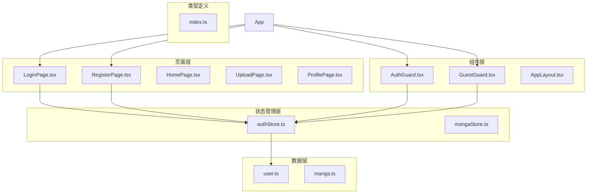
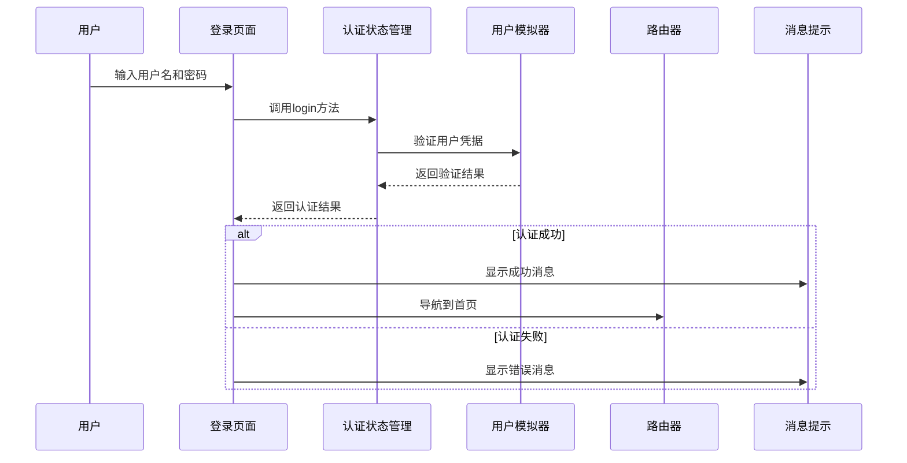
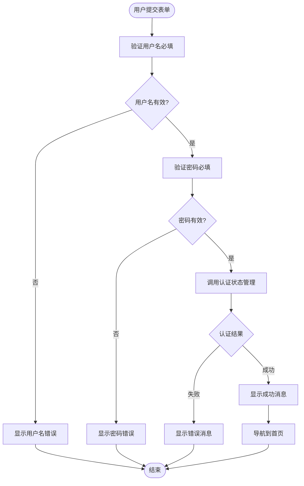
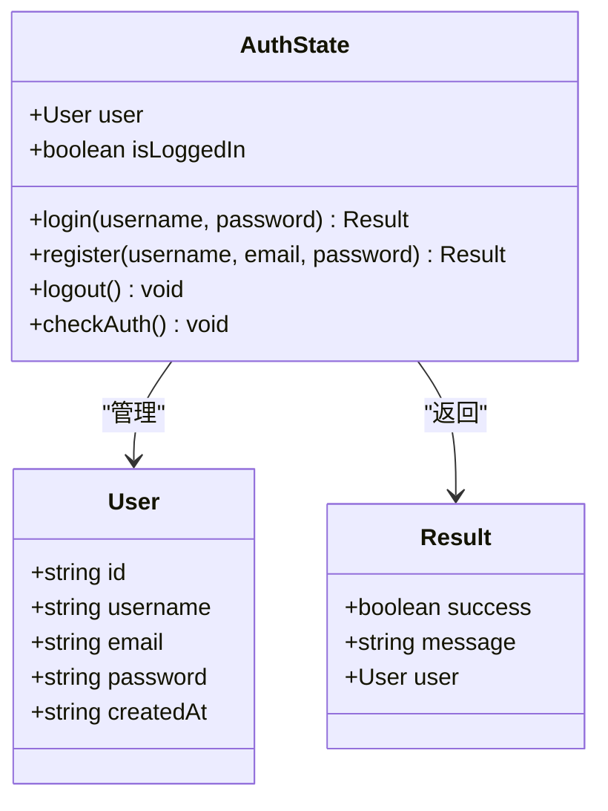
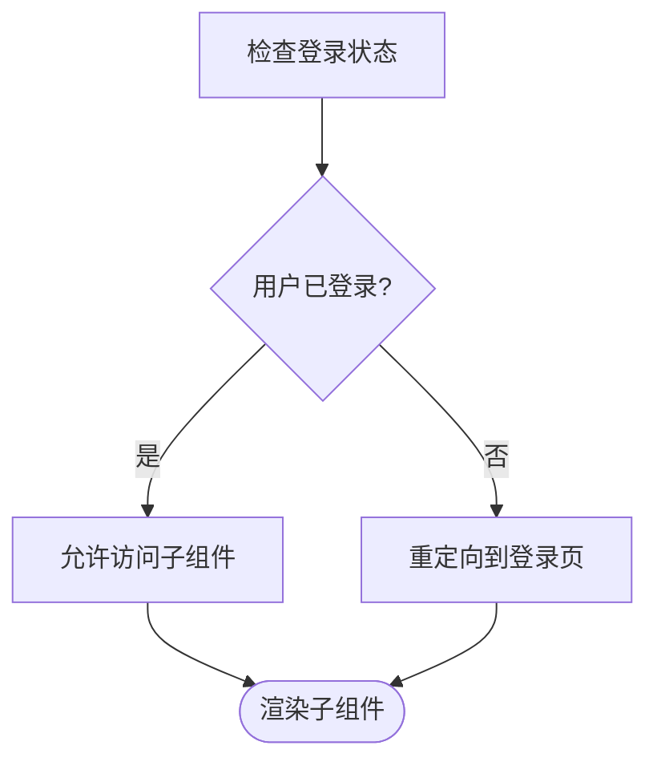
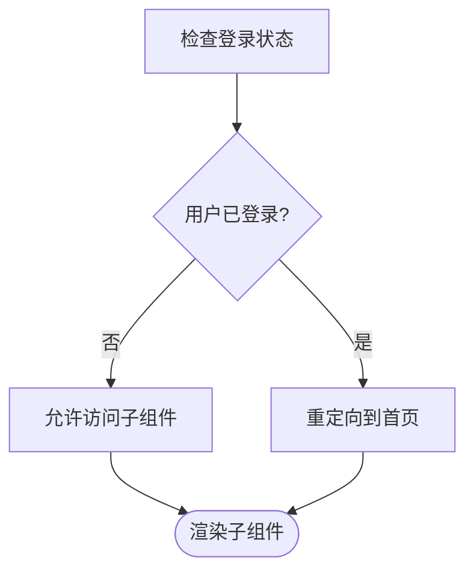
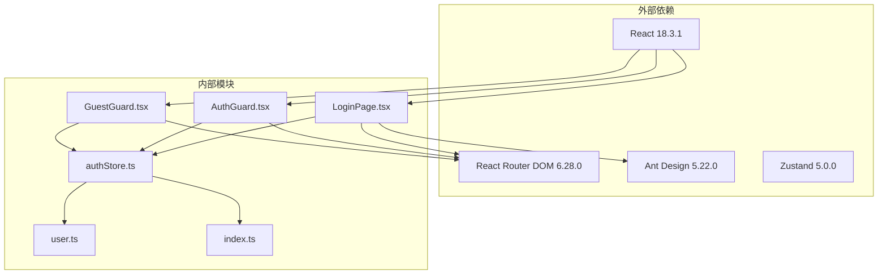

# 登录页面

<cite>
**本文档引用的文件**
- [LoginPage.tsx](file://manga-website/src/pages/LoginPage.tsx)
- [authStore.ts](file://manga-website/src/stores/authStore.ts)
- [user.ts](file://manga-website/src/mock/user.ts)
- [AuthGuard.tsx](file://manga-website/src/components/AuthGuard.tsx)
- [GuestGuard.tsx](file://manga-website/src/components/GuestGuard.tsx)
- [index.ts](file://manga-website/src/types/index.ts)
- [App.tsx](file://manga-website/src/App.tsx)
- [RegisterPage.tsx](file://manga-website/src/pages/RegisterPage.tsx)
</cite>

## 目录
1. [简介](#简介)
2. [项目结构](#项目结构)
3. [核心组件](#核心组件)
4. [架构概览](#架构概览)
5. [详细组件分析](#详细组件分析)
6. [依赖关系分析](#依赖关系分析)
7. [性能考虑](#性能考虑)
8. [故障排除指南](#故障排除指南)
9. [结论](#结论)

## 简介

本文件为漫画网站登录页面组件的详细实现文档。该组件实现了完整的用户身份验证流程，包括登录表单设计、字段验证、用户输入处理、登录状态管理、错误处理与用户反馈机制，以及登录后的路由跳转逻辑。系统采用React + TypeScript + Zustand + Ant Design技术栈构建，提供了直观的用户体验和可靠的安全保障。

## 项目结构

漫画网站采用模块化架构设计，登录功能位于以下关键目录中：

**图表来源**
- [App.tsx:24-59](file://manga-website/src/App.tsx#L24-L59)
- [LoginPage.tsx:1-86](file://manga-website/src/pages/LoginPage.tsx#L1-L86)

**章节来源**
- [App.tsx:1-66](file://manga-website/src/App.tsx#L1-L66)
- [package.json:11-24](file://manga-website/package.json#L11-L24)

## 核心组件

### 登录表单组件

登录页面组件基于Ant Design的Form组件构建，提供了完整的表单验证和用户交互体验：

- **表单布局**: 垂直布局，支持响应式设计
- **输入控件**: 用户名输入框、密码输入框（带安全图标）
- **验证规则**: 必填项检查、实时验证反馈
- **交互设计**: 成功/失败消息提示、自动跳转功能

### 认证状态管理

使用Zustand状态管理库实现全局认证状态管理：

- **状态结构**: 包含用户信息、登录状态、认证方法
- **方法接口**: 登录、注册、登出、认证检查
- **持久化存储**: 使用localStorage保存用户会话信息

**章节来源**
- [LoginPage.tsx:9-86](file://manga-website/src/pages/LoginPage.tsx#L9-L86)
- [authStore.ts:14-44](file://manga-website/src/stores/authStore.ts#L14-L44)

## 架构概览

系统采用分层架构设计，确保关注点分离和代码可维护性：

**图表来源**
- [LoginPage.tsx:14-22](file://manga-website/src/pages/LoginPage.tsx#L14-L22)
- [authStore.ts:18-24](file://manga-website/src/stores/authStore.ts#L18-L24)
- [user.ts:51-64](file://manga-website/src/mock/user.ts#L51-L64)

## 详细组件分析

### 登录页面组件分析

#### 表单设计与验证

登录表单采用Ant Design的Form组件，实现了多层次的验证机制：

**图表来源**
- [LoginPage.tsx:52-64](file://manga-website/src/pages/LoginPage.tsx#L52-L64)
- [LoginPage.tsx:14-22](file://manga-website/src/pages/LoginPage.tsx#L14-L22)

#### 字段验证规则

登录表单实现了基础的必填项验证：
- **用户名**: 必填项检查，无长度限制
- **密码**: 必填项检查，无强度要求

对比注册页面的复杂验证规则：
- **用户名**: 必填、长度3-20字符
- **邮箱**: 必填、邮箱格式验证
- **密码**: 必填、至少6字符
- **确认密码**: 必填、与密码匹配验证

**章节来源**
- [LoginPage.tsx:52-64](file://manga-website/src/pages/LoginPage.tsx#L52-L64)
- [RegisterPage.tsx:54-96](file://manga-website/src/pages/RegisterPage.tsx#L54-L96)

### 认证状态管理器分析

#### 状态结构设计

认证状态管理器使用Zustand创建，提供了完整的认证生命周期管理：

**图表来源**
- [authStore.ts:5-12](file://manga-website/src/stores/authStore.ts#L5-L12)
- [index.ts:14-20](file://manga-website/src/types/index.ts#L14-L20)

#### 登录流程实现

登录方法实现了完整的用户认证逻辑：

1. **参数接收**: 接收用户名和密码
2. **用户查询**: 在用户列表中查找对应用户
3. **凭据验证**: 比较密码是否匹配
4. **状态更新**: 更新全局认证状态
5. **结果返回**: 返回认证结果对象

**章节来源**
- [authStore.ts:18-24](file://manga-website/src/stores/authStore.ts#L18-L24)
- [user.ts:51-64](file://manga-website/src/mock/user.ts#L51-L64)

### 权限控制组件分析

#### AuthGuard组件

认证守卫组件确保只有已登录用户才能访问受保护的路由：

**图表来源**
- [AuthGuard.tsx:8-16](file://manga-website/src/components/AuthGuard.tsx#L8-L16)

#### GuestGuard组件

访客守卫组件确保已登录用户无法访问登录/注册页面：

**图表来源**
- [GuestGuard.tsx:8-16](file://manga-website/src/components/GuestGuard.tsx#L8-L16)

### 错误处理与用户反馈

系统实现了多层次的错误处理机制：

#### 表单级验证错误
- 实时字段验证反馈
- 清晰的错误消息提示
- 自动焦点管理

#### 认证级错误处理
- 用户不存在错误
- 密码错误提示
- 注册冲突检测

#### 用户界面反馈
- 成功消息：绿色主题
- 错误消息：红色主题
- 加载状态：按钮禁用

**章节来源**
- [LoginPage.tsx:16-21](file://manga-website/src/pages/LoginPage.tsx#L16-L21)
- [user.ts:55-60](file://manga-website/src/mock/user.ts#L55-L60)

## 依赖关系分析

系统依赖关系清晰，遵循单一职责原则：

**图表来源**
- [package.json:11-24](file://manga-website/package.json#L11-L24)
- [App.tsx:1-11](file://manga-website/src/App.tsx#L1-L11)

**章节来源**
- [package.json:1-26](file://manga-website/package.json#L1-L26)

## 性能考虑

### 状态管理优化

- **选择性订阅**: 使用Zustand的selector模式减少不必要的重新渲染
- **状态分割**: 将认证状态与其他应用状态分离
- **持久化策略**: 使用localStorage避免刷新后状态丢失

### 组件性能

- **懒加载**: 路由级别的组件按需加载
- **条件渲染**: 守卫组件快速判断用户状态
- **内存管理**: 及时清理localStorage中的用户信息

### 网络请求优化

- **本地模拟**: 使用mock数据减少网络依赖
- **缓存策略**: 用户信息本地缓存
- **并发控制**: 避免重复的认证请求

## 故障排除指南

### 常见问题诊断

#### 登录失败问题
1. **检查用户名**: 确认用户已注册
2. **验证密码**: 确认密码正确无误
3. **查看控制台**: 检查是否有JavaScript错误

#### 页面跳转问题
1. **路由配置**: 确认路由路径正确
2. **守卫组件**: 检查AuthGaurd/GuestGuard配置
3. **状态同步**: 确认认证状态正确更新

#### 数据持久化问题
1. **localStorage检查**: 确认浏览器支持localStorage
2. **数据格式**: 检查JSON序列化/反序列化
3. **存储空间**: 确认localStorage未满

### 调试技巧

#### 开发工具使用
- **React DevTools**: 检查组件树和状态变化
- **Redux DevTools**: 监控Zustand状态更新
- **浏览器开发者工具**: 调试网络请求和错误

#### 日志记录
- **认证流程**: 记录登录/登出事件
- **错误信息**: 详细记录错误原因
- **性能指标**: 监控组件渲染时间

**章节来源**
- [user.ts:67-84](file://manga-website/src/mock/user.ts#L67-L84)
- [authStore.ts:35-43](file://manga-website/src/stores/authStore.ts#L35-L43)

## 结论

该登录页面组件实现了完整的用户身份验证解决方案，具有以下特点：

### 技术优势
- **现代化架构**: 基于React Hooks和Zustand的状态管理
- **类型安全**: 完整的TypeScript类型定义
- **用户体验**: 流畅的表单验证和反馈机制
- **安全性**: 基础的会话管理和权限控制

### 功能完整性
- **表单验证**: 多层次的输入验证机制
- **状态管理**: 全局认证状态统一管理
- **路由保护**: 基于角色的访问控制
- **错误处理**: 完善的异常处理和用户反馈

### 改进建议
1. **增强验证**: 添加邮箱格式验证和密码强度检查
2. **安全加固**: 实现CSRF防护和会话超时机制
3. **性能优化**: 添加防抖和节流机制
4. **国际化**: 支持多语言错误消息

该组件为漫画网站提供了可靠的登录功能基础，可根据实际需求进一步扩展和完善。