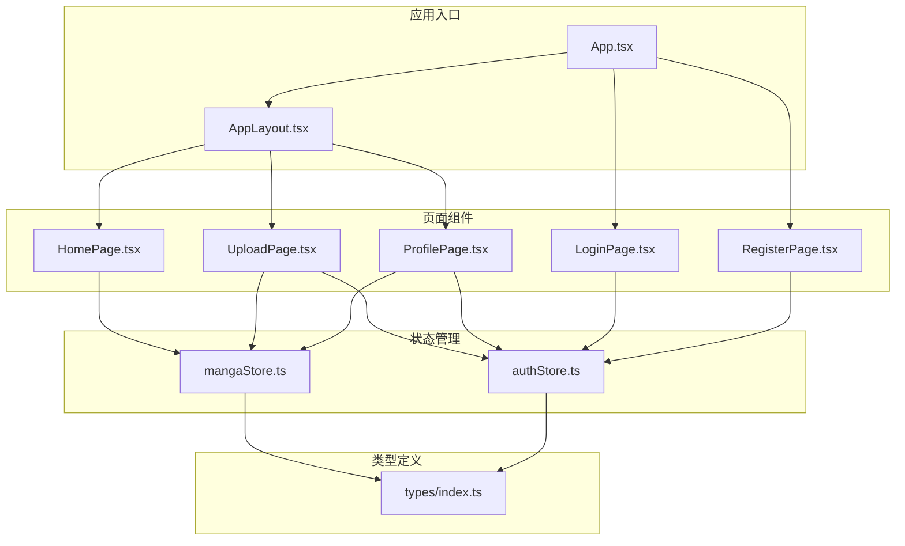
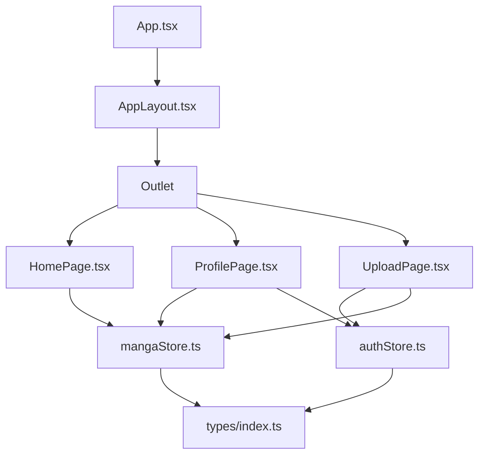
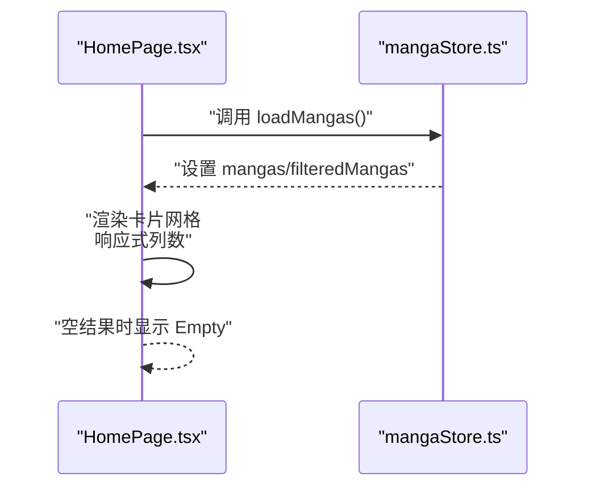
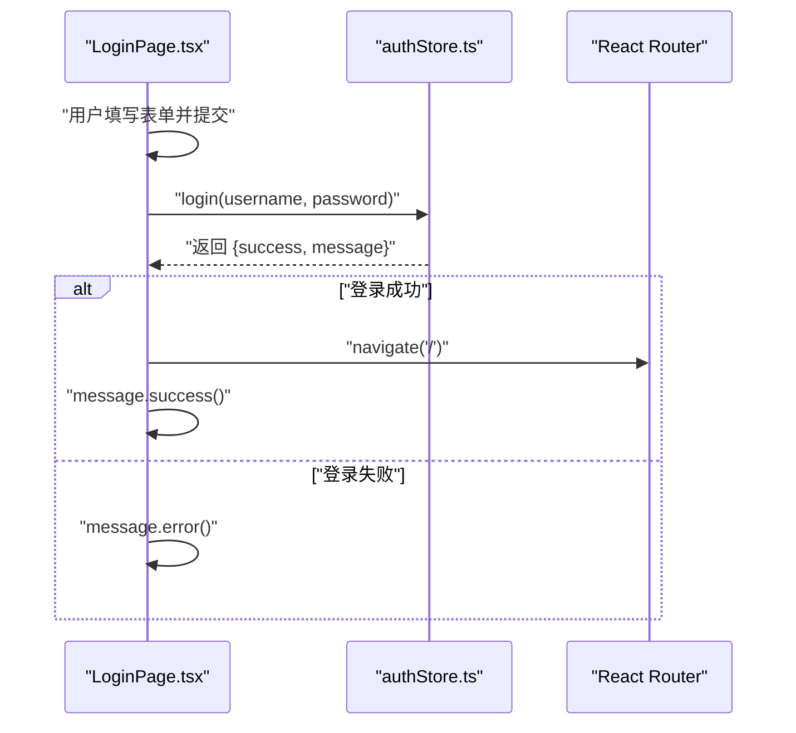
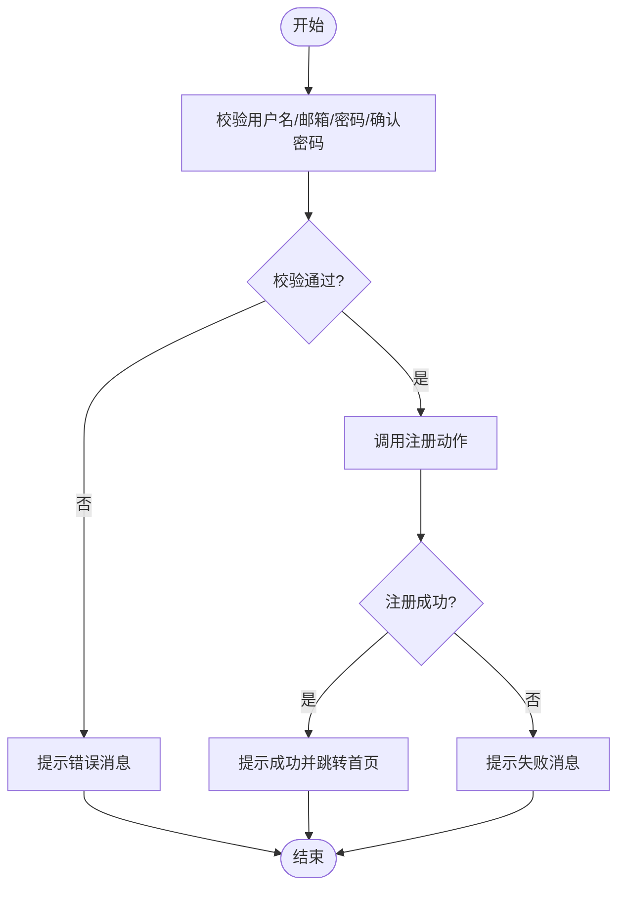
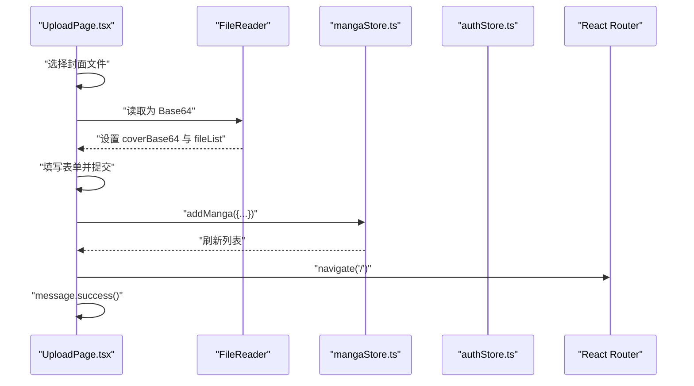
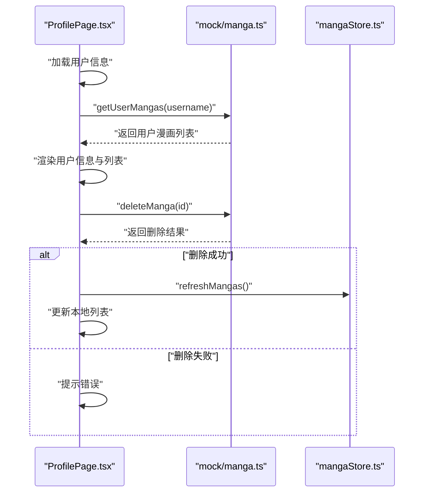
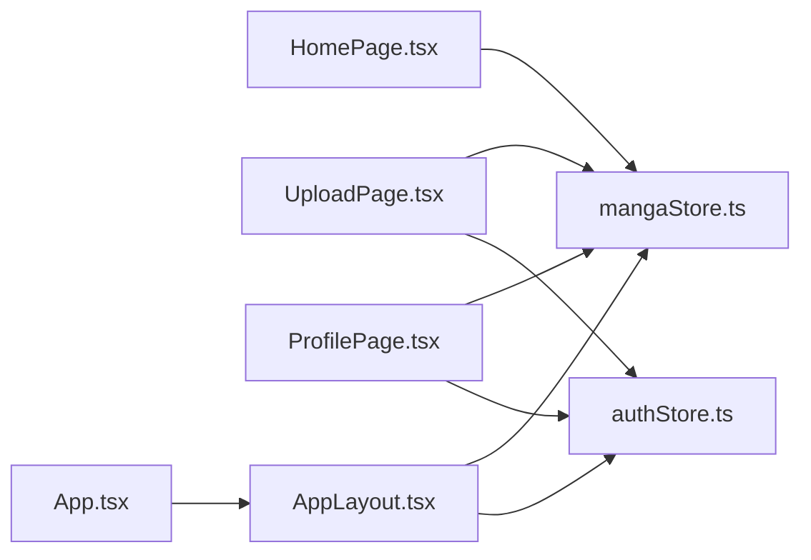

# 页面实现

<cite>
**本文引用的文件**
- [App.tsx](file://manga-website/src/App.tsx)
- [AppLayout.tsx](file://manga-website/src/components/AppLayout.tsx)
- [HomePage.tsx](file://manga-website/src/pages/HomePage.tsx)
- [LoginPage.tsx](file://manga-website/src/pages/LoginPage.tsx)
- [RegisterPage.tsx](file://manga-website/src/pages/RegisterPage.tsx)
- [UploadPage.tsx](file://manga-website/src/pages/UploadPage.tsx)
- [ProfilePage.tsx](file://manga-website/src/pages/ProfilePage.tsx)
- [authStore.ts](file://manga-website/src/stores/authStore.ts)
- [mangaStore.ts](file://manga-website/src/stores/mangaStore.ts)
- [index.ts](file://manga-website/src/types/index.ts)
</cite>

## 目录
1. [引言](#引言)
2. [项目结构](#项目结构)
3. [核心组件](#核心组件)
4. [架构总览](#架构总览)
5. [详细组件分析](#详细组件分析)
6. [依赖分析](#依赖分析)
7. [性能考虑](#性能考虑)
8. [故障排查指南](#故障排查指南)
9. [结论](#结论)
10. [附录](#附录)

## 引言
本文件面向开发者，系统性梳理漫画网站页面组件的实现，覆盖主页、登录、注册、上传、个人中心五大页面。内容包括：页面功能与交互设计、数据流与状态管理、路由与权限控制、页面间跳转与状态同步、以及可复用的最佳实践建议。文档以仓库现有实现为依据，避免臆测，确保技术细节可追溯。

## 项目结构
项目采用按页面与功能分层组织：页面组件位于 src/pages，全局布局与守卫位于 src/components，状态管理位于 src/stores，类型定义位于 src/types，应用入口在 src/App.tsx 中完成路由装配与主题配置。

**图表来源**
- [App.tsx:13-62](file://manga-website/src/App.tsx#L13-L62)
- [AppLayout.tsx:19-155](file://manga-website/src/components/AppLayout.tsx#L19-L155)
- [HomePage.tsx:8-107](file://manga-website/src/pages/HomePage.tsx#L8-L107)
- [LoginPage.tsx:9-85](file://manga-website/src/pages/LoginPage.tsx#L9-L85)
- [RegisterPage.tsx:9-120](file://manga-website/src/pages/RegisterPage.tsx#L9-L120)
- [UploadPage.tsx:13-186](file://manga-website/src/pages/UploadPage.tsx#L13-L186)
- [ProfilePage.tsx:11-151](file://manga-website/src/pages/ProfilePage.tsx#L11-L151)
- [authStore.ts:14-44](file://manga-website/src/stores/authStore.ts#L14-L44)
- [mangaStore.ts:16-61](file://manga-website/src/stores/mangaStore.ts#L16-L61)
- [index.ts:1-44](file://manga-website/src/types/index.ts#L1-L44)

**章节来源**
- [App.tsx:13-62](file://manga-website/src/App.tsx#L13-L62)
- [AppLayout.tsx:19-155](file://manga-website/src/components/AppLayout.tsx#L19-L155)

## 核心组件
- 应用入口与路由：在应用入口中装配 Ant Design 主题与国际化，并通过 React Router 定义页面路由与布局包装。
- 全局布局与导航：AppLayout 提供顶部导航栏、搜索框、用户菜单与页脚；作为所有受保护页面的容器。
- 状态管理：authStore 维护用户会话与认证动作；mangaStore 维护漫画列表、搜索关键词与过滤后的列表。
- 类型系统：统一定义漫画、用户、登录/注册/上传表单的数据结构，保证跨组件一致性。

**章节来源**
- [App.tsx:13-62](file://manga-website/src/App.tsx#L13-L62)
- [AppLayout.tsx:19-155](file://manga-website/src/components/AppLayout.tsx#L19-L155)
- [authStore.ts:14-44](file://manga-website/src/stores/authStore.ts#L14-L44)
- [mangaStore.ts:16-61](file://manga-website/src/stores/mangaStore.ts#L16-L61)
- [index.ts:1-44](file://manga-website/src/types/index.ts#L1-L44)

## 架构总览
页面组件围绕“布局-页面-状态-类型”四层协作：AppLayout 作为容器渲染 Outlet；各页面组件通过 Zustand 访问 authStore 与 mangaStore；类型定义贯穿于表单校验、状态结构与 API 接口契约。

**图表来源**
- [App.tsx:24-59](file://manga-website/src/App.tsx#L24-L59)
- [AppLayout.tsx:139-141](file://manga-website/src/components/AppLayout.tsx#L139-L141)
- [HomePage.tsx:8-13](file://manga-website/src/pages/HomePage.tsx#L8-L13)
- [ProfilePage.tsx:11-13](file://manga-website/src/pages/ProfilePage.tsx#L11-L13)
- [UploadPage.tsx:13-16](file://manga-website/src/pages/UploadPage.tsx#L13-L16)
- [authStore.ts:14-44](file://manga-website/src/stores/authStore.ts#L14-L44)
- [mangaStore.ts:16-61](file://manga-website/src/stores/mangaStore.ts#L16-L61)
- [index.ts:1-44](file://manga-website/src/types/index.ts#L1-L44)

## 详细组件分析

### 主页（HomePage）
- 功能概述
  - 加载并展示全部漫画或根据关键词筛选后的结果。
  - 展示封面缩略图、标题、作者、简介与“查看原网站”操作。
  - 支持空结果提示与加载态占位。
- 实现要点
  - 初始化时触发加载漫画列表。
  - 使用响应式栅格布局，卡片悬停放大封面，突出视觉层次。
  - 通过 Ant Design 的 Empty/Spin 提升空态与加载态体验。
- 用户体验
  - 搜索关键词为空时显示“全部漫画”，非空时显示“搜索结果: 关键词”。
  - 卡片动作区提供外链跳转，点击卡片元数据不触发跳转，保持交互清晰。
- 数据流
  - 从 mangaStore 读取 filteredMangas 与 searchKeyword，渲染卡片列表。

**图表来源**
- [HomePage.tsx:8-13](file://manga-website/src/pages/HomePage.tsx#L8-L13)
- [HomePage.tsx:15-21](file://manga-website/src/pages/HomePage.tsx#L15-L21)
- [HomePage.tsx:34-104](file://manga-website/src/pages/HomePage.tsx#L34-L104)
- [mangaStore.ts:21-32](file://manga-website/src/stores/mangaStore.ts#L21-L32)

**章节来源**
- [HomePage.tsx:8-107](file://manga-website/src/pages/HomePage.tsx#L8-L107)
- [mangaStore.ts:16-61](file://manga-website/src/stores/mangaStore.ts#L16-L61)

### 登录页（LoginPage）
- 功能概述
  - 提供用户名/密码登录表单，提交后调用认证动作并进行消息提示与路由跳转。
- 表单验证与输入处理
  - 使用 Ant Design Form 对字段进行必填校验。
  - 输入处理通过 onFinish 回调，调用 authStore.login 并根据返回值决定提示与跳转。
- 错误反馈机制
  - 成功：提示成功消息并跳转至首页。
  - 失败：提示错误消息，保持当前页。
- 导航与跳转
  - 提供“立即注册”按钮，跳转到注册页。

**图表来源**
- [LoginPage.tsx:9-22](file://manga-website/src/pages/LoginPage.tsx#L9-L22)
- [authStore.ts:18-24](file://manga-website/src/stores/authStore.ts#L18-L24)

**章节来源**
- [LoginPage.tsx:9-85](file://manga-website/src/pages/LoginPage.tsx#L9-L85)
- [authStore.ts:14-44](file://manga-website/src/stores/authStore.ts#L14-L44)

### 注册页（RegisterPage）
- 功能概述
  - 提供用户名、邮箱、密码与确认密码的注册表单，提交后调用注册动作并进行消息提示与路由跳转。
- 表单验证与输入处理
  - 用户名长度限制与必填校验。
  - 邮箱格式校验。
  - 密码长度限制与必填校验。
  - 确认密码与密码字段联动校验，确保两次输入一致。
- 错误反馈机制
  - 成功：提示成功消息并跳转至首页。
  - 失败：提示错误消息，保持当前页。
- 导航与跳转
  - 提供“立即登录”按钮，跳转到登录页。

**图表来源**
- [RegisterPage.tsx:9-22](file://manga-website/src/pages/RegisterPage.tsx#L9-L22)
- [RegisterPage.tsx:52-99](file://manga-website/src/pages/RegisterPage.tsx#L52-L99)
- [authStore.ts:26-33](file://manga-website/src/stores/authStore.ts#L26-L33)

**章节来源**
- [RegisterPage.tsx:9-120](file://manga-website/src/pages/RegisterPage.tsx#L9-L120)
- [authStore.ts:14-44](file://manga-website/src/stores/authStore.ts#L14-L44)

### 上传页（UploadPage）
- 功能概述
  - 上传漫画封面（Base64）、填写标题、作者、简介与原链接，提交后写入状态并提示成功。
- 文件处理与图片预览
  - beforeUpload 中限制文件类型与大小，使用 FileReader 将图片转为 Base64，更新本地状态并阻止默认上传。
  - 使用 Upload 组件的 picture-card 列表展示已选文件，支持移除。
- 表单验证与输入处理
  - 标题/作者/简介/原链接必填，原链接需为有效 URL。
  - 确认封面已上传后再提交。
- 错误反馈与状态同步
  - 失败：提示错误消息。
  - 成功：清空表单与文件列表，延迟跳转首页。
- 状态同步
  - 提交成功后调用 mangaStore.addManga，随后刷新漫画列表，使主页与个人中心同步最新数据。

**图表来源**
- [UploadPage.tsx:13-74](file://manga-website/src/pages/UploadPage.tsx#L13-L74)
- [UploadPage.tsx:22-44](file://manga-website/src/pages/UploadPage.tsx#L22-L44)
- [UploadPage.tsx:104-125](file://manga-website/src/pages/UploadPage.tsx#L104-L125)
- [UploadPage.tsx:127-168](file://manga-website/src/pages/UploadPage.tsx#L127-L168)
- [mangaStore.ts:46-50](file://manga-website/src/stores/mangaStore.ts#L46-L50)
- [authStore.ts:14-44](file://manga-website/src/stores/authStore.ts#L14-L44)

**章节来源**
- [UploadPage.tsx:13-186](file://manga-website/src/pages/UploadPage.tsx#L13-L186)
- [mangaStore.ts:16-61](file://manga-website/src/stores/mangaStore.ts#L16-L61)
- [authStore.ts:14-44](file://manga-website/src/stores/authStore.ts#L14-L44)

### 个人中心（ProfilePage）
- 功能概述
  - 展示当前用户的基本信息与“我的上传”列表；支持打开原链接与删除作品。
- 数据展示与用户信息管理
  - 通过 authStore 获取当前用户信息，渲染用户描述信息卡片。
  - 通过 mock 方法获取该用户上传的漫画列表，渲染列表项与操作按钮。
- 操作功能
  - 打开原链接：在新标签页打开漫画源站链接。
  - 删除作品：二次确认弹窗，成功后更新本地列表并刷新全局漫画列表。
- 状态同步
  - 删除成功后调用 mangaStore.refreshMangas，确保主页与个人中心数据一致。

**图表来源**
- [ProfilePage.tsx:11-33](file://manga-website/src/pages/ProfilePage.tsx#L11-L33)
- [ProfilePage.tsx:17-22](file://manga-website/src/pages/ProfilePage.tsx#L17-L22)
- [ProfilePage.tsx:24-33](file://manga-website/src/pages/ProfilePage.tsx#L24-L33)
- [mangaStore.ts:58-60](file://manga-website/src/stores/mangaStore.ts#L58-L60)

**章节来源**
- [ProfilePage.tsx:11-151](file://manga-website/src/pages/ProfilePage.tsx#L11-L151)
- [mangaStore.ts:16-61](file://manga-website/src/stores/mangaStore.ts#L16-L61)

## 依赖分析
- 组件耦合
  - 页面组件对状态管理模块存在直接依赖：HomePage 依赖 mangaStore；UploadPage/ProfilePage 同时依赖 authStore 与 mangaStore。
  - AppLayout 作为容器，依赖 authStore 与 mangaStore 提供搜索与用户菜单能力。
- 外部依赖
  - Ant Design 组件库用于 UI 呈现与交互。
  - React Router 用于路由与导航。
  - Zustand 用于轻量级状态管理。
- 可能的循环依赖
  - 当前文件组织避免了显式的循环导入；若后续扩展 mock 或工具函数，应避免在 store 与页面之间形成双向依赖。

**图表来源**
- [HomePage.tsx:8-13](file://manga-website/src/pages/HomePage.tsx#L8-L13)
- [UploadPage.tsx:13-16](file://manga-website/src/pages/UploadPage.tsx#L13-L16)
- [ProfilePage.tsx:11-13](file://manga-website/src/pages/ProfilePage.tsx#L11-L13)
- [AppLayout.tsx:21-22](file://manga-website/src/components/AppLayout.tsx#L21-L22)
- [App.tsx:24-59](file://manga-website/src/App.tsx#L24-L59)

**章节来源**
- [App.tsx:13-62](file://manga-website/src/App.tsx#L13-L62)
- [AppLayout.tsx:19-155](file://manga-website/src/components/AppLayout.tsx#L19-L155)
- [authStore.ts:14-44](file://manga-website/src/stores/authStore.ts#L14-L44)
- [mangaStore.ts:16-61](file://manga-website/src/stores/mangaStore.ts#L16-L61)

## 性能考虑
- 渲染优化
  - 主页卡片使用固定高度与 object-fit 覆盖，减少重排；悬停缩放通过内联样式过渡，避免复杂动画。
  - 列表渲染使用 key 为唯一 id，提升列表更新效率。
- 状态更新
  - mangaStore 在新增/删除漫画后统一调用 loadMangas 刷新过滤结果，避免多处分散更新导致的不一致。
- 图片处理
  - 上传页将封面转换为 Base64 存储于组件状态，适合演示场景；生产环境建议改为服务端直传并存储 URL，降低前端内存压力。
- 搜索性能
  - 搜索关键词匹配为小写包含匹配，复杂度与列表长度线性相关；如数据量增长，可考虑索引或防抖策略。

[本节为通用性能建议，无需特定文件引用]

## 故障排查指南
- 登录/注册无反应
  - 检查表单规则是否触发；确认 onFinish 是否被调用；查看消息提示与路由跳转逻辑。
  - 参考：[LoginPage.tsx:14-22](file://manga-website/src/pages/LoginPage.tsx#L14-L22)、[RegisterPage.tsx:14-22](file://manga-website/src/pages/RegisterPage.tsx#L14-L22)
- 上传失败或未跳转
  - 确认封面是否已上传（coverBase64 是否存在）；检查 addManga 调用与异常捕获；查看消息提示与跳转时机。
  - 参考：[UploadPage.tsx:46-74](file://manga-website/src/pages/UploadPage.tsx#L46-L74)
- 删除无效
  - 确认删除接口返回值与本地列表更新逻辑；检查 refreshMangas 是否被调用。
  - 参考：[ProfilePage.tsx:24-33](file://manga-website/src/pages/ProfilePage.tsx#L24-L33)、[mangaStore.ts:52-60](file://manga-website/src/stores/mangaStore.ts#L52-L60)
- 搜索无结果
  - 确认搜索关键词是否正确设置；检查 mangaStore 的过滤逻辑是否生效。
  - 参考：[AppLayout.tsx:26-29](file://manga-website/src/components/AppLayout.tsx#L26-L29)、[mangaStore.ts:34-44](file://manga-website/src/stores/mangaStore.ts#L34-L44)

**章节来源**
- [LoginPage.tsx:14-22](file://manga-website/src/pages/LoginPage.tsx#L14-L22)
- [RegisterPage.tsx:14-22](file://manga-website/src/pages/RegisterPage.tsx#L14-L22)
- [UploadPage.tsx:46-74](file://manga-website/src/pages/UploadPage.tsx#L46-L74)
- [ProfilePage.tsx:24-33](file://manga-website/src/pages/ProfilePage.tsx#L24-L33)
- [mangaStore.ts:34-44](file://manga-website/src/stores/mangaStore.ts#L34-L44)

## 结论
本项目通过清晰的页面分层、稳定的路由与守卫体系、以及基于 Zustand 的轻量状态管理，实现了从浏览、上传到个人中心的完整用户旅程。页面组件职责明确、交互直观，配合类型系统与表单校验，提升了开发与维护效率。建议在后续迭代中引入服务端直传、搜索防抖与更完善的错误边界，持续优化性能与稳定性。

[本节为总结性内容，无需特定文件引用]

## 附录
- 路由与权限控制
  - 未登录用户可访问登录与注册页；已登录用户可访问上传与个人中心页。
  - 参考：[App.tsx:24-59](file://manga-website/src/App.tsx#L24-L59)
- 导航与跳转
  - AppLayout 提供统一导航栏与下拉菜单；页面内部通过 Link/按钮触发跳转。
  - 参考：[AppLayout.tsx:36-56](file://manga-website/src/components/AppLayout.tsx#L36-L56)
- 数据模型
  - 漫画与用户类型定义，确保表单与状态结构一致。
  - 参考：[index.ts:1-44](file://manga-website/src/types/index.ts#L1-L44)

**章节来源**
- [App.tsx:24-59](file://manga-website/src/App.tsx#L24-L59)
- [AppLayout.tsx:36-56](file://manga-website/src/components/AppLayout.tsx#L36-L56)
- [index.ts:1-44](file://manga-website/src/types/index.ts#L1-L44)