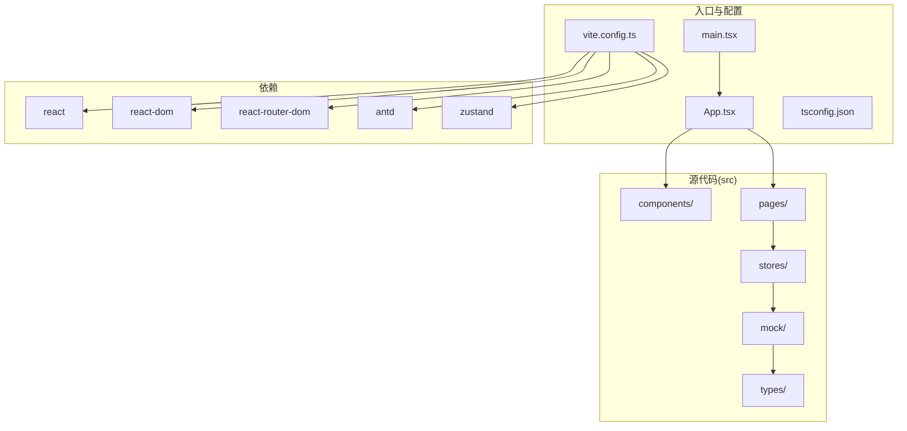
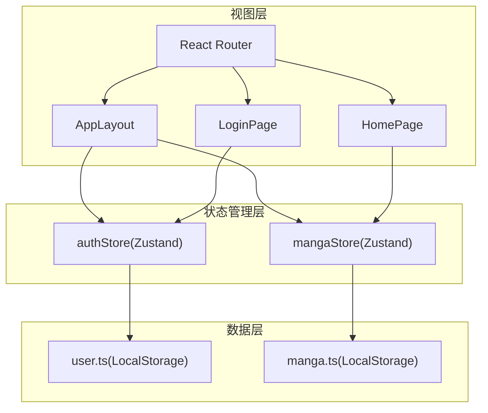
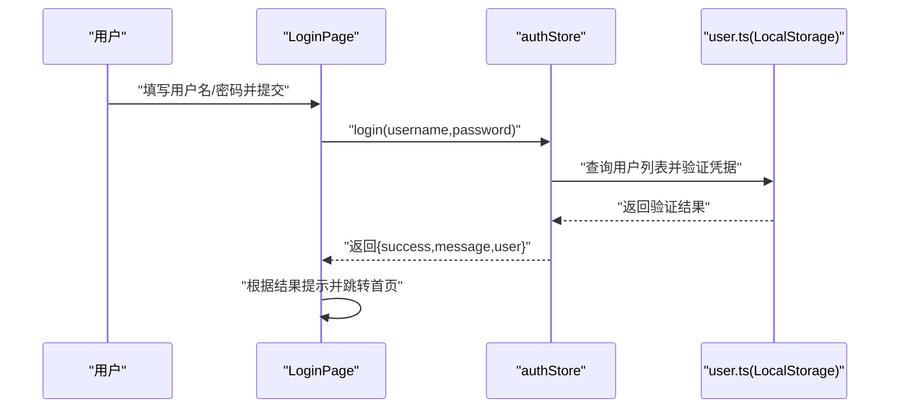
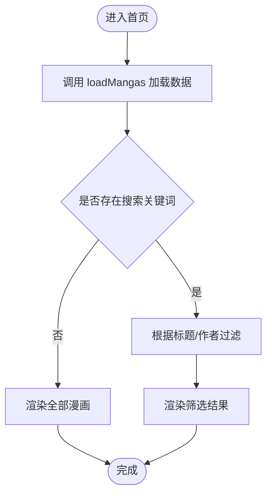
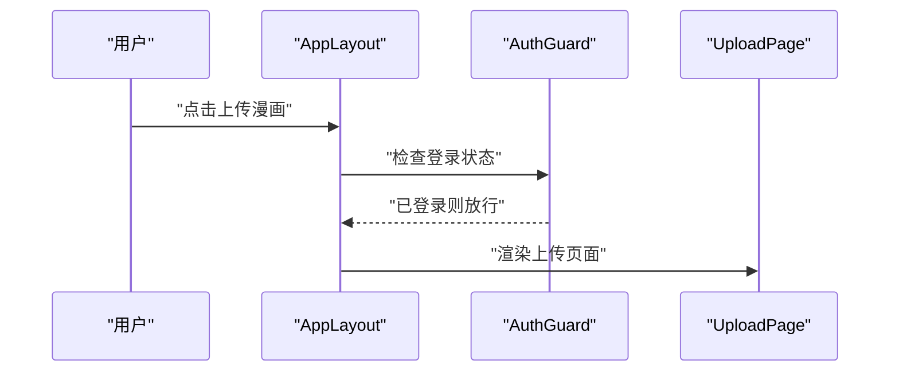
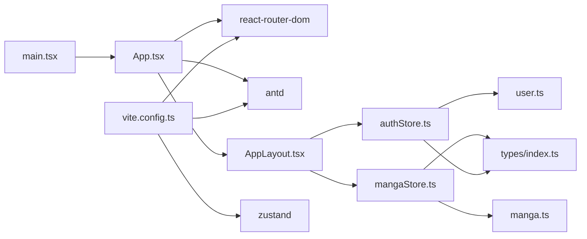

# 项目概述

<cite>
**本文档引用的文件**
- [package.json](file://manga-website/package.json)
- [vite.config.ts](file://manga-website/vite.config.ts)
- [tsconfig.json](file://manga-website/tsconfig.json)
- [src/main.tsx](file://manga-website/src/main.tsx)
- [src/App.tsx](file://manga-website/src/App.tsx)
- [src/components/AppLayout.tsx](file://manga-website/src/components/AppLayout.tsx)
- [src/components/AuthGuard.tsx](file://manga-website/src/components/AuthGuard.tsx)
- [src/components/GuestGuard.tsx](file://manga-website/src/components/GuestGuard.tsx)
- [src/stores/authStore.ts](file://manga-website/src/stores/authStore.ts)
- [src/stores/mangaStore.ts](file://manga-website/src/stores/mangaStore.ts)
- [src/types/index.ts](file://manga-website/src/types/index.ts)
- [src/mock/user.ts](file://manga-website/src/mock/user.ts)
- [src/mock/manga.ts](file://manga-website/src/mock/manga.ts)
- [src/pages/HomePage.tsx](file://manga-website/src/pages/HomePage.tsx)
- [src/pages/LoginPage.tsx](file://manga-website/src/pages/LoginPage.tsx)
</cite>

## 目录
1. [引言](#引言)
2. [项目结构](#项目结构)
3. [核心组件](#核心组件)
4. [架构总览](#架构总览)
5. [详细组件分析](#详细组件分析)
6. [依赖关系分析](#依赖关系分析)
7. [性能考虑](#性能考虑)
8. [故障排除指南](#故障排除指南)
9. [结论](#结论)

## 引言

本项目是一个基于 React 18.3.1 和 TypeScript 的现代化前端应用，专注于漫画展示与管理。项目采用 React 生态系统（React Router DOM 路由、Ant Design UI 组件库、Zustand 状态管理）与 Vite 构建工具，提供用户认证、漫画浏览、搜索、上传以及个人中心等核心功能。

项目目标是为用户提供简洁直观的漫画浏览体验，支持用户通过本地存储进行注册与登录，实现漫画数据的本地化管理与展示。通过模块化的组件设计与状态管理，确保代码可维护性与扩展性。

## 项目结构

项目采用按功能分层的组织方式，主要目录与职责如下：

- `src/`：源代码根目录
  - `components/`：通用布局与守卫组件
  - `pages/`：页面级组件（首页、登录、注册、上传、个人中心）
  - `stores/`：Zustand 状态管理（用户认证、漫画数据）
  - `mock/`：本地数据模拟（用户、漫画）
  - `types/`：TypeScript 类型定义
- `public/`：静态资源
- `vite.config.ts`：Vite 构建配置
- `tsconfig.json`：TypeScript 编译配置
- `package.json`：项目依赖与脚本

**图表来源**
- [src/main.tsx:1-14](file://manga-website/src/main.tsx#L1-L14)
- [src/App.tsx:1-66](file://manga-website/src/App.tsx#L1-L66)
- [vite.config.ts:1-11](file://manga-website/vite.config.ts#L1-L11)
- [package.json:11-24](file://manga-website/package.json#L11-L24)

**章节来源**
- [package.json:1-26](file://manga-website/package.json#L1-L26)
- [vite.config.ts:1-11](file://manga-website/vite.config.ts#L1-L11)
- [tsconfig.json:1-24](file://manga-website/tsconfig.json#L1-L24)

## 核心组件

- 应用入口与路由
  - 入口文件负责挂载 React 应用与路由容器，确保页面渲染与导航正常工作。
  - 应用根组件集中配置 Ant Design 国际化与主题，并声明所有页面路由与布局包装。

- 布局组件
  - 提供统一头部、内容区与页脚布局，包含搜索框、用户菜单、登录/注册按钮等交互元素。
  - 通过状态管理读取搜索关键词并触发页面跳转，实现搜索功能闭环。

- 认证守卫
  - AuthGuard：未登录用户访问需要认证的页面时重定向至登录页。
  - GuestGuard：已登录用户访问登录/注册页时重定向至首页。

- 状态管理
  - authStore：封装用户登录、注册、登出与认证检查逻辑，使用本地存储持久化当前用户。
  - mangaStore：封装漫画列表加载、搜索过滤、新增与删除操作，支持关键字实时筛选。

- 页面组件
  - 首页：展示漫画卡片网格，支持悬停缩放、标签标识与外部链接跳转。
  - 登录页：表单校验与提交，调用认证状态管理完成登录流程。

**章节来源**
- [src/main.tsx:1-14](file://manga-website/src/main.tsx#L1-L14)
- [src/App.tsx:1-66](file://manga-website/src/App.tsx#L1-L66)
- [src/components/AppLayout.tsx:1-156](file://manga-website/src/components/AppLayout.tsx#L1-L156)
- [src/components/AuthGuard.tsx:1-17](file://manga-website/src/components/AuthGuard.tsx#L1-L17)
- [src/components/GuestGuard.tsx:1-17](file://manga-website/src/components/GuestGuard.tsx#L1-L17)
- [src/stores/authStore.ts:1-45](file://manga-website/src/stores/authStore.ts#L1-L45)
- [src/stores/mangaStore.ts:1-62](file://manga-website/src/stores/mangaStore.ts#L1-L62)
- [src/pages/HomePage.tsx:1-108](file://manga-website/src/pages/HomePage.tsx#L1-L108)
- [src/pages/LoginPage.tsx:1-86](file://manga-website/src/pages/LoginPage.tsx#L1-L86)

## 架构总览

系统采用“页面 + 组件 + 状态管理 + 数据模拟”的分层架构，路由控制页面切换，布局组件提供统一 UI 结构，状态管理负责跨组件共享的数据与行为，mock 层提供本地持久化的数据存取。

**图表来源**
- [src/App.tsx:1-66](file://manga-website/src/App.tsx#L1-L66)
- [src/components/AppLayout.tsx:1-156](file://manga-website/src/components/AppLayout.tsx#L1-L156)
- [src/stores/authStore.ts:1-45](file://manga-website/src/stores/authStore.ts#L1-L45)
- [src/stores/mangaStore.ts:1-62](file://manga-website/src/stores/mangaStore.ts#L1-L62)
- [src/mock/user.ts:1-90](file://manga-website/src/mock/user.ts#L1-L90)
- [src/mock/manga.ts:1-173](file://manga-website/src/mock/manga.ts#L1-L173)

## 详细组件分析

### 认证系统（登录/注册/登出）

认证系统通过 Zustand 状态管理与本地存储实现，提供登录、注册、登出与自动认证检查功能。登录与注册表单在页面组件中收集输入并通过状态管理器处理业务逻辑，最终更新全局状态并持久化当前用户信息。

**图表来源**
- [src/pages/LoginPage.tsx:14-22](file://manga-website/src/pages/LoginPage.tsx#L14-L22)
- [src/stores/authStore.ts:18-24](file://manga-website/src/stores/authStore.ts#L18-L24)
- [src/mock/user.ts:51-64](file://manga-website/src/mock/user.ts#L51-L64)

**章节来源**
- [src/pages/LoginPage.tsx:1-86](file://manga-website/src/pages/LoginPage.tsx#L1-L86)
- [src/stores/authStore.ts:1-45](file://manga-website/src/stores/authStore.ts#L1-L45)
- [src/mock/user.ts:1-90](file://manga-website/src/mock/user.ts#L1-L90)

### 漫画浏览与搜索

漫画浏览与搜索功能由状态管理与页面组件协同实现。状态管理负责加载漫画列表、维护搜索关键词并生成筛选后的结果集；页面组件负责渲染卡片网格与交互行为。

**图表来源**
- [src/pages/HomePage.tsx:8-13](file://manga-website/src/pages/HomePage.tsx#L8-L13)
- [src/stores/mangaStore.ts:21-32](file://manga-website/src/stores/mangaStore.ts#L21-L32)
- [src/mock/manga.ts:138-140](file://manga-website/src/mock/manga.ts#L138-L140)

**章节来源**
- [src/pages/HomePage.tsx:1-108](file://manga-website/src/pages/HomePage.tsx#L1-L108)
- [src/stores/mangaStore.ts:1-62](file://manga-website/src/stores/mangaStore.ts#L1-L62)
- [src/mock/manga.ts:1-173](file://manga-website/src/mock/manga.ts#L1-L173)

### 上传功能与个人中心

上传功能通过守卫组件限制访问权限，仅允许已登录用户访问上传页面；个人中心用于展示用户信息与相关操作。当前实现中，上传与个人中心页面作为占位符存在，后续可扩展为完整的功能页面。

**图表来源**
- [src/components/AppLayout.tsx:111-119](file://manga-website/src/components/AppLayout.tsx#L111-L119)
- [src/components/AuthGuard.tsx:8-16](file://manga-website/src/components/AuthGuard.tsx#L8-L16)

**章节来源**
- [src/components/AppLayout.tsx:1-156](file://manga-website/src/components/AppLayout.tsx#L1-L156)
- [src/components/AuthGuard.tsx:1-17](file://manga-website/src/components/AuthGuard.tsx#L1-L17)

## 依赖关系分析

项目依赖围绕 React 生态系统构建，核心依赖包括 React、React DOM、React Router DOM、Ant Design 与 Zustand。开发依赖包括 TypeScript、Vite 与 React 插件。

**图表来源**
- [src/App.tsx:1-11](file://manga-website/src/App.tsx#L1-L11)
- [src/components/AppLayout.tsx:13-14](file://manga-website/src/components/AppLayout.tsx#L13-L14)
- [src/stores/authStore.ts:1-3](file://manga-website/src/stores/authStore.ts#L1-L3)
- [src/stores/mangaStore.ts:1-3](file://manga-website/src/stores/mangaStore.ts#L1-L3)
- [src/mock/user.ts:1-4](file://manga-website/src/mock/user.ts#L1-L4)
- [src/mock/manga.ts:1-4](file://manga-website/src/mock/manga.ts#L1-L4)
- [src/types/index.ts:1-44](file://manga-website/src/types/index.ts#L1-L44)
- [src/main.tsx:1-5](file://manga-website/src/main.tsx#L1-L5)
- [vite.config.ts:1-11](file://manga-website/vite.config.ts#L1-L11)
- [package.json:11-24](file://manga-website/package.json#L11-L24)

**章节来源**
- [package.json:11-24](file://manga-website/package.json#L11-L24)
- [vite.config.ts:1-11](file://manga-website/vite.config.ts#L1-L11)

## 性能考虑

- 构建与打包
  - 使用 Vite 提供快速冷启动与热更新，开发体验更佳；生产构建优化资源体积与加载速度。
- 状态管理
  - Zustand 以极简 API 实现轻量状态管理，避免不必要的重渲染；建议按需订阅状态，减少组件更新频率。
- UI 组件
  - Ant Design 组件库提供开箱即用的样式与交互，注意按需引入样式以降低包体积。
- 数据模拟
  - 本地存储方案适合演示与开发阶段；如需扩展，建议引入真实后端接口与缓存策略。

## 故障排除指南

- 登录失败
  - 检查用户名与密码是否匹配；确认本地用户数据是否正确保存。
  - 参考路径：[登录处理逻辑:14-22](file://manga-website/src/pages/LoginPage.tsx#L14-L22)，[用户验证逻辑:51-64](file://manga-website/src/mock/user.ts#L51-L64)
- 搜索无结果
  - 确认搜索关键词大小写不敏感匹配逻辑是否生效；检查漫画数据是否正确加载。
  - 参考路径：[搜索触发与状态更新:26-29](file://manga-website/src/components/AppLayout.tsx#L26-L29)，[筛选逻辑:34-44](file://manga-website/src/stores/mangaStore.ts#L34-L44)
- 上传/个人中心不可用
  - 已登录用户应可通过守卫组件访问相应页面；检查守卫组件逻辑与路由配置。
  - 参考路径：[AuthGuard 守卫:8-16](file://manga-website/src/components/AuthGuard.tsx#L8-L16)，[路由配置:43-58](file://manga-website/src/App.tsx#L43-L58)

**章节来源**
- [src/pages/LoginPage.tsx:14-22](file://manga-website/src/pages/LoginPage.tsx#L14-L22)
- [src/mock/user.ts:51-64](file://manga-website/src/mock/user.ts#L51-L64)
- [src/components/AppLayout.tsx:26-29](file://manga-website/src/components/AppLayout.tsx#L26-L29)
- [src/stores/mangaStore.ts:34-44](file://manga-website/src/stores/mangaStore.ts#L34-L44)
- [src/components/AuthGuard.tsx:8-16](file://manga-website/src/components/AuthGuard.tsx#L8-L16)
- [src/App.tsx:43-58](file://manga-website/src/App.tsx#L43-L58)

## 结论

本项目以 React 18.3.1 与 TypeScript 为基础，结合 Ant Design 与 Zustand，构建了一个结构清晰、易于扩展的漫画展示平台前端原型。通过路由守卫、状态管理与本地数据模拟，实现了用户认证、漫画浏览、搜索与上传等核心功能。建议在后续迭代中引入真实后端接口、完善上传与个人中心页面，并优化性能与用户体验。